# 本周学习内容

## 监督学习

监督学习是机器学习的类型，其中机器使用"标记好"的训练数据进行训练，并基于该数据，机器预测输出。标记的数据意味着一些输入数据已经用正确的输出标记。

在监督学习中，提供给机器的训练数据充当监督者，教导机器正确预测输出。

监督学习是向机器学习模型提供输入数据和正确输出数据的过程。监督学习算法的目的是找到一个映射函数来映射输入变量（x）和输出变量（y）。

在现实世界中，监督学习可用于风险评估、图像分类、欺诈检测、垃圾邮件过滤等。

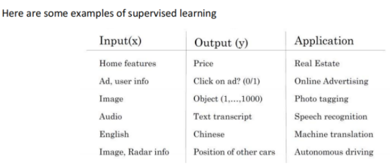

如图，我们可以选择一些数据标签如房子的特征，广告，图片等作为标签，并使用相应的模型对这些标签进行预测，从而得到输出。

## 逻辑回归

逻辑回归也称作logistic回归分析，是一种广义的线性回归分析模型，属于机器学习中的监督学习。其推导过程与计算方式类似于回归的过程，但实际上主要是用来解决二分类问题（也可以解决多分类问题）。通过给定的n组数据（训练集）来训练模型，并在训练结束后对给定的一组或多组数据（测试集）进行分类。其中每一组数据都是由p 个指标构成。

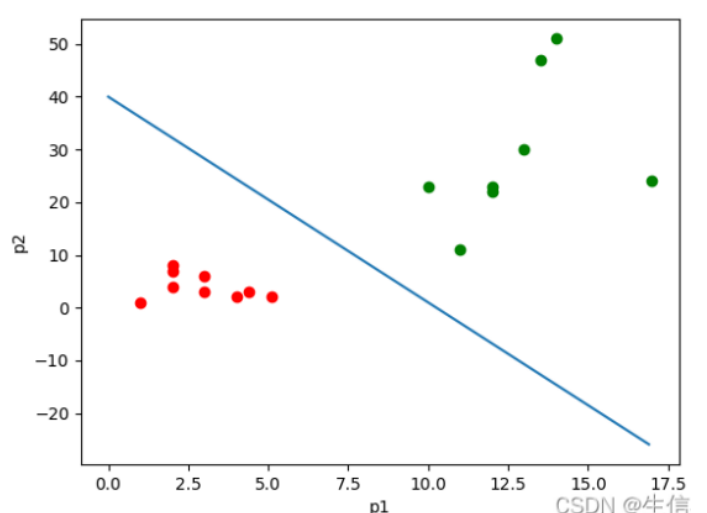

### 逻辑回归的损失函数

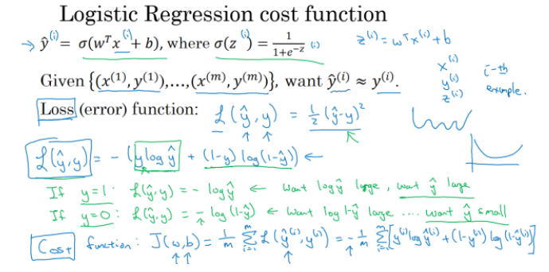

使用损失函数的目的：

为了尽可能地是的我们的预测值与真实值的结果相匹配，我们使用损失函数来表示它们之间的误差值，损失函数越小，说明我们的模型越好，得到的误差越小。

在逻辑回归中，我们进场使用sigmoid函数，其图像如下：

$$sigmoid(x) = \frac{1}{1 + exp( - x)}$$

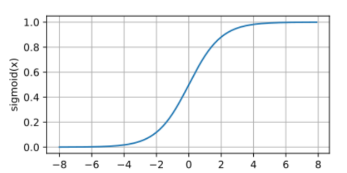

为了尽可能地将损失函数降低，我们将最优化损失函数，因此这是一个最优化问题。如何最优化这个损失函数？我们可以使用最大似然估计的方法计算参数，得到最优化问题的解。

## 经典的双层神经网络（输入层不算）

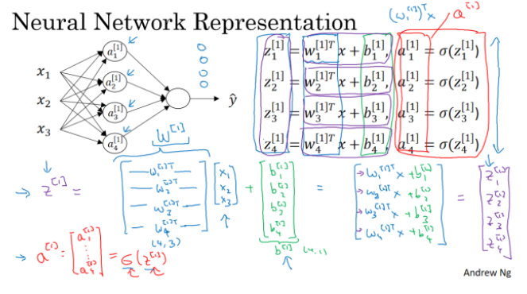

在网络中，我们总是：

1.  计算z=wx+b

2.  使用非线性激活函数对z进行激活，得到a

3.  将a作为该层的输出给下一层的输入

4.  最后一层的输出层结果a即为最终结果

## 为什么要非线性激活函数

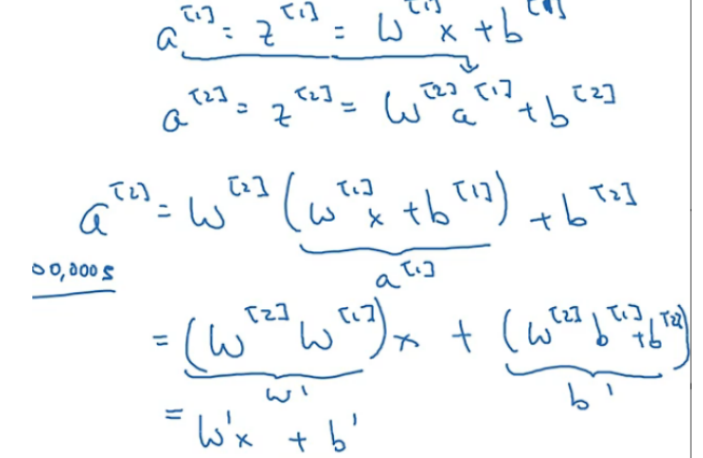

如果使用线性激活函数或者不使用激活函数，那么我们一直做的都是线性运算，无法达到期望的要求，神经网络就是为了解决**非线性的模型**而存在的。

**ReLU激活函数**：

ReLU，全称为：Rectified Linear Unit，是一种人工神经网络中常用的激活函数，通常意义下，其指代数学中的斜坡函数，即：$f(x) = max(0,x)$

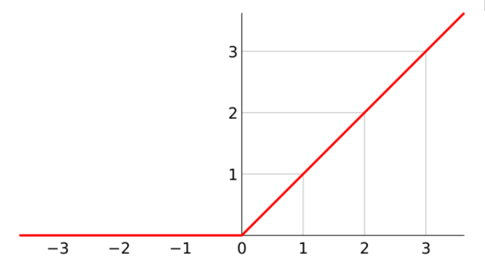

相比于传统的神经网络激活函数，诸如逻辑函数（Logistic sigmoid）和tanh等双曲函数，ReLU函数有着以下几方面的优势：

-   更加有效率的梯度下降以及反向传播：避免了梯度爆炸和梯度消失问题;

-   简化计算过程：没有了其他复杂激活函数中诸如指数函数的影响；同时活跃度的分散性使得神经网络整体计算成本下降.

## 梯度下降与反向传播

### 梯度下降

它的主要目的是通过迭代找到目标函数的最小值，或者收敛到最小值。如图，我们需要通过最小化J，找到满足该式子的参数w和b。

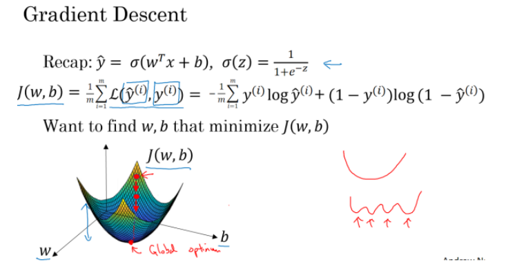

为什么梯度下降能够找到最小值？

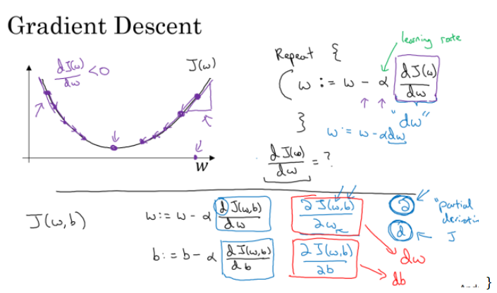

可以看到梯度下降的等式是迭代的，总是在计算完梯度后进行一次迭代计算，更新参数。假设我们从损失函数的某点开始计算，那么我们会计算该点的梯度并更新参数，从而得到新的参数值。我们会一直计算，要么得到全局最小值，要么达到设定的迭代次数，从而得到我们需要的参数值。

如图，左边表示某一个样本本次的梯度下降，右边表示该样本集的一次梯度下降。

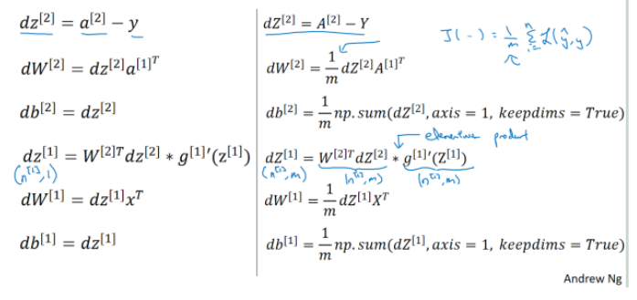

前向传播与反向传播的公式：

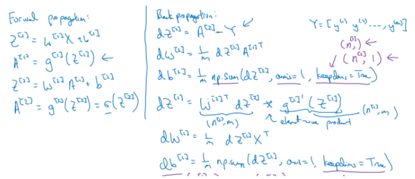

### 前向传播

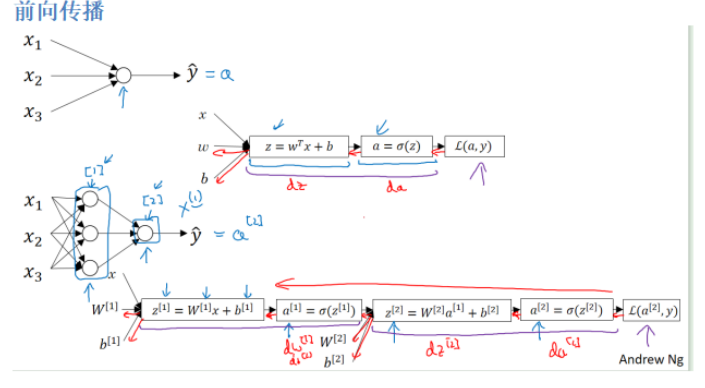

前向传播即计算每层的参数与该层神经元的值，并加上偏置常数，然后通过非线性的激活函数得到输出值。

为什么要前向传播？

就是使用神经网络，通过各层上的参数值计算并非线性激活、正则化，得到最终的结果，然后通过反向传播进行梯度下降，再对相应的参数进行更新，得到一个泛化能力最强的模型，这就是使用神经网络的作用。

在一个深层的神经网络中，我们也嫩进行前向传播，如下图所示。

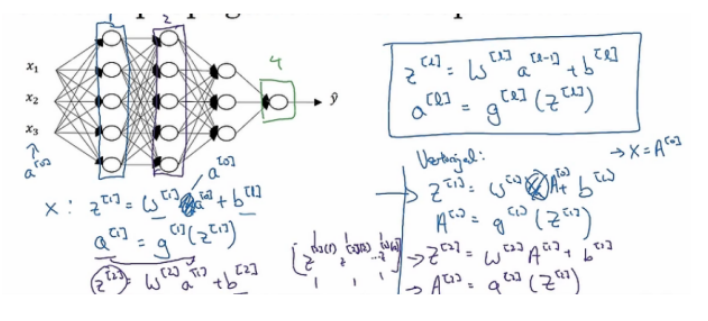

前向传播好理解，反向传播的公式怎么来的？

### 反向传播

首先要知道此处的损失函数是用极大似然估计的思想得出，然后对其进行求导：

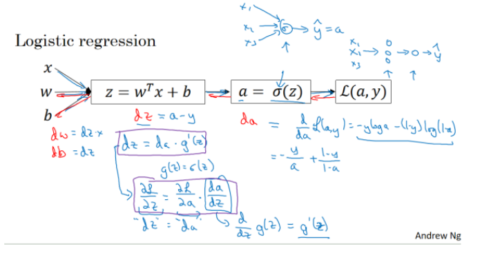

如图所示的逻辑回归，根据高数的链式求导法则可以推出损失函数对于各个参数的导数。

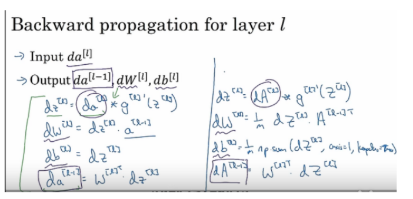

同理，对于神经网络，我们也是用类似的方式计算对每层的参数的导数，然后反向传播与梯度下降。

梯度下降与更新：$w = w - dw \ast \alpha$，其中的α为学习率。

## 向量化

在机器学习和深度学习中，我们总是会将数据写成矩阵的形式，并使用相应的科学计算库进行计算。这样的好处就是我们能够减少大量的计算时间，提高我们的效率。

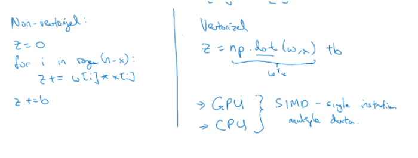

# 本周遇到的困难

1.学习反向传播时，各式子对参数的导数一开始不太明白，不明白反向传播的意义和方法。因此，在网上查阅了相关资料，了解了反向传播的意义，通过对参数的求导进行反向传播与梯度下降，求得满足全局最小值的参数值。同时。通过手动计算各层对于参数的导数，加深了对反向传播的理解。

2.在学习有关损失函数的知识时接触到了极大似然估计，对这个知识比较陌生。因此在网上查阅了相关资料，并加深对该知识的理解。

# 极大似然估计

概率：已知条件x，求结果y。P(y\|x)

似然：与概率相反，已知结果y，反求可能发生的条件x。P(x\|y)。

似然函数：P(x\|y)，即在已知结果时反推导致该结果的原因。

条件概率和似然函数在数值上是相等的，即：

但是意义并不相同，L(θ\|x) 是关于θ的函数，而P(x\|θ)则是关于x的函数。

学习与推断是反过来的过程。在机器学习中，我们通过样本学习参数，然后通过求出的参数推断结果。

 重要前提：训练样本的分布能代表样本的真实分布。每个样本集中的样本都是所谓独立同分布的随机变量，且有充分的训练样本。

总结起来，最大似然估计的目的就是：利用已知的样本结果，反推最有可能（最大概率）导致这样结果的参数值。

原理：极大似然估计是建立在极大似然原理的基础上的一个统计方法，是概率论在统计学中的应用。极大似然估计提供了一种给定观察数据来评估模型参数的方法，即："模型已定，参数未知"。通过若干次试验，观察其结果，利用试验结果得到某个参数值能够使样本出现的概率为最大，则称为极大似然估计。

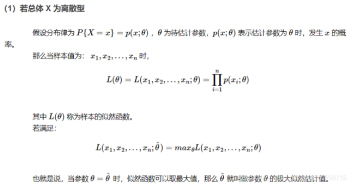

极大似然估计的步骤：

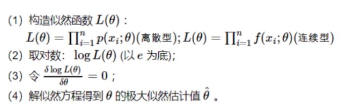

在逻辑回归中，我们就是基于极大似然估计的原理求出满足对数似然函数的参数值从而得到我们需要的能够最小化损失函数的参数，即得到我们需要的模型。

# 下周计划

本周学习了神经网络，了解了网络的前向传播，反向传播，梯度下降。下周将继续学习神经网络，并学习在神经网络中可能遇到的问题，如梯度消失、梯度爆炸问题，以及可能出现的模型过拟合问题，并了解如何解决这些问题，使用哪种方法，如何解决。
