# 本周学习内容：

1. 学习了机器学习中的参数与超参数的定义与区别，并了解了在神经网络中常见的超参数。
2. 学习了机器学习中的数据集的划分。了解了测试集常见的划分方式，如留出法、交叉验证、自助法等。
3. 学习了方差与偏差的定义与性质，了解了真实模型和预测模型之间的差别以及度量该差别的方法。
4. 学习了过拟合与欠拟合的定义与性质，并掌握如何通过不同的方法缓解过拟合和欠拟合。
5. 学习了正则化的作用和实现方式，了解为什么正则化能够解决过拟合的出现。同时，对于最常用的L1、L2正则化进行了进一步的学习。
6. 学习了归一化和标准化，将数据的范围放缩在一定范围内，防止数据的范围不一致倒是损失函数的收敛速度降低。
7. 学习了梯度消失与梯度爆炸，了解了其出现的原因。

# 1.参数与超参数

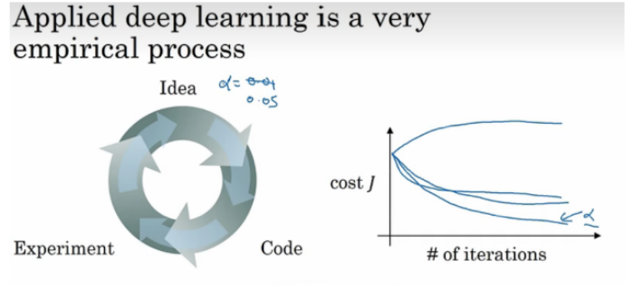

深度学习是一个带有经验性的过程。我们可能一开始有一些想法，然后我们会使用代码将其实现。但是在实现过程中，我们会根据经验来调整里面的参数，从而得到我们需要的模型。在机器学习与深度学习中，最常见且重要的大致有两种参数，分别为参数与超参数。

经过我们的参数调整，在不断的迭代下计算损失函数并且计算损失值，并使用各种优化算法尽可能的降低损失值，从而得到一个泛化能力最强的参数模型。

参数与超参数的区别如下：
区分两者最大的一点就是是否通过数据来进行调整，模型参数通常是有数据来驱动调整，超参数则不需要数据来驱动，而是在训练前或者训练中人为的进行调整的参数。例如卷积核的具体核参数就是指模型参数，这是有数据驱动的。而学习率则是人为来进行调整的超参数。这里需要注意的是，通常情况下卷积核数量、卷积核尺寸这些也是超参数，注意与卷积核的核参数区分。

在神经网络中，可以将超参数分为三类：

- 网络参数：可指网络层与层之间的交互方式（相加、相乘或者串接等）、卷积核数量和卷积核尺寸、网络层数（也称深度）和激活函数等。
- 优化参数：一般指学习率（learning rate）、批样本数量（batch size）、不同优化器的参数以及部分损失函数的可调参数。
- 正则化参数：权重衰减系数，丢弃法比率（dropout）

# 2.数据集的划分

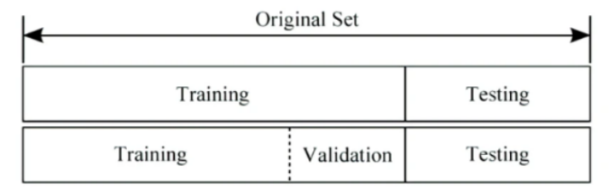

我们通常把训练的数据分为三个文件夹：**训练集、测试集和验证集**。

1. 训练集（train set）：用于训练模型以及确定参数。通常情况下，训练集是原始数据集的一部分，用于训练模型的参数。模型通过训练集来学习数据的特征，并产生一个模型，以便在之后的预测中使用。
2. 验证集（validation set）：用于确定网络结构以及调整模型的超参数。它通常是从原始数据集中划分出来的，用于在训练过程中调整模型的参数和超参数，以提高模型的性能。验证集的作用是帮助开发人员调整模型，避免模型过拟合或欠拟合。
3. 测试集（test set）：用于检验模型的泛化能力。它通常是从原始数据集中划分出来的，与训练集和验证集互不重叠。测试集的作用是评估模型在未见过的数据上的性能，并判断模型是否足够准确和鲁棒。

**为什么要将数据集划分成三个子集，而不是训练集和测试集？**

1. 我们在训练模型时总是需要调节模型超参数(hyperparameter)，让模型性能达到最佳，这个调节过程需要使用模型在验证集上的性能作为反馈信号。如果我们不使用验证集进行验证，那么很可能我们得到的模型会发生过拟合的现象，导致模型的泛化能力不够,不能够很好地拟合数据。
2. 调节超参数的过程本质上就是一种学习。因此，如果基于模型在验证集上的性能来调节模型配置，会很快导致模型在验证集上过拟合，即使你并没有在验证集上直接训练模型也会如此。
3. 造成模型在验证集过拟合的关键在于信息泄露(information leak)。每次基于模型在验证集上的性能来调节模型超参数，都会有一些关于验证数据的信息泄露到模型中。如果对每个参数只调节一次， 那么泄露的信息很少，验证集仍然可以可靠地评估模型。但如果你多次重复这一过程（运行一 次实验，在验证集上评估，然后据此修改模型），那么将会有越来越多的关于验证集的信息泄露 到模型中。
4. 最后，你得到的模型在验证集上的性能非常好（人为造成的），因为这正是你优化的目的。 你关心的是模型在全新数据上的性能，而不是在验证数据上的性能，因此你需要使用一个完全不同的、前所未见的数据集来评估模型，它就是测试集。你的模型一定不能读取与测试集有关 的任何信息，既使间接读取也不行。如果基于测试集性能来调节模型，那么对泛化能力的衡量是不准确的。

因此，我们需要将数据划分成训练集、验证集和测试集。这三个数据互不交叉，且各有其功能。

通常情况下，如果当数据量不是很大的时候（万级别以下）的时候将训练集、验证集以及测试集划分为6：2：2；若是数据很大，可以将训练集、验证集、测试集比例调整为98：1：1。

## 机器学习测试集选取常用方法

1. 留出法：直接将数据集D划分为两个互斥的集合，其中一个集合作为训练集S，另一个作为测试集T，即.在S上训练出模型后，用T来评估其作为测试误差，作为对泛化误差的估计。
2. 交叉验证法（crossvalidation）/k折交叉验证（k-fold cross validation）：将数据集D划分为k个大小相似的互斥子集，即.每个子集$D_i$都尽可能保持数据分布的一致性，即从D中通过分层采样得到。然后每次都用k-1个子集的并集作为训练集，余下的那个子集作为测试集；这样就可获得k组训练/测试集，从而可进行k次训练和测试，最终返回的是这k个测试结果的均值。
   为了减小因样本划分不同而引入的差别，k折交叉验证通常要随机使用不同的划分重复p次，最终的评估结果是这p次k折交叉验证结果的均值，例如常见的10次10折交叉验证。
3. 自助法：以bootstrap sampling为基础，给定包含m个样本的数据集，我们对它进行采样产生数据集D’：每次随机从D中挑选一个样本，将其拷贝放入D’，然后将该样本放回初始数据集D中，使得该样本在下次采样时仍有可能被采到；这个过程重复m次以后，我们就得到了包含m个样本的数据集D’。将D’用作训练集，D\D’用作测试集。该方法常用于集成学习。
   

# 3.偏差与方差

## 1.为什么要有偏差和方差？

对学习算法除了通过实验估计其泛化性能之外，人们往往还希望了解它为什么具有这样的性能。**“偏差-方差分解”（bias-variance decomposition）**就是从偏差和方差的角度来解释学习算法泛化性能的一种重要工具。

在机器学习中，我们用训练数据集去训练一个模型，通常的做法是定义一个误差函数，通过将这个误差的最小化过程，来提高模型的性能。然而我们学习一个模型的目的是为了解决训练数据集这个领域中的一般化问题，单纯地将训练数据集的损失最小化，并不能保证在解决更一般的问题时模型仍然是最优，甚至不能保证模型是可用的。这个训练数据集的损失与一般化的数据集的损失之间的差异就叫做**泛化误差（generalization error）**。

而泛化误差可以分解为**偏差（Biase）**、**方差（Variance）**和**噪声（Noise）**。泛化误差可以通过一系列公式分解运算证明：泛化误差为偏差、方差与噪声之和。

## 2.偏差、方差、噪声

**Bias**是用**所有可能的训练数据集**训练出的**所有模型**的输出的**平均值**与**真实模型**的输出值之间的差异。

**Variance**是**不同的训练数据集训练出的模型**输出值之间的差异。

**噪声**的存在是学习算法所无法解决的问题，数据的质量决定了学习的上限。假设在数据已经给定的情况下，此时上限已定，我们要做的就是尽可能的接近这个上限。

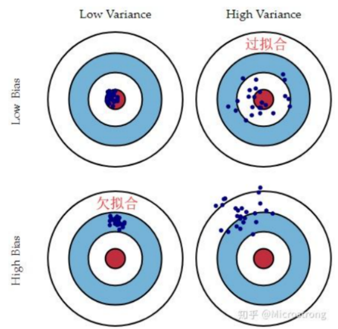

对于偏差和方差的理解可看上图。

假设红色的靶心区域是学习算法完美的正确预测值，蓝色点为训练数据集所训练出的模型对样本的预测值，当我们从靶心逐渐往外移动时，预测效果逐渐变差。

从上面的图片中很容易可以看到，左边一列的蓝色点比较集中，右边一列的蓝色点比较分散，它们描述的是方差的两种情况。比较集中的属于方差比较小，比较分散的属于方差比较大的情况。

我们再从蓝色点与红色靶心区域的位置关系来看，靠近红色靶心的属于偏差较小的情况，远离靶心的属于偏差较大的情况。

如右上的图片，我们发现蓝点与红色区域比较接近，但是我们根据不同的训练集训练出的模型得到的结果波动范围较大，说明他的泛化能力不行，只适用于特定的数据集，发生了过拟合。
而左下的图片虽然蓝点较为集中，但是与红色区域的距离较远，因此发生了欠拟合，对原始数据集的训练程度不够，没有充分的挖掘出数据的信息。

## 3.偏差-方差窘境（bias-variance dilemma）

一般来说，偏差与方差是有冲突的，这称为**偏差-方差窘境（bias-variance dilemma）**。下图给出了一个示意图。给定学习任务，假定我们能控制学习算法的训练程度，则在训练不足时，学习器的拟合能力不够强，训练数据的扰动不足以使学习器产生显著变化，此时偏差主导了泛化错误率；随着训练程度的加深，学习器的拟合能力逐渐增强，训练数据发生的扰动渐渐能被学习器学到，方差逐渐主导了泛化错误率；在训练程度充足后，学习器的拟合能力已经非常强，训练数据发生的轻微扰动都会导致学习器发生显著变化，若训练数据自身的、非全局的特性被学习器学到了，则将发生过拟合。

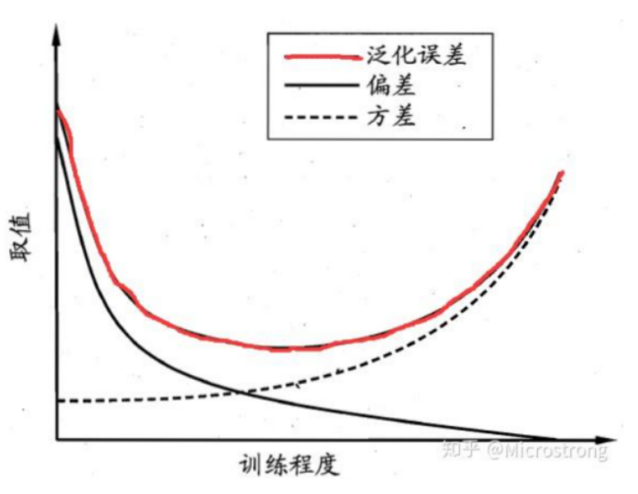

# 4.过拟合与欠拟合

**欠拟合：模型不能适配训练样本，有一个很大的偏差。**

**过拟合：模型很好的适配训练样本，但在测试集上表现很糟，有一个很大的方差。**

如何解决？

解决欠拟合：

1. 模型复杂化
   - 对同一个算法复杂化。例如回归模型添加更多的高次项，增加决策树的深度，增加神经网络的隐藏层数和隐藏单元数等。
   - 弃用原来的算法，使用一个更加复杂的算法或模型。例如用神经网络来替代线性回归，用随机森林来代替决策树等。
2. 增加更多的特征，使输入数据具有更强的表达能力
   - 特征挖掘十分重要，尤其是具有**强表达能力的特征**，往往可以抵过大量的弱表达能力的特征，特征的数量往往并非重点，质量才是，总之强特征最重要。
   - 能否挖掘出强特，还在于**对数据本身以及具体应用场景的深刻理解**，往往依赖于经验。
3. 调整参数和超参数
   - 超参数包括：神经网络中的学习率、学习衰减率、隐藏层数、隐藏层的单元数、Adam优化算法中的β1和β2参数、batch_size数值等
   - 其他算法中：树模型（随机森林、GBDT、xgboost）的树数量，k-means中的cluster数，正则化参数λ等。
4. 增加训练数据往往没有用。欠拟合本来就是模型的学习能力不足，增加再多的数据给它训练它也没能力学习好，因此，正如方法2一样，高质量的数据是前提，正如BAT这些大公司，为什么算法模型很强，那是因为平台积累的数据质量足够好。
5. 降低正则化约束。正则化约束是为了防止模型过拟合，如果模型压根不存在过拟合而是欠拟合了，那么就考虑是否**降低正则化参数λ**或者**直接去除正则化项，与过拟合相反操作。**

解决过拟合：

1. 正则化（Regularization）（L1和L2）
2. 数据增强（Data augmentation），也就是增加训练数据样本
3. Dropout正则化
4. early stopping（提前终止训练）

# 5.正则化与归一化

由于深层神经网络容易发生过拟合，因此我们使用正则化来惩罚参数。

常用：L1正则化，L2正则化，Dropout正则化

## L1和L2正则化

L1正则化：$||w||_1=\sum_{i=1}^{m}|x_i|$，模型各个参数的**绝对值之和**。得到的ω将会有较多的0，有利于压缩模型，做特征选择。

L2正则化：$||w||_2=\sqrt{\sum_{i=1}^{m}x_i^2}$，模型各个参数的**平方和再平方根**。

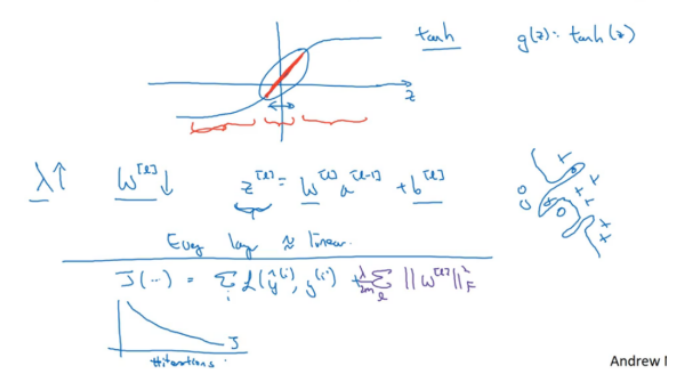

如图，λ为正则化参数。通常使用验证集或者交叉验证来确定λ的大小，是一个**超参数**。当λ增大时，由于**权重衰减**，w会减小，那么z也减小，导致使用激活函数得到的趋于线性（红色部分），那么对于右边所示的复杂分类就不太可能发生，防止过拟合，因此减小了过拟合。

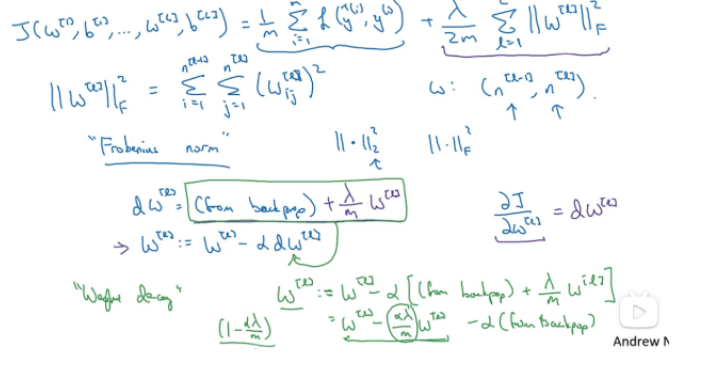

在原w的基础上，乘了1-αλ/m，该系数小于1，因此w会变得更小，这就叫做**权重衰减**，因为乘了一个小于1的系数再进行梯度下降。

## dropout正则化

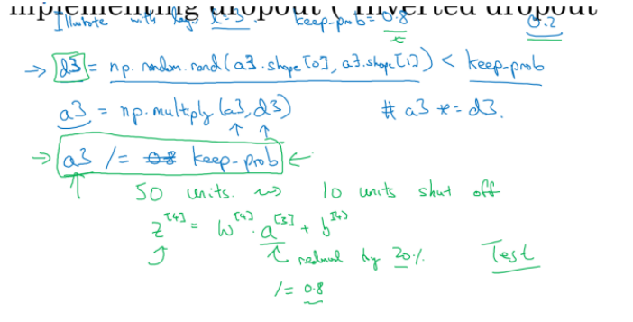

对于参数矩阵，对其进行随机失活，设置keep_prob，表示保存的概率。然后计算a和z。为了保证期望不变，我们需要在a的基础上除以keep_prob。如：原来有50个神经元，随机失活后还剩50*0.8=40，就用这40个神经元进行运算，最后还要除以0.8.

步骤：

1. 首先让所有神经元以一定概率p失活，输入输出的神经元保持不变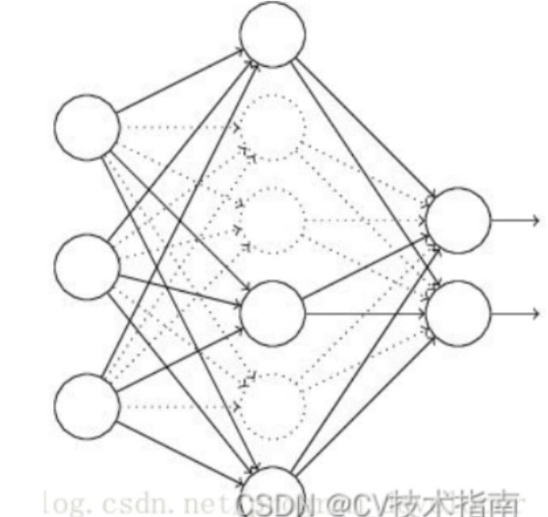)
2. 让输入X通过部分神经元失活的新网络（如上图）进行前向传播，然后计算损失并把损失反向传播，一小批样本执行完这个过程后，根据梯度下降算法更新参数（w,b)
3. 不断重复这一过程:
   - 恢复失活的神经元；
   - **重新**让所有神经元以一定概率p失活（**这次失活的和上次失活的神经元并不一定相同**）；
   - 让输入X通过部分神经元失活的新网络进行前向传播，然后计算损失并把损失反向传播，新的一批样本执行完这个过程后，根据梯度下降算法更新参数（w,b).

 

## 归一化

### 归一化的作用

在机器学习领域中，不同评价指标（即特征向量中的不同特征就是所述的不同评价指标）往往具有不同的量纲和量纲单位，这样的情况会影响到数据分析的结果，为了消除指标之间的量纲影响，需要进行数据标准化处理，以解决数据指标之间的可比性。原始数据经过数据标准化处理后，各指标处于同一数量级，适合进行综合对比评价。其中，最典型的就是数据的归一化处理。

简而言之，归一化的目的就是使得预处理的数据被限定在一定的范围内（比如[0,1]或者[-1,1]），从而**消除奇异样本数据**导致的不良影响。

**如果不进行归一化，那么由于特征向量中不同特征的取值相差较大，会导致目标函数变“扁”**。这样在进行梯度下降的时候，梯度的方向就会偏离最小值的方向，走很多弯路，即训练时间过长。

如图左侧，我们发现要找他的梯度方向，我们需要找到其切线方向，然后按照其垂直方向进行梯度下降。这样的话需要的时间就会较长。

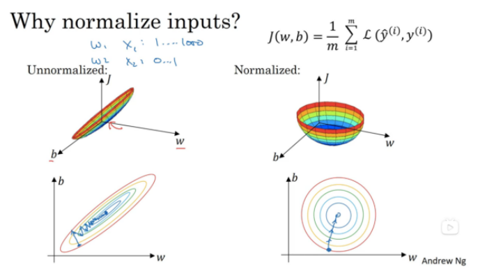

当我们进行归一化之后，各数据的数据范围都放缩在了一定范围内，这样就会得到右边的梯度图像。这样在我们进行梯度下降时，就能够更快的梯度下降。

### 归一化（Normalization）和标准化（Standardization）

1. 最大最小标准化：本归一化方法又称为离差标准化，使结果值映射到[0 ，1]之间，转换函数如下：$x^{'}=\frac{x-min(x)}{max(x)-min(x)}$。
2. 标准化：将数据变换为均值为0，标准差为1的分布切记。$x^{'}=\frac{x- \mu}{\sigma}$。

区别与联系：

1. 第一点：显而易见，Normalization会严格的限定变换后数据的范围，比如按之前最大最小值处理的Normalization，它的范围严格在[ 0 , 1 ]之间；
   而Standardization就没有严格的区间，变换后的数据没有范围，只是其均值是0，标准差为1。
2. 第二点：归一化(Normalization)对数据的缩放比例仅仅和极值有关，就是说比如100个数，你除去极大值和极小值其他数据都更换掉，缩放比例α = $\alpha = X_{max}-X_{min}$是不变的；反观，对于标准化(Standardization)而言，它的$\alpha=\sigma,\beta=\mu$，如果除去极大值和极小值其他数据都更换掉，那么均值和标准差大概率会改变，这时候，缩放比例自然也改变了。
   

# 6.梯度消失与爆炸

目前优化神经网络的方法都是基于BP，即根据损失函数计算的误差通过梯度反向传播的方式，指导深度网络权值的更新优化。其中将误差从末层往前传递的过程需要链式法则（Chain Rule）的帮助，因此反向传播算法可以说是梯度下降在链式法则中的应用。

- 梯度消失：经常出现，产生的原因有：一是在深层网络中，二是采用了不合适的损失函数，比如sigmoid。**当梯度消失发生时，接近于输出层的隐藏层由于其梯度相对正常，所以权值更新时也就相对正常，但是当越靠近输入层时，由于梯度消失现象，会导致靠近输入层的隐藏层权值更新缓慢或者更新停滞。这就导致在训练时，只等价于后面几层的浅层网络的学习。**如在sigmoid函数中，只有在0点的梯度为线性，其余地方均小于1.0。如果深层网络不断连乘，最终导致结果趋于0，造成无法更新权重的结果。
- 梯度爆炸：一般出现在深层网络和权值初始化值太大的情况下。在深层神经网络或循环神经网络中，误差的梯度可在更新中累积相乘。如果网络层之间的梯度值大于 1.0，那么重复相乘会导致梯度呈指数级增长，梯度变的非常大，然后导致网络权重的大幅更新，并因此使网络变得不稳定。

从三个角度分析：

1. 深层网络
   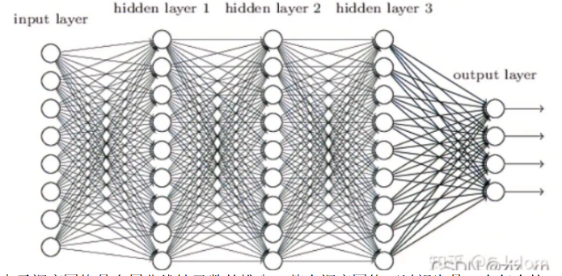
   由于深度网络是多层非线性函数的堆砌，整个深度网络可以视为是一个复合的非线性多元函数。**当我们进行方向传播的时候，由于是连乘的形式，会导致梯度已指数进行传播。当梯度大于或者小于1时，就会容易造成梯度爆炸和梯度消失。**
2. 激活函数
   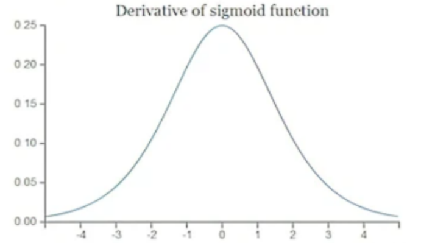
   由于sigmoid函数的导数值不会超过0.25，因此在反向传播进行梯度下降时会导致梯度消失。
3. 初始权重值过大
   如果权重值过大，那么当我们反向传播时，梯度会积累，导致前面的梯度越来越大，导致梯度爆炸。

解决方法：学习中...

# 本周难点

## L1和L2正则化的区别

相同点：都用于避免过拟合
不同点：

- L1正则化可以产生稀疏权值矩阵，即产生一个稀疏模型，大部分的参数都为0，用于特征选择。L1可以让一部分特征的系数缩小到0，从而间接实现特征选择。所以L1适用于特征之间有关联的情况。
- L2正则化可以产生参数值较小的模型，能适应不同的数据集，一定程度上防止过拟合，抗扰动能力强。L2让所有特征的系数都缩小，但是不会减为0，它会使优化求解稳定快速。所以L2适用于特征之间没有关联的情况。

L1正则化的损失函数：

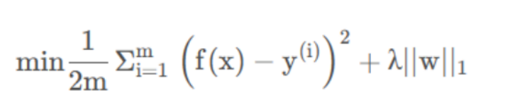

在上述的公式中，$\frac{1}{2m}\sum_{i=1}^{m}(f(x)-y^{(i)})^2$是原始的损失函数，也称为经验误差，在此基础上，加入了L1正则项$\lambda ||w||_1$,L1正则项是权重向量中各元素的绝对值之和。模型训练的目的是令损失函数达到全局最小值，当在原始的损失函数之后加入L1正则项之后，相当于对权重向量做了约束，此时我们的任务变为了在L1约束条件下求得损失函数的最小值。这样我们就可以使用拉格朗提乘数法。由于高维的情况无法用图像形象的描述出来，我们这里考虑二维的情况，即只有两个权重值$w_1和W_2，$此时对损失函数应用梯度下降法，求解过程中可以画出等值线，如下图所示：

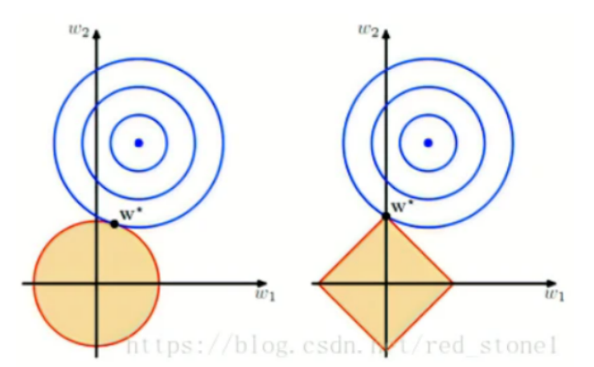

**为什么是矩形？**
因为约束条件是$\lambda ||w||_{1}$，即为$|w_1|+|w_2| \lt C$，那么就画出了矩形的形状。彩色的为损失函数的等值线，我们需要求得在矩形的约束条件下，损失函数的最小值。显然是上图的交点。

**稀疏化的原因：**

对于 L1 来说，限定区域是正方形，方形与蓝色区域相交的交点是顶点的概率很大，这从视觉和常识上来看是很容易理解的。也就是说，方形的凸点会更接近 Ein 最优解对应的 wlin 位置，而凸点处必有 w1 或 w2 为 0。这样，得到的解 w1 或 w2 为零的概率就很大了。所以，L1 正则化的解具有稀疏性。

同理对于L2正则化，我们用的是：$w_{1}^2+w_2^2 \lt C$，因此画出的是个圆形。相较于L1正则化，L2正则化就没那么容易产生稀疏性。

# 下周计划

1. 进一步学习梯度消失和梯度爆炸产生的原因和解决方法。
2. 学习出常见的梯度下降之外，另外的优化损失函数的方法。
3. 学习批标准化来解决梯度问题。
4. 学习并了解softmax激活函数，用来实现多分类问题。
