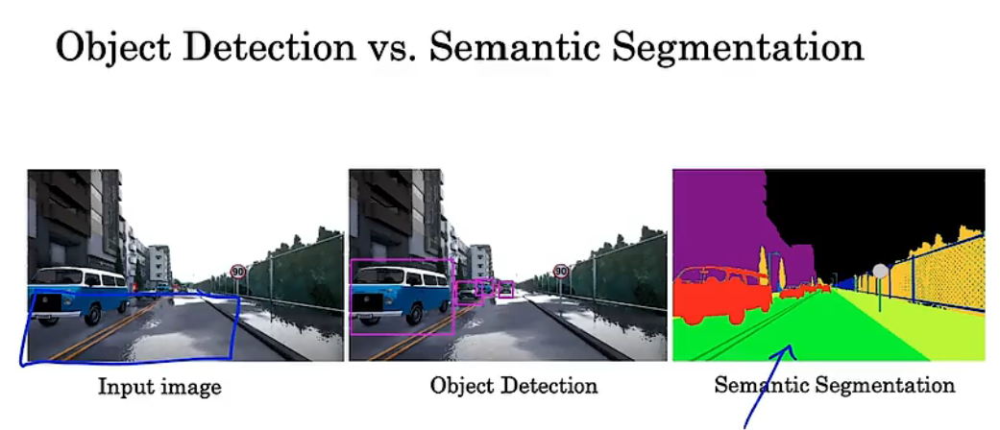
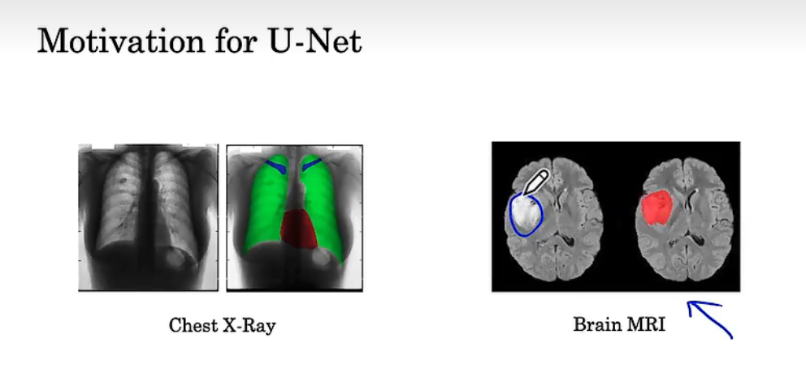
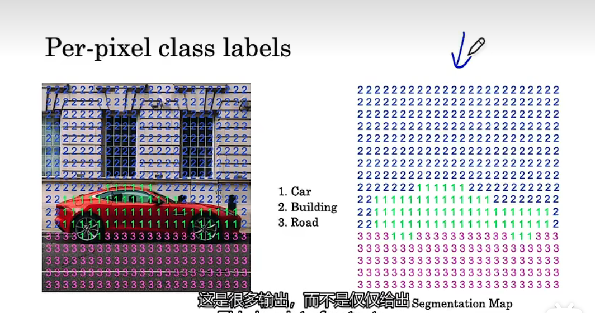
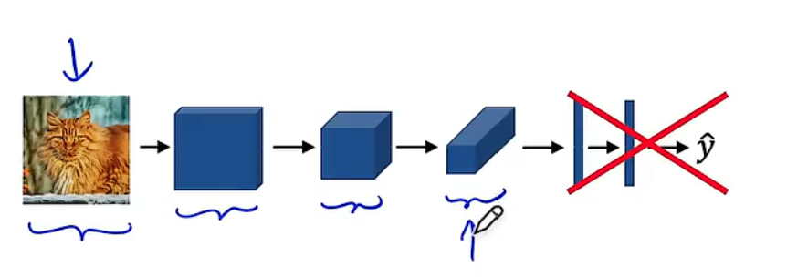
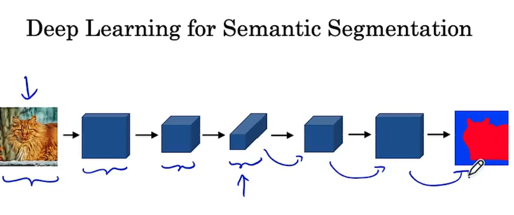
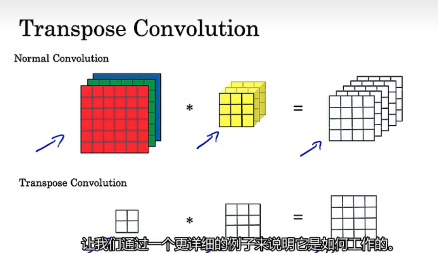
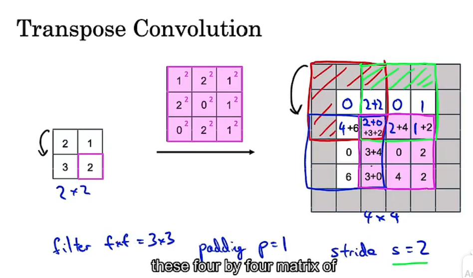
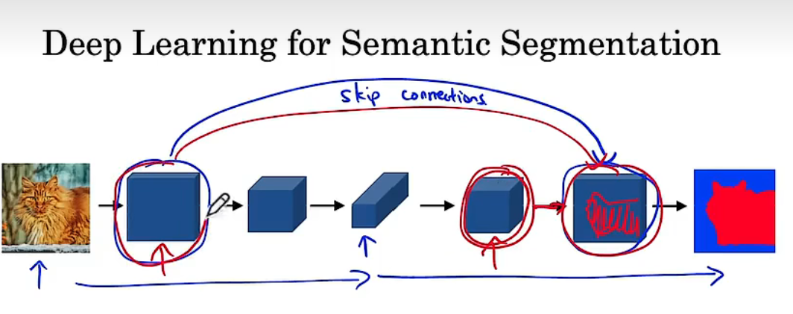
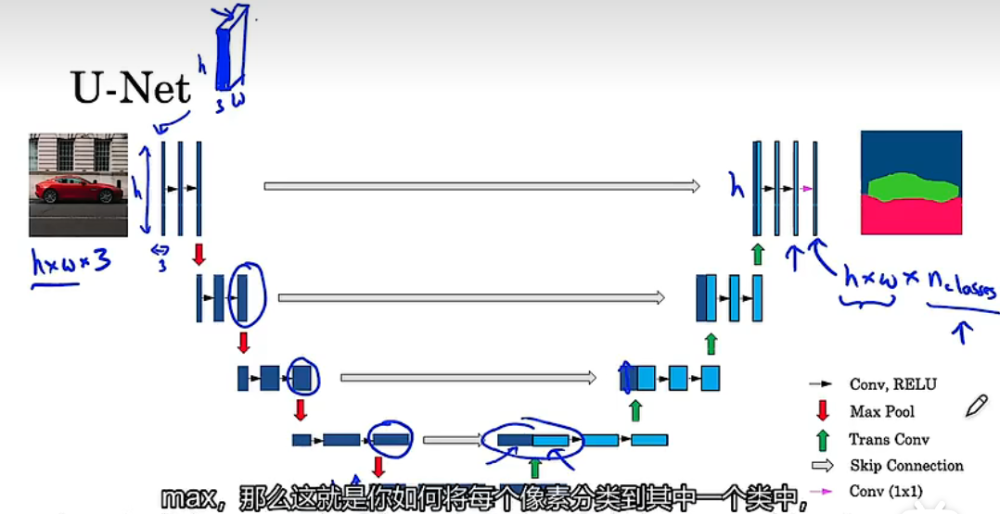

# 语义分割

# 1.语义分割与目标检测的区别

## 目标检测

在图像分类问题中，给定一幅图片，我们只要说出图片里的物体是什么就行了。在这堂课要讨论的任务中，我们还要多做一件事——定位。我们要先用边框圈出图中的物体，再说出框里的物体是什么。这叫做带定位(localization)的分类问题。更进一步，如果我们不再是只讨论一个物体，而是要把图片中**所有物体都框出来，并标出每一个物体的类别**，这就是目标检测问题。

## 语义分割

语义分割是对图像在像素级别上进行分类的方法，在一张图像中，属于同一类的像素点都要被预测为相同的类，因此语义分割是从像素级别来理解图像。但是需要正确区分语义分割和实例分割，虽然它们在名称上很相似，但是它们属于不同的计算机视觉任务。

- 例如，一张照片中有多个人，针对语义分割任务，只需将所有人的像素都归为一类即可。
- 但是针对实例分割任务，则需要将不同人的像素归为不同的类。简单来说，实例分割会比语义分割所做的工作更进一步。

*语义分割在医学上的例子*

# 2.语义分割的原理

如图，我们会对不同的类别的物体给出不同的标签，然后输出如右图所示的结果，这样就代表了我们对于原图像进行了分割，得到了不同的结果。

**与目标检测不同的是，**目标检测需要检测出该目标的位置以及给出一个标签，==而语义分割需要将整个图像所有像素位置进行输出，不同的目标将得到不同的输出。==

*一个语义分割的卷积网络示例*

目标检测：

语义分割：

在我们进行卷积时，图像大小会越来越小，但是我们需要输出与原图像大小一致的结果，因此在后面我们需要将其大小恢复到原状，因此我们需要用到**转置卷积。**

# 3.转置卷积

如上图，正常的卷积会通过过滤器计算后降低图像的大小，然而**转置卷积反而会提升其大小。**==因此，转置卷积就是将小的输入放大为大的输出。==

## 转置卷积怎么计算

如图，我们会以此地从输入中选择一个数，然后分别与过滤器计算，再将计算的结果放在输出中。
该图片中，p=1,s=2，因此得到的结果如图所示，阴影部分表示padding。

==注：==

1. padding的结果不需要，因此阴影部分都没有结果；
2. 如果计算的结果已经存在了值，那么要进行相加，如图2+2，4+6等。

# 4. u-net网络

如图，我们使用卷积得到猫的一些局部特征，**这些是具有较低的分辨率但有较高的空间水平的上下文信息**，同时我们使用skip connections得到**更低级但是更加详细的纹理信息**。==即，使用卷积得到关于特征的信息，使用skip connection得到位置信息。==

这就是U-Net的原理图，实际上就是上采样加下采样。