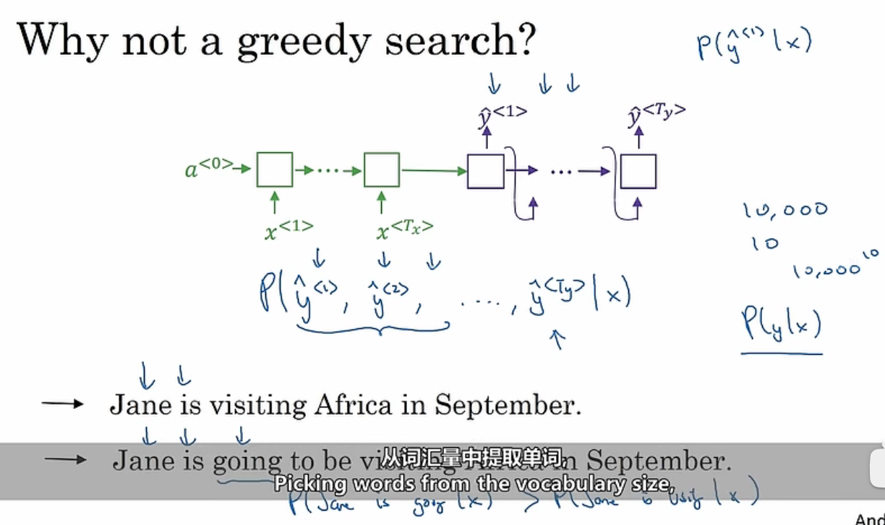
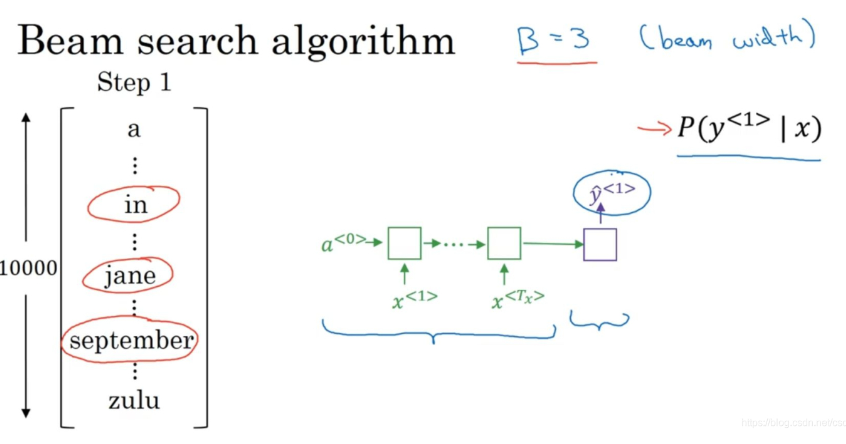
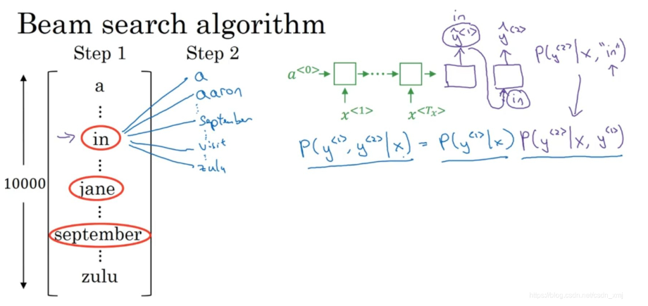
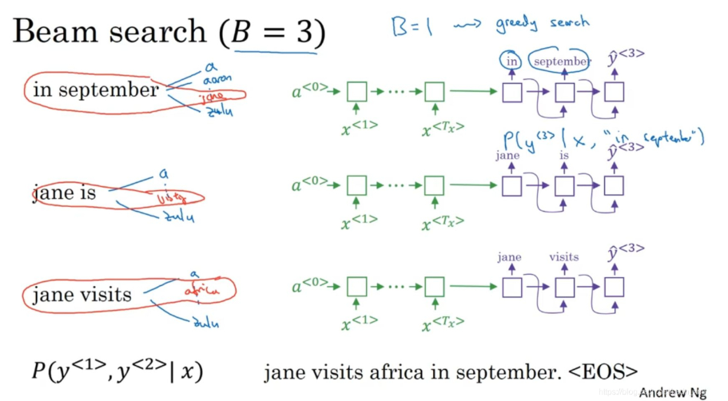
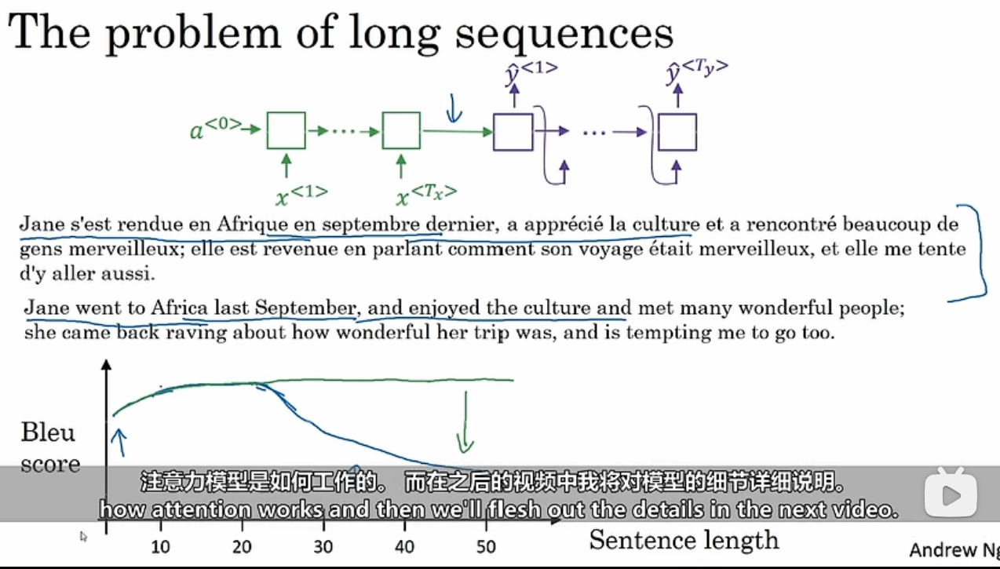
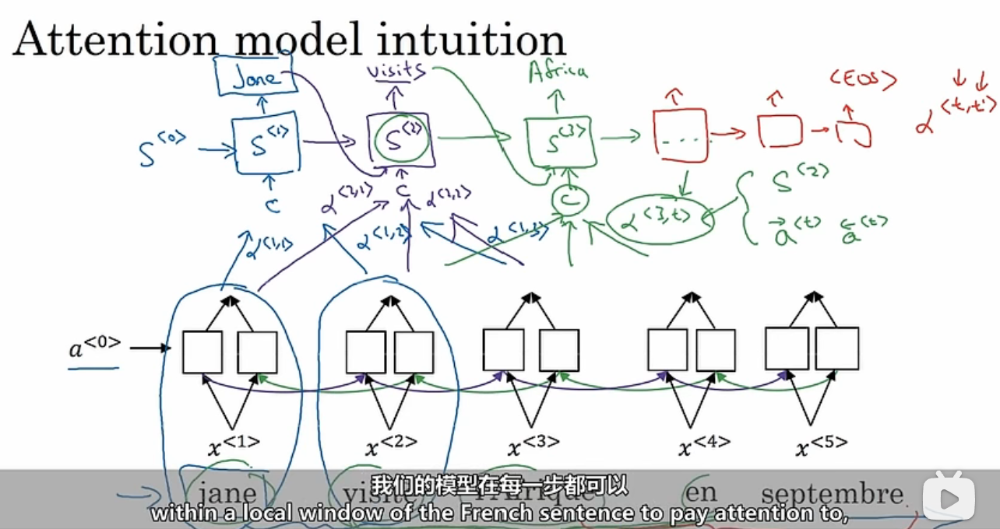
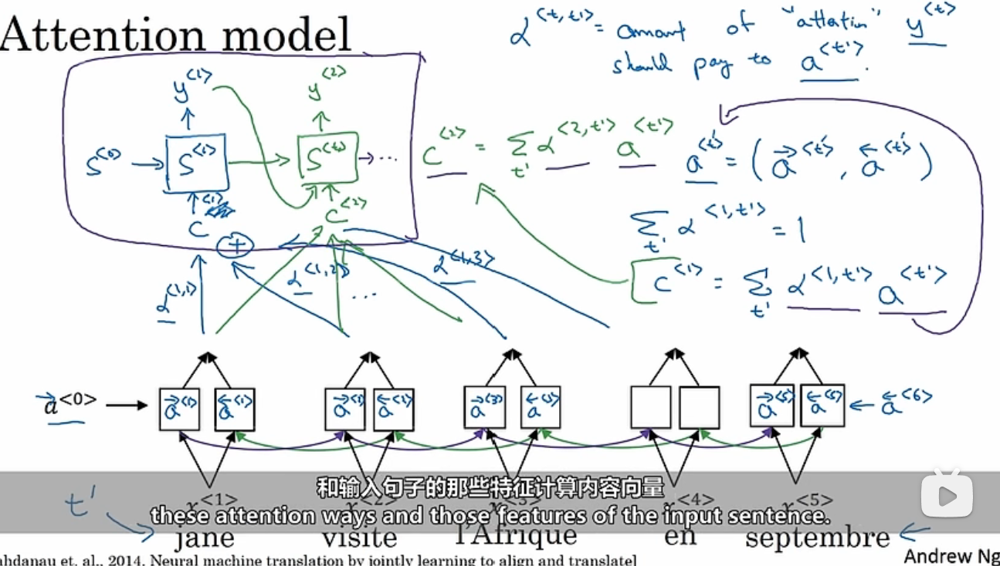
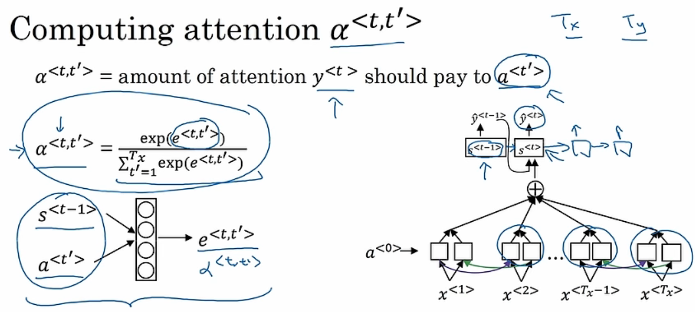

# 1.基础模型

Seq2Seq模型：

- 如图，输入为一张图像
- 我们可以使用CNN提取图像特征，如图中使用AlexNet并去掉最后的softmax层
- 这样我们就得到了4096维的特征向量来表示这张图像
- 然后将该特征向量作为输入数据输入到RNN中，我们可以输出一个输出集或者说一个文字输出序列用于描述这个图像，如图中的句子

# 2.选择最有可能的句子

如在机器翻译中，可能有多种可能的句子组合。我们需要选择一个概率最高的句子。如果使用贪婪算法，那么只会每次都选择概率最大的单词，然后组成一句话，这显然是不合理的。

# 3.（Beam Search）集束搜索

第一步，使用如图所示的编码-解码其输入句子来计算第一个输出单词的可能性。在这里使用一个超参数B=3，**表示每次考虑几个单词。**这里考虑三个单词，那就选择3个概率最高的单词作为候选。

第二步，将上面的三个单词输出分别作为解码器第一个的输入，再次预测第二个单词的输出，同样选择三个，保证与第一个单词出现的概率最大。

第三步，仍然重复上面的过程，每次都挑选与前面输出组成的概率最大的前三个输出作为结果，知道遇到终止符。这样我们就得到了很多个句子，选最概率最大的，就是我们输出的最终结果。

可以发现，当B=3时，他就退化成了贪婪算法。实际上他就是一个每次输出都会增加一层、每层3个节点的树，每个节点都保存从根开始到当前的单词序列的概率，最后只要挑选最后一层值最大的即可。

# 4.注意力模型

如果使用传统的RNN网络，那么其识别长句子的能力是比较有限的。**人类翻译句子的习惯是先识别一部分并翻译一部分，然后再识别一部分再翻译。因为记住整个句子实在太难了。**

如果使用注意力模型机制，那么他就能像人一样在一段时间内专注于翻译一段句子，就能得到比较好的结果。

如图，我们使用下面的双向RNN（BRNN）识别句子，然后使用上面的RNN进行翻译输出。在使用注意力机制时，对于第一个单词，我们会产生一个权重参数$\alpha<1,1>$告诉RNN对于要输出的第一个单词要多少程度地关注输入的第一个单词，同理$\alpha<1,2>$表示要输出的第一个单词要多少程度地关注输入的第二个单词。这些参数告诉了上面的RNN输入的值以及关注度。

之后对于要翻译的第二个单词，前一个输出也是输入的一部分，然后同样生成一系列$\alpha<2,x>$的权重参数。这些共同组成输入用于预测第二个输出。以此类推知道输出终止符。

如图时注意力模型。上面的用于翻译，下面的用于读取输入。其中：

- $c^{<t'>}$表示解码时的总输入
- $\alpha^{<t,t'>}$表示解码的第t个输出需要对编码的各个输入花多少关注度
- $a^{<t'>}$表示编码的激活值

其中$\alpha^{<t,t'>}$的计算如上所示，可见她是一个softmax形式的，因此总和为1.其中的$e^{<t,t'>}$表示解码的第t激活输出值，可通过训练下面的小网络得到。

