# 本周学习内容

1. 进一步学习梯度消失和梯度爆炸产生的原因和解决方法。
2. 学习常见的梯度下降之外，另外的优化损失函数的方法，如mini batch,Momentum,RMSProp,Adam。

# 1.解决梯度消失和爆炸

梯度消失和梯度爆炸问题都是因为网络太深，网络权值更新不稳定造成的，本质上是因为梯度反向传播中的连乘效应。解决梯度消失、爆炸主要有以下几种方法：

1. pre-training+fine-tunning（预训练+微调）
   采取无监督逐层训练方法，其基本思想是每次训练一层隐节点，训练时将上一层隐节点的输出作为输入，而本层隐节点的输出作为下一层隐节点的输入，此过程就是逐层“预训练”（pre-training）；在预训练完成后，再对整个网络进行“微调”（fine-tunning）。此思想相当于是先寻找局部最优，然后整合起来寻找全局最优。
2. **梯度剪切：对梯度设定阈值**
   梯度剪切这个方案主要是针对梯度爆炸提出的，其思想是设置一个梯度剪切阈值，然后更新梯度的时候，如果梯度超过这个阈值，那么就将其强制限制在这个范围之内。这可以防止梯度爆炸。
3. **权重正则化**
   另外一种解决梯度爆炸的手段是采用权重正则化（weithts regularization），正则化主要是通过对网络权重做正则来限制过拟合。如果发生梯度爆炸，那么权值就会变的非常大，反过来，通过正则化项来限制权重的大小，也可以在一定程度上防止梯度爆炸的发生。比较常见的是 L1 正则和 L2 正则。
4. 选择relu等梯度大部分落在常数上的激活函数。
   relu函数的导数在正数部分是恒等于1的，因此在深层网络中使用relu激活函数就不会导致梯度消失和爆炸的问题。
5. **batch normalization**
   BN就是通过对每一层的输出规范为均值和方差一致的方法，消除了权重参数放大缩小带来的影响，进而解决梯度消失和爆炸的问题，或者可以理解为BN将输出从饱和区拉倒了非饱和区。
6. 残差网络
   相比较以往的网络结构只是简单的堆叠，残差中有很多跨层连接结构，这样的结构在反向传播时具有很大的好处。

# 2.常见的优化算法

## 1.mini-batch梯度下降

在训练网络时，如果训练数据非常庞大，那么把所有训练数据都输入一次神经网络需要非常长的时间，另外，这些数据可能根本无法一次性装入内存。

假设我们有500000对数据，那么我们可以将其划分成500组，每组1000对，这样我们就得到了500组的mini batches。

在之前的梯度下降算法中，我们使用整个数据集来运行梯度下降算法，但现在，我们在每组 mini-batch 上运行梯度下降算法，即在这个例子中，我们只需要将 1000 对训练数据，就可以更新一次网络中的权重，而在之前，我们需要全部 500000 对训练数据才能更新一次权重。这种新的梯度下降就叫做 mini-batch 梯度下降，而之前的梯度下降其实叫做 batch 梯度下降。

虽然 mini-batch 梯度下降算法可以更快地更新权重，但是损失函数并**不会在每次更新权重后都下降，不过总体趋势仍然是下降的**，下面是两种梯度下降算法的对比：

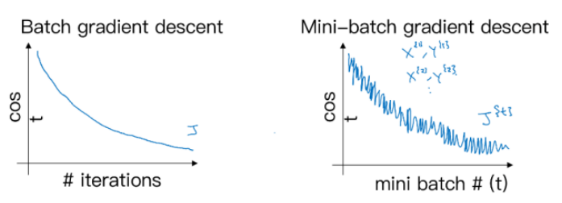

mini  batch的过程如下所示：

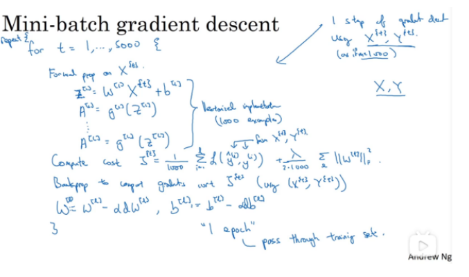

之前的batch梯度下降，是在一次epoch中处理所有的数据集，我们会：

1. 前向传播，计算该层的值；
2. 计算激活函数后的值；
3. 计算损失函数；
4. 反向传播，更新参数

这将在一次epoch中完成，遍历了一次数据集。

而在mini batch中，我们处理的数据不再是整个数据集，而是每个mini batch。这样，我们的一次epoch遍历整个数据集，就需要进行500次的梯度下降才能够完成。

### 使用mini batch的好处

1. 能够防止数据无法一次装入内存，缓解了GPU的压力；
2. 提高训练速度，减少训练时间。

### mini batch的size选择

- m => 得到 **batch 梯度下降算法**
- 1 => 得到**随机梯度下降算法（SGD）**
- 1~m 之间 => **mini-batch 梯度下降算法**

m为我们训练集样本的大小。

三种梯度下降的损失函数图如下：

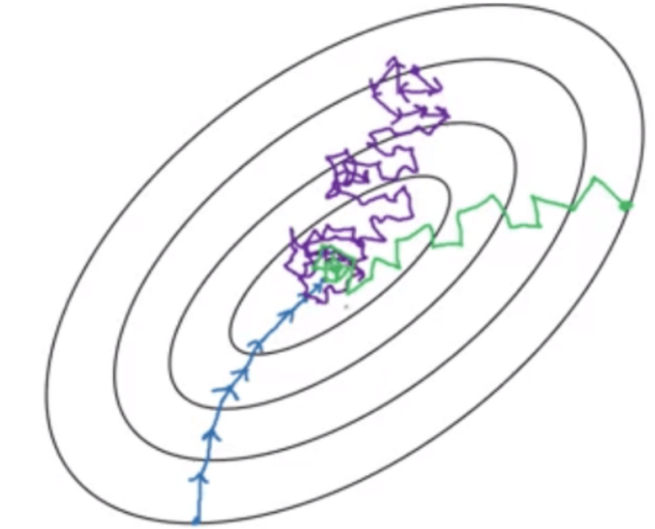

其中，

1. 蓝色的线为batch梯度下降，因为我们使用的是所有数据集进行梯度下降，他总能够找到梯度下降最快的方向进行更新，但是由于其易受到数据集规模的影响，更新的速度较慢；
2. 紫色的线为随机梯度下降SGD，由于我们每次只选择一个数据进行梯度下降，因此大部分时候朝着全局最小值靠近，但是有时也会远离最小值。整体上来看，我们会发现他也是靠近最小值，但是他不会收敛到最小值，而是会在最小值附近震荡。
3. 绿色的线为mini batch，他介于两者之间，既解决了batch的处理数据集过大时速度慢的缺点，也能够解决SGD处理数据时一次只处理一个数据，损失了向量化所带来的加速的缺点。因此，选择合适的mini batch size，能够对我们的训练带来很大的好处。

## 2.指数加权平均

指数加权平均(exponentially weighted averges)也叫指数加权移动平均，通过它可以**计算局部的平均值，来描述数值的变化趋势。**

如图是某地的全面的温度：

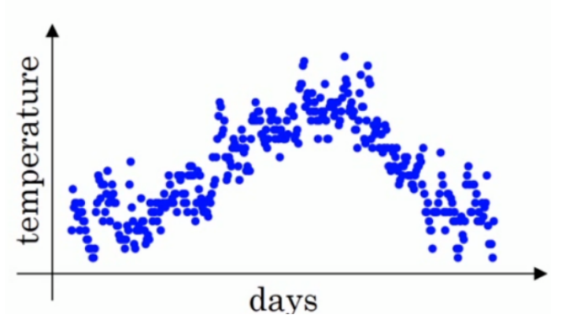

我们通过计算温度的**局部平均值（移动平均值）**来描述温度的变化趋势，计算公式为：

$v_t=\beta *v_{t-1}+(1-\beta)\theta _t$，其中$\theta $表示当天的温度，v表示局部平均值。

当β取不同的值时，绘制出的曲线如下图所示：

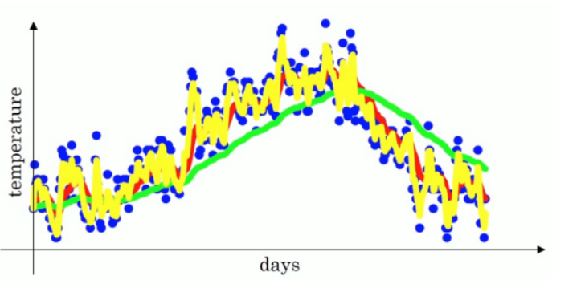

红色：β=0.9，  绿色：β=0.98， 黄色：β=0.5.

### 指数加权平均的作用

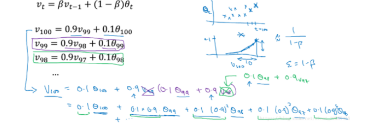
$$
\begin{aligned}
&v_{100}=\\
&0.1*\theta_{100}+0.1*0.9*\theta_{99}+0.1*0.9^2*\theta_{98}+...+0.1*0.9^{99}*\theta_1=\\
&0.1*\sum_{i=1}^{100}0.9^{(100-i)}*\theta_i
\end{aligned}
$$

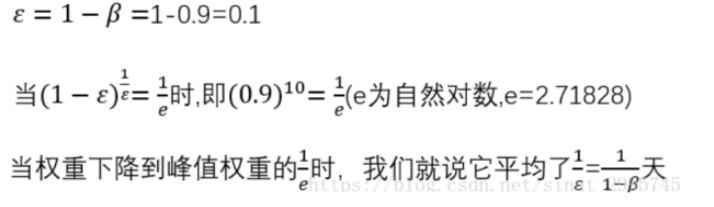

如果你想要计算10天局部温度的平均值，你需要保存最近10的温度（相当于使用滑动窗口进行计算每十天的温度）。而使用指数加权平均来计算局部平均值的时候，可以节省大量的空间，你**只需要保存前一个加权平均值**。*相对于直接计算平均值而言，它的精确度没有那么高。*

### 偏差修正

偏差修正的主要目的是为了提高指数加权平均的精确度，主要是针对前期的加权平均值的计算精度。

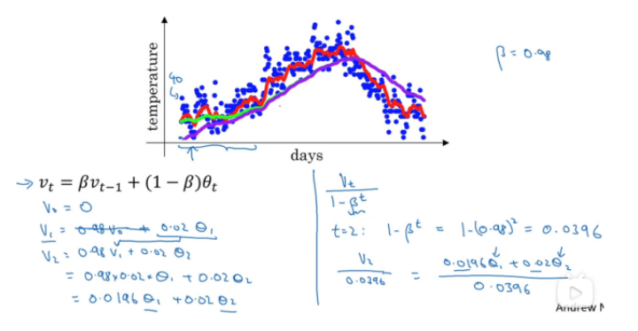

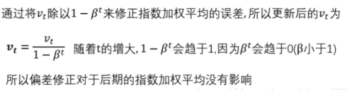

## 3.Momentum梯度下降（动量梯度下降）

先来看使用梯度下降会遇到的问题：

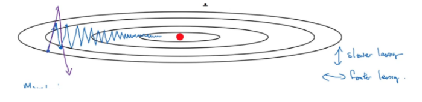

如蓝色的线所示，使用梯度下降时，会朝着梯度方向进行下降，但是我们在纵轴上总是会有波动，导致收敛速度较慢。同时，如果学习率α的选择较大，会导致我们得到紫色所示的线，收敛速度较慢。因此，能否找到一个方法，使得在纵轴上摆动的幅度变小的同时，加快在横轴上迭代的速度，使得学习速度更快？

普通的梯度下降法在更新参数时：

$w=w-\alpha dW$

对于动量梯度下降，我们针对dW计算$v_{dW}$:

$v_{dW}=\beta v_{dW}+(1-\beta)dW$，然后在更新参数时，我们不是乘dW，而是：

$w=w-\alpha v_{dW}$，这里的超参数β一般取0.9，α为学习率。

==为什么乘加权平均数就可以加快收敛的速度？==

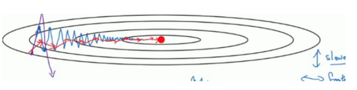

**运用了指数滑动平均后，$v_t$相当于粗略计算了前$\frac{1}{1-\beta}$个数据的平均值。**

观察上图中的蓝线，我们发现竖直方向的振动大致可以抵消，即每两次上下方向的振动长度大致相等，因此如果对其去平均值，结果就会很接近 0，这就是**“竖直方向的振动几乎消失”**的原因，而蓝线水平方向的路径都是向右的，对其取平均值不会使其减小，而是**随着已经行进的路径增多而变大**，这就是“水平方向的步伐逐渐加大”的原因。综上，得到上图中的红线。

## 4.RMSProp

RMSprop，全称：Root Mean Sqaure prop（均方根）。

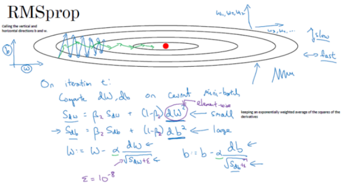

同使用动量的梯度下降一样，**RMSprop的目的也是为了消除垂直方向的抖动，使梯度下降快速收敛。**

其计算方法使用了将导数看作水平方向上的w和垂直方向上的b。并计算dw和db的平方值，这实际上是**平方版本的指数加权平均**。然后更新的时候又除去了根号求平均值，因此叫做Root Mean Sqaure prop。除法进行的时候因为dw较小，所以计算出的根号也较小，而db较大，所以计算出的根号也较大，因此更新时b变小了，w变化不大。（该图中为$(dw)^2,(db)^2$）。

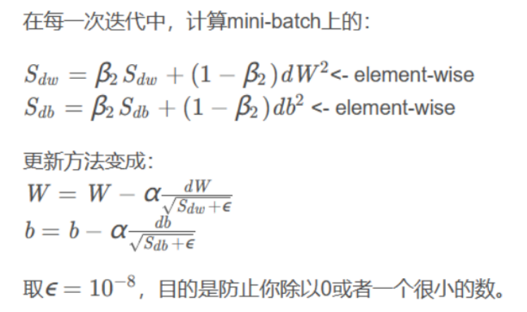

如图，纵轴是b，横轴是w，我们要做的是减缓纵轴的摆动，横轴方向上继续向前推进学习。

因此，我们需要dw较小，这样我们得到的$S_{dw}$也会较小；
db较大，得到的$S_{db}$也较大，这样其摆动就会缓解，从而提到了收敛的速度。

 

## 5.Adam（Adaptive Moment Estimation）优化算法

Adam算法可以看作是Momentum和RMSProp算法的结合。

我们首先会初始化$V_{dw},V_{db},S_{dw},S_{db}$为0，然后使用mini batch进行梯度下降，在第t次迭代中，我们会：

1. 使用Momentum方法更新超参数$\beta_1$；
2. 使用RMSProp方法更新超参数$\beta_2$;
3. 然后使用偏差修正，计算偏差修正；
4. 最后进行参数更新，完成一次迭代。

# 本周遇到的困难

本周主要学习了各类优化算法，并对各类优化算法进行了对比，了解各类优化算法的优点与不足。在学习中，有时容易混淆各类算法，需要进行进一步的学习。

1. 区分mini batch 的size取值为不同情况时对应的梯度下降方法，理解不同方法的梯度下降图像以及优缺点。
2. 理解什么是指数加权平均，为什么指数加权平均能够提高梯度下降的速度。因为平均了前n个梯度值，在竖直方向上整体上均值为0，减少摆动，水平方向上学习速度变快，能够进一步收敛到全局最小值。

# 下周计划

1. 加深对于各种优化算法的理解与学习。
2. 学习批标准化的原理与应用。
3. 学习学习率衰减的原因与解决方法。
4. 学习softmax回归，并应用于多分类问题。
5. 简要了解深度学习的相关框架。
