# 本周学习内容

1. 继续学习优化算法，并比较个优化算法的优缺点。

2. 学习并了解学习率衰减。

2. 学习局部最优以及鞍点，了解超参数的选取方法。

3. 学习批标准化。

4. 学习softmax回归，了解其在多分类问题中的应用。

   

# 1.Adam（Adaptive Moment Estimation）优化算法

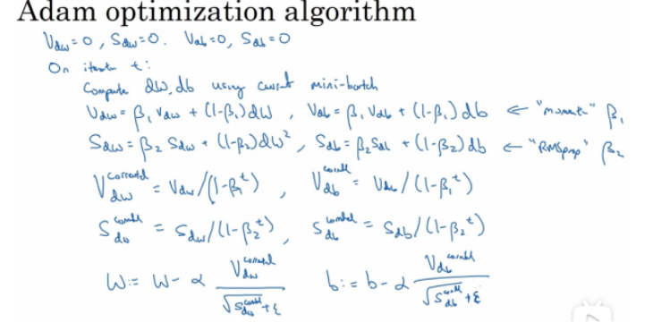

Adam算法可以看作是Momentum和RMSProp算法的结合。

我们首先会初始化$V_{dw},V_{db},S_{dw},S_{db}$为0，然后使用mini batch进行梯度下降，在第t次迭代中，我们会：

1. 使用Momentum方法更新超参数$\beta_1$；
2. 使用RMSProp方法更新超参数$\beta_2$;
3. 然后使用偏差修正，计算偏差修正；
4. 最后进行参数更新，完成一次迭代。

# 2.各优化算法的优缺点

|   优化算法   |                           优点                            |                 缺点                 |
| :----------: | :-------------------------------------------------------: | :----------------------------------: |
|     SGD      | 每次选取一个数据训练，避免数据量太大无法训练，缓解GPU压力 | 无法收敛到最小值，会在最小值附近震荡 |
|  mini-batch  |      提高训练速度，解决了SGD无法使用向量化加速的缺点      |              计算量较大              |
| 指数加权平均 |              使用前n个数据来计算局部的平均值              |            精度没有那么高            |
|   Momentum   |            使得参数摆脱鞍点或局部最优成为可能             |          需要人工设定学习率          |
|   RMSProp    |  改变梯度积累为指数加权移动平均，应用于凸问题时快速收敛   |                                      |
|     Adam     |               结合了Momentum和RMSProp的优点               |                                      |

# 3.学习率衰减

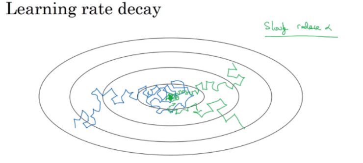

在进行梯度下降收敛损失函数时，由于mini batch是整体上收敛的，局部可能会像更糟糕的方向进行学习，而且由于我们的学习率一开始可能较大，我们会得到如蓝色所示的线，他表示我们总**是在最小值较大的一块区域内，无法收敛到最小值。**

==那么如何解决该问题？==

使用学习率衰减。一**开始我们仍然使用原学习率进行学习，保证快速的梯度下降。**之后，我们将使用某方法进行**学习率衰减**，使得我们的模型能够在后续的收敛过程中的**步伐更小，更加地接近局部最小值**，如绿色的线所示。

## 常见的学习率衰减方式

1. $\alpha=\frac{1}{1+decay\_rate*epoch\_num}*\alpha_0$，其中decay\_rate为超参数，epoch\num为迭代次数。
2. 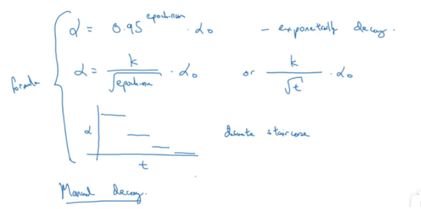

# 4.局部最优与超参数的选取

## 4.1局部最优与鞍点

长期以来，人们普遍认为，神经网络优化问题困难是因为较大的神经网络中包含很多局部极小值（local minima），使得算法容易陷入到其中某些点。然而，**高维非凸优化问题之所以困难，是因为存在大量的鞍点而不是局部极值。**

> 鞍点：一个维度向上倾斜且另一维度向下倾斜的点。这些鞍点通常被相同误差值的平面所包围，这使得算法陷入其中很难脱离出来，因为梯度在所有维度上接近于零。

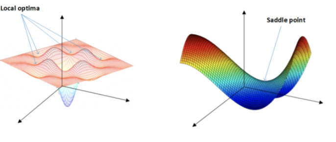

左图表示：神经网络只有两个参数时的情况（水平方向分别为两个参数，纵轴代表损失函数），有多个局部最小值
右图表示：神经网络具有高维参数时，可看到有鞍点。

**神经网络优化问题中的鞍点即一个维度向上倾斜且另一维度向下倾斜的点。**

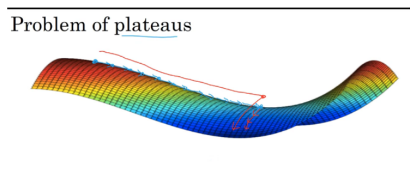

鞍点处的梯度为零，鞍点通常被相同误差值的平面所包围（这个平面又叫Plateaus，**Plateaus是梯度接近于零的平缓区域，会降低神经网络学习速度**），在高维的情形，这个鞍点附近的平坦区域范围可能非常大，这使得SGD算法很难脱离区域，即可能会长时间卡在该点附近（因为梯度在所有维度上接近于零）。

==高维非凸优化问题之所以困难，是因为高维参数空间存在大量的鞍点。==

## 4.2 超参数的选取

超参数的选取与修改在深度学习中是极为重要的。一般来说，学习率$\alpha$是最重要的，其次为Momentum的参数$\beta$、学习率衰减以及batch-size。剩下的几个超参数一般使用默认值。

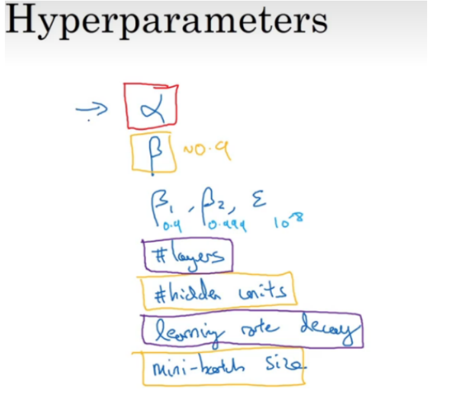

 

### 4.2.1 网格搜索

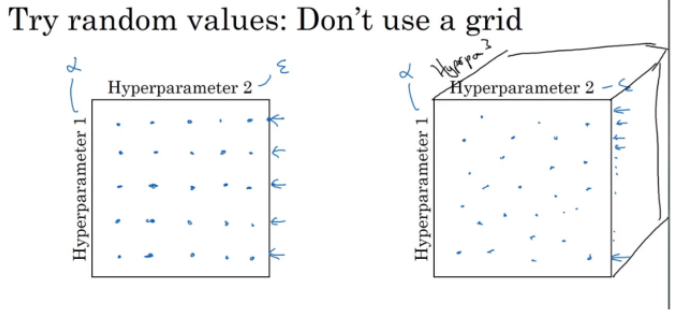

当我们的超参数数量不是很多时，我们可以在网格中取样点。如上左图所示，我们选取25个点，然后挑选出其中效果最好的作为我们的超参数。
另一种做法是，我们会随机的选择相同数量的点，然后对这些参数进行评估，选择效果最好的的超参数。

### 4.2.2 由粗糙到精细

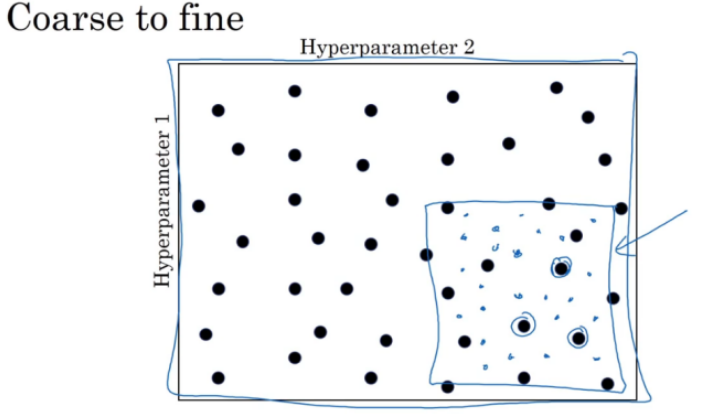

如图，我们假设在该二维的参数格中随机选取某些点，然后找到了效果最好的点。之后，我们可以在该点的附近位置在随机选择一些点，选取最好的，然后再进行选取。这样我们可以选去到效果较好的超参数。

# 5.批标准化(Batch Normalization)

是一个深度神经网络训练的技巧，它不仅可以**加快了模型的收敛速度**，而且更重要的是在**一定程度缓解了深层网络中“梯度弥散（特征分布较散）”的问题，**缓解了梯度消失的问题，从而使得训练深层网络模型更加容易和稳定。

全连接层：g(BN(Wx+b))。x为上层输入，w，b为参数，先计算wx+b，再BN，再激活，得到的结果传给下一层。

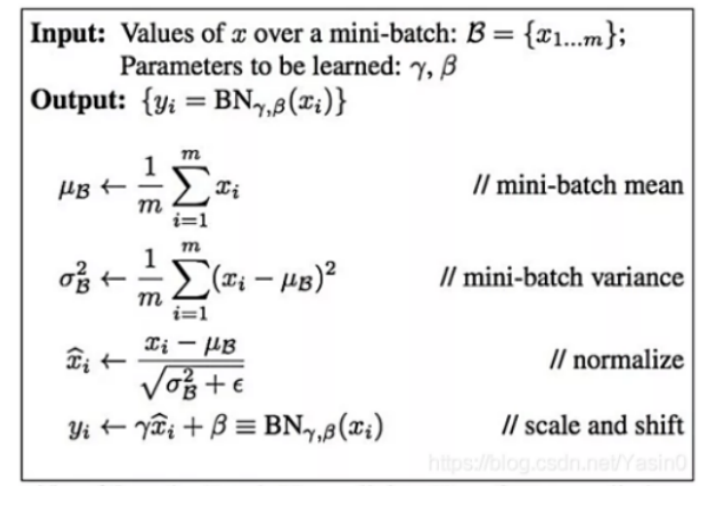

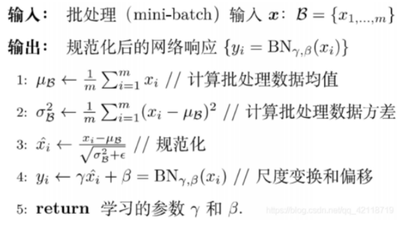

其中，ϵ>0是一个很小的常数，保证分母大于0。批量标准化在标准化的基础上增加了**变换重构，**引入了两个**可以学习**拉伸（scale）参数γ和偏移（shift）参数β。**经过BN后，目前大部分Activation的值落入非线性函数的线性区内，其对应的导数远离导数饱和区，这样来加速训练收敛过程。**

如果批量归一化没有起到优化作用，可以通过这两个参数进行抵消，此时只需学出γ和β即可。**如果使用标准化，那就相当于把非线性激活函数替换成线性函数了。**如果是多层的线性函数变换其实这个深层是没有意义的，因为多层线性网络跟一层线性网络是等价的。这意味着网络的表达能力下降了，这也意味着深度的意义就没有了。

所以BN为了保证非线性的获得，对变换后的满足均值为0方差为1的x又进行了scale加上shift操作(y=scale*x+shift)，让神经网络自己去学着使用和修改这个扩展参数 scale, 和 平移参数shift, 这样神经网络就能自己慢慢琢磨出前面的 normalization 操作到底有没有起到优化的作用, **如果没有起到作用, 我就使用 scale和 shift来抵消一些 normalization 的操作。**通过scale和shift把这个值从标准正态分布左移或者右移一点并长胖一点或者变瘦一点，每个实例挪动的程度不一样，这样等价于**非线性函数的值从正中心周围的线性区往非线性区动了动。**

核心思想应该是想找到一个线性和非线性的较好平衡点，**既能享受非线性的较强表达能力的好处，又避免太靠非线性区两头使得网络收敛速度太慢。**所以加γ和β就是要在一定程度下抵消BN带来的线性化。

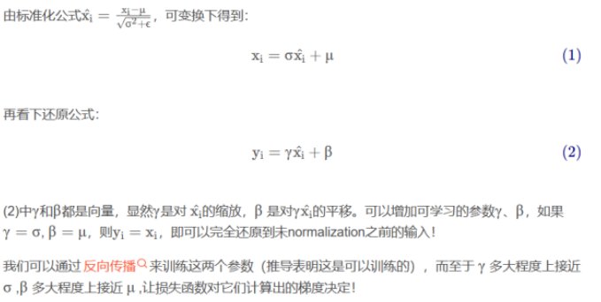

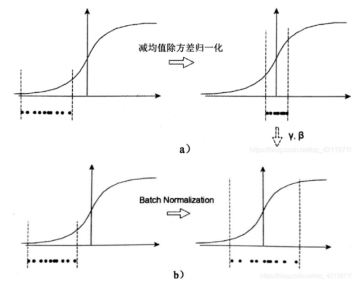

1. a中左图是没有经过任何处理的输入数据，曲线是sigmoid函数，如果数据在梯度很小的区域，那么学习率就会很慢甚至陷入长时间的停滞。减均值除方差后，数据就被移到中心区域如右图所示，对于大多数激活函数而言，这个区域的梯度都是最大的或者是有梯度的（比如ReLU），这可以看做是一种对抗梯度消失的有效手段。对于一层如此，如果对于每一层数据都那么做的话，数据的分布总是在随着变化敏感的区域，相当于不用考虑数据分布变化了，这样训练起来更有效率。换句话说，就是把数据从梯度较小的区域移到了梯度较大区域，这样的话模型收敛速度就快了，这就是sigmoid激活函数被ReLU激活函数普遍替代的原因。**即通过标准化将数据集中在梯度较大区域，缓解了梯度消失，加快训练速度，减少训练时间。**
2. 那么为什么要有尺度变换和偏移，不是仅使用减均值除方差操作就能获得目的效果吗？我们思考一个问题，减均值除方差得到的分布是正态分布，我们能否认为正态分布就是最好或最能体现我们训练样本的特征分布呢？不能，比如数据本身就很不对称，或者激活函数未必是对方差为1的数据最好的效果，比如Sigmoid激活函数，在-1~1之间的梯度变化不大，那么**非线性变换的作用就不能很好的体现**，换言之就是，减均值除方差操作后可能会削弱网络的性能！针对该情况，加入尺度变换和偏移才能完成真正的batch normalization。**BN的本质就是利用优化变一下方差大小和均值位置，使得新的分布更切合数据的真实分布，保证模型的非线性表达能力。**神经网络就是要的非线性表达能力，否则不如直接用逻辑回归。

==什么时候用？==

1. 在训练时，我们会对同一批的数据的均值和方差进行求解，进而进行标准化操作。
2. 对于预测阶段时所使用的均值和方差，其实也是来源于训练集。比如我们在模型训练时我们就记录下每个batch下的均值和方差，待训练完毕后，我们求整个训练样本的均值和方差期望值，作为我们进行预测时进行BN的的均值和方差。

# 6.softmax回归

## 6.1基本概念

softmax regression主要用于解决多元分类问题，假设对于样本${X,Y}$，样本有K个类别，即softmax回归主要是估算对于输入样本$x^{(i)}$属于每一类别的概率，所以softmax回归的假设函数如下：

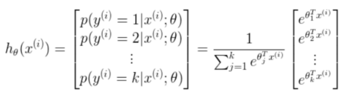

其中$\theta_1,\dots,\theta_k$是模型的参数，乘以$\frac{1}{\sum_{j=1}^ke^{\theta^T_jx^{(i)}}}$的目的是为了使概率在[0,1]之间且概率之和为1。因此，softmax回归将样本$x^{(i)}$分类为j的概率为：

$p(y^{(i)}=j|x^{(i)};\theta)=\frac{e^{\theta^T_jx^{(i)}}}{\sum_{l=1}^ke^{\theta^T_lx^{(i)}}}$

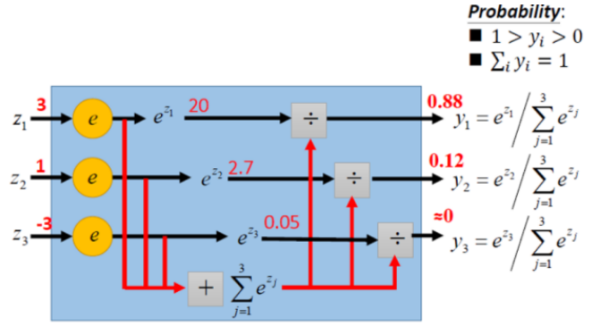

因此，使用softmax后的输出不是某一个类别，而是该次分类为各个类别的概率。这样，我们就能够看到属于各分类的概率，并且可以使用最高的结果作为该次的类别。

## 6.2损失函数

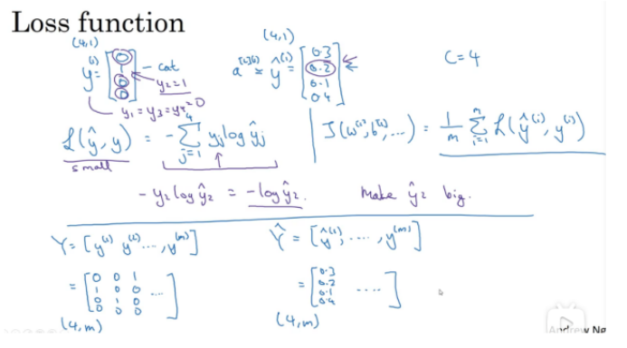

其公式如下：

$J(\theta)=\frac{1}{m}\sum_{i=1}^mL(\hat y^{(i)},y^{(i)}) \
=-\frac{1}{m}\sum_{i=1}^m\sum_{j=1}^ky^{(i)}_klog\hat y^{(i)}_k$

其中的m为样本类别数量，然后我们将计算每个样本各类别的损失后相加求和，最后进行梯度下降进行优化。

# 本周遇到的困难

1. 个人对于对于局部最优的理解与实际有出入，并学习到了鞍点。了解了高位参数的优化问题的困难。
2. 在进行批标准化时为什么要进行scale和shift。BN的本质就是利用优化变一下方差大小和均值位置，使得新的分布更切合数据的真实分布，保证模型的非线性表达能力。

# 下周计划

开始进一步了解深度学习，学习卷积神经网络。

