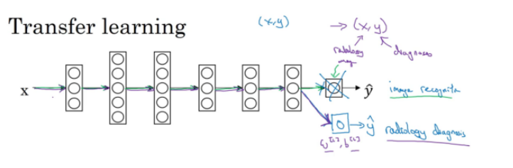
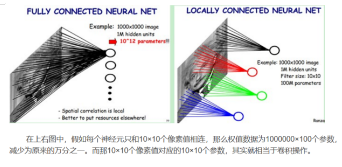
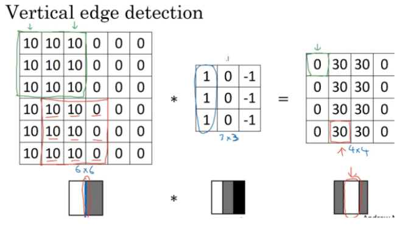
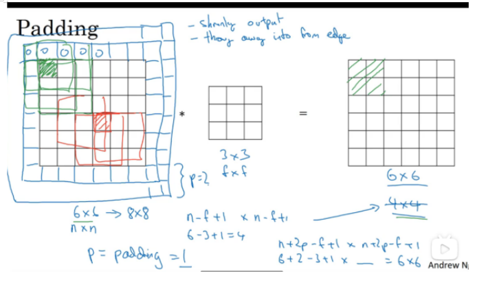
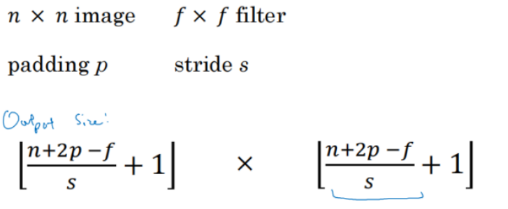
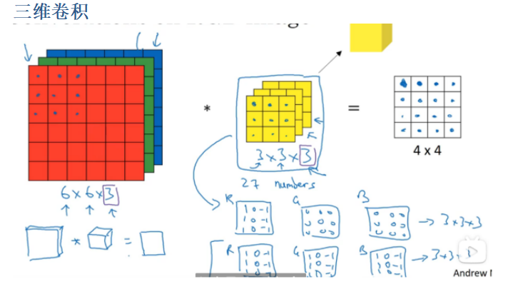
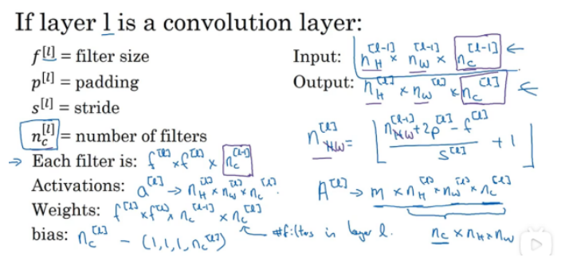
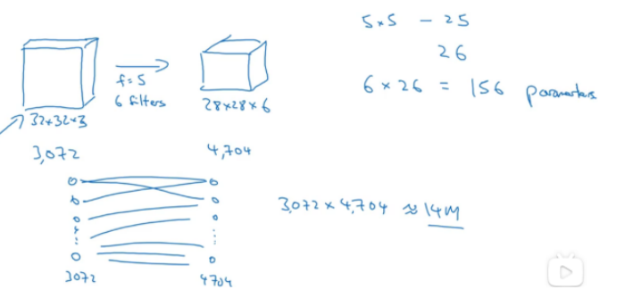
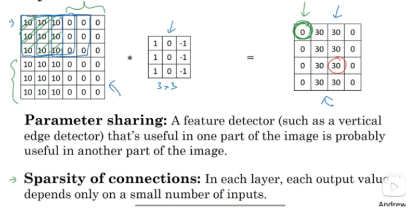

# 本周学习的内容

1. 学习了迁移学习，包括基本概念、使用场景以及作用。
2. 学习了卷积神经网络，了解了CNN的基本原理，包括：
   - 局部感受野
   - 权值共享
   - 卷积层工作原理
   - 池化层工作原理
   - 全连接层工作原理
3. 学习了多维的卷积神经网络，了解了如何在一个深度神经网络中进行卷积的计算，学习了卷积和池化的计算方式。

# 迁移学习(Transfer)

迁移学习(Transfer Learning)是一种机器学习方法，就是把为任务 A 开发的模型作为初始点，重新使用在为任务 B 开发模型的过程中。迁移学习是通过从已学习的相关任务中转移知识来改进学习的新任务，迁移学习专注于存储已有问题的解决模型，并将其利用在其他不同但相关问题上。

如图，当使用原始数据集(x,y)得到了相应的模型参数后，我们可以将其应用到新的数据集中。为此，我们可以删除掉输出层的参数并进行随机初始化。之后再对新的参数进行训练。

- 

- 如果新的数据集较少，那么可以只训练最后一到两层网络模型。
- 如果数据集较大，那就需要对所有的参数进行训练。

## 预训练和微调

如果需要重新训练神经网络中的所有参数，那么在训练的初期阶段，我们称之为**预训练**，因为我们是在使用原始数据集的权重去预先初始化，然后再更新所有的权重。有时这个过程称为**微调**。

## 为什么要迁移学习？

1. 大数据与少标注的矛盾：虽然有大量的数据，但往往都是没有标注的，无法训练机器学习模型。人工进行数据标定太耗时。
2. 大数据与弱计算的矛盾：普通人无法拥有庞大的数据量与计算资源。因此需要借助于模型的迁移。
3. 普适化模型与个性化需求的矛盾：即使是在同一个任务上，一个模型也往往难以满足每个人的个性化需求，比如特定的隐私设置。这就需要在不同人之间做模型的适配。
4. 特定应用（如冷启动）的需求。

举个例子，比如将图像识别得到的参数模型迁移到医学检测上。对于图像识别，我们可以收集到大量的数据集并且通过相应的方法进行检测。但是对于医学识别，数据量的规模较小。**因此，使用迁移学习，将数据集多的模型迁移到数规模较小的数据集上，能够帮助我们解决数据集少导致无法充分训练并学习到特征的问题。**

## 迁移学习的基本问题

- **How to transfer**： 如何进行迁移学习？（设计迁移方法）设计特定的迁移学习方法，**能够将原始数据集得到的参数模型应用到本数据集上**。
- **What to transfer**： 给定一个目标领域，如何找到相对应的源领域，然后进行迁移？（源领域选择）**确保使用的数据集具有相同的输入**。比如，将图像识别的参数模型迁移到音频识别显然是不合理的。
- **When to transfer**： 什么时候可以进行迁移，什么时候不可以？（避免负迁移）通常情况下，**当任务A比任务B的数据量多得多的时候，迁移学习意义更大**。

**以上要求都是为了确保能够通过迁移学习将任务A的模型应用到B上，提高任务B的性能并解决问题。**

# CNN的基本原理

**机器识图的过程：机器识别图像并不是一下子将一个复杂的图片完整识别出来，而是将一个完整的图片分割成许多个小部分，把每个小部分里具有的特征提取出来（也就是识别每个小部分），再将这些小部分具有的特征汇总到一起，就可以完成机器识别图像的过程了。** 

用CNN卷积神经网络识别图片，一般需要的步骤有：

1. 卷积层初步提取特征
2. 池化层提取主要特征
3. 全连接层将各部分特征汇总
4. 产生分类器，进行预测识别

# 为什么要用CNN识别？

能够有效识别特征，并且能够减少参数的使用。

## 局部感受野

一般认为人对外界的认知是从局部到全局的，而**图像的空间联系也是局部的像素联系较为紧密，而距离较远的像素相关性则较弱。因而，每个神经元其实没有必要对全局图像进行感知，只需要对局部进行感知，然后在更高层将局部的信息综合起来就得到了全局的信息**。网络部分连通的思想，也是受启发于生物学里面的视觉系统结构。视觉皮层的神经元就是局部接受信息的（即这些神经元只响应某些特定区域的刺激）。

## 权值共享

   但其实这样的话参数仍然过多，那么就启动第二级神器，即权值共享。在上面的局部连接中，每个神经元都对应100个参数，一共1000000个神经元，如果这1000000个神经元的100个参数都是相等的，那么参数数目就变为100了。

 怎么理解权值共享呢？我们可以这**100个参数（也就是卷积操作）看成是提取特征的方式，该方式与位置无关**。这其中隐含的原理则是：图像的一部分的统计特性与其他部分是一样的。这也意味着我们在这一部分学习的特征也能用在另一部分上，所以对于这个图像上的所有位置，我们都能使用同样的学习特征。

   更直观一些，当从一个大尺寸图像中随机选取一小块，比如说 8x8 作为样本，并且从这个小块样本中学习到了一些特征，这时我们可以把从这个 8x8 样本中**学习到的特征作为探测器，应用到这个图像的任意地方中去**。特别是，我们可以用从 8x8 样本中所学习到的特征跟原本的大尺寸图像作卷积，从而对这个大尺寸图像上的**任一位置获得一个不同特征的激活值**。

大家都知道，用CNN可以提取特征。好了，你就会想，这样提取特征会不会有点不靠谱？因为每个神经元都用同样的一个滤波器，那么只能提取一种特征？当需要提取多种特征是怎么办？**其实一种滤波器，也就是一种卷积核就是提取出图像的一种特征**，例如某个方向的边缘。那么我们需要提取不同的特征，则可以怎么办，加多几种滤波器不就行了吗？所以假设我们加到50，每种滤波器的参数不一样，表示它提出输入图像的不同特征，例如不同的边缘。这样**每种滤波器去卷积图像就得到对图像的不同特征的放映，我们称之为Feature Map。所以50种卷积核就有对应的50个Feature Map。这50个Feature Map就组成了一层神经元**。我们这一层有多少个参数了？50种卷积核x每种卷积核共享100个参数=50*100，也就是5000个参数，达到了我们想要 的效果，不仅可以提取多方面的特征而且还可以减少计算。

## 卷积层工作原理

**卷积层的作用：就是提取图片每个小部分里具有的特征**

假定我们有一个尺寸为6*6 的图像，每一个像素点里都存储着图像的信息。我们再定义一个**卷积核**（相当于权重），用来从图像中提取一定的特征。卷积核与数字矩阵对应位相乘再相加，得到卷积层输出结果。 

机器一开始并不知道要识别的部分具有哪些特征，是通过与不同的卷积核相作用得到的输出值，相互比较来判断哪一个卷积核最能表现该图片的特征——比如我们要识别图像中的某种特征（比如曲线），也就是说，这个卷积核要对这种曲线有很高的输出值，对其他形状（比如三角形）则输出较低。卷积层输出值越高，就说明匹配程度越高，越能表现该图片的特征。

比如我们需要识别猫。当某个卷积核识别到耳朵时，得到的值较大；识别到尾巴时，值较小。**那么我们认为：该卷积核保存着猫耳朵的特征。我们还需要其他特征的卷积核，来匹配其他部分。**

## 池化层工作原理

池化层的输入就是卷积层输出的原数据与相应的卷积核相乘后的输出矩阵 。
池化层的目的：

- 为了减少训练参数的数量，降低卷积层输出的特征向量的维度
- 减小过拟合现象，只保留最有用的图片信息，减少噪声的传递

## 全连接层工作原理
卷积层和池化层的工作就是提取特征，并减少原始图像带来的参数。然而，为了生成最终的输出，我们需要应用全连接层来生成一个等于我们需要的类的数量的分类器。

全连接层的工作原理和之前的神经网络学习很类似，我们需要把池化层输出的张量重新切割成一些向量，乘上权重矩阵，加上偏置值，然后对其使用ReLU激活函数，用梯度下降法优化参数既可。

# 边缘检测

 

如图，数值越大表示越亮。我们使用一个3*3的过滤器进行运算，得到的右边的图像。发现在中间有较亮的区域，因此我们就检测到了垂直边缘。

同理可以检测到水平边缘，将过滤器横向即可。

# padding边缘填充

卷积网络的两个问题：

- 使用一次卷积后，得到的图像会变小，当我们多用几次，那么图像就会很小，这显然不是我们想要的
- 对于在角落的像素，我们只是用了一两次，那么角落的数据信息就容易丢失。

为了解决这两个问题，我们使用了padding加边方法。

如图，我们在边缘填充了一层0，那么卷积后得到的图像大小无变化，并且边缘的像素也得到了有效的使用。

1. Valid填充:表示不使用填充
2. Same:表示填充后得到的数据大小和原数据大小一致。设p为填充大小，那么有：n=n+2p-f+1,得到**p=(f-1)/2**.

# stride卷积步长

表示每次计算完一个区域的卷积后，移动多少距离。

如果我们的过滤器超出了图像范围，那么我们就不能对其进行卷积操作。因此，这就是为什么要向下取整的原因。

# 三维卷积

如输入的是6\*6\*3，使用3\*3\*3的的过滤器，那么我们得到的就是4*4的二维结果，因为我们会对对应的地方进行相乘后再相加。

如果想检查红色通道的垂直边界，那么我们可以设置如下图所示的过滤器，G，B通道全为0. 

# 单层卷积网络

使用几个过滤器，  就能得到几维的数据。

数据表示：

# 池化层Pool 

该层有两个超参数f和s，表示池化的大小以及步长，但是不需要反向传播进行梯度下降更新。

池化的作用：
池化操作后的结果相比其输入缩小了。池化层的引入是仿照人的视觉系统对视觉输入对象进行降维和抽象。在卷积神经网络过去的工作中，研究者普遍认为池化层有如下三个功效：

1. 特征不变性：**池化操作是模型更加关注是否存在某些特征而不是特征具体的位置。**其中不变形性包括，平移不变性、旋转不变性和尺度不变性。平移不变性是指输出结果对输入对小量平移基本保持不变，例如，输入为(1, 5, 3), 最大池化将会取5，如果将输入右移一位得到(0, 1, 5)，输出的结果仍将为5。对伸缩的不变形，如果原先的神经元在最大池化操作后输出5，那么经过伸缩（尺度变换）后，最大池化操作在该神经元上很大概率的输出仍是5.
2. 特征降维（下采样）：池化相当于在空间范围内做了维度约减，从而使模型可以抽取更加广范围的特征。同时减小了下一层的输入大小，进而减少计算量和参数个数。
3. 在一定程度上防止过拟合，更方便优化。
4. 实现非线性（类似relu）。
5. 扩大感受野。

常见的池化层：
（1）最大池化、平均池化

- 最大池化（max pooling）:选图像区域的最大值作为该区域池化后的值。

- 平均池化（average pooling）：计算图像区域的平均值作为该区域池化后的值。

# 神经网络全连接层作用

在最后一层即输出层将最终的结果拉伸，变成一个n维向量，然后再使用sigmoid或者softmax等函数对最终结果进行预测。

就是它**把特征representation整合到一起，输出为一个值。**这样做，有一个什么好处？就是大大**减少特征位置对分类带来的影响。**

全连接层之前的作用是提取特征，全理解层的作用是分类

# 为什么使用卷积

如图，如果都是用全连接层，那么一层的参数数量就会十分大，更不用说一个深层神经网络了。

==为什么卷积的参数这么少？==

1. 参数共享。比如要进行垂直边缘检测，那么一个过滤器可能对其他区域也适用。如边缘检测既对左上区域适用，也对中间区域适用。
2. 稀疏连接。如上图，左上的绿色值至于原始输入左上区域有关，和其他位置无关。因此，完全没必要添加无关的参数，也就减少了参数量。

# CNN的经典步骤

CBAPD

1. Conv：卷积计算（初步提取特征）
2. B：BN，批标准化（将数据进行批标准化，为了在激活时梯度较大且非线性）
3. A：activation，激活函数（非线性激活函数，提升模型的泛化能力）
4. P：Pooling，池化（进一步提取特征，并降维）
5. D：Dropout，正则化（防止过拟合）

