# 本周学习内容：

一些经典的卷积神经网络，包括：

1. LeNet-5的基本框架。
2. ResNet的基本内容，并了解ResNet为什么能解决梯度消失和网络退化的问题。
3. 1×1卷积的实现步骤，并了解其作用与优点。

# 1.[LeNet-5](http://yann.lecun.com/exdb/publis/pdf/lecun-98.pdf)

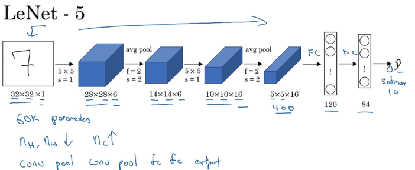

其中，LeNet-5的网络结构如下所示：

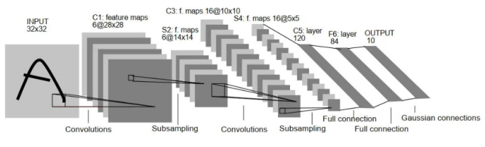

LeNet-5是一个较简单的卷积神经网络。上图显示了其结构：输入的二维图像（单通道），先经过两次卷积层到池化层，再经过全连接层，最后为输出层。整体上是：
输入层->卷积层->池化层->激活函数->卷积层->池化层->激活函数->卷积层->全连接层->全连接层->输出层。

整个 LeNet-5 网络总共包括7层（不含输入层），分别是：C1、S2、C3、S4、C5、F6、OUTPUT。

## 1.1 输入层

输入层（INPUT）是 32x32 像素的图像，注意通道数为1（因为他当时使用的是灰度图像）。

## 1.2 C1层

C1 层是卷积层，使用 6 个 5×5 大小的卷积核，padding=0，stride=1进行卷积，得到 6 个 28×28 大小的特征图。计算方式：(32-5+1+0*2)/1=28。

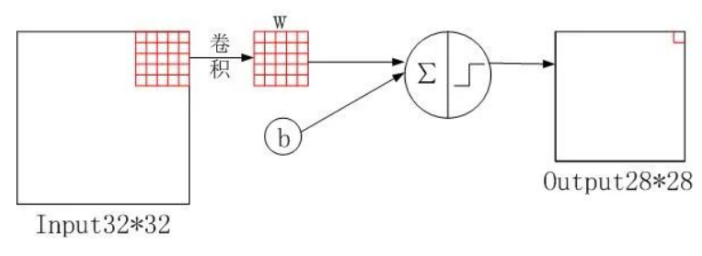

## 1.3 S2层

S2 层是下采样层，使用 6 个 2×2 大小的卷积核进行池化，padding=0，stride=2，得到 6 个 14×14 大小的特征图。计算方式：28/2=14。

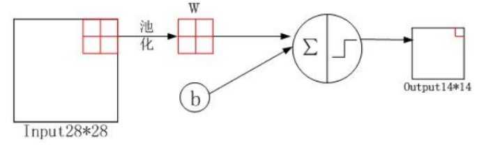

注意，S2层使用了下采样以及激活函数激活后输出。此处使用的是平均池化（Average Pooling），取卷积核的平均数作为该区域内的特征值。

## 1.4 C3层

C3 层是卷积层，使用 16 个 5×5xn 大小的卷积核，padding=0，stride=1 进行卷积，得到 16 个 10×10 大小的特征图：14-5+1=10。

16 个卷积核并不是都与 S2 的 6 个通道层进行卷积操作，如下图所示，C3 的前六个特征图（0,1,2,3,4,5）由 S2 的相邻三个特征图作为输入，对应的卷积核尺寸为：5x5x3；接下来的 6 个特征图（6,7,8,9,10,11）由 S2 的相邻四个特征图作为输入对应的卷积核尺寸为：5x5x4；接下来的 3 个特征图（12,13,14）号特征图由 S2 间断的四个特征图作为输入对应的卷积核尺寸为：5x5x4；最后的 15 号特征图由 S2 全部(6 个)特征图作为输入，对应的卷积核尺寸为：5x5x6。

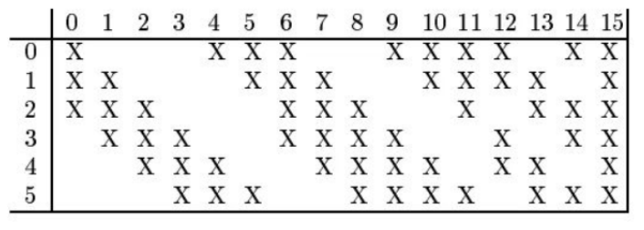

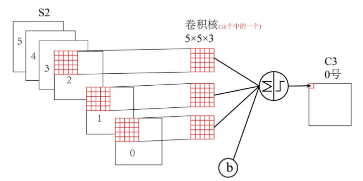

## 1.5 S4层

S4 层与 S2 一样也是降采样层，使用 16 个 2×2 大小的卷积核进行池化，padding=0，stride=2，得到 16 个 5×5 大小的特征图：10/2=5。

## 1.6 C5层

C5 层是卷积层，使用 120 个 5×5x16 大小的卷积核，padding=0，stride=1进行卷积，得到 120 个 1×1 大小的特征图：5-5+1=1。即相当于 120 个神经元的全连接层。

值得注意的是，与C3层不同，这里120个卷积核都与S4的16个通道层进行卷积操作。

## 1.7 F6层

F6 是全连接层，共有 84 个神经元，与 C5 层进行全连接，即每个神经元都与 C5 层的 120 个特征图相连。计算输入向量和权重向量之间的点积，再加上一个偏置，结果通过 sigmoid 函数输出。

## 1.8 OUTPUT层

Output 层共有 10 个节点，分别代表数字 0 到 9。采用RBF函数计算输入向量图参数向量之间的欧氏距离（现在使用Softmax函数）。计算方式为：
$$
y_i=\sum_{j=0}^{83}(x_j-w_{ij})^2
$$
上式中 i 取值从 0 到 9，j 取值从 0 到 7*12-1，w 为参数。i表示数字0-9，j表示共有84个神经元。

最后计算输出值，值越接近于 0，则越接近于 i，即越接近于 i 的 ASCII 编码图，表示当前网络输入的识别结果是字符 i。

# 2.残差网络

## 2.1 基本知识

1. 真实值表示真实世界中的数据
2. 观测值表示机器学习模型的样本数据
3. 预测值表示学习模型预测出的数据

我们要用观测值训练机器学习算法，然后用模型得到的预测值去预测真实世界的数据。

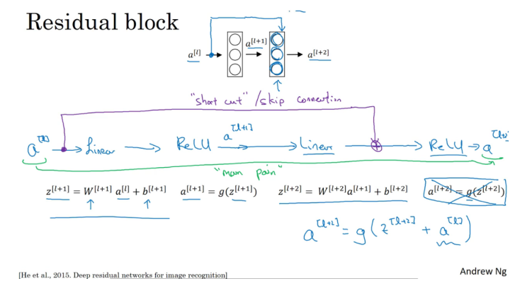

上图是ResNet的示意图。他在普通网络(Plain Network)的基础上添加了捷径short cut（或远跳连接skip connection），得到了ResNet。如图，一个网络总是先线性计算，然后使用ReLU激活函数输出。而ResNet会将前面的值通过short cut添加到后面的层中，在线性计算完成后，ReLU激活函数计算之前。**这样做的目的是将a[l]的信息直接送到神经网络的深层。**

## 2.2 Residual Network与Plain Network

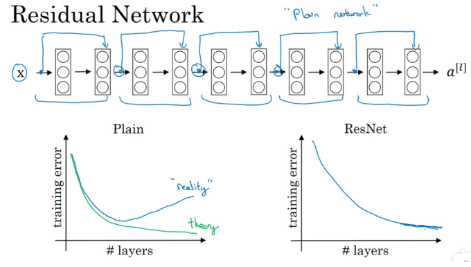

把Plain Network变成ResNet的方法是加上所有跳跃连接，每两层增加一个捷径，构成一个残差块。如图所示，5个残差块连接在一起构成一个残差网络。

1. 如果我们使用标准优化算法训练一个普通网络，比如说梯度下降法，或者其它热门的优化算法。如果没有残差，没有这些**捷径或者跳跃连接**，凭经验你会发现随着网络深度的加深，训练错误会先减少，然后增多。而理论上，随着网络深度的加深，应该训练得越来越好才对。也就是说，理论上网络深度越深越好。但实际上，如果没有残差网络，对于一个普通网络来说，深度越深意味着用优化算法越难训练。**实际上，随着网络深度的加深，训练错误会越来越多。**
2. 但有了ResNets就不一样了，即使网络再深，训练的表现却不错，比如说训练误差减少，就算是训练深达100层的网络也不例外。有人甚至在1000多层的神经网络中做过实验，这样就让我们在训练更深网络的同时，又能保证良好的性能。也许从另外一个角度来看，随着网络越深，网络连接会变得臃肿，但是ResNet确实在训练深度网络方面非常有效。

------------------------------------------------
## 2.3 为什么ResNet有效

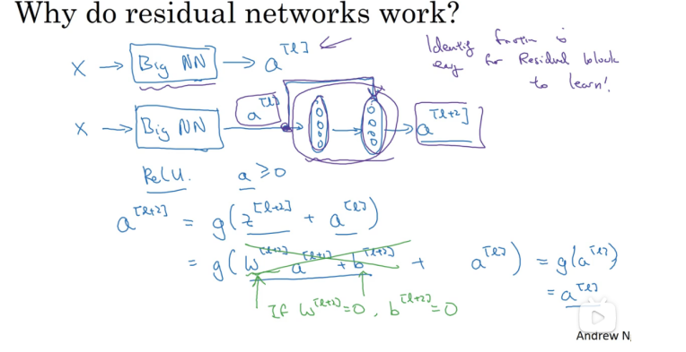

如图，当我们使用额外的两层网络进行训练时，我们会添加一个short cut。那么$a^{[l+2]}$的计算公式就如上所示。

1. 假设其中的参数都为零，那么添加这两层的效果与不添加一致，相当于使用了一个恒等函数。因此在这种情况下，**网络的层数增加，但是效果和原来一致。**
2. 但是，如果这两层网络**能够识别一些有效的特征，那么他可能比学习恒等函数表现得更好**，相比于那些不使用short cut的网络效果更佳。

其次，如果$a^{[l]}与a^{[l+2]}$的维度不一致，那么我们需要进行维度转换。

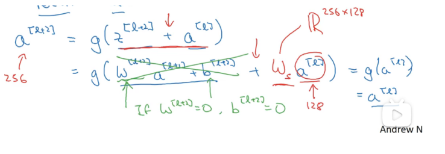

其中的$w_s$用于将$a^{[l]}$的维度转换为相应的维度，它也是一个网络可以学习的参数。

## 2.4 残差网络解决的问题

### 2.4.1 解决梯度消失问题

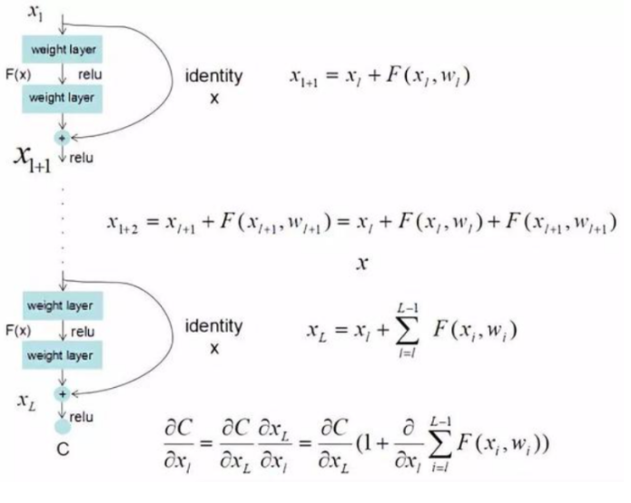

我们知道，梯度消失是因为在反向传播的过程中，有些导数值小于1，这些小于1的值通过深层网络的不断相乘，导致最终的结果趋于0，从而发生了梯度消失。

ResNet最终更新某一个节点的参数时，由于h(x)=F(x)+x，使得链式求导后的结果如图所示，不管括号内右边部分的求导参数有多小，因为左边的1的存在，并且将原来的链式求导中的连乘变成了连加状态，都能保证该节点参数更新不会发生梯度消失或梯度爆炸现象。

### 2.4.2 解决网络退化问题

我们发现，**假设该层是冗余的**，在引入ResNet之前，我们想让该层学习到的参数能够满足**h(x)=x**，即输入是x，经过该冗余层后，输出仍然为x。但是可以看见，要想学习h(x)=x恒等映射时的这层参数时比较困难的。
ResNet想到避免去学习该层恒等映射的参数，让h(x)=F(x)+x;这里的F(x)我们称作残差项，我们发现，要想让该冗余层能够恒等映射，我们**只需要学习F(x)=0**。学习F(x)=0比学习h(x)=x要简单，因为一般**每层网络中的参数初始化偏向于0**，这样在相比于更新该网络层的参数来学习h(x)=x，该冗余层学习F(x)=0的更新参数能够更快收敛，如图所示：

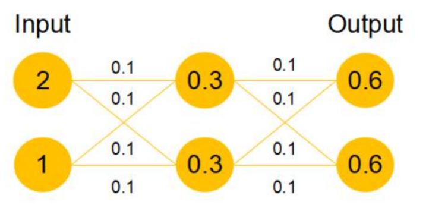

这样当网络自行决定了哪些层为冗余层后，通过学习残差F(x)=0来让该层网络恒等映射上一层的输入，使得有了这些冗余层的网络效果与没有这些冗余层的网络效果相同，这样很大程度上解决了网络的退化问题。

# 3.1×1卷积

## 3.1 基本原理

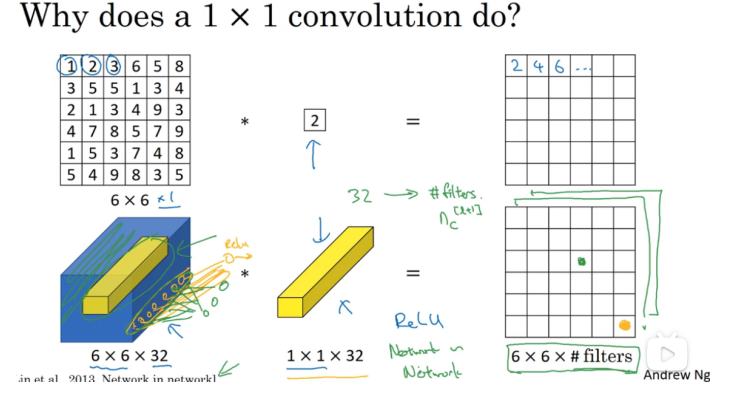

假设当前输入张量维度为6×6×32，卷积核维度为1×1×32，取输入张量的某一个位置（如图黄色区域）与卷积核进行运算。实际上可以看到，如果把1×1×32卷积核看成是32个权重W，输入张量运算的1×1×32部分（左图黄色部分）为输入x，那么每一个卷积操作相当于一个Wx过程，多个卷积核就是多个神经元，相当于一个全连接网络。

综上，**可以将1×1卷积过程看成是将输入张量分为一个个输入为1×1×32的x（例如左图，分成了6 X 6=36个），他们==共享卷积核变量==（对应全连接网络的权重）W的全连接网络**。

## 3.2 1×1卷积的作用

### 3.2.1 实现特征通道的升维和降维

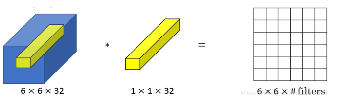

用一个6*6*32的图像去乘以1*1*32的卷积核得到的其实是一个6*6*1的二维矩阵。这样就将通道数32给消除了（卷积核的通道数必须与源图像的通道数相同），相当于给图像降维的操作，而且很迅速。

在通常的神经网络中，一般不会单独只使用1个卷积核，当使用的卷积核的个数是filters的时候，最后输出的就是一个6\*6\*filters的立方块。

### 3.2.2 增加非线性

1×1卷积核的卷积过程相当于全连接层的计算过程，并且还加入了非线性激活函数，从而可以增加网络的非线性，使得网络可以表达更加复杂的特征。

### 3.2.3 减少卷积核参数

通过引入1×1确保效果的同时减少计算量。

不使用1×1卷积(same卷积保证H和W不变)：

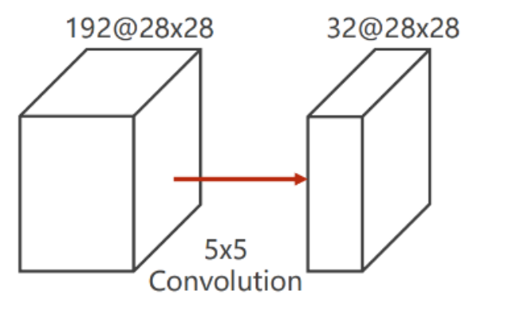

计算量：
$5*5*192*28*28*32=120,422,400$

使用1×1卷积：
$$
\begin{equation}
\begin{aligned}
&1*1*192*28*28*16\\
&+5*5*16*28*28*32\\
&=12,433,648
\end{aligned}
\tag{3-1}
\end{equation}
$$
由此可见，减少了大量的计算量。
