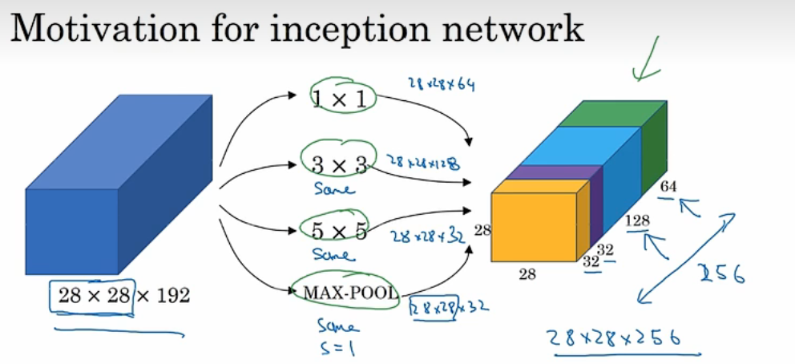
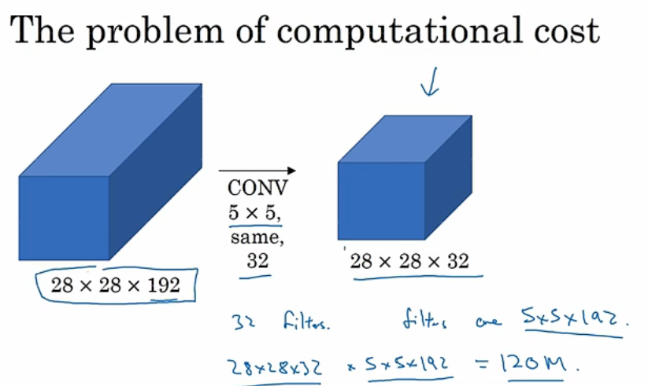
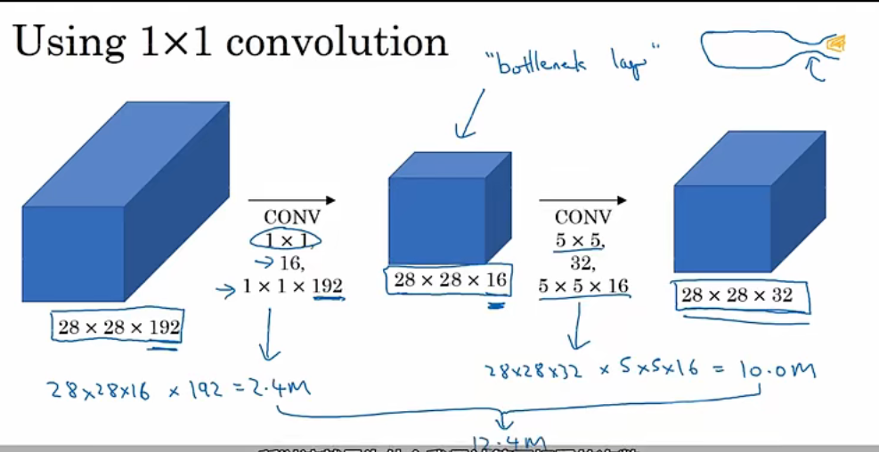
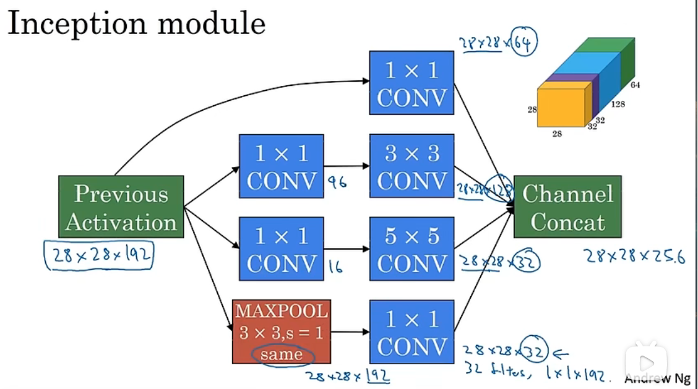

# Inception network

## 1. Motivation for Inception network

如图，对于一个输入，我们可能想使用不同的过滤器的大小来对其进行计算。但是我们不知道使用多大的过滤器；或者不使用过滤器，而是使用一个池化层。Inception网络的思想是：**为什么不全使用呢？**

如图，对于一个输入，我们使用1\*1,3\*3,5\*5的过滤器得到了输出维度相同但通道维度不同的结果（注意使用padding填充保证维度相同）。同样对于池化层也是如此。这样就得到了通道数量很多的结果。

## 2. 计算成本

怎么计算其计算的次数？

计算次数=kernel size\*kernel size\*channels\*out_size*out_size\*kernel_num

==为什么这么算？==

1.  首先过滤器与输入数据计算，一次的计算次数为size\*kernel size\*channels
2.  每次计算得到输出的一个数据，而输出大小为out_size\*out_size，因此再乘上out_size\*out_size
3.  最后由于有kernel_num个过滤器，需要得到kernel_num个通道，因此再乘上kernel_num

实际上计算出的结果非常大，约为1.2亿。
$$
5*5*192*28*28*32=120,422,400
$$

## 3. 1×1卷积

使用1×1卷积，将能够显著地降低计算次数，减少计算成本。

## 4. Inception network的用法

- 在建立网络模型时不确定使用多大的过滤器还是使用池化层，那么就可以使用该网络。
- 使用==1×1网络能够有效减少计算成本，合理使用Bottleneck能够提升性能==。

## 5. 完整的Inception network

一个完整的Incept Network模块：

与1.1相比，我们不直接进行卷积，而是使用1×1卷积后再进行3×3，5×5卷积。