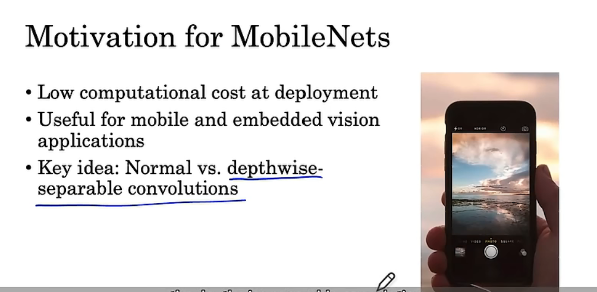
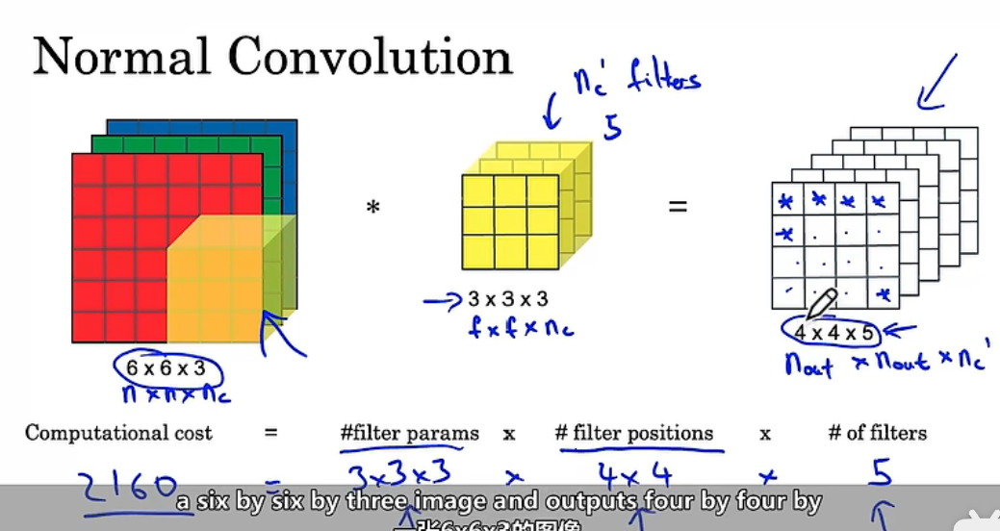
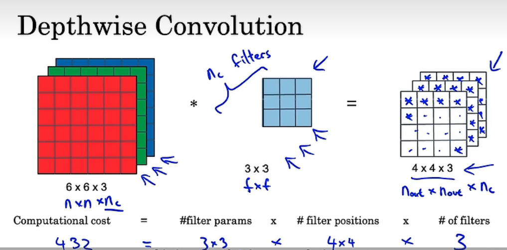
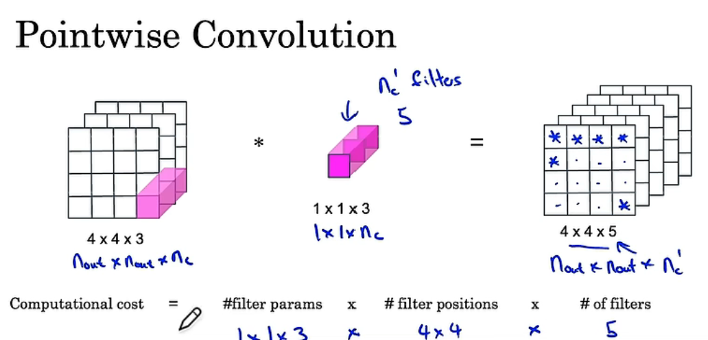
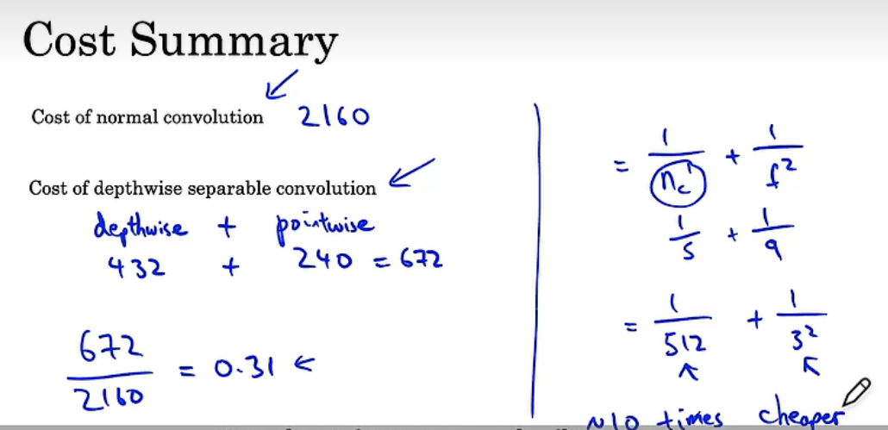
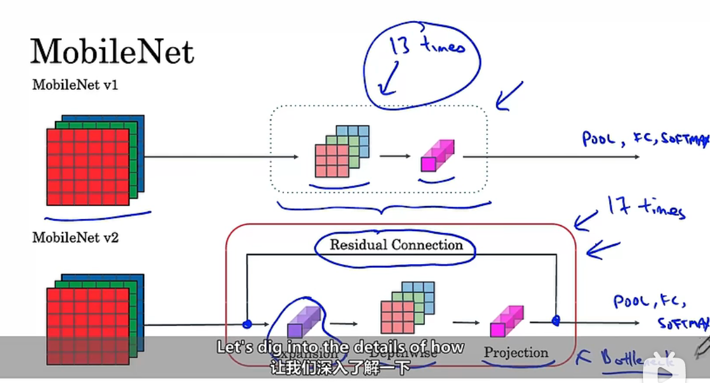
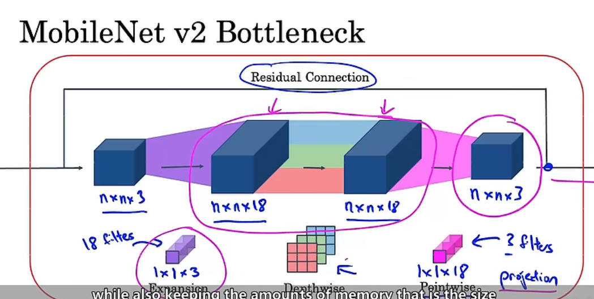

# MobileNet

## 1. Motivation for MobileNet

1. 能够在低功耗配置的设备上运行
2. 普通卷积与==**深度可分离卷积**==

## 2. 普通卷积与深度可分离卷积

### 2.1 普通卷积

普通卷积如上，就是将过滤器与原始输入图像相乘得到最终结果。
计算方法：将过滤器与输入图像相乘，然后得到结果。

### 2.2 深度可分离卷积

分为两个步骤，首先进行深度卷积（Depthwise），再进行逐点卷积（Pointwise）。

**深度卷积（Depthwise）**：
与普通卷积不同，过滤器的数量将与输入通道数一致，并且**不再是过滤器直接与输入图像相乘，而是每个过滤器与图像的每个通道进行相乘。**

如图，由于输入的通道数为3，因此我们会将每个过滤器（3×3）与每个通道进行计算，得到最后的结果。

**逐点卷积（Pointwise）**

使用1×1卷积进行计算。

## 3. MobileNet的优点

MobileNet就是使用了深度可分离卷积得到与普通卷积相同大小的输出结果，但是其计算成本相较于普通卷积少了很多，如图：

## 4. MobileNet v2

在v1的基础上，使用了残差块，如图。
首先使用1×1卷积（紫色）进行扩展，然后再进行深度卷积（中间），接着使用1×1卷积进行逐点卷积（粉色），最后添加shortcut。

如图为MobileNet v2的BottleNeck层。可见使用了1×1卷积：

- 提升维度进行扩展，能够增加需要表现的大小，学习到更丰富的特征。
- 由于该网络常用在移动设备上，因此内存量较小。使用bottleneck可以将输入映射成较小的输出，减少内存的使用。

