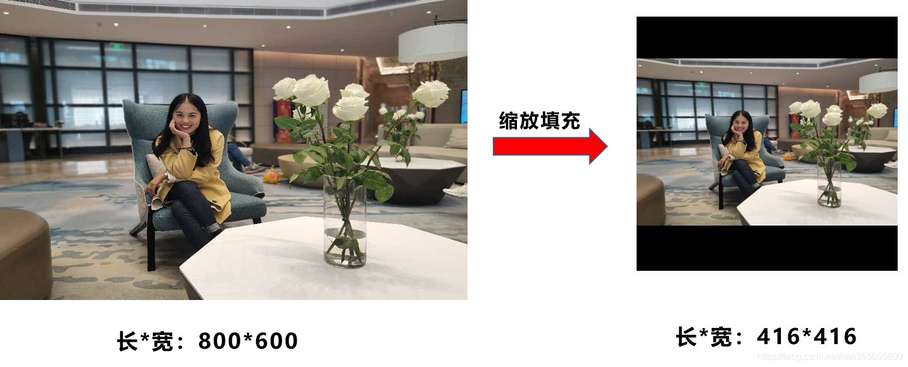
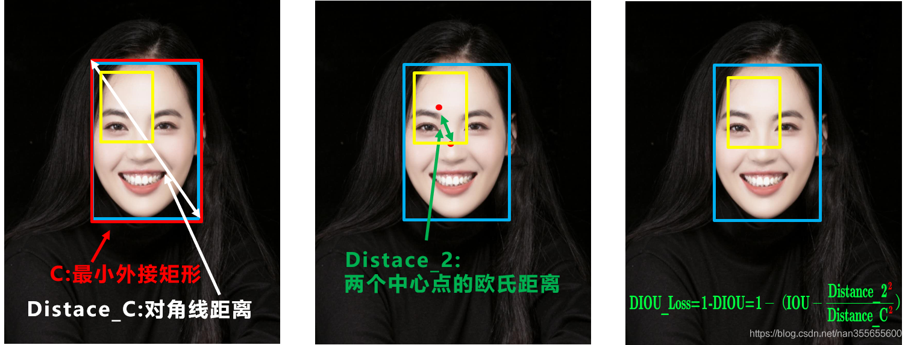

# YOLO算法

把一张图片划分为若干大小相等的块，如图为3\*3.对于要检测的物体，我们找到他的中心点，中西点在哪个位置，那么这个物体就应该被分在哪个框内。每个输出都是y所示的样子。

## 非极大值抑制

**在测试集中**，可能有好几个边框认为中心点在自己这里，那么就有可能对一个对象做出多次检测，有多个边界框**==(注意，这里是一个框里面一个bounding box，但是都多个框会认为自己有，所以会出现多个bounding box，表示相同类别。而后文的anchor box是一个框内会出现多个anchor box，表示不同类别)==**。非极大值抑制就是要处理那些检测结果，保证一个对象制备检测一次。

NMS也即非极大值抑制。在最近几年常见的物体检测算法（包括rcnn、sppnet、fast-rcnn、faster-rcnn等）中，最终都会从一张图片中找出很多个可能是物体的矩形框，然后为每个矩形框为做类别分类概率：

所谓非极大值抑制：依靠分类器得到多个候选框，以及关于候选框中属于类别的概率值，根据分类器得到的类别分类概率做排序，具体算法流程如下：

1. 将所有框的得分$p_c$排序，去掉小于某阈值的框，说明他不太可能是要检测的对象
2. 然后选中最高分及其对应的框 
3. 遍历其余的框，如果和当前最高分框的重叠面积(IoU)大于一定阈值，我们就将框删除。（**为什么要删除，是因为超过设定阈值，认为两个框的里面的物体属于同一个类别，比如都属于狗这个类别。我们只需要留下一个类别的可能性框图即可。**）
4. 从未处理的框中继续选一个得分最高的，重复2,3.
5. 如果是检测多类物体，那么对每类物体分别进行NMS。

如图，选择概率最大的，抑制与其IoU超过某阈值的。

## anchor box

显然NMS用于处理一个格子内有多个相同的检测，然后只保留最大的。但是**他只能在一个格子内检测一类对象**。anchor box用于解决一个格子中有多个对象的情况。**anchor box的形状以及数量一般由经验人工手动指定。**

如果在一张图片中有多个对象，并且他们的中心点被分配到了同一个格子中，那么我们需要使用anchor box对其进行判断。

如图，我们会事先定义两种形状的anchor box(实际情况会更多)，然后对于一个格子中有多个对象的情况，输出不再是原来的8维，而是包含了所有对象的维度，这里有两个对象，会输出16维。

然后判断，将预测到的对象形状与设置好的anchor box计算交并比，IoU大的说明是该种类别。 

**怎么实现？**

1.训练集

如图，在训练时，我们会将一张图片划分成3\*3，然后分别对每个框进行卷积计算，得到最终输出的y。为什么y是3\*3\*2\*8?3\*3表示我们划分成了9个框，2表示我们使用了2个anchor box，8表示每个输出框的维度。pc表示是否有对象，然后是对该对象的位置描述，最后是该对象的类别。

在预测中，我们同样是划分，然后进行判断。如图，这样我们就发现了一个对象，并且他与anchor box2的IoU更高，因此认为他可能是一辆汽车，所以我们将其box2的参数读出，并知道了该对象的位置。

需要注意，可能在一张图片中是可能存在多个对象的，我们会得到如下的边界框，使用两个anchor boxes,那么对于9个格子中的任何一个都会有两个预测的边界框。

首先要做的，就是去掉预测值低的边界框，因为神经网络认为此处存在对象的可能性不大。

然后，根据anchor box，得出每个框的类别。之后，对于**每个要预测的类别，我们分别对每个类别进行非极大值抑制，这样就得到了每个类别最可能的结果**，去掉那些与该结果IoU较大的框，剩下我们的预测框。

# [YOLOv5](https://blog.csdn.net/nan355655600/article/details/107852353)

yolov5的核心框架：

## 1.输入端（对数据进行处理）

### 1.1 mosaic数据增强

**Mosaic数据增强**则采用了4张图片，**随机缩放**、**随机裁剪**、**随机排布**的方式进行拼接。

优点如下：

1. 丰富数据集：随机使用4张图片，随机缩放，再随机分布进行拼接，大大丰富了检测数据集，特别是随机缩放增加了很多小目标，让网络的鲁棒性更好。
2. 减少GPU计算：因此Mosaic增强训练时，可以直接计算4张图片的数据，使得Mini-batch大小并不需要很大，一个GPU就可以达到比较好的效果。**如果数据量太大，那么可能full batch无法进行，这时候我们设置batch-size表示使用mini-batch，这样就能分批训练数据集，降低了GPU的要求。**

### 1.2 自适应锚框计算

在**Yolo**算法中，针对不同的数据集，都会有初始设定长宽的锚框。
在网络训练中，网络在**初始锚框**的基础上输出预测框，进而和**真实框groundtruth**进行比对，计算两者差距，再反向更新，迭代网络参数。使用kmeans的到初始n个框，然后用和遗传算法对宽和高进行变异。

### 1.3 自适应图片缩放

在常用的目标检测算法中，不同的图片长宽都不相同，因此**常用的方式**是将原始图片统一缩放到一个**标准尺寸**，再送入检测网络中。

但是yolov5不同，他进行了修改，对原始图像**自适应的添加最少的黑边**。

怎么操作？先计算缩放比，然后选择缩放比小的，再将长宽按照小的缩放，最后填充黑边。

## 2.backbone（躯干，主干，用于特征提取）

### 2.1 Focus架构

以**Yolov5s**的结构为例，原始**608×608×3**的图像输入**Focus结构，**采用**切片操作**，先变成**304×304×12**的特征图，再经过一次32个卷积核的卷积操作，最终变成**304×304×32**的特征图。

Focus层将w\*h平面上的信息转换到通道维度，再通过3*3卷积的方式提取不同特征。采用这种方式可以**减少下采样带来的信息损失，因为下采样会损失一部分信息。而我们堆叠后维度变大，可以用更多的卷积核进行特征提取，减少信息损失**。

### 2.2 CSP架构

*Building block和bottleNeck*

building block由两个3\*3的卷积层组成，Bottleneck由两个1\*1卷积层夹心一个3\*3卷积层组成：其中1\*1卷积层负责减少然后增加（实际上就是恢复）维数，让3\*3卷积层成为输入/输出维数更小的瓶颈。**Bottleneck既减少了参数量，又优化了计算，保持了原有的精度。**

YOLOv5s的CSP结构是将原输入分成两个分支，分别进行卷积操作使得通道数减半，然后一个分支进行Bottleneck \* N操作，然后concat两个分支，**使得BottlenneckCSP的输入与输出是一样的大小，这样是为了让模型学习到更多的特征。**

CSP1_X用在Backbone，网络层数较深。将输入分为两个分支，一个分支先通过CBS，再经过多个残差结构**（Bottleneck\* N）**，再进行一次卷积；另一个分支直接进行卷积；然后两个分支进行concat，再经过BN（正态分布），再来一次激活（之前的版本是Leaky，后期是SiLU），最后进行一个CBS。CSP1_X应用于backbone主干网络部分（backbone具体介绍以后再说哒），backbone是较深的网络，**增加残差结构可以增加层与层之间反向传播的梯度值，避免因为加深而带来的梯度消失，增加了bottleneck残差网络，提升了层数且防止了过拟合，从而可以提取到更细粒度的特征并且不用担心网络退化**。

CSP2_X相对于CSP1_X来说，不一样的地方只有CSP2_X将Resunit换成了2 * X个CBS，主要应用在Neck网络 （网络没那么深）。
## 3.Neck（脖子，对特征进行融合，并且把这些特征传递给预测层）

**Yolov5**和**Yolov4**的不同点在于，**Yolov4**的**Neck**中，采用的都是普通的卷积操作。
而**Yolov5**的**Neck结构**中，采用借鉴**CSPNet**设计的**CSP2结构**，**加强网络特征融合的能力**。

在卷积神经网络过程中，**网络层数越深，目标的特征信息就越强，模型对目标的预测就更好，但同时也会使得目标的位置信息越来越弱，**并且在不断的卷积过程中，对小目标的信息容易造成损失，因此，需要进行不同尺度的预测。YOLOv5 采用 FPN 和 PAN的结构对特征进行多尺度融合。

下图为通过 FPN 和 PAN 对图像进行多尺度特征融合，其中上层特征图因为网络层数更深，包含的语义信息也就更强，而下层特征因为经过的卷积层数较少，位置信息损失就更少，**FPN 结构通过自顶向下进行上采样，使得底层特征图包含更强的图像强特征信息；PAN 结构自底向上进行下采样，使顶层特征包含图像位置信息，两个特征最后进行融合，使不同尺寸的特征图都包含图像语义信息和图像特征信息，保证了对不同尺寸的图片的准确预测。**

## 4.输出端（进行最终的预测输出）

目标检测任务的损失函数一般由Classificition Loss（分类损失函数）和Bounding Box Regeression Loss（回归损失函数）两部分构成。
Bounding Box Regeression的Loss近些年的发展过程是：Smooth L1 Loss-> IoU Loss（2016）-> GIoU Loss（2019）-> DIoU Loss（2020）->CIoU Loss（2020）

**Yolov5**中采用其中的**CIOU_Loss**做**Bounding box**的**损失函数**。

好的目标框回归函数应该考虑三个重要几何因素：**重叠面积**、**中心点距离**，**长宽比**。

IOU_Loss：主要考虑检测框和目标框重叠面积。

GIOU_Loss：在IOU的基础上，解决边界框不重合时的问题。

DIOU_Loss：在IOU和GIOU的基础上，考虑边界框中心点距离的信息。

CIOU_Loss：在DIOU的基础上，考虑边界框宽高比的尺度信息。

