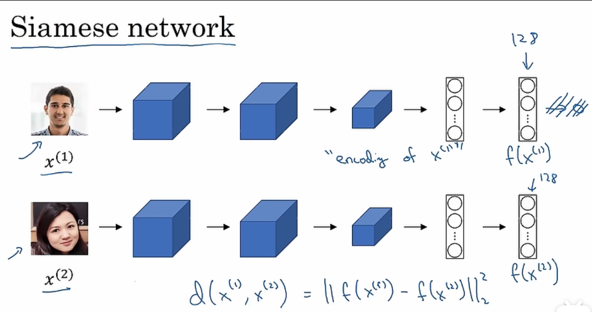
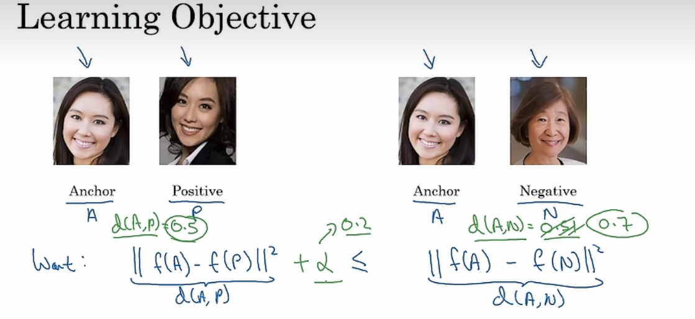
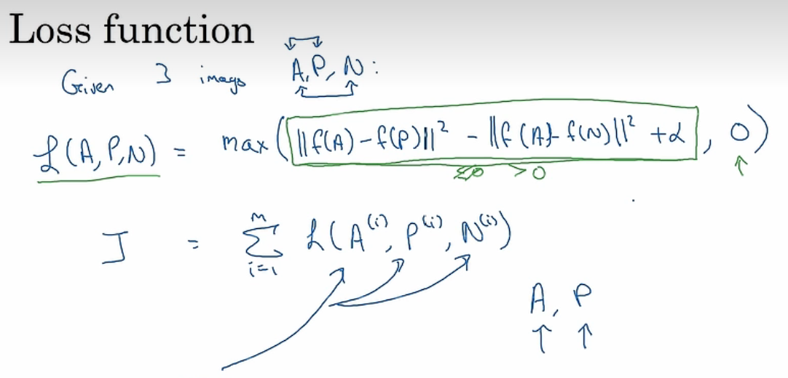
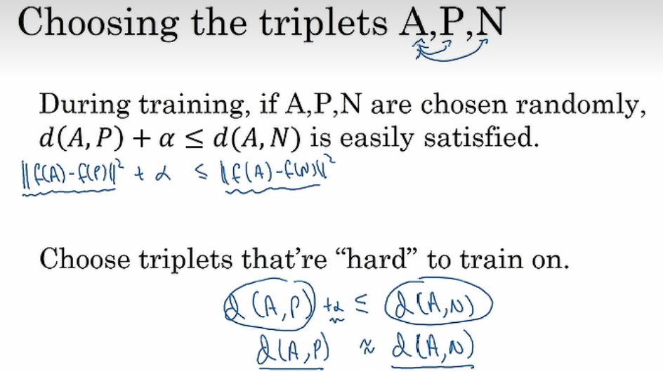

# 人脸识别与验证

1. 人脸验证：“这是不是本人呢？”，比如说，在某些机场你能够让系统扫描您的面部并验证您是否为本人从而使得您免人工检票通过海关，又或者某些手机能够使用人脸解锁功能。这些都是1：1匹配问题。
2. 人脸识别：“这个人是谁？”，比如说，在视频中的百度员工进入办公室时的脸部识别视频的介绍，无需使用另外的ID卡。这个是1：K的匹配问题。

## 怎么解决人脸验证问题

人脸验证问题在于其是1：1，即需要根据提供的图像判断是否为这个人。但是，由于人脸识别关于同一个人的图像数量较少，因此不能够使用常规的方法。

这里，我们可以创建一个**相似度函数，他表示图像之间的不同程度**，他的输入是两个图像，即采集到的图像以及数据库中的图像，我们将设定一个阈值$\tau$，如果计算出的结果小于该值，那么我们认为这两张图像为同一人，否则不是同一人。这样，就解决了人脸验证问题。

## Siamese network

实际上，这个网络就是将一个输入图像使用卷积神经网络进行处理后得到一个输出向量。我们将使用该网络以及相同的网络参数，并比较两个输出向量，如果：

- 结果较小，即小于我们设定的阈值，那么我们认为这两张照片是同一个人
- 结果较大，大于设定的阈值，那么么我们认为这是两个不同的人

## Triplet Loss三元组损失

我们想要如图所示的式子，我们会分别计算输入图像与正例、负例图像的距离，并保证正例加上$\alpha$后要小于负例。其中$\alpha$是一个超参数，用于表示d(A,P)与d(A,N)之间的差距。==它能够将正例和负例拉得更远，即使得d(A,P)与d(A,N)的差距更大，这样判断的更准确。==

 

### 三元组损失函数

如图，这就是三元组损失函数。我们使用的max来得到损失值，为什么呢？

- 如果前者小于0，那么我们就取最大值0
- 如果前者大于0，那么说明我们有一个损失，因此取前者的值

### 一个潜在的问题

实际上，当我随机选择照片的时候，显然d(A,P)+$\alpha$很可能经常地小于d(A,N)，因为同一个人的距离会比较小，不同人的距离会比较大。**这将造成我们的网络难以训练出有效的参数**。解决该问题的办法是选择较难训练的三元组，**即d(A,P)与d(A,N)相差不大**，这样我们的网络在计算损失函数时会将其拉开，会降低d(A,P)或提升d(A,N)。

### 实现步骤

将训练集划分成三元组：(图像，正例图像，负例图像)，然后使用梯度下降计算损失，得到参数模型。
