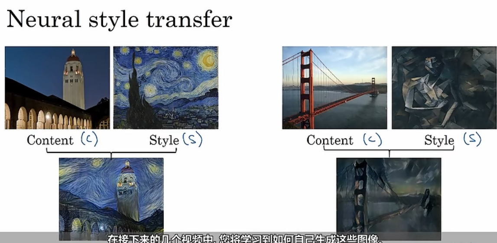
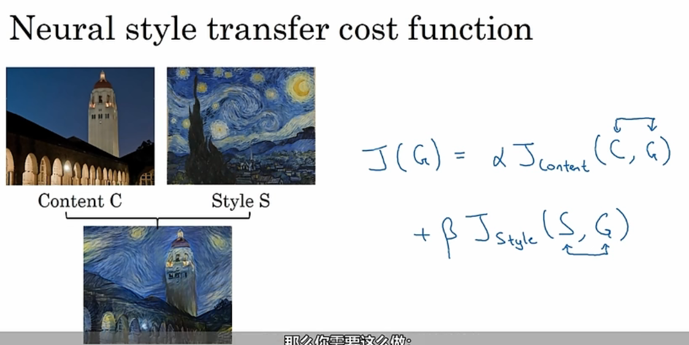
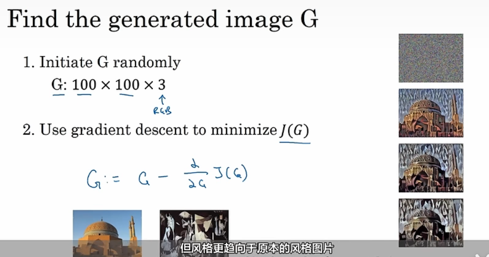
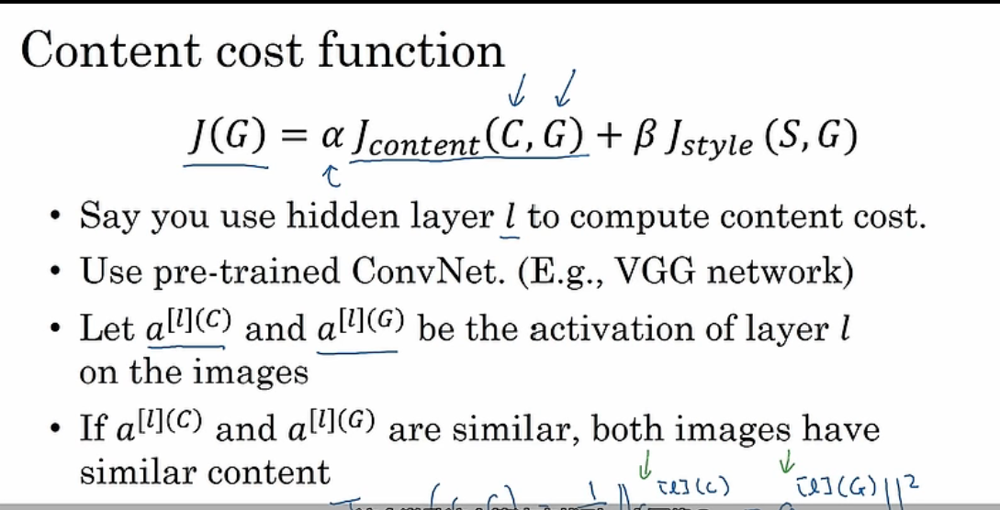
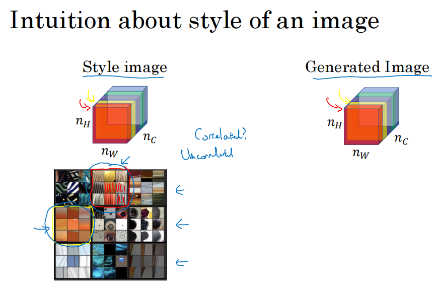
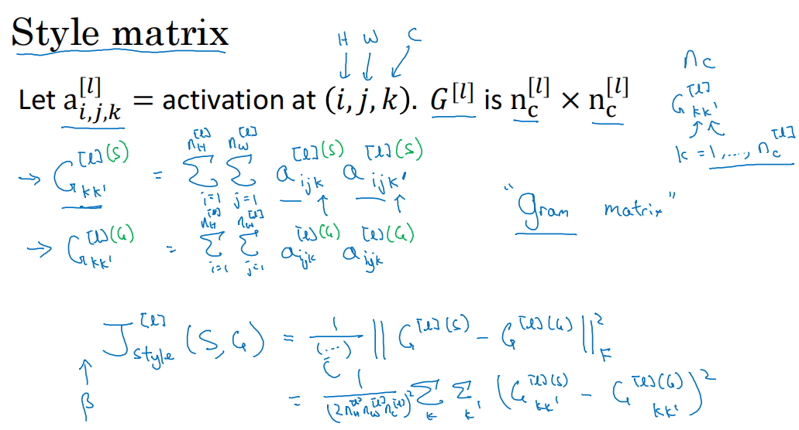
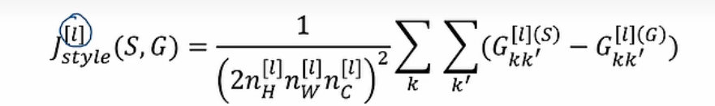
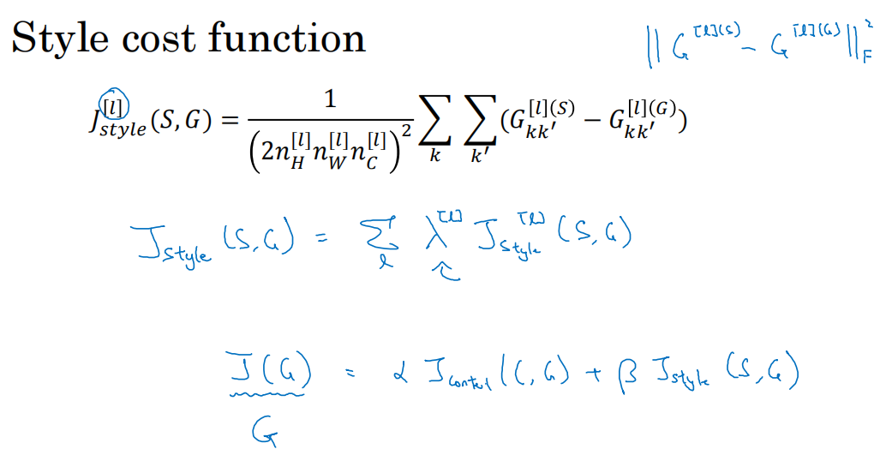

# 1.什么是神经风格转移

如图所示，我们将使用按照提供的图像风格，建构我们的图像按照该风格进行生成输出。

# 2.损失函数

衡量神经风格迁移的损失函数如图：

其中，

- J(C,G)表示生成图像与内容图像的损失值，表示生成图像与内容图像的相似度
- J(S,G)表示生成图像与风格图像的损失值，表示生成图像与风格图像的相似度
- $\alpha和\beta$是超参数，用来

大致步骤如上图所示：

1. 随机生成图像G
2. 使用梯度下降更新损失函数，得到结果G

## 2.1 内容损失函数

- 我们会使用隐藏层l来计算内容损失
- 使用与徐丽安的卷积网络进行计算，如VGG
- 我们会使用网络进行计算，得到C和G在隐藏层l上的激活值
- 如果$a^{[l](C)}与a^{[l](G)}$接近，那么我们认为这两张图像有相似的内容

## 2.2 风格损失函数

 

如图，当两个通道相关时，如第一个通道检测是否竖纹，第二个通道检查是否有橙色，那么很有可能就会有橙色的竖纹，这代表着两个通道相关。

因此，我们设置一个风格矩阵，如下图：

其中，$a^{[l]}_{i,j,k}$表示隐藏层l第k个通道i行j列的激活值。

我们将计算每两个个通道中每个激活值的乘积，即如图所示的$G^{[l](s)}_{kk'}$，他表示第l层第k和第k'各通道各个激活值的乘积之和，其中s表示他是风格图像，G表示他是生成图像。

==如果得到的G较大，说明这两个通道可能比较相关，否则不那么相关。==

得到$G^(S)和G^{(G)}$后，我们就可以计算风格损失函数了。前面的参数是标准化常数。

