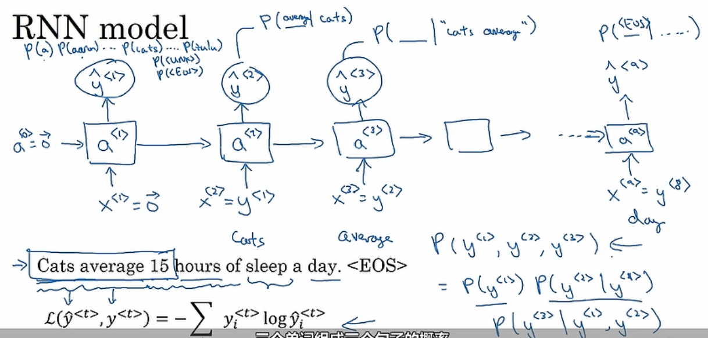
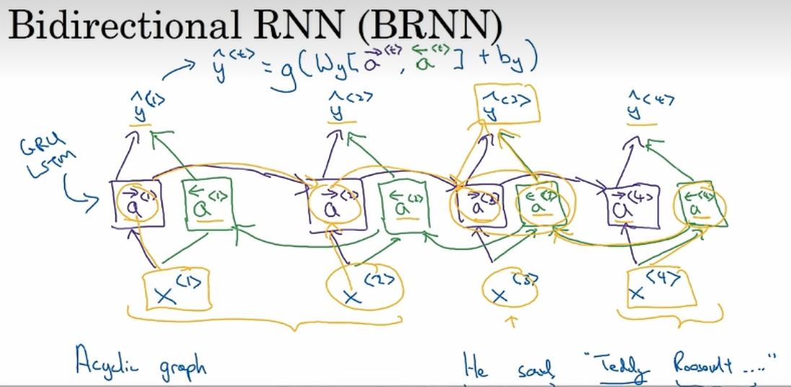

# 1.为什么使用序列模型

对于一些输入为序列模型的输入，我们使用相应的网络模型，可以得到需要的输出结果。

# 2.使用的符号注释

## 2.1 常用的符号表示

 

其中，$X^{(i)<t>}$表示第i个训练样本的第t个数据，$T_x^{(i)}$表示第i个训练样本有多少个数据，同理对于y。

## 2.2 如何表示单词

如图，我们会创建一个单词表，或者称为字典，然后将字典里面的单词排序。对于我们的输入单词，我们会在该字典中找到它的位置，然后使用独热编码(one-hot)进行表示。
如图，其中and在字典中的位置为367，那么我们会**创建一个长度为字典长度**的向量，==并在相应位置上至为1，其余位置为0(one-hot)。==这样就使用了字典表示了输入中的单词。由于该例子中有9个单词，因此需要9个维度为字典长度的向量。

# 3.循环神经网络模型

## 3.1 为什么不使用标准的神经网络

如果使用一个普通的神经网络，会遇到以下两点问题：

1. 输入，输出的长度不同。不同于其他的输入，序列输入的长度经常不一致，如果使用普通的网络，那么对于数据长度的处理十分麻烦
2. 不能共享在文本中不同位置学到的特征，导致使用的参数数量剧增，而且不能够有效学习。

## 3.2 循环神经网络(Recurrent Neural Network)

如图，我们使用RNN对$X^{<1>}$进行预测，然后得到输出；之后对$X^{<2>}$预测时，我们不仅仅使用$X^{<2>}$，同时会将前面的激活值$a^{<1>}$做为输入一起放进来进行计算。

在RNN中，我们会将使用同一个网络逐步地对每个输入单词进行计算并预测器输出类型。我们同样能够实现**权值共享**。如图：

1. $w_{ax}$表示使用参数与输出值X进行计算；
2. $w_{aa}$表示使用上一步的激活值进行计算；
3. $w_{ya}$表示最终得到预测的结果值。

RNN的**前向传播**：

因此，RNN的前向传播过程如下：

1. 开始时，输入一个全零的向量，作为$a^{<0>}$的初始值；
2. 计算激活值$a^{<t>}$；
3. 计算预测值$y^{<t>}$；
4. 前向传播$a^{<t>}$。

 

简化RNN的表示方法：

我们将$W_{aa},W_{ax}$表示成$W_a$，$a^{<t-1>}，x^{<t>}$表示成$[a^{<t-1>},x^{<t>}]$。注意里面的维度是否与原来的保持一致。

# 4.通过时间的反向传播

前向传播计算完成，如何通过反向传播得到相应的导数，并进行梯度更新并修改参数？

其中，$\hat y^{<t>}$是第t个单词的预测值，$y^{<t>}$是真实值，我们同样使用交叉熵损失函数定义其损失，然后累加这个数据中所有单词的损失值，得到本条数据的损失值，记为$L^{<t>}(\hat y^{<t>},y^{<t>})$，然后将所有的损失进行累加，就得到了该数据集的损失值。

# 5.不同类型的RNNs

如图，实际上序列模型的输入和输出的类型可以不同，如输入文字，输出音符等。同时，输入数据和输出数据的长度也可以不同。

常见的类型有：

- 多对多(输入输出长度相同)：如判断句子中的单词是否为人名。
- 多对一：输入文本，并对该电影打分1-5。
- 一对一
- 一对多：音乐生成器，输入音符等，输出一段音乐。
- 多对多(输入输出长度不同)：如翻译句子，首先使用encoder进行编码，再使用decoder进行解码。

# 6.语言模型和序列生成

语言模型所做的就是根据我们的语料库，估计特定单词序列的概率。如图，语言模型更可能是别下面这段话，因为他的概率更高。

## 如何建立一个语言模型？

1. 首先需要一个大型的语料库，语料库是指拥有大量文字的文章、新闻、报纸等一切可以获得的文字信息。
2. 然后，我们需要将我们的句子做标记化(tokenize)。即，将我们的句子映射到我们的语料库中，得到一个向量。并且将在句末添加标记符号<EOS>，表示句子的结尾。
3. 如果遇到语料库中没有的单词，我们应该使用**全局统一的标记**，将其统一设定成<UNK>即不知道的单词，并对<UNK>的概率建模。

如图，就是使用RNN预测单词的概率。在给定一个单词的前提下预测其他单词的概率。

我们会以每次前面的单词作为输入，然后进行预测输出。

# 7.对新序列的采样

如图，我们会输入$a^{<0>}和x^{<1>}$，得到各个词汇表中的概率，并使用随机采样选取第一个单词。在此之后，便将上一步的输出作为输入，然后不断选取单词得到一句话。

我们不仅能够使用单词层面的词汇表，也可以使用字符层面的词汇表。如果使用字符词汇表，那么每个字符就是一个输入。

# 8.RNNs的梯度消失

如图，RNN通常情况下很难捕捉到与他相距较远的信息，如名词单复数与谓词。

即，RNN的预测结果通常由他附近的输出影响，很难使用到前面的信息。如果不解决该问题，结果将很难通过反向传播去影响前面的层，从而造成梯度消失。

# 9.门控循环单元GRU

其中：

1. c表示记忆单元，用来记住前面的值；
2. 在GRU中，$c^{<t>}$=$a^{<t>}$;
3. $\tilde c^{<t>}$是用来修改的新的值，可用来修改前面的$c^{<t>}$；
4. $\Gamma _u$表示门控单元，用来判断是否需要修改$c^{<t>}$.$\Gamma _u$一般使用sigmoid函数，因为数据通常激活之后变成了0或1，这样便于我们设置$\Gamma _u$的值。
5. 因此，$c^{<t>}$的计算如上图所示，如果$\Gamma _u$为1，那就说明本次的$c^{<t>}$需要进行修改，如果为0则不需要修改。

在一个完整的GRU中，我们会再添加一个$\Gamma _r$，表示本次的$c^{<t>}$与上次的$c^{<t-1>}$的相关性有多大。

# 10.长短期记忆网络LSTM

 

在LSTM中，不再使用$c^{<t>}$=$a^{<t>}$，而是：

- 在$\tilde c^{<t>}$中将$c^{<t>}$改为$a^{<t>}$；
- 引入更新门$\Gamma _u$，将$c^{<t>}$改为$a^{<t>}$；
- 引入遗忘门$\Gamma _f$，将$c^{<t>}$改为$a^{<t>}$；
- 引入输出门$\Gamma _o$，将$c^{<t>}$改为$a^{<t>}$；
- 对于将$c^{<t>}$的计算，我们不再使用单个的门，而是使用更新门以及遗忘门；
- 最后，将$\Gamma _o$与 $c^{<t>}$相乘，得到新的$a^{<t>}$.

# 11.双向RNN（Bidirectional RNN，BRNN）

如图，BRNN同时考虑前面和后面的信息进行预测。

我们会从左往右计算$\stackrel{\rightarrow}{a}^{<t>}$,然后从右往左计算$\stackrel{\leftarrow}{a}^{<t>}$，最后将两者的结果作为输入用于预测$\hat y{<t>}$。

# 12.深度RNNs

$a^{[1]<0>}$表示深度RNN的第一层的第一个输入。每一行表示一个RNN，我们堆叠多个RNN，得到了shenduRNN。
