# 1.词表示

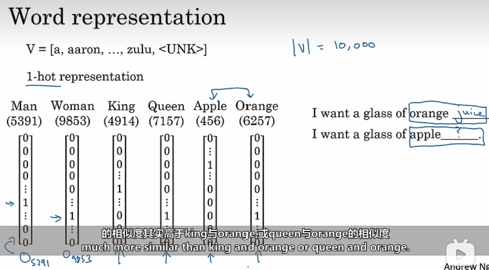

使用独热编码的一个缺点：

他无法记录词语词之间的关系，如图，当我们的学习算法学习到了orange 与juice的组合，他难以学习到apple 和juice的组合。因为算法不知道orange与apple相对于queen和orange更加接近。

无法表示两个词之间的关系，他们的乘积都为0.

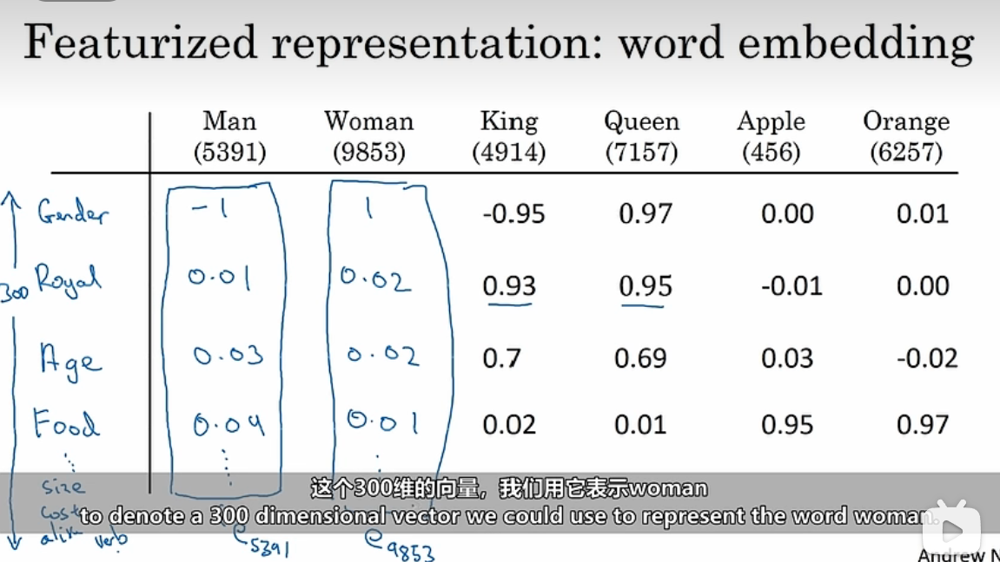

因此，我们可以使用特征来表示这些词。如图，我们假设使用300个特征表示每个词，数值越大表示其越符合这个特征。因此我们发现，Apple和Orange的特征较为相似，因此我们可能从orange juice学习到apple juice。

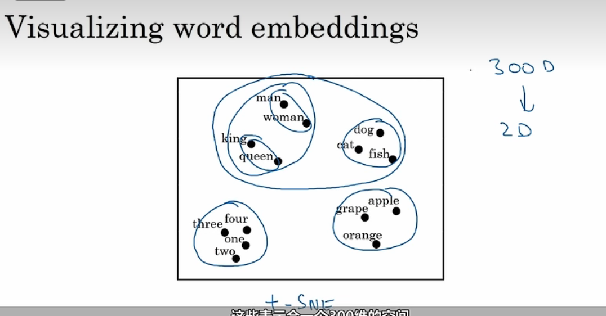

我们可以使用t-SNE算法将词嵌入降维至2维，相似的将放在一起，如图所示。

# 2.使用词嵌入

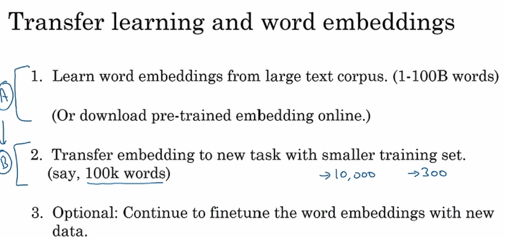

1. 从大型的语料库学习或者在网上下载单词嵌入；
2. 使用迁移学习，将这些嵌入运用到更小的训练集上。比起可能一万维的one-hot编码，使用词嵌入的维度更低，如300维，并且他是密集的；
3. 可以继续微调参数。

# 3.词嵌入的性能

 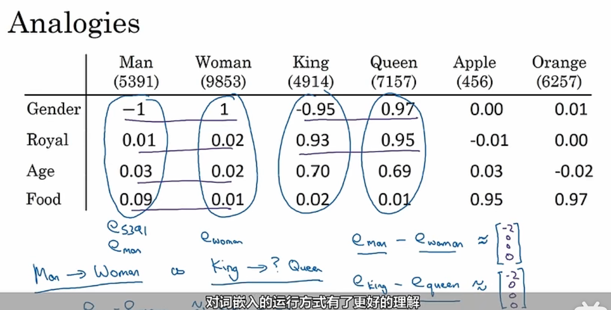

如果使用man-woman，与使用king-queen相似。因此，网络学习到它们之间的区别主要是性别。当man对应woman时，他很可能会将king对应queen。

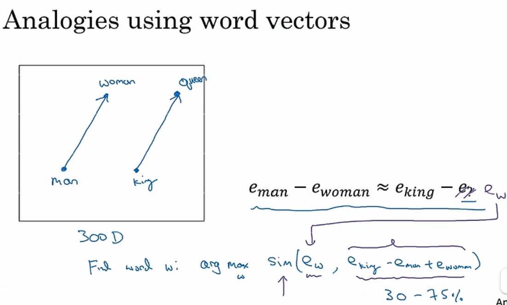

如图，当我们的词嵌入向量为300维向量时，我们要找到一个w，使得公式中的数据相似度最高。可以看见，man-woman与king-queen的相似度最高，他们几乎平行。

相似度函数：余弦相似度:

$sim(u,v)=\frac{u^Tv}{||u||_2||v||_2}$

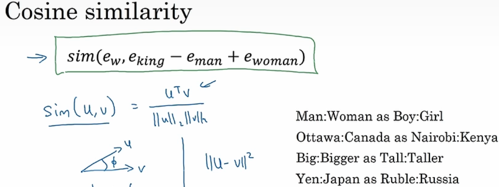

通过词嵌入，我们能够学习到诸多相似的词。

# 4.矩阵嵌入

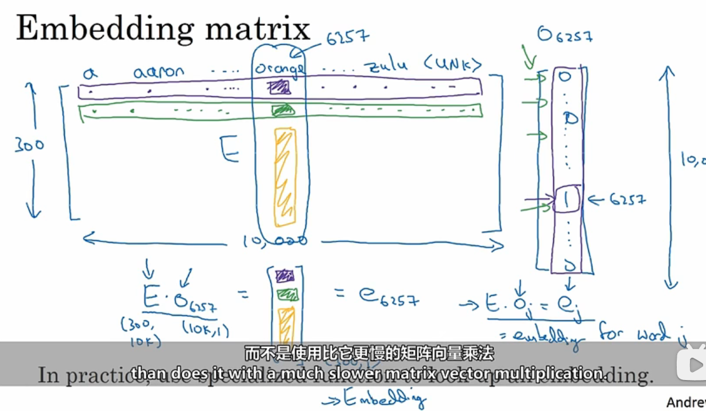

如图，E表示嵌入矩阵，如果使用该嵌入矩阵乘一个one-hot编码，我们将得到这个one-hot编码对应的词嵌入向量。

实际上，我们在编写代码时不会进行这样的乘法，因为基本上都是×0，没有意义。一般都是使用查找函数进行查找嵌入矩阵E的某一列。

# 5.学习词嵌入

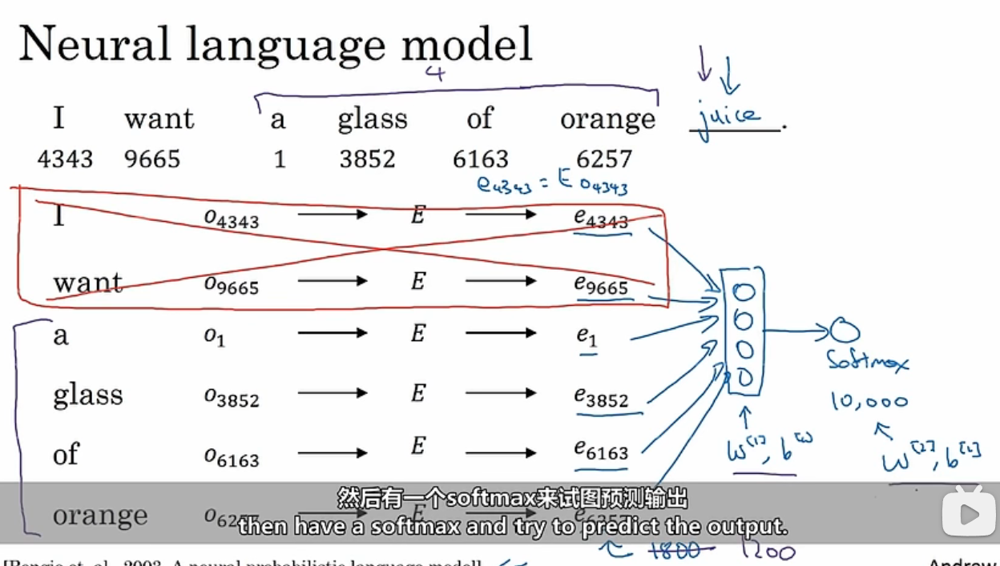

如图，我们会选择前几个词作为输入，输入到神经网络中，并使用softmax输出10000维的结果，取最大值为预测到的单词。

也有其他选择上下文的方法：

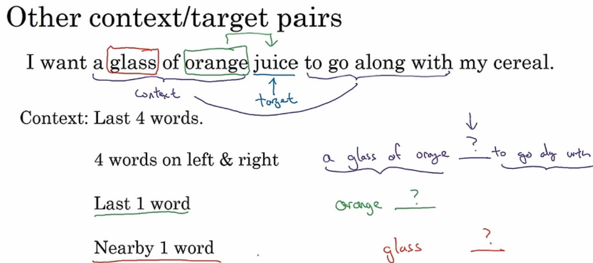

# 6.词转换成向量形式(Word2Vec)

SKip-grams模型：

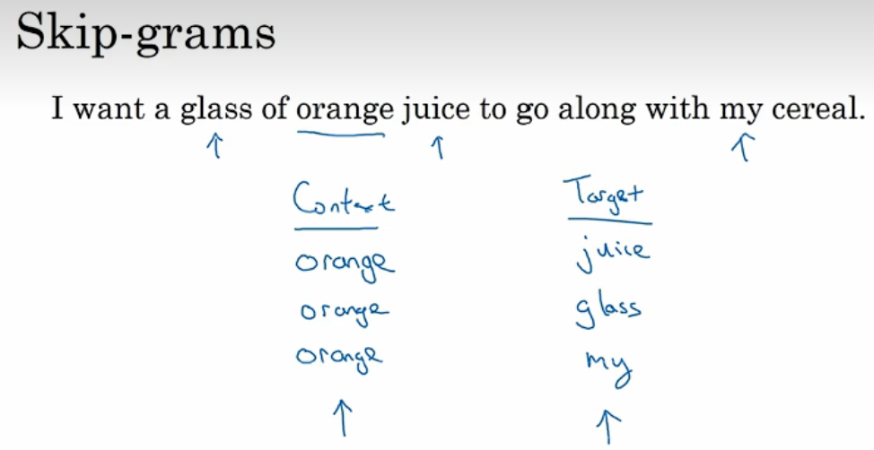

与其让上下文总对应最后四个单词或在目标词之前的紧接着出现的最后的结尾词，不如随机选择一个词作为语境词，然后再某个窗口中随意的挑出另外一个单词作为预测词。这样就建立了若干个对子，我们需要去预测在一个随机窗口内的词会是什么，比如上下文单词正负5个窗口。

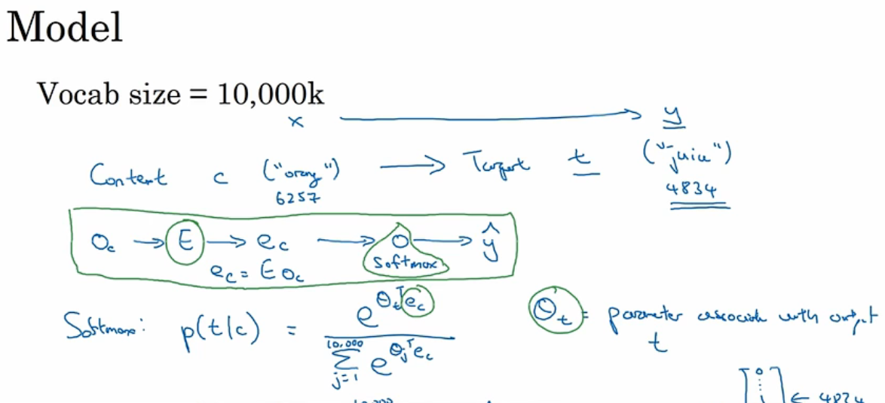

然后，我们就可以使用词嵌入矩阵E计算嵌入向量，然后使用神经网络进行训练，并使用softmax进行分类。

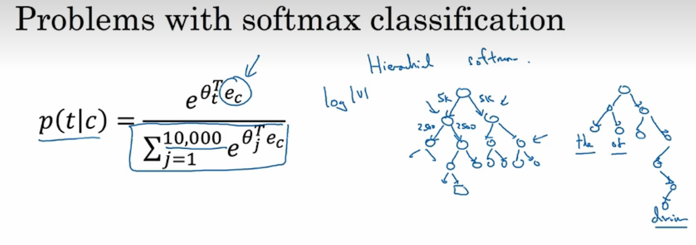

其缺点如上图，使用softmax需要对分母进行求和，这是十分耗时间的。一种做法是使用右图所示的树，将常用的词放在浅层，不常用的藏在深层位置。

# 7.负采样

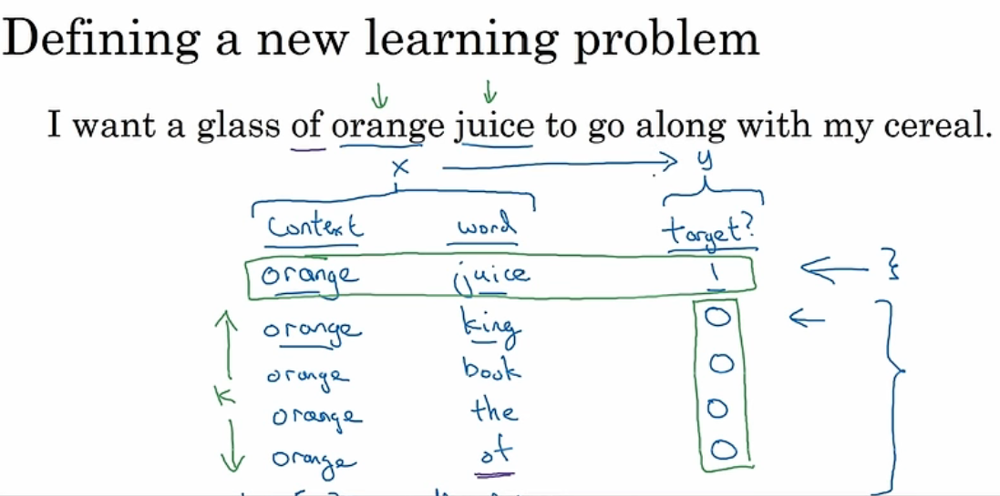

使用负采样方法。首先随机选择一个词作为语境词，然后在某窗口内选择一个词，这样的得到的一组词作为正样本。然后，仍然是这个语境词，在字典中随机选择其他的此作为负样本，我们得到如上图所示的词对。再将其使用神经网络进行训练。其中，x为语境词与挑选的词的组合，y为预测是否为目标词。

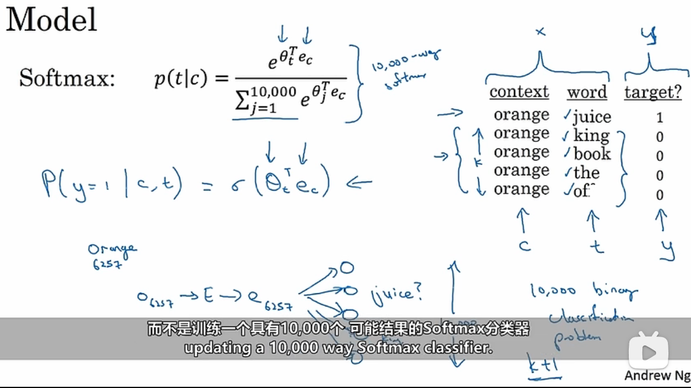

同样的，我们先得到词嵌入向量，然后对于这个输入词，他有10000个可能值，我们不像之前那样对这10000个分类器训练，而是对着所选的1个正样本和4个负样本进行训练，这样所消耗的时间大幅降低。
