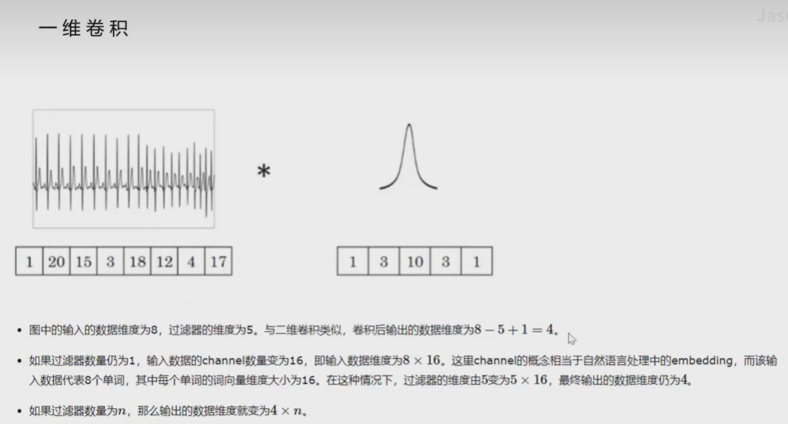

# PointNet: Deep Learning on Point Sets for 3D Classification and Segmentation

# 1.Motivation

## 1.1 related work

由于3D点云格式不规则，大多数研究人员将这些数据转换为规则的3D体素网格或图像集合。然而，这使得数据不必要地庞大，并引起问题。

1. Volumetric CNNs：对体素应用3DCNN。缺点是点云的坐标空间的稀疏性导致转成体素后的分辨率问题，以及3D卷积带来的开销
2. Multiview CNNs：将点云或者shape渲染成视图，使用传统的图像卷积来做特征学习。这种方法确实取得了不错的效果，但是缺点是应用非常局限，像分割、补全等任务就不太好做
3. Spectral CNNs
4. feature-based DNN

## 1.2 why do this:confused:

点云或者mesh，大多数研究人员都是将其转化成3D体素或者多视图来做特征学习的，这其中的工作包括了VoxelNet, MVCNN等。这些工作都或多或少存在了一些问题（上面提到了）。

直接对点云做特征学习也不是不可以，但有几个问题需要考虑：特征学习需要对点云中各个点的排列保持不变性、特征学习需要对rigid transformation保持不变性等。虽然有挑战，但是深度学习强大的表征能力以及其在图像领域取得的巨大成功，因此是很有必要直接在点云上进行尝试的。

**因此，我们设计了一种新型的直接消耗点云的神经网络，它很好地尊重了输入点的排列不变性，网络在输入扰动和损坏方面是鲁棒的。**

## 1.3 contribution

1. 我们设计了一个新颖的深层网络架构来处理三维中的无序点集
2. 我们设计的网络表征可以做三维图形分类、图形的局部分割以及场景的语义分割等任务
3. 我们提供了完备的经验和理论分析来证明PointNet的稳定和高效。
4. 充分的消融实验，证明网络各个部分对于表征的有效性

## 1.4 缺点

# 2.算法描述

## 2.1 整体架构

主要针对3个方面设计了该网络结构：

1. 要做到**对点云点排列不变性**。3D点云一个重要的特征是无序性，对于 N个点的点集，它有 N ! 种输入顺序。那么，**针对每一种顺序，如何保证网络的学习结果保持不变。**使用对称函数MaxPooling（结果与输入顺序无关）来解决无序性的问题。同时，最大池化层将独立学习的点特征聚合为全局点集特征，进而进行后续的3D识别任务。
2. 点之间的关系。**每个点不是孤立的，局部点之间是一个有意义的子集。**
3. 变换的不变性。**作为一个几何对象，学习到的点集表示对于一定的变换应该是不变的。**例如，一起旋转和平移点不应该修改全局点云类别，也不应该修改点的分割。

网络的3个主要模块：

- maxpooling对称函数用于最大池化层将独立学习的点特征聚合为全局点集特征；
- 局部和全局信息的融合结构；
- 有两个联合对齐网络用于对齐输入点和点特征。

### 2.1.1无序输入的对称函数

有三种备选策略：

1. 将输入按规范顺序排序;
2. 将输入作为一个序列来训练RNN，但通过各种排列来增强训练数据;
3. 使用一个简单的对称函数对每个点的信息进行聚合。

对于1，发现很难找到一个稳定的排序方法进行排序；
对于2，RNN很难处理好成千上万长度的这种输入元素（比如点云）。

我们的目标：左边 f是我们的目标，右边 g是我们期望设计的对称函数。由上公式可以看出，基本思路就是对各个元素（即点云中的各个点）使用 ℎ 分别处理，在送入对称函数 g 中处理，以实现排列不变性。

在实现中 ℎ 就是MLP， g就是max pooling。**也就是说，我们可以使用MLP(即h)和maxpooling(即g)组成的复合函数来祭祀得到置换不变函数f。**

### 2.1.2 局部和全局信息聚合

在分割任务中，需要point-wise feature。因此，在计算出全局点云特征向量后，通过将全局特征与每个点特征连接起来，将其反馈给每个点特征。然后再进行一次。

### 2.1.3 联合对准网络

用于实现网络对于仿射变换、刚体变换等变换的无关性。

## 2.2 损失函数:star:

# 网络实现细节

## 一维卷积

 

如图，输入数据的格式为(B,C,N).其中**B表示batchsize**,**C表示每个数据的维度**，**N表示每个点云样本中有多少个点**。

过滤器的格式为(n,C,K)。其中n表示过滤器个数，C表示过滤器维度，与输入相同，K表示过滤器核大小。

eg:假设batchsize为8，每个点云样本有2000个点，且每个点只有(x,y,z)3个维度，那么输入数据的格式为：(8,3,2000)。

**conv1d与2d的计算公式一样，先计算后相加。**

为什么这里的卷积核大小为1？因为每次只是用一个卷积核计算。如果使用2个，那就是2.**其中，k=1，s=1，因此计算方式为：(n-k)/s+1=(2500-1)/1+1=2500。**

这里给出了一个简单的例子，我们随机初始化了一个维度为（32，35，256）的tensor矩阵，**32表示batch_size**，**35表示句子最大长度（组成一个样本的个数**），**256表示词向量长度（样本里每个数据的长度）**。我们将其送到卷积层之前需要进行维度转换，根据pytorch的官方文档，输入的维度应该为（样本数，通道数，句子长度），所以要将矩阵从（32，35，256）转换为（32，256，35）。
  这里输出通道设置为100，表明有100个卷积核。卷积核的大小为2，卷积核的通道数要和输入的通道数一致，所以单个卷积核的维度为（256，2）。单个样本计算过程如下：

因为k=2，因此每次使用两个channel为256的卷积核计算。

我们经过多层感知机进行升维，将原来的3维变为多维。在**后面的最大池化中就不会丢失太多的信息**。最后，再使用MLP提取特征，得到最终的分类结果。

## T-Net

