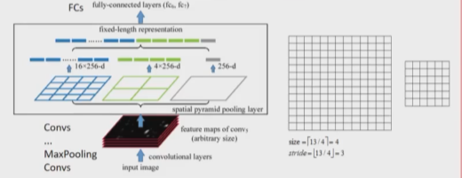

# Fast R-CNN

# 摘要

提出了Fast R-CNN算法，与当时优秀的目标检测算法R-CNN和SPPNet相比，Fast R-CNN更为优秀。

# 1.介绍

说明目标检测的两大难点：

- 需要处理大量的区域候选；
- 所得到的预测框位置不是精确的，需要对其进行调整，得到精确的位置。

## 1.1 R-CNN与SPPNet

介绍了R-CNN与SPPNet的缺点。

R-CNN的缺点：

1. 训练是多阶段的。R-CNN首先需要进行微调来训练一个CNN提取特征，然后再训练SVM进行分类，此外还需要额外训练一个SVM进行预测框位置调整。
2. 训练消耗时间以及存储空间。
3. 在检测目标时速度较慢。

因为它对每个对象候选执行卷积神经网络前向传递，而不共享计算。需要存到磁盘上，所以耗时耗内存。

SPPNet：

SPPNet使用了共享计算。R-CNN的一个缺点是他的每个候选都需要进行前向传播。而SPPNet使用了**空间金字塔池化层**，它输入的是**一个图像（大小不固定）**，然后使用CNN进行特征提取。对于那些候选，我们只需要在得到的特征中的**特定位置提取这些候选特征**即可。由于输入图像大小不固定，因此使用的**池化层的输出大小是固定（通过动态调整池化核的大小与步长）**的，我们可以输出多个大小固定的feature map，最后拼接在一起就是候选区域的特征信息。

与R-CNN相比：1、2两点问题依然存在，但是通过共享计算解决了问题3，但又引入了新问题：==提出的微调算法无法更新空间金字塔池化之前的卷积层==。

## 1.2 贡献

基于R-CNN与SPPNet的缺点，本文提出了FastR-CNN，他的优点如下：

1. 更高的检测效果，即mAP更高；
2. 使用一个多任务的损失，训练是单阶段的；
3. 训练可以更新所有的网络层；
4. 不需要使用磁盘存储特征。

# 2.网络架构与训练

Fast R-CNN网络将**一整张图像和一组目标候选**作为输入。

- 该网络首先用几个卷积(conv)和最大池化层来处理整个图像，以产生一个conv特征图。
- 然后，针对每个目标候选，一个感兴趣区域(RoI)池化层从特征映射中提取一个固定长度的特征向量。
- 每个特征向量被馈送到一个全连接(fc)层的序列中，最终分支成两个输出层:一个层对K个对象类和一个全“背景”类产生softmax概率估计，另一个层为K个对象类中的每个对象类输出四个实值数字。每组4个值为K个类中的一个精细的bounding box的位置。

## 2.1 RoI池化层

RoI池化层使用最大池化将**任何RoI内的特征转换为具有==固定空间范围==H × W(例如7 × 7)的小特征映射**，其中H和W是独立于任何特定RoI的层超参数。实际上，RoI池化层就是空间金字塔池化的特殊情况（前者为一个固定输出，后者为3个）。
池化过程为：将大小为h×w的RoI区域分成大小为H×W(这就是我们固定的输出大小)的网格，这些网格大小大约为h/H×w/W，这个H×W中的每个子窗口都会取h/H×w/W中的最大值。

计算方法：使用的池化核大小：$size=\lceil input / output\rceil$；使用的步长：$stride=\lfloor input/output \rfloor$。如：输入为13×13，输出4×4，那么：$size=\lceil 13/4\rceil=4,stride=\lfloor 13/4 \rfloor=3。$

## 2.2 从预训练网络中初始化

使用了3个ImageNet的预训练网络，并做了3个修改，以适应Fast R-CNN：

1. 最后一层的最大池化被修改成RoI池化；
2. 将最后一层的全连接层和softmax1000分类修改成并行的softmax类别概率预测以及bounding box位置预测的两个全连接层；
3. 输入不再是区域候选，而是两个数据输入：图像列表以及这些图像中的RoI列表。

## 2.3 在检测任务上进行微调

相比于R-CNN与SPPNet，Fast R-CNN使用了分层抽样，提高了效率。

在SPPnet和R-CNN中，当每个训练样本（比如RoI）来自于不同的图像时，向后传播会变得非常的低效。这是因为每个**RoI可能会有很大的接受野**，而这个接受野经常会把一整个图像都包括其中。因为**向前传播必须处理这一整个接受野，因此训练的输入是非常大的**（经常是一整个图像）。
反观Fast R-CNN，首先对N个图像进行采样，然后对每个图象的中的R/N个RoI进行采样。**最重要的是，来自同一图像的RoI在向前和向后传播过程中共享计算和内存。==因为他们来自同一个图像，其接受野最多也就是N张图像，而前两种方法很可能是R张图像。==**

也就是说，SPPnet更新权重的效率太低了，FastR-CNN解决了这一问题。

### 2.3.1 Multi-task loss

在最后的输出阶段是两个并行的softmax分类输出，因此需要两个损失值。

设$p_i$为预测的类别，$p_0$表示背景类别；$t^k$为bounding box预测框的位置；u表示真实类别；v表示真实位置框。

总损失如图所示，分为分类损失以及定位损失。其中分类损失$L_{cls}(p,u)=-log p_u$；定位损失为：

在$l_{loc}(t^u,v)$中，使用的是$L_1平滑损失$，相比于$L_2平滑损失L_2(x)=x^2$，我们发现：**当预测值与真实值的差距较大时，x较大，那么对其求导则梯度会很大，可能会造成梯度爆炸现象。**因此，使用$L_1$平滑损失更合理。

此外，总损失中的超参数λ控制两个任务损失之间的平衡，[u≥1]表示只有当预测的类别不是背景时才有回归框损失。

### 2.3.2 采样策略

- 选取两张图像，每个图像采样64个RoIs，共128个；
- IoU高于0.5的为正样本，分类的值u≥1；
- 在0.1到0.5之间的为负样本，他们作为背景类，u=0；
- 低于0.1的是难以训练的数据，将使用hard example mining(难例挖掘)的方式。
- 训练时，每张图像有0.5的概率水平翻转（数据增强）。

### 2.3.3 RoI池化层的反向传播

对于激活输入$x_i$，他可能在多个特征图中都出现，并且是该区域的最大值。$y_{rj}$表示第r个特征图池化后的第j个值。因此，对$x_i$求导，则需要考虑在所有特征图r上出现了$x_i$且他是最大值的情况。因此公式如上所示。

# 3.测试

## 3.1 使用截断的SVD（奇异值分解）加快测试速度

对于整幅图像分类，计算完全连接层所花费的时间比计算卷积层要少。相反，**对于检测阶段，要处理的roi数量很大，并且近一半的前向传递时间用于计算完全连接的层（因为只需要对输入的图像进行一次前向传播即可，而对于特征的提取需要后面的FC。由于有很多的RoI，因此耗时）。**

假设输入的为$W_{u \times v}$，使用truncated SVD将其近似变为$U_{u \times t}\sum_tV^T_{t \times v}$。

其中，$\sum_t$是W的前t个特征值(共n个)组成的对角阵，特征值越大，其对应的向量越重要。因此我们取前t个可以尽可能地提取特征。

然后，将单一的完全连接层用两个完全连接层所取代,它们之间没有非线性关系。这些层中的第一层使用权重矩阵$\sum_tV^T_{t \times v}$，第二层使用$U_{u \times t}$。

# 4.实验结果

总之就是Fast R-CNN比R-CNN和SPPNet强。

## 4.5 讨论从哪开始微调

首先说明需要微调，如果冻结卷积层，那么mAP将下降。**这个实验验证了我们的假设:通过RoI池层进行训练对于非常深的网络很重要。**

其次，并不是所有的卷积层都要微调。在使用VGG16的Fast R-CNN上实验，发现：

- 与从conv3_1中学习相比，从conv2_1中更新训练速度降低了1.3倍。即从太前面的层微调需要时间代价；
- 从conv1_1更新会占用GPU内存。

# 5.设计理念验证

## 5.1 多任务训练是否有效

在R-CNN中，使用的是顺序训练，训练完一个模块后再训练另一个模块。他会训练CNN，一个SVM用于分类，另一个SVM用于调整bbox。

而Fast R-CNN是多任务训练，他的分类（判断类别）和回归（bbox预测）任务是同时训练的。

试验结果表明，多任务训练是有效的。

# 总结

针对R-CNN与SPPNet的缺点进行了完善，得到了效果更好的R-CNN。

创新点：

1. 相比于R-CNN，Fast R-CNN是多任务训练。分类和回归同时进行；
2. 不需要额外的存储空间，训练速度和内存开销少；
3. 使用RoI最大池化，不需要规定输入的大小。训练可以更新所有的网络层。

不足：

1. 使用的是SS算法，生成候选区域的速度太慢；
2. 候选区域的生成与后续特征的提取没有共享计算。
