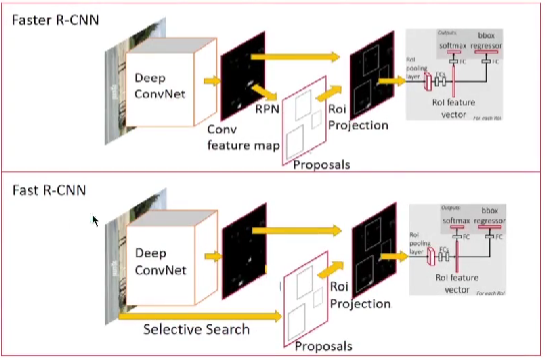
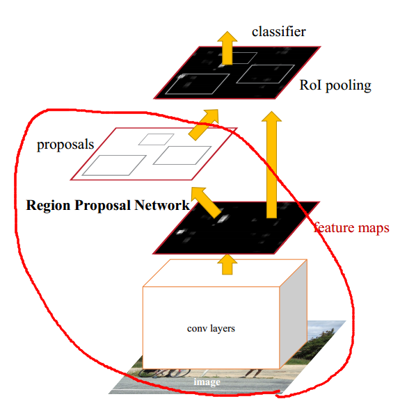
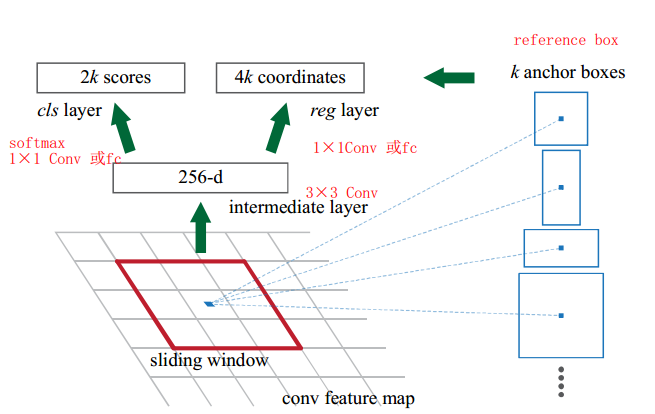
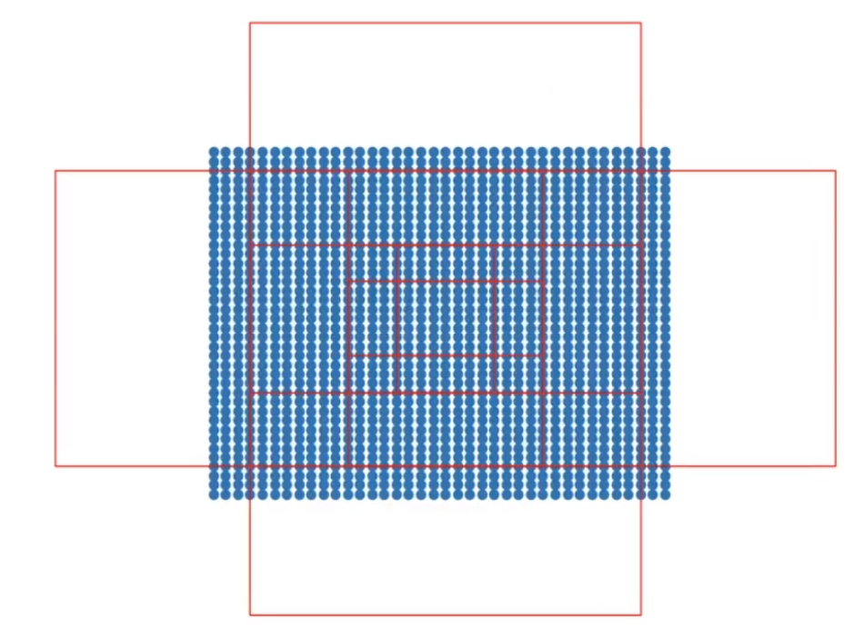
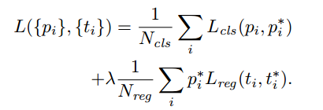
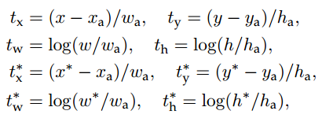
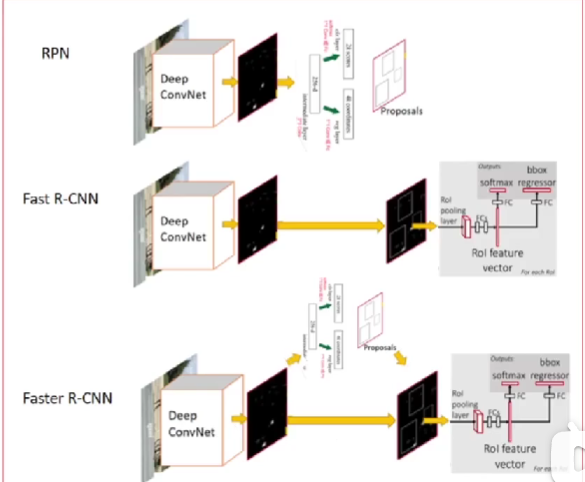
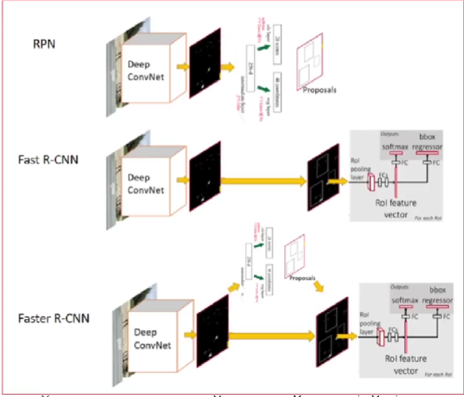

# Faster R-CNN: Towards Real-Time Object Detection with Region Proposal Networks

# 摘要

> 最先进的目标检测网络依赖于区域建议算法来假设目标位置。SPPnet[7]和Fast R-CNN[5]等先进技术减少了这些检测网络的运行时间，**使区域提议计算成为瓶颈**。在这项工作中，我们引入了一个区域建议网络(RPN)，它与检测网络共享全图像卷积特征，从而实现几乎无成本的区域建议。RPN是一个全卷积网络，**它可以同时预测物体边界和物体在每个位置的得分。**rpn被端到端训练以生成高质量的区域建议，这些建议被Fast R-CNN用于检测。通过简单的交替优化，RPN和Fast R-CNN可以被训练成共享卷积特征。对于非常深的VGG-16模型[19]，我们的检测系统在GPU上的帧率为5fps(包括所有步骤)，同时在PASCAL VOC 2007 (73.2% mAP)和2012 (70.4% mAP)上实现了最先进的目标检测精度，每张图像使用300个提议。
>

# 1.介绍

得益于候选区域可以实现共享计算，因此当前目标检测的主要难题是如何减少生成候选区域的时间。

在Fast R-CNN中，他的检测时间几乎是实时的，但是在这之前需要生成区域候选（Region Proposals），这是十分耗时间的。而且，其使用的Selective Search方法是运行在CPU上的，速度较慢。

因此，作者提出了新的方法：区域候选网络（Region Proposal Network，检测RPN）。**该方法同样使用CNN来生成候选区域。那么，他就可以和特征提取共享CNN的计算结果，所以提升了速度。**

上图是Faster R-CNN与Fast R-CNN的对比。最大的区别就是**前者使用了计算特征共享的RPN模块替换了耗时的SS方法来生成区域候选**。

# 3.Faster R-CNN

## 3.1 RPN网络设计

Faster R-CNN的网络结构图如上图所示。其中，红色圈出来的表示RPN模型，**区域建议网络(RPN)以任意大小的图像作为输入，输出一组矩形对象建议，每个建议都有一个对象得分。**

怎么实现RPN？

使用一个小网络对得到的feature map进行卷积计算，并输出分类以及bounding box的位置，如上图。

其中，这个小网络将在得到的feature map上滑动，并进行卷积计算，得到256维的特征，然后分别将其传到两个1×1的卷积中计算，分别得到分类以及坐标位置。

### 3.1.1 Anchors

右边的为Anchor boxes，表示提供参考的框。**在每个滑动窗口位置，我们同时预测多个区域提案，因此anchor的作用就是提供参考，选出最有可能的框。**其中每个位置的最大可能提案数表示为k。因此reg层有4k个输出编码k个框的坐标，cls层输出2k个分数**（判断是前景还是背景）**，用于估计每个提案的对象或非对象概率。

**最后输出的是每个参考框的偏移量，得到预测框。**在本文中，使用3个尺寸的参考框，并且有3个长宽比例，因此共9个参考框，k=9.

一般来说，我们都会在经过骨干网络处理的特征层上进行先验框匹配。因为如果在一开始的图片上就进行先验框匹配，那就会有很多先验框，这样计算量就会激增。以Faster RCNN为例，输入图片是600x600的大小，而特征层是38x38的大小。如果在输入图片上进行先验框匹配，那就产生600 ∗ 600 ∗ 9 = 3 , 240 , 000 600 * 600*9 = 3,240,000600∗600∗9=3,240,000个先验框，而在特征层上则是38 ∗ 38 ∗ 9 = 12996 38 * 38 *9 = 1299638∗38∗9=12996个先验框。下图是Faster RCNN特征层一个点上的先验框演示（其他点没有绘制）。**蓝色点表示feature map，每个点代表16\*16的原图像区域。**

因此，假设输入为600\*600，那么feature map为38\*38.这样的话相当于原图像中的每16\*16区域变成了feature map上的一个点，**这是通过conv得到的特征信息。在这个像素上绘制先验框，相当于在原图像上以该先验框大小绘制框，用以探测该先验框内是否有物体**。之后就可以使用1\*1网络计算这个经过**conv后的像素（提取到的特征）**中是否有物体，并调整先验框的位置与大小得到bbox。

### 3.1.2 损失函数

 

首先会对所有的anchor分配一个二分类表示这个anchor是否为一个目标。正样本的定义如下：

- 与ground truth的IoU值最大的anchor；
- IoU与ground truth超过0.7的anchor。
- 如果IoU与所有ground truth的值低于0.3，我们将其分配为负标签。

其中，**t依然是归一化后的值**。$x,x_a,x^*$分别表示预测框，anchor box以及真实框。

### 3.1.3 训练RPN网络

RPN可以通过反向传播和随机梯度下降(SGD)进行端到端训练[35]。我们遵循[2]中的“以图像为中心”采样策略来训练该网络。**每个小批都来自一个包含许多正面和负面例子锚点的单一图像。**即，每个batch的数据都来自同一张图像，有利于共享计算，提高速度。

相反，我们在一张图像中随机采样256个锚点来计算一个小批量的损失函数，其中采样的正锚点和负锚点的比例高达1:1。如果图像中阳性样本少于128个，我们就用阴性样本填充至256。

## 3.2 RPN和Fast R-CNN的特征共享

对于RPN和Fast R-CNN的特征共享，在训练时有三种方法。

1. 交替训练，如图所示。
   
   共有4步。第一步是单独训练一个RPN网络，网络初始参数来自ImageNet；第二步是使用第一步生成的区域候选训练一个Fast R-CNN网络，网络初始参数同样来自ImageNet；第三步是将RPN中深度卷积网络的参数替换为得到的Fast R-CNN网络参数，并冻结这些深度卷积网络参数，只微调其特有的滑动窗口的参数；第四步保持Fast R-CNN的深度卷积网络参数不变，只训练其特有的参数，即RoI Pooling之后的全连接层。最后，通过这4步，RPN和Fast R-CNN的深度卷积网络的参数一致，那么就可以进行合并，得到训练好的Faster R-CNN模型。
2. 近似联合训练。直接将两个模块结合成Faster R-CNN进行训练。对于RPCN产生的损失，进行反向传播；同理对于Fast R-CNN产生的损失也反向传播。结果表明，他与1的精度差不多，但时间更少。因此在代码发行中使用的是2。**缺点是Fast R-CNN使用的是RPN产生的候选框，但是反向传播时并没有经过RPN。**
3. 非近似联合训练。使用了RoI Warp解决该问题。

## 3.3 实现细节

使用单一尺度进行训练，短边被缩放成600.一些RPN的候选彼此高度重叠。为了减少冗余，我们根据提案区域的cls分数对其采用非极大值抑制(NMS)。

# 总结

创新点：

1. 使用RPN模块替换掉SS算法，使用CNN来生成候选区域；
2. RPN可以与Fast R-CNN计算共享，提高训练速度。
