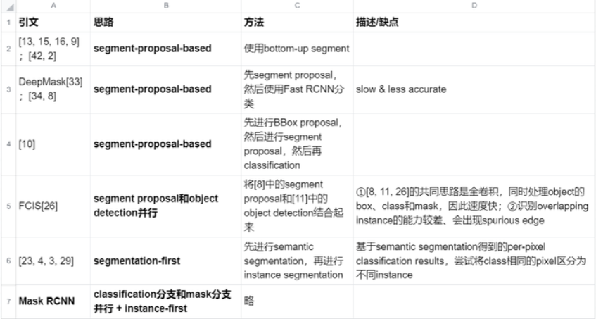
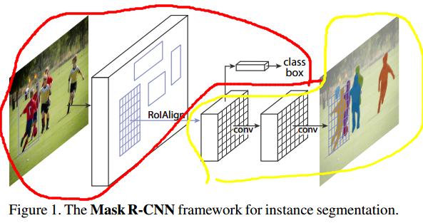
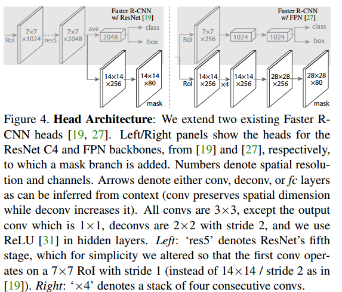
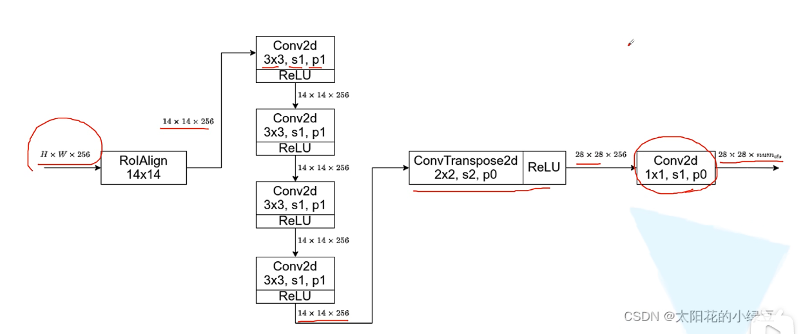
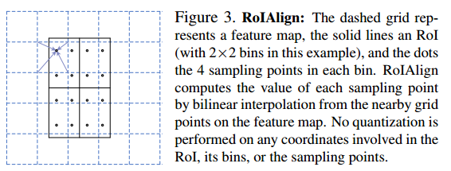
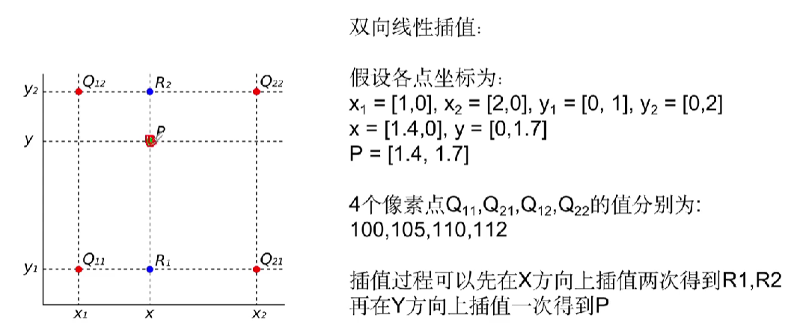
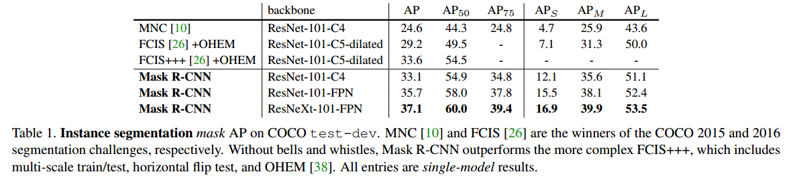
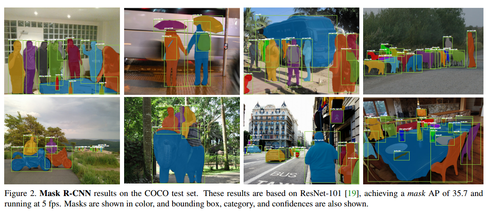
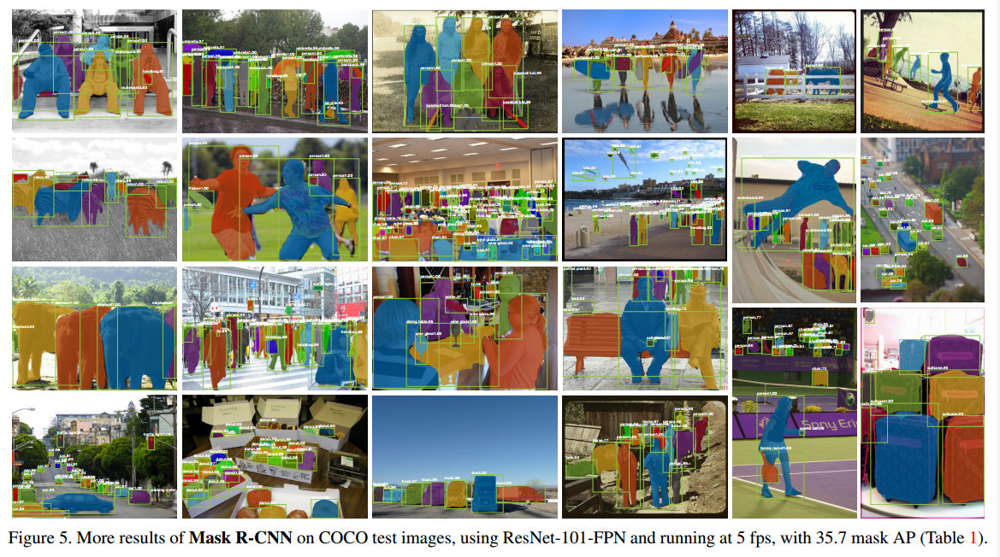
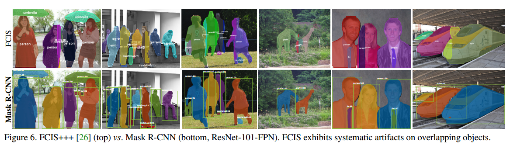

# Mask R-CNN

# 1.文章概要

## 1.1 背景

## 1.2 方法/研究内容:star:

- Mask RCNN：基于Faster RCNN，**添加1个对每个RoI预测binary mask的分支**，该分支与已有的**classification分支和BBox regression分支(即Fast R-CNN的两个并行输出)并行**，因此可以同时进行object detection和instance segmentation（输出BBox和mask）

- RoIAlign

  -  问题：Faster RCNN并非为pixel-to-pixel的input和output设计的。RoIPool是识别instance的核心操作，但其仅通过**coarse spatial quantization**来提取特征

  - 改进：本文提出RoIAlign，其保留了**exact spatial locations**
  - 性能：虽然改动很小，但将mask accuracy相对提高了10%-50%

## 1.3 创新点/优点:star:

- 创新点

  -  Mask RCNN在instance segmentation思路上的创新：**classification分支和mask分支并行**，Mask R-CNN其实是将物体检测和语义分割结合起来，从而达到了实例分割的效果

  - RoIAlign：RoIPool通过**coarse** spatial quantization来提取特征，这并不适用于精细的pixel-pixel的instance segmentation任务，因此提出可以保留exact spatial location的RoIAlign。虽然改动很小，但将mask accuracy相对提高了10%-50%
  - 将segmentation和classification**解耦**：FCN通常执行per-pixel multi-class categorization（即对每个像素进行多分类），将classification和segmentation耦合起来，而本文通过实验发现两者耦合时在instance segmentation任务中的效果并不好；而本文使用classification分支进行分类，mask分支独立为每个class预测1个binary mask，并且classification分支和mask分支是并行的

- 优点

  -  易于训练，mask分支仅增加了很小的计算开销

  - generality：Mask RCNN的框架易于generalize到其它任务（比如Human Pose Estimation）中
  - 准确度：在多个任务（instance segmentation、object detection、person keypoint detection）中达到SOTA

# 2.Mask R-CNN算法描述

## 2.1 整体架构

**红色部分为Faster R-CNN，替换成了RoIAlign。黄色部分为添加的Mask分支。**分别代表了文章中的(i)用于特征提取的骨架网络;(ii)网络头，用于预测类别、bbox以及对于每个RoI的mask预测。

在Faster RCNN上添加mask分支：经过Backbone + RPN + RoIAlign之后，将得到的每个RoI分别传入classification分支、regression分支和mask分支。

## 2.2 Mask分支:star:

- 输出：对于每个RoI，mask分支的输出为$Km^2$维，这对应K个class的m×m维的binary mask。inference时，由classification分支的结果选择第k个m×m维的mask进行resize，然后再进行二值化（阈值0.5）

- Mask Branch for ResNet(左图)

  -  Backbone(ResNet C4) + RPN + RoIAlign：输出7×7×1024的feature map，表示1个RoI

  - res5：ResNet第5个stage，输出7×7×2048
  - ave：应该是对7×7×2048的每个channel取平均值，得到2048维的vector，然后传入classification分支和regression分支
  - deconv & conv：将7×7×2048通过转置卷积变成14×14×256，再变成14×14×80（80个channel分别表示80个class的mask）

- Mask Branch for ResNet-FPN(右图)

  -  ResNet + FPN + RPN + RoIAlign：**使用两个RoIAlign，分别输出7×7×256(用于cls和reg)和14×14×256(用于mask)的feature map，**表示1个RoI，分别传入后面的2个预测分支和mask分支

  - classification分支和regression分支：应该是通过FC层得到2个1024维的vector，再传入2个预测分支
  - mask分支：通过一系列**卷积和反卷积**，得到28×28×80（80个channel分别表示80个class的mask）
    

  

- **解耦**

  - 在FCN中，对于 得到的mask输出的每个像素将沿着channel方向进行softmax计算，判断这个像素属于哪个类别。由于softmax的计算性质，那么不同类别之间是有竞争关系的，Mask与class存在耦合状态
  - 在Mask R-CNN中，使用classification分支预测的class label用于选择mask分支输出的K个mask中的某1个，这样实现mask prediction和class prediction的解耦

  - 因为$L_{mask}$仅定义在第k个mask上（即其它class的mask不参与loss计算），所以mask分支在生成mask时class之间不存在competition，即mask分支是个dedicated mask generator

## 2.3 损失函数:star:

- multi-task loss：对每个sampled RoI，计算其损失$L=L_{cls}+L_{box}+L_{mask}$，其中$L_{cls}$和$L_{box}$与Fast RCNN中的定义相同
- mask分支对于每个RoI有$Km^2$维输出，它编码K个分辨率为m × m的二进制掩码，K个类各一个
- $L_{mask}$：mask分支中会使用1个per-pixel sigmoid，$L_{mask}$为average e binary cross-entropy loss。如果RoI被分配的GT class为k，则$$L_{mask}$仅定义在第k个mask上（即其它class对应的mask不参与loss计算）

## 2.4 RoIAlign:star:

- motivation：Faster RCNN并非为pixel-to-pixel的input和output设计的，不同于另外2个分支输出class和BBox，mask分支需要提取更精细的对象空间布局。RoIPool是识别instance的核心操作，但其仅通过**coarse** spatial quantization来提取特征。因此本文提出RoIAlign，它可以保留exact spatial location以实现pixel-to-pixel alignment
- RoI Pool的问题：RoI Pool使用了2次**quantization（“浮点数变整数”）**：将原图上的RoI映射到特征图时、对特征图进行RoIpooling以得到期望size的输出时（详见**[图解 RoIPooling、RoIAlign 和 RoIWarp - 知乎](https://zhuanlan.zhihu.com/p/273587749)**一文）。quantization使得RoI和RoI Pool输出的feature之间存在**misalignment**。这种misalignment可能不会影响classification，但它对预测pixel-accurate mask有很大的负面影响
- 方法：RoIAlign并不使用quantization。首先将原图上的RoI映射到特征图（不使用quantization），然后将特征图上的RoI均分成2×2个bin（**RoIPool/RoIAlign输出C×N×N的feature map，则bin的数量就是N×N，这里仅以2×2 bins为例**）；在每个bin中求平均值得到4个point的位置，通过双线性插值计算这4个point对应的value，然后对这4个point的value进行aggregation（max/avg pooling）得到该bin的value。

具体做法如下：

1. 计算$R_1$的值$F(R_1)$:$F(R_1)=\frac{x_2-x}{x_2-x_1}F(Q_{11})+\frac{x-x_1}{x_2-x_1}F(Q_{21})$
2. 计算$R_2$的值$F(R_2)$:$F(R_2)=\frac{x_2-x}{x_2-x_1}F(Q_{12})+\frac{x-x_1}{x_2-x_1}F(Q_{22})$
3. 计算P的值F(P):$F(P)=\frac{y_2-y}{y_2-y_1}F(R_1)+\frac{y-y_1}{y_2-y_1}F(R_2)$

# 3.Training Details

- 正负样本：每个图像采样N个RoI，正负样本比例为1:3，IoU阈值为0.5
- mask分支的loss $L_{mask}$仅在positive RoI上定义
- RPN：和FPN原文中相同，anchor有5个scale、3个aspect ratio

# 4.Inference Details

- proposal数量：

- - 没有FPN时，Backbone中C4生成300个proposal（和Faster RCNN原文相同）
  - 有FPN时生成1000个proposal（和FPN原文相同）

- pipeline：**先在proposal上运行regression分支，然后进行NMS，取score最高的100个BBox作为RoI传入mask分支**（尽管这与训练中的并行计算不同，但它加快了推理速度并由于使用了更少、更准确的 RoI而提高了准确性）

# 5.实验结果

## 5.1 Mask R-CNN的实验结果

在COCO测试集上进行实例分割：

分别使用ResNet101和ResNet-101-FPN作为network head在COCO的测试集上的实验结果：

对比FCIS+++与Mask R-CNN(ResNet-101-FPN)的结果。发现FCIS展示了重叠对象上的系统伪影。

