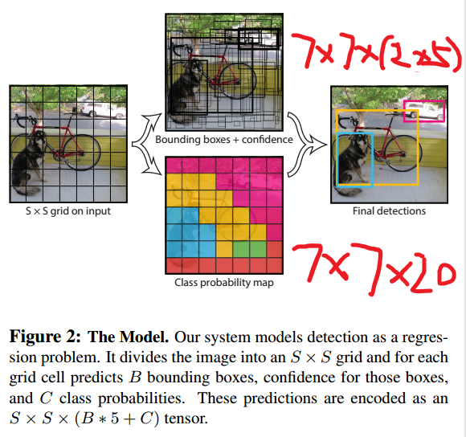
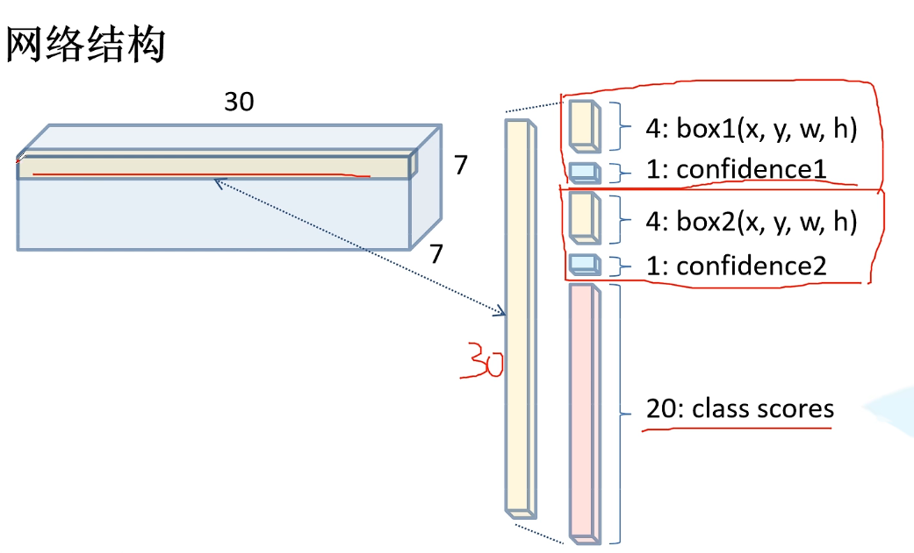
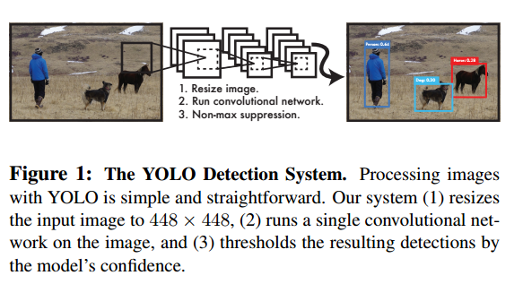
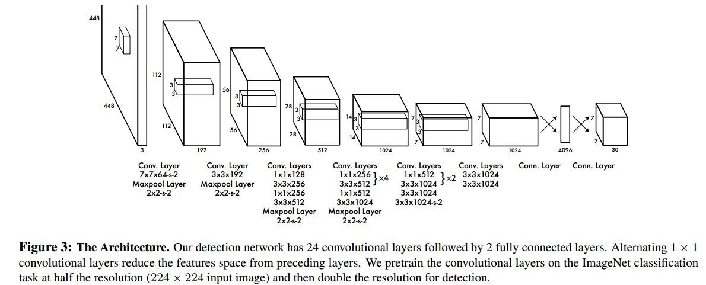
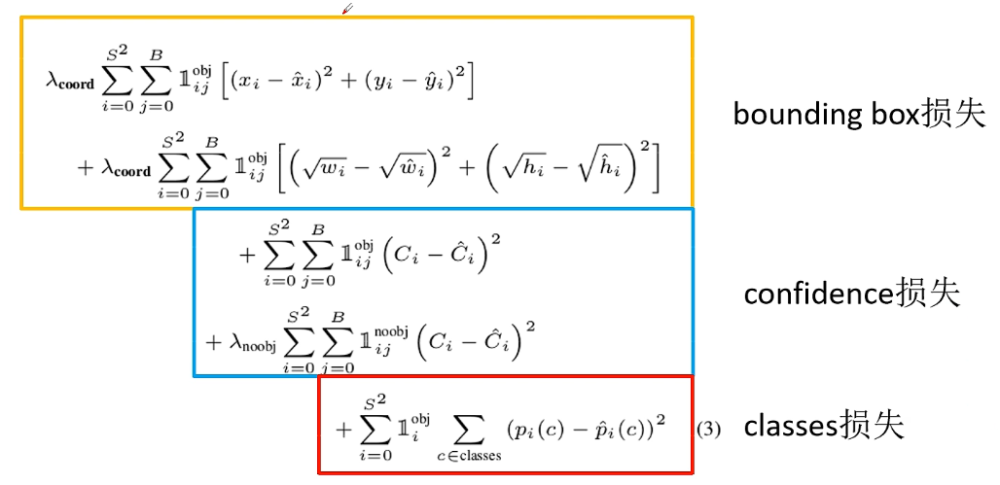
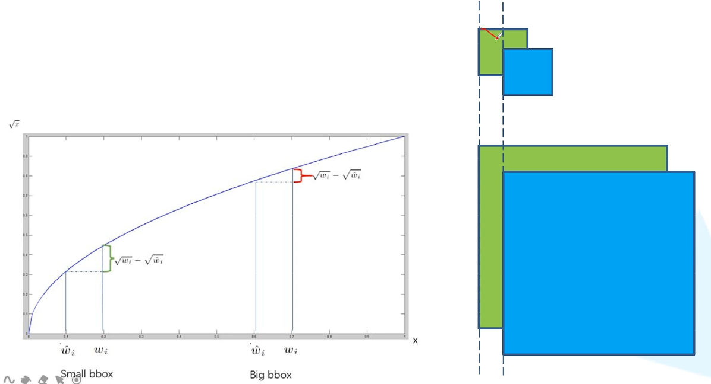
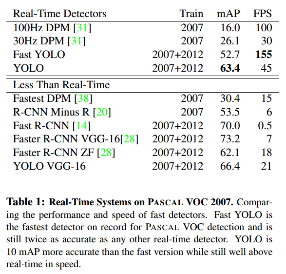
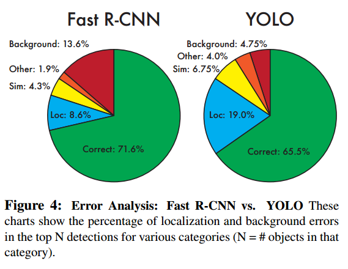

# You Only Look Once:Unified, Real-Time Object Detection

# 1.文章概要

## 1.1 背景

1. 当前的检测方法重新使用分类器来执行检测；
2. 诸如R-CNN方法使用候选区域的方式，这些复杂的管道运行缓慢且难以优化，因为每个单独的组件必须单独训练。

## 1.2 方法:star:

1. 我们将目标检测重新定义为一个单一的**回归问题，直接从图像像素到边界框坐标和类概率。**该网络使用整个图像的特征来预测每个边界框。它还可以同时预测图像的所有类的所有边界框。

2. 我们的系统将输入图像分成S × S网格。如果一个**物体的中心落在一个网格单元(grid cell)中**，这个网格单元负责检测这个物体。

3. 每个grid cell预测**B个边界框**和这些框的**置信度得分(confidence score)**，用于表示**该框中有物体的置信程度**以及**这个框位置的准确度**。公式为$Pr(Object)*IOU^{truth}_{pred}$。如果没有物体，那么Pr为0，置信度为0；否则Pr为1，置信度就等于IOU的值。

4. bbox由5个数据组成：(x,y,w,h,confidence)，分别表示中心点的位置、bbox的宽高以及置信度得分。

5. 每个grid cell预测C个类条件概率$Pr(Class_i|Object)$，表示是目标的条件下类别为i的概率。**无论grid cell所设定的bbox数量B为多少，我们都只预测一组类别概率，即C个，而不是C\*B个。**

  如图，最后输出的结果是$S\times S\times (B*5+C)$。其中S×S表示每张图像划分成多少个grid cell，B表示每个grid cell的bbox数量，\*5表示有5个坐标点，+C表示最后的分类类别使用one-hot表示。
  

  

## 1.3 创新点/优点:star:

1. 首先，YOLO非常快。因为我们把检测作为一个回归问题，我们不需要一个复杂的管道；
2. 其次，YOLO在训练和测试期间查看**整个图像**，因此它隐式地编码有关类及其外观的上下文信息，在预测时能够进行全局推理；
3. 第三，YOLO学习对象的一般化表示，YOLO具有高度的通用性。

## 1.4 缺点

1. YOLO在精度上仍然落后于最先进的探测系统。虽然它可以快速识别图像中的物体，但很难精确定位某些物体，尤其是小物体。
2. YOLO对边界框预测施加了很强的空间约束，**因为每个网格单元只能预测两个框，并且只能有一个类。**这个空间约束限制了我们的模型可以预测的附近物体的数量。我们的模型**难以处理成群出现的小物体**，比如鸟群。**因为分的是7\*7，分辨率不够，grid cell比较少。且使用的是IOU，小物体的IOU比较小，导致了置信度较小，所以小物体较难识别。**
3. 由于我们的模型学习从数据中预测边界框，它很难推广到特殊长宽比的对象。由于没有先验框，因此只能从数据中学习框的大小和形状，所以难以查找到特殊形状的对象。
4. 架构从输入图像到输出有多个下采样层，使用的是相对粗糙的特征来预测边界框。
5. 损失函数在小边界框和大边界框中处理错误是相同的。然而大盒子里的小错误通常是良性的，但小盒子里的小错误对借据的影响要大得多，因此这也是一个缺点。主要错误来源是不正确的定位。

# 2.算法描述

## 2.1 整体架构

上图为整体架构，主要是：

1. resize图像大小成$448*448$;
2. 训练一个CNN；
3. 使用非极大值抑制NMS。

其中，网络架构如下所示：

检测网络有24个卷积层，后面是2个全连接层。**交替的1 × 1卷积层减少了前一层的特征空间。**我们在ImageNet分类任务上以**一半的分辨率(224 × 224输入图像)预训练**卷积层，然后将**分辨率提高一倍用于检测**。

## 2.2 损失函数:star:

我们对模型输出中的**和平方误差**进行优化。

1. $1^{obj}_{ij}$：当bbox为目标框时，取值为1，否则为0；对于noobj则相反。**他们都是为了说明当他是/不是物体时才对损失函数有影响，否则结果为0无影响。**
2. $\lambda_{corrd},\lambda_{nobj}$:分别用于控制定位误差与分类误差的加权（**和平方误差将定位误差与分类误差等同地加权，这可能不是理想的**），以及**用于削弱大量的负样本导致的模型倾斜**（在每个图像中，许多网格单元不包含任何对象。这使得这些单元格的“置信度”得分趋近于零，往往压倒了包含对象的单元格的梯度。这可能导致模型不稳定，导致训练在早期出现分歧）。**由于大量的都是负样本，正样本较少，因此前者的值较大，后者的值较小。**
3. 宽高要开方是因为为了区分大小样本。
    
    如图，对于大小样本偏移同样的值，**如果不开方，那么得到的损失值一样。显然是不合理的，因为明显小样本偏移的程度更大。因此开方后，区分了大小样本的偏移程度，如果偏移的值一样，那么小样本的损失值更大，因此损失函数会更加关注小样本。**
4. $C_i$:表示置信度$Pr(Object)*IOU^{truth}_{pred}$。GT中正样本为1，负样本为0。
5. $p_i(c)$:表示经过最后的线性层输出的结果中的分类得分，$Pr(Class_i|Object)*President(Object)*IOU^{truth}_{pred}=Pr(Class_i)*IOU^{truth}_{pred}$
    第i个grid cell中是c类别的概率。

# 3.Training Details

1. 在ImageNet 1000分类上进行预训练，此时的图像分辨率为$224*224$。然后使用更加细粒度的448\*448的图片用于检测。
2. 对于最后的输出x,y,w,h都进行了归一化到0-1之间。
3. 最后一个用于输出预测结果的全连接层使用线性激活，其他所有层都是用leaky ReLU:
    $$\phi(x)=\begin{cases}x,&if x \gt 0 \\ 0.1x, &else
    \end{cases}$$
4. 避免过拟合，使用了Dropout和数据增强。

# 4.Inference Details

- 通常情况下，**一个物体被一个grid cell预测**。但是，如果这是一个大的物体或者在多个grid cell边界，那么**多个grid cell都能预测这个物体**。为了解决这一问题，使用NMS进行处理。

# 5.实验结果

在PASCAL VOC 2007上的实时性系统比较：

显然YOLO实时性较好，保证mAP较高的同时检测速度较快。

该图表明YOLO的主要问题是定位较差，但是对于负样本的检测十分优秀。