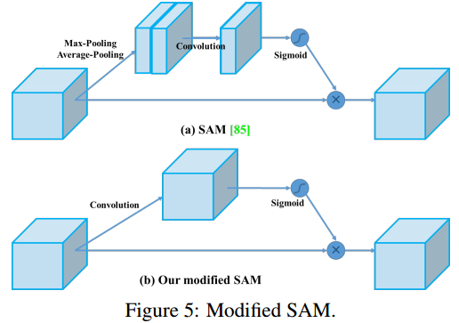

# YOLOv4: Optimal Speed and Accuracy of Object Detection

# 1.文章概要

## 1.1 背景

本工作的主要目标是在生产系统中设计一个快速运行的目标检测器，并优化并行计算，而不是低计算量理论指标(BFLOP)。

## 1.2 方法:star:

### 1.2.1 将整个过程划分为几个部分

1. Input：输入端，主要用于输入图像或者图像金字塔等。
2. Backbone：骨架网络，主要是一些预训练好的模型用于初步提取特征。
3. Neck：在Backbone和head之间，通常用于**从不同的阶段采集feature map**。主要由一些从上到下和从下到上的路径组成，如FPN和PAN。
4. Head：用于预测类别以及bbox。主要用两种类型：
   1.  Dense Prediction：用于单阶段的检测方法。如anchor based的YOLO系列算法，anchor free的CornerNet，CenterNet算法。
   2. Sparse Prediction：用于两阶段的检测方法。如anchor based的Faster R-CNN，Mask R-CNN算法，anchor free的RepPoints算法。

### 1.2.2 Bag of freebies

只改变**训练策略**或只**增加训练成本**的方法称为Bag of freebies。如使用离线训练的方法使目标检测器在不增加推理成本的情况下获得更好的精度。

1. 最常见的BOF方法是**数据增强**。常见方法有以下几种：
   - 逐像素调整，即pixel-wise adjustment。可以对**光学层面**和**几何形状**进行增强，如调整亮度、饱和度，旋转、缩放等。
   - 物体遮挡方法，如random erase和CutOut对图像进行遮挡。而Dropout、**Dropblock**可以对featuremap进行遮挡。
   - 使用多个图像一起执行数据增强。
   
2. 此外，还有一些BOF方法解决数据集中语义分布可能存在偏差的问题。
   在处理语义分布偏差问题时，一个非常重要的问题是**不同类之间存在数据不平衡的问题**（即一个或几个类特别多，其他类特别少）。
   - 对于two stage检测器，可以使用hard negative example mining or online hard example mining。
   
   - 对于one stage检测器，使用**focal loss。**
     
   
     如图为focal loss。发现它在普通的交叉熵损失的基础上添加了一个系数，这样的话就能衡量在**分类正确时与真实样本的差值。**差值越大，说明预测虽然准确，但是预测的不好，因此模型就会比较关注这个样本。
   
3. 最后，关于BBox回归的损失函数问题。
   传统的目标检测器通常使用均方误差(Mean Square Error, MSE)直接对BBox的中心点坐标和高度、宽度进行回归。然而，**直接估计BBox各点的坐标值，是将这些点视为自变量，而实际上并没有考虑对象本身的完整性。**因此提出了IoU loss，将预测BBox面积和GT的BBox面积的覆盖率考虑在内。

### 1.2.3 Bag of specials

对于那些只增加少量推理成本，却能显著提高目标检测精度的**插件模块**和**后处理方法**，我们称之为Bag of specials。

一般来说，这些插件模块是为了增强模型中的某些属性，如扩大接受野、引入注意机制或增强特征集成能力等，后处理是对模型预测结果进行筛选的一种方法。

在本文中，使用如下的方法实现YOLOv4：

- Bag of Freebies (BoF) for backbone: CutMix and Mosaic data augmentation, DropBlock regularization,Class label smoothing
- Bag of Specials (BoS) for backbone: Mish activation, Cross-stage partial connections (CSP), Multiinput weighted residual connections (MiWRC)
- Bag of Freebies (BoF) for detector: CIoU-loss, CmBN, DropBlock regularization, Mosaic data augmentation, Self-Adversarial Training, Eliminate grid sensitivity, Using multiple anchors for a single ground truth, Cosine annealing scheduler [52], Optimal hyperparameters, Random training shapes
-  Bag of Specials (BoS) for detector: Mish activation,SPP-block, SAM-block, PAN path-aggregation block,DIoU-NMS

# 2.算法描述

## 2.1 整体架构

1. CBM：Yolov4网络结构中的最小组件，由Conv+Bn+Mish激活函数三者组成。
2. CBL：由Conv+Bn+Leaky_relu激活函数三者组成。
3. Res unit：借鉴Resnet网络中的残差结构，让网络可以构建的更深。
4. CSPX：借鉴CSPNet网络结构，由卷积层和X个Res unit模块Concat组成。
5. SPP：采用1×1，5×5，9×9，13×13的最大池化的方式，进行多尺度融合。

## 2.2 Input

为了使所设计的检测器更适合在单GPU上进行训练，我们进行了额外的设计和改进如下：

- 新的数据增强方法：**Mosaic**和Self-Adversarial Training(SAT)方法。
- 使用遗传算法选择最优超参数。
- 我们修改了一些现有的方法，使我们的设计适合于有效的训练和检测。如modified SAM, modified PAN, and Cross mini-Batch Normalization (CmBN)

### 2.2.1 Mosaic数据增强

**Mosaic数据增强**则采用了4张图片，**随机缩放**、**随机裁剪**、**随机排布**的方式进行拼接。

在平时项目训练时，**小目标的AP**一般比中目标和大目标低很多。而Coco数据集中也包含大量的小目标，但比较麻烦的是小目标的分布**并不均匀**。

但在整体的数据集中，小、中、大目标的占比并不均衡。
如上表所示，Coco数据集中小目标占比达到**41.4%**，数量比中目标和大目标都要多。
但在所有的训练集图片中，只有**52.3%的图片有小目标，而中目标和大目标的分布相对来说更加均匀一些。**

因此采用了Mosaic数据增强，主要优点如下：

- 丰富数据集：随机使用**4张图片**，随机缩放，再随机分布进行拼接，大大丰富了检测数据集，特别是随机缩放**增加了很多小目标，使得小目标的分布更加均匀**，让网络的鲁棒性更好。
- 减少GPU的负担：Mosaic增强训练时，可以**直接计算4张图片的数据，使得Mini-batch大小并不需要很大**，一个GPU就可以达到比较好的效果。

### 2.2.2 SAT自对抗训练

- 在第一阶段，**神经网络改变原始图像，而不是改变网络权重。**通过这种方式，神经网络对自己进行对抗性攻击，改变原始图像，制造原始图像上没有期望对象的虚假对象。
- 在第二阶段，训练神经网络以正常方式检测修改后的图像上的物体。

### 2.2.3 CmBN

 Cross mini-Batch Normalization。

**当batch很小的时候，BN的有效性将大大降低。**因为小批量包含很少的样本，在训练迭代期间，无法从中可靠的估计定义规范化的统计信息。即，**无法通过这些小样本得到训练集的数据分布情况。**因此，使用了多个batch并计算相应的均值与方差，有利于消除该影响。

## 2.3 Backbone

### 2.3.1 CSPDarknet53

backbone从Darknet53变为CSP Darknet53，主要体现在：

从上图上看,CSP在保持原来的Bottleneck的基础上，利用卷积的方式将输入的特征数据分为2个部分(split_conv0, split_conv1),这两部分其中一部分做resnet的残差卷积，然后在做1x1卷积，最后与另一部分进行cat拼接操作。

### 2.3.2 Mish激活函数

在Backbone中，使用了Mish激活函数。其他地方还是使用的LeakyReLU。

Mish激活函数如下：$Mish=x*tanh(ln(1+e^x))$

Mish激活函数**无边界(即正值可以达到任何高度)避免了由于封顶而导致的饱和。与ReLU相比，Mish的梯度更加平滑，检查了理想的激活函数应该是什么(平滑、能够处理负值等)的所有内容**。

其优点如下：

1. 没有上限，这样可以保证没有饱和区域，因此在训练过程中不会有梯度消失的问题；
2. 有下限的话能够保证具有一定的regularization effect，这对于神经网络训练来说是一个很好的特性；
3. 非单调性，这个在swish里面也强调过，文章说这种特性能够使得很小的负input在保持负output的同时也能够 improves expressivity and gradient flow。
4. 光滑性，这个主要是相比relu的，relu在0点处不光滑。

### 2.3.3 Dropblock

用于COnv的dropout，相当于在卷积层进行dropout。

==为什么dropout在conv上表现不好？因为conv具有空间相关性，即使对一些单元随机dropout，仍然有信息流向后面的网络，导致dropout不彻底。==

如图(b)，尽管对狗的一些像素进行dropout失活，但是通过卷积还是能提取特征进行识别。

如图(c)的dropblock，**是一种结构化的、二维的dropout。既然随即丢弃独立的单元导致丢弃不彻底，那就一次丢弃一个block，该block内的单元在空间上是相关的。**

==如何实现？==

如图，使用伯努利分布（二项分布)进行判断，如果某个点确定要失活，那么就要以该点为中心，block_size为大小的区域全部失活。

## 2.4 Neck

### 2.4.1 SPP模块

SPP(Spatial Pyramid Pooling)，空间金字塔池化。

一般而言，对于一个CNN模型，可以将其分为两个部分：

1. 前面包含卷积层、激活函数层、池化层的特征提取网络，下称CNN_Pre
2. 后面的全连接网络，下称CNN_Post

许多CNN模型都对输入的图片大小有要求，实际上**CNN_Pre对输入的图片没有要求**，可以简单认为其将图片缩小了固定的倍数，而**CNN_Post对输入的维度有要求**，简而言之，限制输入CNN模型的图片尺寸是为了迁就CNN_Post。

SPP的目的是，**无论CNN_Pre输出的feature maps尺寸是怎样，都能输出固定的维度传给CNN_Post。**

SPP的本质就是**多层maxpool**，只不过为了对于不同尺寸大小 a×a 的featur map 生成固定大小的输出，滑窗win大小，以及步长str都要作自适应的调整：
$win=ceil(a/n),str=floor(a/n)$，其中n=1,2,3...。然后多个不同固定输出尺寸的 Pool组合在一起就构成了SPP Layer。

在v4的**SPP模块**中，使用**k={1×1,5×5,9×9,13×13}的最大池化的方式，再将不同尺度的特征图进行Concat操作**。这里最大池化采用**padding操作**，移动的步长为1，比如13×13的输入特征图，使用5×5大小的池化核池化，**padding=2**，因此池化后的特征图仍然是13×13大小。

### 2.4.2 FPN+PAN

FPN：feature Pyramid Network，PAN：Path Aggregation Network。

上图为FPN+PAN结构。FPN为特征金字塔网络，主要是为了使用到低级的位置信息，每次将高层的特征信息通过**上采样**的方式进行传递融合，与相同大小的featuremap进行相加得到新的特征图。

如下左图为PAN结构。他会对原图进行下采样，同时添加相同大小的原feature map。而右图为v4中使用的PAN结构。与原始的PAN相比，它使用的是concat连接而不是add相加。

区别如下图所示（左为常规的PAN，右为v4中的PAN）：

### 2.4.3  SAM（Spatial Attention Module）

如上图的SAM(空间注意力模块)，他首先经过池化提取特征，再通过卷积进一步提取特征。然后使用sigmoid函数映射到0-1之间，然后与原图进行element相乘。==这么做的目的是在sigmoid之后将生成一个Mask只包含0-1的值，要检测的目标其值接近1，其余接近0.==这样的话能够加快推理速度，只需要训练里面的池化和卷积参数即可。

在v4中进行修改，我们将SAM从空间型注意改为点型注意（spatial-wise attention to pointwise attention）。如下图，直接进行卷积后就对其sigmoid得到Mask，再对其相乘即可。

## 2.5 Head

### 2.5.1 CIOU_loss

目标检测任务的损失函数一般由Classificition Loss（分类损失函数）和Bounding Box Regeression Loss（回归损失函数）两部分构成。
Bounding Box Regeression的Loss近些年的发展过程是：Smooth L1 Loss-> IoU Loss（2016）-> GIoU Loss（2019）-> DIoU Loss（2020）->CIoU Loss（2020）

1. IOU_loss
   
   直接计算bbox和GT的交并比。
   
   $IOU\_loss=1-IOU=1-A/B$
   缺点：
   
    如状态1，当预测框和目标框不相交时，**IOU=0**，无法反应两个框距离的远近，此时**损失函数不可导**，IOU_Loss**无法优化**两个框不相交的情况。
   状态2和状态3的情况，当两个预测框大小相同，两个IOU也相同，**IOU_Loss**无法区分两者相交情况的不同。
   
2. GIOU_loss(Generalized IOU_loss)
   
   可以看到右图GIOU_Loss中，增加了相交尺度的衡量方式，缓解了**单纯IOU_Loss**时的尴尬。能够解决不相交时不可导的情况，也能够区分状态2，3.因为并集B相同，但是最小外接矩形C不同。那么差集/C=(C-B)/C=1-B/C，所以得到的结果也不同。根据GIOU_loss的公式可以知道，C越大，损失越大；C越小，损失越小。
   $GIOU\_loss=1-GIOU=1-(IOU-\frac{|差集|}{C})$。
   
   **然而，依然存在一种不足：**
   
   这样的话，GIOU变成了IOU，无法区分相对位置关系。
   
3. DIOU_loss(Distance IOU_loss)
   
   **DIOU_Loss**考虑了**重叠面积**和**中心点距离**，当目标框包裹预测框的时候，直接度量2个框的距离，因此**DIOU_Loss收敛**的更快。
   
   $DIOU\_loss=1-DIOU=1-(IOU-\frac{Distance\_2^2}{Distance\_C^2})$
   但是，并没有考虑到**长宽比**。
   
   
   上面三种状态，目标框包裹预测框，本来DIOU_Loss可以起作用。
   但预测框的中心点的**位置都是一样的**，因此按照**DIOU_Loss**的计算公式，三者的值都是相同的。
   
4. CIOU_loss
   **CIOU_Loss**和**DIOU_Loss**前面的公式都是一样的，不过在此基础上还增加了一个**影响因子**，将预测框和目标框的**长宽比**都考虑了进去。
   $CIOU\_Loss=1-(IOU-\frac{Distance\_2^2}{Distance\C^2}-\frac{v^2}{(1-IOU)+v})$，其中v是衡量长宽比一致性的参数，我们也可以定义为：
   $v=\frac{4}{\pi^2}(arctan\frac{w^{gt}}{h^{gt}}-arctan\frac{w^{p}}{h^p})^2$。这样CIOU_Loss就将目标框回归函数应该考虑三个重要几何因素：**重叠面积、中心点距离，长宽比**全都考虑进去了。

再来综合的看下各个Loss函数的不同点：

- IOU_Loss：主要考虑**检测框和目标框重叠面积**。
- GIOU_Loss：在IOU的基础上，解决**边界框不重合**时的问题。
- DIOU_Loss：在IOU和GIOU的基础上，考虑**边界框中心点距离**的信息。
- CIOU_Loss：在DIOU的基础上，考虑**边界框宽高比**的尺度信息。

Yolov4中采用了**CIOU_Loss**的回归方式，使得预测框回归的速度和精度更高一些。

### 2.5.2 DIOU_nms

ms主要用于预测框的筛选，常用的[目标检测算法](https://so.csdn.net/so/search?q=目标检测算法&spm=1001.2101.3001.7020)中，一般采用普通的nms的方式，Yolov4则借鉴上面**D/CIOU loss**的论文,将其中计算**IOU**的部分替换成**DIOU**的方式：

在上图重叠的摩托车检测中，中间的摩托车因为考虑边界框中心点的位置信息，也可以回归出来。因此在重叠目标的检测中，**DIOU_nms**的效果优于**传统的nms**。

前面讲到的**CIOU_loss**，是在DIOU_loss的基础上**添加的影响因子**，包含groundtruth标注框的信息，在**训练时用于回归**。
但在**测试过程**中，**并没有groundtruth的信息**，不用考虑影响因子，因此直接用DIOU_nms即可。

# 3.实验结果

