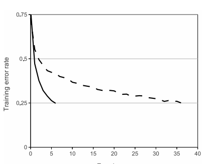
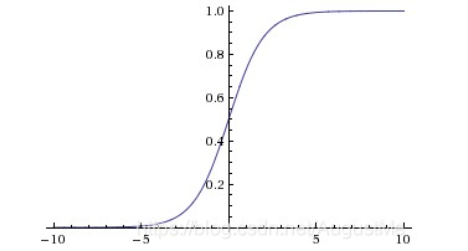
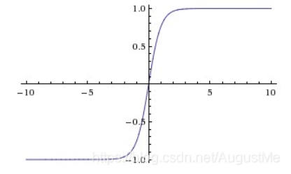
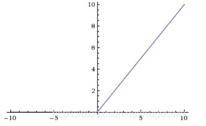
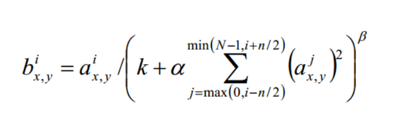
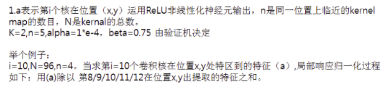
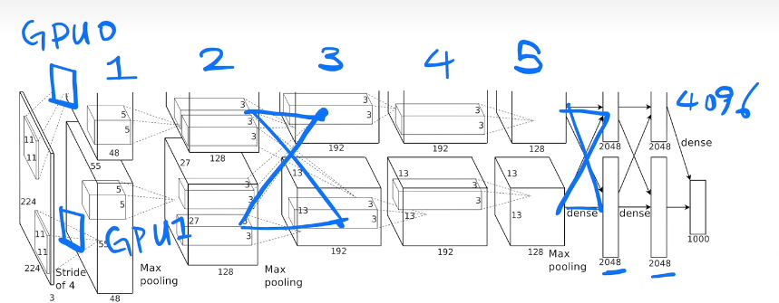
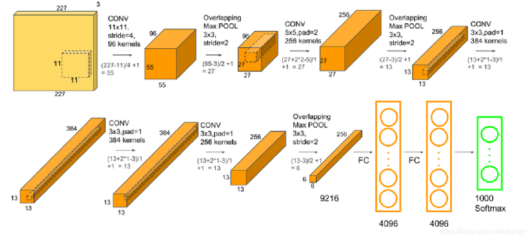
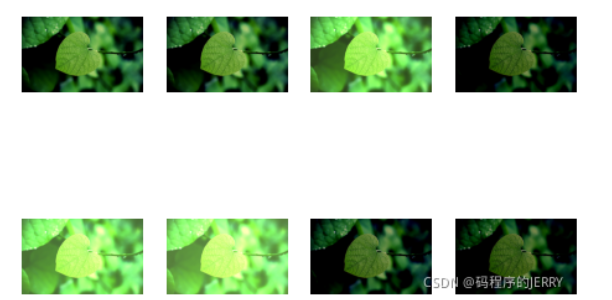
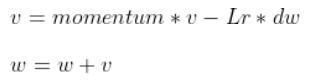

# ImageNet Classification with Deep Convolutional Neural Networks

# 摘要

>  我们训练了一个**大型的深度卷积神经网络**，将ImageNet LSVRC-2010竞赛中的120万张高分辨率图像分为1000个不同的类别。在测试数据上，我们实现了**前1和前5**的错误率分别为37.5%和17.0%，大大优于之前的先进技术。这个神经网络有6000万个参数和65万个神经元，由5个卷积层组成，其中一些是最大池化层，还有3个完全连接的层，最后是1000路softmax。为了使训练更快，我们使用了非饱和神经元和一个非常高效的GPU实现卷积操作。为了减少全连接层的过拟合，我们采用了最近开发的一种称为**“dropout”的正则化方法**，该方法被证明非常有效。我们还在ILSVRC-2012比赛中输入了该模型的一个变体，并获得了前5名的15.3%的测试错误率，而第二名的错误率为26.2%。

top1和top5准确率是什么？

我们在训练完某个分类网络后，假设我们需要分类的数量为50类，我们需要评估它的分类性能。输入测试集的每张图片，会得到它的50个类别的的概率。

- Top-5准确率就是：在这张测试的图片50的类别中，取出概率最大的前五个类别，如果真实类别在这五个类别中，则预测正确，否则预测错误，再测完全部测试集。
  top−5 Accuracy = $\frac{真实类别在预测的五个类别中的数量}{所有测试集的数量}$ 
- 同理：Top-1准确率其实就是平常我们评估预测的准确性指标。
  top−1 Accuracy = $\frac{预测正确的数量}{所有测试集的数量}$ 
- 而Top-5错误率与Top-1错误率恰好与top-5准确率和top-1准确率相反，他们的和为1。
- 显然top5准确率应该要大于top1的准确率，相反，top5错误率要低于top1的错误率。

# 1.介绍

## P1

> 当前的目标识别方法基本使用了机器学习方法。为了提高它们的性能，**1.我们可以收集更大的数据集，学习更强大的模型，并使用更好的技术来防止过拟合。**直到最近，标记图像的数据集相对较小，大约为数万张图像(例如，NORB [16]， Caltech-101/256[8,9]和CIFAR-10/100[12])。使用这种大小的数据集可以很好地解决简单的识别任务，特别是如果它们使用保持标签的转换进行增强。

作者认为，相较于传统的机器学习方法，我们可以使用深度神经网络来提升性能，使用更好的技术防止过拟合。并介绍了在一些**小型数据集**上使用目标识别方法能够达到预期的效果。

> **但现实环境中的物体表现出相当大的可变性，因此要学会识别它们，有必要使用更大的训练集。**事实上，小型图像数据集的缺点已经被广泛认识到(例如，Pinto等[21])，但直到最近才有可能收集具有数百万图像的标记数据集。新的更大的数据集包括LabelMe[23]，它由数十万张完全分割的图像组成，以及ImageNet[6]，它由超过22,000个类别的超过1500万张标记的高分辨率图像组成

然而，作者认为，在现实环境中的物体可变性强，要使用更大的训练集。之后介绍了LabelMe以及ImageNet数据集。

## P2

> 为了从数百万张图像中学习数千个对象，我们需要一个具有大学习能力的模型。然而，物体识别任务的巨大复杂性意味着即使是像ImageNet这样大的数据集也不能指定这个问题，因此我们的模型还应该有大量的先验知识来弥补我们没有的所有数据。卷积神经网络(cnn)就是这样一类模型[16,11,13,18,15,22,26]。**1.它们的能力可以通过改变它们的深度和广度来控制**，并且它们还对图像的性质(即统计数据的平稳性和像素依赖性的局部性)做出强有力且大多数正确的假设。因此，与具有类似大小层的标准前馈神经网络相比，**2.cnn的连接和参数要少得多，因此更容易训练，而它们的理论最佳性能可能只会稍微差一点**。
>

作者认为，为了解决目标识别任务，一是要使用大量的数据集，二是要使用大量的先验知识，即卷积神经网络。

为什么要使用CNN？与标准的前馈神经网络相比，他的参数以及连接数更少，更容易训练，理论上的最佳性能相差无几。

实际上，我们知道CNN与前馈神经网络相比，它主要有两点优点：

1. ==局部感受野。一般认为人对外界的认知是从局部到全局的，而**图像的空间联系也是局部的像素联系较为紧密，而距离较远的像素相关性则较弱。因而，每个神经元其实没有必要对全局图像进行感知，只需要对局部进行感知，然后在更高层将局部的信息综合起来就得到了全局的信息**。==
2. ==权值共享。参数（也就是卷积操作）看成是提取特征的方式，该方式与位置无关。因此，每个神经元都使用相同的参数用于提取特征，减少了了参数个数。==

## P3

> 尽管cnn具有吸引人的品质，尽管其局部架构相对高效，但大规模应用于高分辨率图像的成本仍然高得令人望而却步。幸运的是，当前的gpu，加上高度优化的2D卷积实现，足够强大，可以促进有趣的大型cnn的训练，并且最近的数据集(如ImageNet)包含足够的标记示例来训练这样的模型，而不会出现严重的过拟合。

主要介绍了实现CNN的一些困难，但是由于GPU+卷积+足够的数据集标注，能够有效地实现CNN。

## P4

> 我们的网络包含了许多新的和不寻常的特征，这些特征可以提高其性能并减少其训练时间。即使有120万个标记的训练样例，过拟合依然是一个重要的问题。所以我们使用了几种有效的技术来防止过拟合。我们最终的网络包含五个卷积层和三个全连接层。我们发现删除任何卷积层(每个层包含不超过模型参数的1%)都会导致性能下降。

作者介绍了本文的贡献：在两个比赛上使用了自己的方法取得了最好的结果，并且使用了卷积层+全连接层，并使用了其他方法缓解过拟合的问题。

## P5

最后，介绍了该模型受限于GPU的计算能力以及计算时间，并说明可以从该两个方面进行优化，提升性能。

# 2.数据集

## P1

本段主要介绍了数据集ImageNet以及ILSVRC。

- ImageNet是一个包含超过1500万张标记高分辨率图像的数据集，属于大约22,000个类别。
- ILSVRC使用ImageNet的一个子集，在1000个类别中每个类别中大约有1000张图像。总共大约有120万张训练图像、5万张验证图像和15万张测试图像。

## P2

ILSVRC有两个数据集版本2010与2012，其中2010公开了测试集，因此主要使用该版本。并且介绍了测试的评判标准，top1和top5的错误率。

## P3

> **1.ImageNet由可变分辨率的图像组成，而我们的系统需要恒定的输入维度。因此，我们将图像降采样到256 × 256的固定分辨率。给定一个矩形图像，我们首先重新缩放图像，使较短的边长度为256，然后从结果图像中裁剪出中心的256×256补丁。我们没有以任何其他方式预处理图像，除了从每个像素减去训练集上的平均活动。所以我们在像素的(居中的)原始RGB值上训练我们的网络。**

作者在这个地方对于数据集大小的处理为：将所有的图像设置为256\*256。首先将较短边设定为256，对于较长的边，我们会将其从中心开始进行裁剪。

==实际上，数据预处理的大小以及方法对于最终的结果有较大的影响。在本文中使用了最简单的裁剪，没有考虑到被裁剪掉的图像损失的细节。举个例子，在yolo中使用了**自适应图片缩放**。==

# 3.网络架构

## 3.1 ReLU非线性单元

主要介绍了ReLU，以及使用ReLU这种**非饱和非线性(non-saturating nonlinearity)**比sigmoid这种**饱和非线性(saturating nonlinearity)**快。

- 线性linear，指量与量之间按比例、成直线的关系，在数学上可以理解为一阶导数为常数的函数；
- 非线性non-linear，指不按比例、不成直线的关系，一阶导数不为常数。
- 线性的可以认为是1次曲线，比如y=ax+b ,即成一条直线。非线性的可以认为是2次以上的曲线，比如y=ax2+bx+c，即不为直线的即可。
  

1. 饱和非线性：饱和的激活函数会将输出结果缩放到有限的区间。
   sigmoid激活函数的范围是[0, 1]，所以它是饱和的。
   
   tanh激活函数的范围是[-1,1]，所以它是饱和的。
   
2. 非饱和非线性：非饱和的激活函数会将输出结果缩放到无穷区间。
   对于**ReLU**激活函数f(x) = max(0, x)，当x趋于正无穷则f(x)也趋于正无穷。所以该函数是非饱和的。
   

为什么使用ReLU比sigmoid能够快速下降？

1. 相比Sigmoid和tanh，ReLU摒弃了复杂的计算（这里指的是幂运算），提高了运算速度；
2. 对于深层的网络而言，Sigmoid和tanh函数反向传播的过程中，**饱和区域非常平缓，接近于0，容易出现梯度消失的问题，减缓收敛速度。**Relu的gradient大多数情况下是常数，有助于解决深层网络的收敛问题。
3. ReLU会使一部分神经元的输出为0，这样就造成了网络的稀疏性，并且减少了参数的相互依存关系，缓解了过拟合问题的发生。
   

## 3.2 多GPU训练

使用两个GPU进行训练。

## 3.3 LRN局部响应归一化

对局部神经元的活动创建竞争机制， 使其中响应比较大的值变得相对更大， 并抑制其他反馈较小的神经元， 增强了模型的泛化能力。

1. a表示卷积层（包括卷积操作和池化操作）后的输出结果，这个输出结果的结构是一个四维数组[batch,height,width,channel]，batch就是批次数。

2. height就是图片高度。

3. width就是图片宽度。

4. channel就是通道数，可以理解成一批图片中的某一个图片经过卷积操作后输出的神经元个数(或是理解成处理后的图片深度)。

5. 表示在这个输出结构中的一个位置[a,b,c,d]，可以理解成在某一张图中的某一个通道下的某个高度和某个宽度位置的点，即第a张图的第d个通道下的高度为b宽度为c的点。

6. 论文公式中的N表示卷积核的数量。

7. a,n/2,k,α,β分别表示函数中的input,depth_radius,bias,alpha,beta，其中n/2,k,α,β都是自定义的，

8. **特别注意一下∑叠加的方向是沿着通道方向的**，即每个点值的平方和是沿着a中的第3维channel方向的，==也就是一个点同方向的前面n/2个通道（最小为第0个通道）和后n/2个通道（最大为第d-1个通道）的点的平方和(共n+1个点)。==而函数的英文注解中也说明了把input当成是d个3维的矩阵，说白了就是把input的通道数当作3维矩阵的个数，叠加的方向也是在通道方向。 

9. a表示第**i个核**在位置（x,y）运用激活函数ReLU后的**输出**，n是同一位置上临近的**kernal map的数目**，**N是kernel的总数**。参数K,n,alpha，belta都是超参数，一般设置k=2,n=5,$\alpha$=1*e-4,$\beta$=0.75。

   

## 3.4 Overlapping Pooling重叠池化

在CNN中使用重叠的最大池化。此前CNN中普遍使用平均池化，AlexNet全部使用最大池化，避免平均池化的模糊化效果。**并且AlexNet中提出让步长比池化核的尺寸小，这样池化层的输出之间会有重叠和覆盖，提升了特征的丰富性。**

## 3.5 总体架构

lianggeGPU训练：

将两个整合在一起看：

- conv1:[227,227,3]\*[11,11,227]，stride=4，kernels=96，得到[55,55,96]
- pool1:[55,55,96]\*[3,3,96]，stride=2(overlapping pooling)，得到[27,27,96]
- conv2:[27,27,96]\*[5,5,96],padding=2(same卷积),kernels=256，得到[27,27,256]
- pool2:[27,27,256]\*[3,3,256],stride=2,得到[13,13,256]
- conv3:[13,13,256]\*[3,3,256],padding=1,kernels=384，得到[13,13,384]
- conv4:[13,13,384]\*[3,3,384],padding=1,kernels=384，得到[13,13,384]
- conv5:[13,13,384]\*[3,3,384],padding=1,kernels=256，得到[13,13,256]
- pool3:[13,13,256]\*[3,3,256],stride=2,得到[6,6,256]
- FC1:首先Flatten，然后9216=>4096
- FC2:4096=>4096
- softmax:4096=>1000分类

# 4.减少过拟合

## 4.1 数据增强

### 4.1.1 随机裁剪

> 第一种形式的数据增强包括生成图像平移和水平翻转。我们通过从256×256图像中提取随机的224 × 224块补丁(及其水平反射)并在这些提取的补丁上训练我们的网络来做到这一点。在测试时，网络通过提取5个224 × 224的补丁(四个角补丁和中心补丁)以及它们的水平反射(总共10个补丁)进行预测，并对网络的softmax层在这10个补丁上的预测进行平均。

==前文提到的256\*256是在原始图像的基础上将所有图像设置为这个大小，然后再在256\*256的基础上进行裁剪和水平翻转得到224*224(实际上应该是227\*227)。==

256\*256:将原始数据集缩放到此大小

224\*224(227\*227):数据增强

### 4.1.2 改变训练图像中RGB通道的强度

在AlexNet中介绍了一种基于PCA的色彩增强的方法，效果就是图片的明度（明亮程度）会发生整体的变化，并且没有发生图片结构的改变或色差的明显变化。**该方案抓住了原始图像的一个重要属性，即物体不受光照强度和颜色变化的影响。**

效果如下图:

图像的亮度发生了明显的变化，有的暗，有的亮，而且图片的主要事物的轮廓还是十分清晰，没有发生改变；
事物的主导颜色没有发生变化（上面树叶的主导色绿色没有发生变化）；
图片的相对色差没有发生改变，（原来图片暗的地方和亮的地方的对比度仍然存在）

- 将图片按照RGB三通道进行normalization处理，均值为0，标准差为0.1。值得一提的是，按照RGB三通道进行处理，因为我们进行的是色彩增强，在RGB 三通道的图片中，决定图像色彩的是RGB之间的相对关系，我们不能改变三通道内部的像素值分布。
- 将图片按照channel展平成大小为(?, 3)的X
- 求上述X的协方差矩阵($X^T$X)
- 对协方差矩阵进行特征分解(实对称矩阵对角化得到特征值并求特征向量)

特征向量组成的矩阵是3x3的，特征值乘以抖动系数组成的array是3x1的，所以点乘得到的array 正好是3x1大小的，三个值分别加到原图像的R,G,B三通道上，就是最后得到的增强的图像。

为什么要使用PCA主成分分析？？
因为要保持原图像的相对色差、主要色系和轮廓，我们不能在增强完数据之后让图像本身表达的事物发生改变。
我们是对三通道进行PCA的，协方差矩阵的特征向量表达的是R、G、B三个channel之间的相对关系，比如上面的叶子的图片，绿色占主导地位，色差主要是由绿色体现出来，绿色的色系相对丰富，所以主成分是偏绿色系的。
PCA主成分分析会按照原图像中三各通道内数据的信息量进行权重的划分（即协方差矩阵的特征值大小）。

## 4.2 Dropout

> **1.它包括以0.5的概率将每个隐藏神经元的输出设置为零。以这种方式“退出”的神经元不参与正向传递，也不参与反向传播。**

==Dropout可以作为训练深度神经网络的一种trick供选择。在每个训练批次中，通过忽略一半数量的特征检测器（让一半的隐层节点值为0），可以明显地减少过拟合现象。这种方式可以减少特征检测器（隐层节点）间的相互作用，检测器相互作用是指某些检测器依赖其他检测器才能发挥作用。==

1. 取平均的作用： 先回到标准的模型即没有dropout，我们用相同的训练数据去训练5个不同的神经网络，一般会得到5个不同的结果，此时我们可以采用 “5个结果取均值”或者“多数取胜的投票策略”去决定最终结果。例如3个网络判断结果为数字9,那么很有可能真正的结果就是数字9，其它两个网络给出了错误结果。这种“综合起来取平均”的策略通常可以有效防止过拟合问题。因为不同的网络可能产生不同的过拟合，取平均则有可能让一些“相反的”拟合互相抵消。dropout掉不同的隐藏神经元就类似在训练不同的网络，**随机删掉一半隐藏神经元导致网络结构已经不同，整个dropout过程就相当于对很多个不同的神经网络取平均。**而不同的网络产生不同的过拟合，一些互为“反向”的拟合相互抵消就可以达到整体上减少过拟合。
2. 减少神经元之间复杂的共适应关系： **因为dropout程序导致两个神经元不一定每次都在一个dropout网络中出现。这样权值的更新不再依赖于有固定关系的隐含节点的共同作用，阻止了某些特征仅仅在其它特定特征下才有效果的情况 。迫使网络去学习更加鲁棒的特征 **，这些特征在其它的神经元的随机子集中也存在。换句话说假如我们的神经网络是在做出某种预测，它不应该对一些特定的线索片段太过敏感，即使丢失特定的线索，它也应该可以从众多其它线索中学习一些共同的特征。从这个角度看dropout就有点像L1，L2正则，减少权重使得网络对丢失特定神经元连接的鲁棒性提高。

# 5.训练细节

> 我们使用随机梯度下降训练我们的模型，批量大小为128个样本，动量为0.9，权重衰减为0.0005。
>

实际上应该就是batch_size=128的梯度下降算法。

v表示速度，一般初始化为0；momentum就是引入的动量，一般是设置为0.9。可以理解为，**如果上一次的 momentum(v)与当前的momentum负梯度方向是相同的，那这次下降的幅度就会加大，从而可以加快模型收敛。**

# 讨论

> 我们的研究结果表明，一个大型的深度卷积神经网络能够在一个高度具有挑战性的数据集上使用纯监督学习取得破纪录的结果。值得注意的是，**1.如果移除单个卷积层，我们的网络性能会下降。**例如，删除任何中间层都会导致网络的前1性能损失约2%。所以深度对于实现我们的结果非常重要。

作者认为，如果减少深层神经网络的层数的话，对于结果会造成影响。一个小问题是：层数删了一层结果变差，不一定能说明深度一定是最重要的。实际上，网络层数降低确实可能会影响我们的结果，但是我们也可以增加参数个数也能在一定程度上提升算法的性能。

> 为了简化我们的实验，我们没有使用任何**1.无监督的预训练**，即使我们期望它会有所帮助，特别是如果我们获得足够的计算能力来显着增加网络的大小，而不获得相应的标记数据量的增加。到目前为止，我们的结果已经有所改善，因为我们使我们的网络更大，训练的时间更长，但我们仍然有很多数量级的工作要做，以匹配人类视觉系统的下颞通道。最终，我们希望在视频序列上使用非常大且深度的卷积网络，其中时间结构提供了非常有用的信息，而这些信息在静态图像中是缺失的或不太明显的。

本次实验是监督学习，使用的都是带有标注的图片数据集，而没有使用无标注的数据集。这牵扯到了两种学习模式：

1. 监督学习：数据集带有相应的标注，通过带有标注的训练集得到模型，然后使用测试集进行验证，分析模型的好坏。
2. 无监督学习：数据集不带有标注，需要模型通过训练集自行判断数据的类别并得到模型。

# 总结

创新点：

1. 成功使用ReLU作为CNN的激活函数，并验证其效果在较深的网络超过了Sigmoid，成功解决了Sigmoid在网络较深时的梯度弥散问题。虽然ReLU激活函数在很久之前就被提出了，但是直到AlexNet的出现才将其发扬光大。
2. 训练时使用Dropout随机忽略一部分神经元，以避免模型过拟合。Dropout虽有单独的论文论述，但是AlexNet将其实用化，通过实践证实了它的效果。在AlexNet中主要是最后几个全连接层使用了Dropout。
3. 在CNN中使用重叠的最大池化。此前CNN中普遍使用平均池化，AlexNet全部使用最大池化，避免平均池化的模糊化效果。并且AlexNet中提出让步长比池化核的尺寸小，这样池化层的输出之间会有重叠和覆盖，提升了特征的丰富性。
4. 提出了LRN层，对局部神经元的活动创建竞争机制，使得其中响应比较大的值变得相对更大，并抑制其他反馈较小的神经元，增强了模型的泛化能力。
5. 使用了数据增强，包括随即裁剪+水平翻转，以及修改RGB通道的强度。

不足：

1. 使用的是LRN，但是这个一直饱受诟病。现在一般使用BN。
2. 网络层数较少。
3. 只展示了做的东西以及使用的方法，但没有说明这么做的原因，没有一个合理的解释。也没够关于CNN到底做了什么的解释。