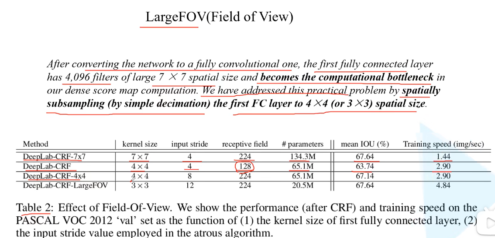
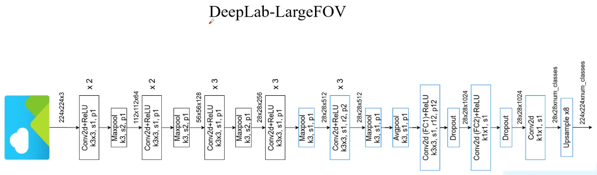
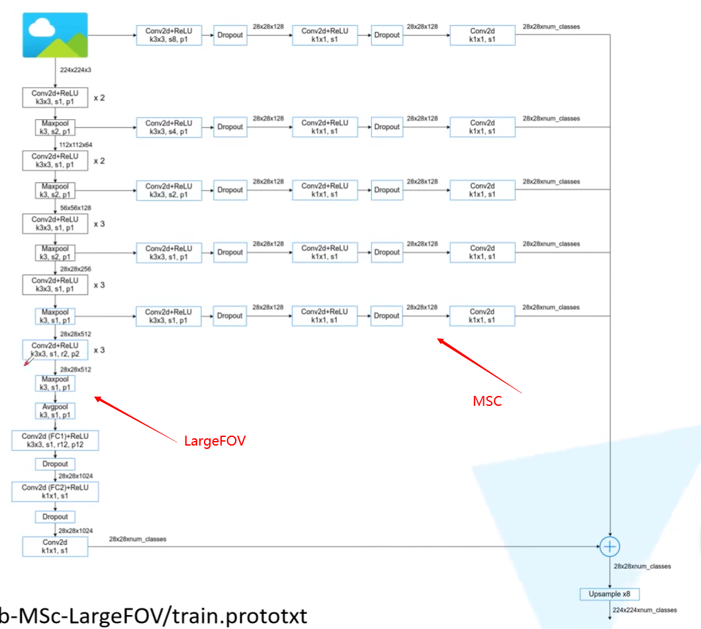

# SEMANTIC IMAGE SEGMENTATION WITH DEEP CONVOLUTIONAL NETS AND FULLY CONNECTED CRFS

# 1.文章概要

## 1.1 背景

在论文的引言部分(INTRODUCTION)首先抛出了两个问题（针对语义分割任务）: **下采样导致分辨率降低**和**空间“不敏感”** 问题。

## 1.2 方法:star:

对于第一个问题信号下采样，作者说主要是采用Maxpooling导致的，为了解决这个问题作者引入了'atrous'(with holes) algorithm（空洞卷积 / 膨胀卷积 / 扩张卷积）。

空洞卷积的作用：

- 扩大感受野：在deep net中为了增加感受野且降低计算量，总要进行降采样(pooling或s2/conv)，这样**虽然可以增加感受野，但空间分辨率降低了。**为了能不丢失分辨率，且仍然扩大感受野，可以使用空洞卷积。这在检测，分割任务中十分有用。**一方面感受野大了可以检测分割大目标，另一方面分辨率高了可以精确定位目标。**
- 捕获多尺度上下文信息：空洞卷积有一个参数可以设置dilation rate，具体含义就是**在卷积核中填充dilation rate-1个0**，因此，**当设置不同dilation rate时，感受野就会不一样，也即获取了多尺度信息。**
- 保持原输入特征图的高度和宽度。**一般都会对padding进行设置（将padding设置为1），这样就能保证输入特征图的高度和宽度不变**。

对于第二个问题空间“不敏感”，作者说分类器自身的问题（分类器本来就具备一定空间不变性），我个人认为其实还是Maxpooling导致的。为了解决这个问题作者采用了fully-connected CRF(Conditional Random Field)方法，**这个方法只在DeepLabV1-V2中使用到了，从V3之后就不去使用了，而且这个方法挺耗时的。**

## 1.3 创新点/优点:star:

相比之前的一些网络，本文提出的网络具有以下优势：

- 速度更快，论文中说是因为采用了膨胀卷积的原因，但fully-connected CRF很耗时
- 准确率更高，相比之前最好的网络提升了7.2个点
- 模型很简单，主要由DCNN和CRF联级构成

## 1.4 缺点

# 2.算法描述

## 2.1 整体架构

### 2.1.1 LargeFOV(Large field of view)

在保证mIOU不下降的前提下，减少模型的参数数量以及提升训练速度。

具体做法是将VGG-16中的FC像FCN那样进行卷积化。**但是这样的话会造成计算瓶颈，使用的kernel size太大。因此，将kernel size调低（3\*3或4\*4），同时filter的数量也会减少（4096->1024个），最终达到了需要的效果。**

其示意图如下：
主要区别就是前面的kernel size修改了一下，以及FC进行卷积化并修改了kernel size，使用了空洞卷积。

### 2.1.2 MSC(Multi-Scale)

融合原图(input image)和前4个Maxpool层的输出。

## 2.2 损失函数:star:

# 3.Training Details

# 4.Inference Details

# 5.实验结果

