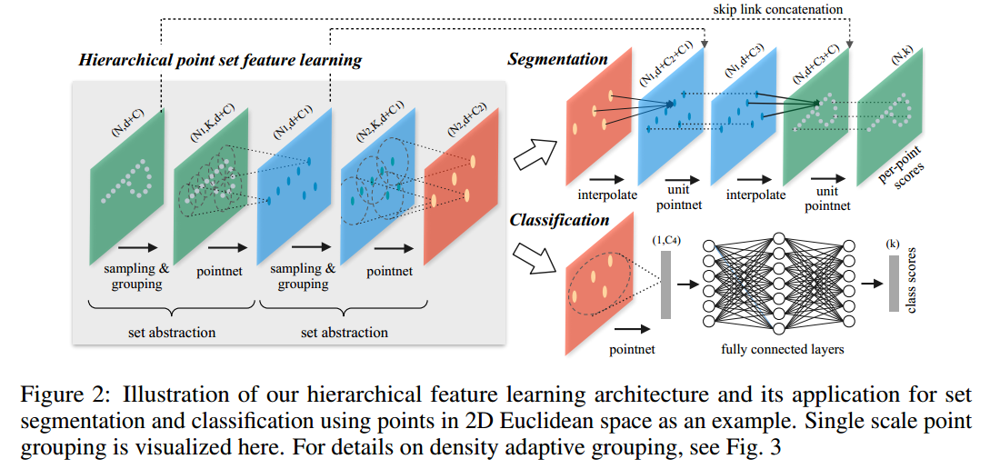
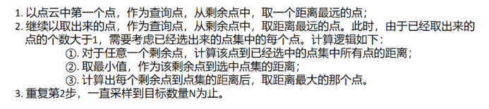
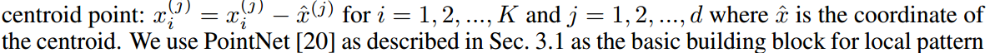
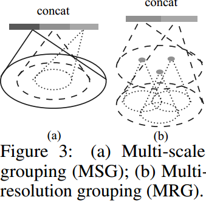
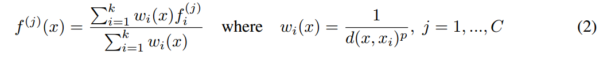

# 标题

# 1.Motivation

## 1.1 related work:smile:

很少有前人研究点集上的深度学习。PointNet是直接处理点集的先驱。**PointNet的基本思想是学习每个点的空间编码，然后将所有单个点的特征聚合成一个全局点云签名**。然而，通过其设计，``PointNet不会捕获由度量引起的局部结构``。然而，利用局部结构已被证明是卷积架构成功的重要因素。

## 1.2 why do this:confused:

从PointNet中的缺点得到启发：

1. point-wise MLP，仅仅是对每个点表征，对局部结构信息整合能力太弱 --> **PointNet++的改进：sampling和grouping整合局部邻域**
2. global feature直接由max pooling获得，无论是对分类还是对分割任务，都会造成巨大的信息损失 --> **PointNet++的改进：hierarchical feature learning framework，通过多个set abstraction逐级降采样，获得不同规模不同层次的local-global feature**
3. 分割任务的全局特征global feature是直接复制与local feature拼接，生成discriminative feature能力有限 --> **PointNet++的改进：分割任务设计了encoder-decoder结构，先降采样再上采样，使用skip connection将对应层的local-global feature拼接**。

## 1.3 创新点/优点:star:

1. 通过基础空间的距离度量将点集划分为重叠的局部区域；
2. 从小邻域中提取捕捉精细几何结构的局部特征。这些局部特征被进一步分组成更大的单元，并被处理以产生更高层次的特征；
3. 解决两个问题：如何生成点集的划分，如何通过局部特征学习器抽象点集或局部特征。

## 1.4 缺点:nerd_face:

# 2.算法描述

## 2.1 整体架构

### 2.1.1 分层点集特征学习( Hierarchical Point Set Feature Learning)

由多个如图所示的set abstraction层组成。集合抽象层由三个关键层组成:**采样层、分组层和点网层**。

- 采样层从输入点中选择一组点，定义局部区域的质心。(产生质心点和半径)
- 分组层然后通过寻找质心周围的“邻近”点来构建局部区域集。（根据质心点和半径选择临近点，创建局部区域集）
- PointNet层使用mini-PointNet将局部区域模式编码为特征向量。（使用pointnet进行特征提取）

set abstraction层的输入与输出：

- 输入：$N \times (b+c)$,该矩阵由N个坐标为d-dim、点特征为C-dim的点组成;
- 输出：它输出一个N\'× (d + c\')矩阵，包含N\'个子采样点，坐标为d-dim，新的c\' -dim特征向量总结了局部上下文。

#### Sampling Layer

最远点采样(Farthest Point Sampling,FPS)的核心思想是**使得所有采样点之间的距离尽可能的远，也就是数据尽可能的离散均匀。**与随机抽样相比，在**相同质心个数的情况下，它具有更好的对整个点集的覆盖。**

注意，如果一选出来的点集中中有多个点，**剩余点到该集合的距离为到该集合各个点距离的最小值。**

- 输入：$N\times (d+c)$
- 输出：$N\times(d+c),N'\times d$

#### Grouping Layer

该层的输入是一个大小为N × (d + C)的点集和一组大小为N\'× d的质心的坐标。输出是大小为N\' × K × (d + C)的点集组，每组对应一个局部区域，==K为质心点的邻域点数==。注意，==K在组之间是不同的==，但是后续的PointNet层能够将灵活数量的点转换为固定长度的局部区域特征向量.

如何根据输入数据点以及在Sampling Layer中选定的N\'个质心进行分组？
**球查询查找在查询点半径内的所有点(在实现中设置了K的上限)。**与kNN相比，球查询的局部邻域**保证了固定的区域尺度，从而使局部区域特征在空间上更具可泛化性**，这对于需要局部模式识别的任务(如语义点标记)是首选。

- 输入：$N\times(d+c),N'\times d$
- 输出：$N' × K × (d + C)$

#### PointNet Layer

在这一层中，输入是数据大小为N\'×K×(d+C)的N\'个点的局部区域。

输出中的每个局部区域由其质心和编码质心邻域的局部特征抽象。输出数据量为N\' × (d + c\')。**即相当于使用了pointnet进行了局部的特征提取。**

首先将局部区域内点的坐标转换为相对于质心点的局部坐标系:
其中x^是质心的坐标，i表示该局部点集的各个点，j表示点的坐标维度。我们使用第PointNet作为局部模式学习的基本构建块。利用相对坐标与点特征相结合的方法可以捕获局部区域的点对点关系。

- 输入：$N' × K × (d + C)$
- 输出：$N'× (d + c')$

### 2.1.2 Robust Feature Learning under Non-Uniform Sampling Density(非均匀采样密度下的鲁棒特征学习)

左图为MSG，右图为MRG。

- MSG：多尺度分类。当点密度降低时，使用**不同的度量获得不同局部区域内的特征并进行拼接。**
- MRG：MSG的计算代价是高昂的，因为要运行多个PointNet。因此使用MRG，避免了这种昂贵的计算，但仍然保留了根据点的分布特性自适应聚合信息的能力。**当密度较低时，图b左边的向量起主要作用，因为他的集合内的点相对更多；当密度较高时，右边向量起主要作用，因为他提取了更加细粒度的特征。类似于CNN。**

### 2.1.3  Point Feature Propagation for Set Segmentation(集分割中的点特征传播)

在特征提取过程中是从Nl-1到Nl层，那么在decoder时从Nl-1到Nl，使用基于k个最近邻的逆距离加权平均进行计算插值点的值，公式如下：

其中d表示两个点的距离，j表示维度，p=2，k=3.
