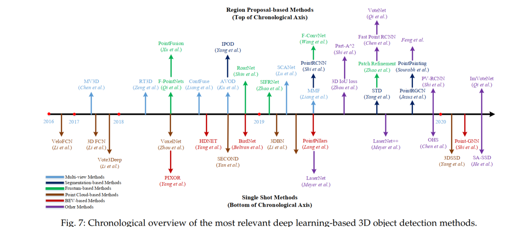

# 路线

## 基于点云的分类

## 基于点云的检测

## 基于点云的分割

# 1 传统方法

在深度学习应用于点云分割领域之前，已经有相当多的方法在尝试点云的分割，这些传统的点云分割方法主要依赖于几何约束和统计规则来人工设计物体的特征，将原始的点云数据分为不重叠的几组区域，来对应场景中的各个对象，虽然效果不太理想，但思想仍然有可借鉴的地方，这些方法可分以下四个方面。

## 1.1基于边缘信息的分割

基于边缘的分割方法是通过识别亮度突变点来识别边缘信息，从而描述物体的形状，再对这些边缘信息点进行分组来确定最终的分割结果。

该方法分割速度较快，但缺点是准确度比较低，对于密度不均匀或稀疏的点云很敏感，还会受到噪声的干扰。

## 1.2基于模型拟合的分割

基于模型拟合的分割是以点云数据的分类和几何形状为基础的，将点云与已知的几何图形进行对比匹配（如圆柱体、圆锥体、球体等）将具有相同数学特征的点划为一类，从而在点云中分割出已知的几何形状，

该方法主要是基于数学原理的分割方法，与基于边缘信息的分割相比，不仅受噪声干扰小，还有较快的计算速度。

## 1.3基于区域增长的分割

以区域为基础的分割方法就是对点云区域进行分割，根据一定的差异准则，将差异性小的点云归为同一区域。具体分为种子和非种子区域方法。

种子区域首先需要选取多个种子点作为起始点，依据设定好的生长规则，在种子周围添加特征相似度高的邻域点，使其邻域空间生长扩散，再以此邻域点作为新的种子点重复以上生长过程。种子区域分割受噪声影响较大，计算时间较长。另外，该方法的分割精度很大程度受初始种子点选取的影响，因此，如何选择合适的初始种子点是该方法的关键点和难点。

非种子区域则是先将空间域所有的点归为同一区域，再对该区域进行进一步细分。和种子区域相比，非种子区域分割的缺点在于难以细分位置，而且存在分割过度的情况，分割的精度对先验知识的要求较高。

## 1.4基于属性的分割

先根据点云属性进行计算，将计算得到的点的属性进行聚类，为每一个点定义一个特征向量，相似的特征向量将会被归于一类，以此来完成分割。

该方法可以较好的解决噪声和异常值的影响，但缺点是对点云密度要求高且计算时间较长。

## 1.5基于图优化的分割

基于图的分割方法通过建立点之间的关系，将点云数据转变为图数据，再对这个图数据进行卷积计算，即选用合适的图卷积神经网络对其进行表征学习。

该方法的优点是图卷积能够聚合物体的点集特征，并且保持其三维空间的平移不变性，但怎么合适地建立点与点之间的关系还是一个待解决地难题。

# 2基于深度学习的方法

随着深度学习的发展，计算机视觉的各个领域已经越来越离不开深度学习。利用深度学习处理2D图像数据的技术已经十分成熟并且取得了很好的效果。近年来越来越多的研究者将目光投向利用深度神经网络处理点云。

二维的数字图像是由像素组成矩阵构成的，很容易的在计算机中进行表示。但三维的点云数据由空间中无序的点构成，很难在计算机中直接处理。因此需要将点云转化适合卷积神经网络(Convolutional Neural Network,CNN)处理的规则结构。

主要有以下方式:基于**投影**、基于**体素**和基于**点**的分割。

## 2.1基于投影的分割

### 2.1.1多视图表示

早期的深度学习方法尝试将3D点云投影到2D平面上，然后基于CNN的网络模型来对数据进行处理。这个方法解决了三维点云数据难以处理的问题，利用CNN提取平面投影的特征，将多视图的平面投影特征聚合在一起，通过全连接层和池化层得到语义分割的结果。

图2.1 基于多视图表示的代表性网络结构

Fig.2.1 Representative network structure based on multi-view approach

由于三维点云被投影到二维图像上会受到不同视点选择和投影角度的影响，导致图像丢失部分可用的空间集合信息，一定程度上会造成分割精度的下降，而这个缺点是该算法难以避免的。

### 2.1.2球状表示

激光雷达扫描后的点云的几何形状类似一个空心圆柱体，从垂直与圆柱体主轴的方向来看空心圆柱时，可以将其理解为一个环绕的平面图像，这样就可用球状投影图像来表示三维点云。

此方法突出特点是速度快，相较于多视图投影，球面投影方式保留了更多的点云信息，但对于多视图存在的遮挡物问题，球面投影方式仍无法解决。

## 2.2基于体素的分割

体素（occupancy voxels）是一种结构化的表示方法，即**将原始的点云数据分成具有一定空间大小的体素**。

图2.2 基于多视图表示的代表性网络结构

Fig.2.2 Representative network structure based on voxel approach

总体来看，体素化表示点云能较好保留原始点云的邻域结构，体素化表示的结构也具有良好的可扩展性，具有较好的分割效果。
但体素化本身会带来离散伪影和信息丢失等问题，虽然点云体素化将点云转变为了规则数据，但选择高分辨率的同事也带来了计算效率低与占用内存大的问题，导致难以选择适合的网格分辨率来满足各方面的均衡。

## 2.3基于点的分割

由于基于投影和基于体素的方法都存在空间信息丢失和结构分辨率下降等局限性，因此需要一种更加有效的方法来处理点云。基于点的分割方法，不仅能够更充分利用点云的几何结构信息，还提升了计算效率。

目前基于点的分割方法大致分为==逐点MLP方法==、==点卷积方法==、==基于RNN的方法==和==基于图的方法==。

图3 基于点云方法的代表性网络结构

Fig.2.3 Representative network structure based on point

### 2.3.1 逐点MLP方法

PointNet：直接在点云数据上进行处理，使用共享多层感知机（MLP）提取输入点云数据中每个点的特征，经由最大池化得到全局特征。其核心在于T-Net网络，先利用第一个T-Net对点云构造转换矩阵进行空间对齐，解决点云转换不变性的问题，再用一个T-Net对点云构造转换矩阵进行特征空间对齐。

PointNet通过点云的全局特征完成了点云的分类与分割，但也忽略了局部特征，后续为了解决这一问题，PointNet++被提出，通过将点分层，在每层内分组来学习特征，这允许网络从更大的局部区域内来逐步学习点特征。另外，为了解决点云中密度不均匀的问题，设计了一种多分辨率组合算法，由两部分向量组成，一部分是对这部分所有点进行特征提取所得到的向量，即为局部的全局特征向量；另一部分是对子集进行特征提取，即为局部的局部特征向量。该算法较好地提升了多尺度组合算法的计算速度。后续的改进也大多集中在如何学习到更为丰富的每个点关联的上下文信息和局部结构，主要发展为以下几个方法，包括相邻特征池，基于注意力的聚合以及局部全局特征串联的方法。

虽然PointNet没有关注局部特征信息，难以适用于复杂或点云密度不均匀的场景，但由于其开创性的思想，为后来的点云语义分割研究提供了很好的借鉴意义。

### 2.3.2 点卷积方法

卷积操作的优点是能够很好的提取规则数据的空间信息，但点云数据本身所固有的不规则性使普通的卷积操作无法直接应用于原始点云数据。

PointCNN：设计了一种Xtransformation先对点云数据进行规则化处理，重新加权和排列各点的相关联特征，保留点云的空间位置信息，然后对处理过的点云进行传统的卷积操作。PointCNN能够利用数据中以网格形式密集表示的空间局部相关性，因此在点云分割和分类上取得了比较好的表现，但在这些点关联的特征上直接求核的卷积会导致部分形状信息的丢失，还存在因点云顺序不同导致计算结果存在差异的问题。

除此之外，也有直接对传统的卷积操作进行改进的方法，Thomas等人[15]提出的核点卷积网络KPConv，将点云空间中的三维点作为卷积中心，坐标点之间的相对位置信息使用欧氏距离，通过多个卷积中心和根据距离赋予每个点不同的权重值来保存实际三维空间的位置信息。通过两种不同的卷积中心，一种刚性的Rigid Kernel处理均匀分布的简单任务，一种可变的Deformable Kernel处理位置变化的复杂任务。 

### 2.3.3 基于RNN的方法

循环神经网络（RNN）用于点云语义分割主要是为了获取点云本身固有的上下文特征，空间上下文信息对于分割性能的提高很重要。

Ye等人[17]提出一种用于非结构化点云语义分割的新型端到端方法，构建了一个高效的金字塔池化模型来提取3D点云的局部信息，再通过一个双向的RNN提取空间的点云全局依赖性。两个RNN通过不同的方向扫描3D空间提取信息，通过使用两个方向上的层级顺序RNN来融合不同尺度的局部信息以获得更大范围的上下文信息，最终达到良好的3D语义分割的效果。但过多的融合局部特征会丢失原始点云的丰富的几何特征。

### 2.3.4 基于图优化的分割

基于图的分割方法，是通过建立点之间的关系，将点云数据转变为图数据，再对这个图数据进行卷积计算，即选用合适的图卷积神经网络对其进行表征学习。

基于图的方法的思想是将点云中每个点视为图的顶点，与其领域点构成图的有向边，以此来捕获点云的底层形状和几何结构。

该方法的优点是图卷积能够聚合物体的点集特征，并且保持其三维空间的平移不变性，但怎么合适地建立点与点之间的关系还是一个待解决地难题。

# 3 3D数据常见的表示方法

## 体素

体素是欧几里德结构的数据，可以与二维图像做对比，一幅图片通常由一个个包含RGB位置等信息的像素组成，而由体素表示生成三维物体通常由若干个立方体规则的在三维空间中放置，并且为了表示三维物体形状在体素中可以存储几何占有率、体积、密度和符号距离等信息以方便渲染，值得注意的是与像素相比，体素本身并不包含位置信息可以借助体素之间的相对位置推导出位置信息。

由于体素表示的规则性，它们与标准卷积神经网络有着配合良好，并且广泛用于深度几何学习。作为先驱3D ShapeNets是首个将体素表示引入到3D场景理解任务中，它提出将三维几何物体表示为体素上二元变量的概率分布。在网络中通过卷积深度置信网络将输入的单视角深度图用三维体素上二元变量的概率分布表示（其实就是通过深度置信网络去判断空间中的一个点是否被三维物体占据，如果被占据则用一个立方体体素表示），而深度置信网络是一类强大的概率模型，通常用于对二维图像中像素和标签的联合概率分布进行建模。然后再通过预测网络和分类网络对生成体素模型进行其他视角的建模和分类。

## 点云

点云是三维空间中点的无序集合可以将其视为3D形状曲面的离散化样本，因此点云具有无序性、点之间的相互作用和变换不变性。

- 点的无序性：点与点之间没有严格的顺序如将两个点交换之后仍然表示同一个点云
- 点之间的相互作用：虽然点云的点是离散的，但是却可以共同组成物体或者环境的轮廓。这意味着点之间不是孤立的，相邻点形成一个有意义的子集。因此，模型需要从点的附近的点捕捉局部结构，以及局部结构之间的相互作用。
- 变换不变性：是点云进行刚性变换（旋转平移）后，再进行输入，输出的分类或者是分割结果不变。

  点云包含了丰富的信息，包括三维坐标X，Y，Z、RGB、分类值、强度值、时间等等。点云可以由深度传感器直接输出，因此在3D场景理解任务中非常流行。尽管它们很容易获得，但点云的不规则性使得它们很难用现有的用于规则网格数据的神经网络进行处理。此外，由于采样变化，底层3D形状可以由许多不同的点云表示。

## 网格（mesh）

多边形网格是非欧几里得数据，表示具有顶点、边和面的集合的形状曲面。与体素相比，网格仅对场景曲面建模，因此更紧凑且占用内存较少。与点云相比，网格提供了模拟点关系的曲面点的连通性。将3D形状表面参数化为2D几何图像，在使用2D CNN处理几何图像，避免了处理3D拓扑。由于这些优点，多边形网格被广泛应用于传统的计算机图形应用，如几何处理、动画和渲染。然而，将深度神经网络应用于网格比应用于点云更具挑战性，因为除了顶点之外，还需要考虑网格边缘。

# 4 总结

点云数据与普通图像相比具有稀疏性、不规则性、无序性等特点，且对算法效率、内存占用等方面的要求较高，传统的算法难以对三维点云数据进行处理和建模。相比传统方法，基于深度学习对点云数据进行特征提取能够应用于更多的场景，分割效果也更好，基于图卷积神经网络的三维点云分类和分割算法也得到越来越多人的关注和研究。

基于点的网络是目前最常用的研究方法，也有一些点-体素或其他表示方式的联合方法也表现出良好的分割性能，多方法的融合为点云分割领域带来了更多的可能性，目前已有一些工作试图结合不同深度学习方法的优点，但还未取得较好的效果。因此，未来对于不同方法之间的融合是点云数据语义分割仍研究的难点和重点。
