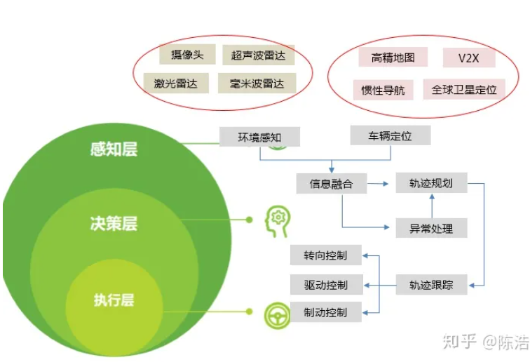
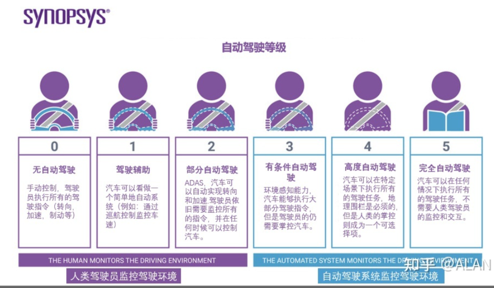

- [SAE发布自动驾驶分级更新版本，还敢说你的车是“自动驾驶”汽车吗？ - 知乎 (zhihu.com)](https://zhuanlan.zhihu.com/p/370060153)
- [自动驾驶等级划分（美国汽车工业协会SAE最新标准） - 知乎 (zhihu.com)](https://zhuanlan.zhihu.com/p/371127787)
- [自动驾驶系统入门（一） - 环境感知 - 知乎 (zhihu.com)](https://zhuanlan.zhihu.com/p/79131539)
- [自动驾驶汽车关键技术|感知 - 知乎 (zhihu.com)](https://zhuanlan.zhihu.com/p/75772265)
- [自动驾驶技术的算法研究需要哪些环境感知的知识？-华夏EV网 (evinchina.com)](https://link.zhihu.com/?target=http%3A//www.evinchina.com/articleshow-311.html)
- [自动驾驶系统入门（三） - 毫米波雷达 - 知乎 (zhihu.com)](https://zhuanlan.zhihu.com/p/92887546)
- [激光雷达与毫米波雷达最本质的区别 - SLAMTEC-Robot Autonomous Localization and Navigation Solution Supplier (Lidar, SLAM, Robot Platform)](https://link.zhihu.com/?target=https%3A//www.slamtec.com/en/News/Detail/59)
- [自动驾驶上的三种感知传感器（激光雷达，毫米波雷达和摄像头）优缺点比较 - 知乎 (zhihu.com)](https://zhuanlan.zhihu.com/p/475856247)

为了得到更加精确的三维信息，激光雷达也一直是自动驾驶感知系统的重要组成部分，尤其是对于L3/4级别的应用。**激光雷达的数据是==相对稀疏（个人理解是指数据比较稀疏，不如图像数据那样都是数据挨在一起）==的点云，这与图像稠密的网格结构差别非常大**，因此图像领域常用的算法需要经过一定的改动才能应用到点云数据。点云感知的任务也可以按照物体检测和语义分割来划分，前者输出三维的物体边框，而后者输出点云中每个点的语义类别。为了利用图像领域的算法，**点云可以转换为==鸟瞰视图==（Bird's Eye View）或者==前视图==（Range View）下的稠密网格结构**。此外，也可以改进深度学习中的卷积神经网络（Convolutional Neural Network, CNN），使其适用于稀疏的点云结构，比如PointNet或者Graph Neural Network。