# Rich feature hierarchies for accurate object detection and semantic segmentation

# 摘要

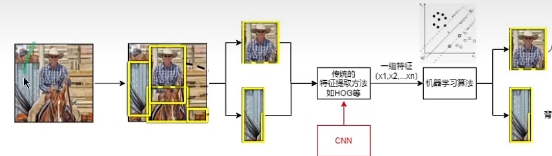

上图是当时传统的目标检测算法，主要是步骤为：

1. 先从图像中提取一系列的区域，得到大量的区域；
2. 使用传统的特征提取方法提取特征；
3. 将特征表示为1维向量，并使用预训练好的机器学习算法对其进行分类。

由于当时AlexNet的发表，使得人们对于CNN开始感兴趣。因此是否可以使用CNN进行特征提取并分类。

摘要大致分为3个部分：

1. 目标检测的传统思路受到了限制，当时表现最好的方法是复杂的集成系统，它通常将多个低级图像特征与高级上下文相结合。
2. 因此，作者提出了R-CNN，主要有两点创新：
   1. 使用CNN替换传统的特征提取方法；
   2. 由于当时的数据集较少，因此作者采用微调的方法，即迁移学习来调整参数。
3. 使用R-CNN与Overfeat比较。

# 1.介绍

## P1

> 过去十年，各种视觉识别任务的进展在很大程度上是基于SIFT[26]和HOG[7]的使用。但是，如果我们看看经典视觉识别任务PASCAL VOC对象检测[12]的性能，人们普遍认为，2010-2012年期间进展缓慢，通过构建集成系统和采用成功方法的微小变体获得了很小的收益。

目标检测的传统思路受到了限制，发展缓慢。

## P2

> SIFT和HOG是块方向直方图，我们可以大致将其与灵长类视觉通路的第一个皮层区域V1的复杂细胞联系起来。但我们也知道，识别发生在下游的几个阶段，这表明可能存在分层的、多阶段的计算过程，这些过程对视觉识别来说甚至更有信息。

试图解释为什么传统方法受限。

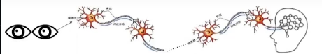

使用生物学角度解释，人类认识物体是通过多个神经元才能够传输到大脑。二传统方法可能只能够实现前几层神经元，只能识别一些低级的特征，而一些高级的、具有强烈的特征难以识别。

## P3-P4

介绍CNN的发展历史。

## P5-P6

CNN在ImageNet数据集上表现良好，说明CNN能应用在图像识别上。然后，**引出本文讨论的内容：在图像识别上表现良好，能否推广到目标检测？**

图像识别：输入图像，判断该图像的类别（单个类别）；
目标检测：输入图像，判断该图像中的类别，并找出每个目标的位置（多个类别）。

需要解决两个问题：

- 使用CNN定位目标；
- 用少量带注释的检测数据训练出高容量模型。

## P7-P8

解决第一个问题：如何使用CNN定位目标。

之前的两个方法：

1. 将定位定义为回归问题。这种方法的效果不佳；
2. 使用滑动窗口探测器。然而该方法为了保持高空间分辨率，使用的层数较少。作者也使用了该方法，但是使用时输入图像大小为195\*195，stride维32，因此在该滑动窗口检测器中精确定位十分困难。

解决方法：recognition using regions”，即使用区域识别。步骤如下图：

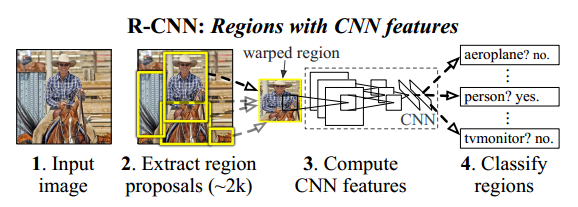

1. 输入图像；
2. 抽取大约两千张区域候选；
3. 使用大型卷积神经网络进行计算，提取候选中的特征；
4. 使用特定的分类器进行分类，得到原始图像中的目标类别。

## P9

解决第二个问题：用少量带注释的检测数据训练出高容量模型。

- 传统方法：使用无监督预训练，然后进行监督微调。
- **本文的方法：先在大型的数据集ILSVRC上进行监督预训练，然后再在小数据集PASCAL上进行微调，即使用到了==迁移学习==的思想。**

## P10-P12

说明了RCNN的高效性，缺点以及可以及将其拓展到语义分割领域。

# 2.使用R-CNN进行目标检测

## 2.1 模块设计

### 2.1.1 区域候选

> 有很多种区域候选算法，通过将CNN应用于规则间隔的方形作物来检测有丝分裂细胞，这是区域建议的特殊情况。**而R-CNN对特定区域提议方法是不可知的，因此采用selective search的方法。**

[什么是Selective Search算法？](https://blog.csdn.net/weixin_43694096/article/details/121610856?ops_request_misc=%7B%22request%5Fid%22%3A%22168966446216800182730908%22%2C%22scm%22%3A%2220140713.130102334..%22%7D&request_id=168966446216800182730908&biz_id=0&utm_medium=distribute.pc_search_result.none-task-blog-2~all~top_positive~default-1-121610856-null-null.142^v88^insert_down1,239^v2^insert_chatgpt&utm_term=selective search算法&spm=1018.2226.3001.4187)

在**two-stage**目标检测算法中，一般先要产生**候选区域(region proposal)**。在图片上使用穷举法或者滑动窗口选出所有物体可能出现的区域框，就是在原始图片上进行不同尺度不同大小的滑窗，获取每个可能的位置。而这样做的缺点也显而易见，复杂度太高，产生了很多的冗余候选区域，而且由于不可能每个尺度都兼顾到，因此得到的目标位置也不可能那么准，在现实当中不可行。**而选择性搜索有效地去除冗余候选区域，使得计算量大大的减小。**

Selective Search的思想：

1. 我们没法事先得知物体的大小，在传统方法中需要用不同尺寸的矩形框检测物体，防止遗漏。而 Selective Search 采用了一种具备层次结构的算法来解决这个问题；
2. 检测的时间复杂度可能会很高。Selective Search 遵循简单即是美的原则，只负责快速地生成可能是物体的区域，而不做具体的检测；
3. 采用多种先验知识来对各个区域进行简单的判别，避免一些无用的搜索，提高速度和精度。
   

步骤：
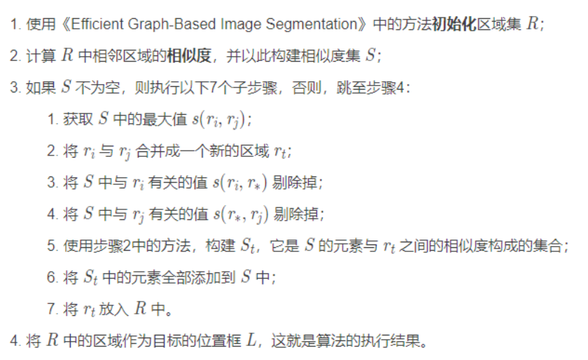

将相似度度量公式分为四个子公式，称为互补相似度测量(Complementary Similarity Measures) 。**这四个子公式的值都被归一化到区间 [0, 1] 内。**

### 2.1.2 特征提取

使用AlexNet进行特征提取。由于只需要提取特征不需要进行预测，因此只是用了5个卷积层以及两个全连接层，最后一层的softmax层没有使用，因此输出为4096维。

经过了上一步的候选区域生成后，为了保证输入的大小一致，均为227\*227，要对候选区域进行处理，使用了最简单测处理算法。
同时，**在得到候选区域后、提取特征前，不会将候选区域直接截取下来，而是会截取比该区域更大一些的区域。原因是为了更多地使用区域角落的特征。这里选择p=16，是因为AlexNet最终缩放了32倍，所以p=16能被32整除。**

候选的大小转换：

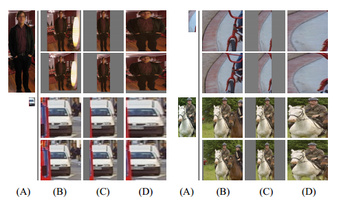

- (A):原始输入的候选区域；
- (B):将长边缩放为227，短边按照相应比例缩放，并填充；
- (C):只针对候选区域进行缩放，并填充；
- (D):**两条边都转换成227，会发生一些形变（本文采用的方法）。**
- 对于每个例子，上面一行没有使用padding，下面一行使用了padding。

## 2.2 测试算法流程

 流程：

1. 使用selective search生成大约2000个候选区域；
2. 对候选区域进行维度转换并添加padding；
3. 使用CNN进行特征提取，并使用SVM进行2分类；
4. 使用非极大值抑制(NMS)删除唱过阈值的重叠预测框。

本节主要说明CNN的两大优点：局部连接和权值共享，这样使用的参数相比于其他方法会很少，提高了效率。

## 2.3 训练

### 2.3.1预训练与微调

使用在ImageNet上进行训练，得到一个预训练模型。然后，修改最后一层的sonftmax为20(PASCAL VOC的类别)+1(背景)类。同时，**规定标注框与生成的候选区域的IoU≥0.5为正样本，否则为负样本，**并设置学习率为原始的1/10，之后开始训练。

==注：==

1. ==Ground Truth不是正样本。正负样本是根据产生的候选区域与Ground Truth的IoU是否大于阈值来定义的；==
2. ==正样本指的是我们需要检测的物体，负样本指不包含任务所要识别的目标的图像。训练负样本的目的是为了降低误检测率、误识别率，提高网络模型的泛化能力。通俗地讲就是告诉检测器，这些“不是你要检测的目标”。==

1. ====

### 2.3.2 目标类别分类

使用SVM进行分类。同理，我们需要先训练才能得到SV模型。**与在CNN中不同的是，这里只有标注框标注的才是正样本，而IoU小于0.3的为负样本。**

此处有两个问题：

1. ==为什么CNN和SVM对于正负样本的定义不一致？==
2. ==在CNN中已经有了21分类，为什么还要训练SVM进行二分类？==

1.作者一开始并没有在PASCAL数据集上微调，而是直接使用ImageNet训练得到的模型并使用提取的特征训练SVM，此时IoU为0.3。之后使用微调时，将CNN的IoU也设置为0.3，发现效果较差，发现0.5对于CNN是最好的。

原因：在SVM中，**只有标注框才是正样本**，因此数据量较少。而在CNN中，**只要IoU≥0.5就是正样本，这样的话多了很多的“抖动”样本，正样本的数量会扩大很多，就防止了CNN的过拟合问题**，因此效果更好。

2.作者认为，使用CNN进行分类的话，微调中使用的**正例没有强调精确的定位**，以及softmax分类器是在**随机抽样的负例上训练的，对于一些比较嫩分类的图像检测效果较差**，因此精确度会降低。即，对于正例，其位置不够精确；对于负例，CNN预测出错的“难负样本”可以挑出再次使用SVM训练。

# 3 可视化，消融实验以及错误的可能性

## 3.1 可视化学习到的特征

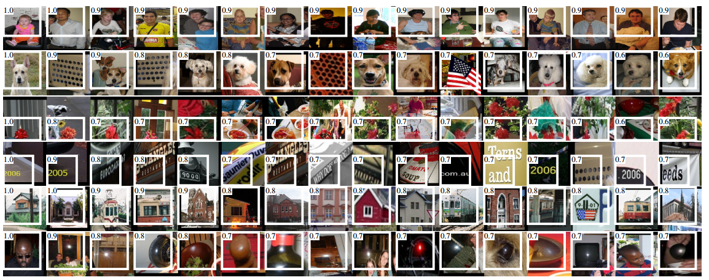

在第5个卷积层的pooling后，得到6\*6\*256的输出。选择6个通道，每个通道按照某个点的值从高到低排序，并挑选值最大的16个值进行可视化展示。

可以发现，6\*6\*256上的每个点可以映射到原始图像的192\*192。==在每个高层的通道中，不同通道学习不同的特征，同一通道学习相同的特征，每个值所对应的原始区域不同。比如，第一行学习到的都是人的特征，第二行主要是狗。第一行不同点所对应的感受野不同。==

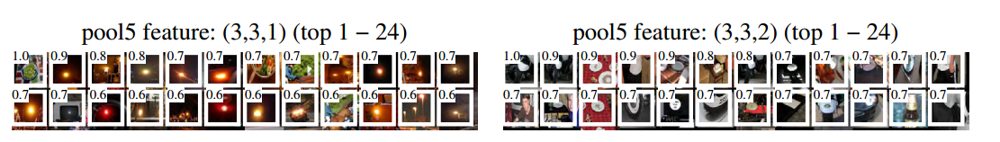

附录中的图也说明了该点，表明在高层神经网络中，不同通道学习不同的、具有明显特征的特征。

## 3.2 消融学习

在上述实验中，使用的是最后一个4096维的数据代表区域候选的特征。那么能否使用前一个4096维或者前一个pool5代表呢？同时，对比了使用以及不使用微调的模型精度。

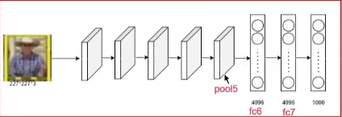

实验结果如下：

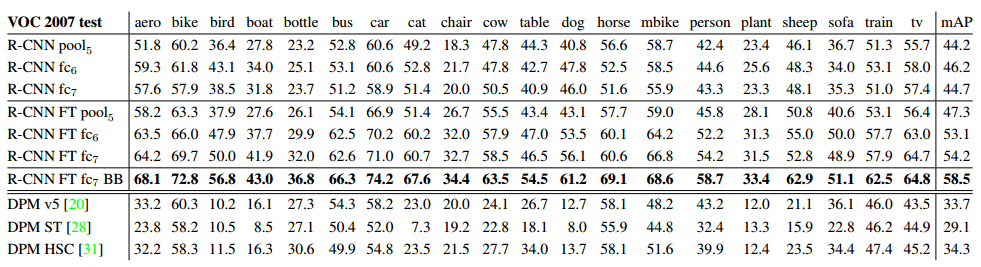

其中，前3行表示不使用微调，4-6行表示使用微调。并且使用不同层的结果作为特征提取的结果。

**实验表明，使用微调的效果更好，使用更加高层的特征作为提取到的结果也更好。**

## 3.3 网络架构

将AlexNet替换成了VGG网络，VGG网络拥有更深的层数以及更多的参数，实验结果发现性能更好，但是所消耗的时间更多。

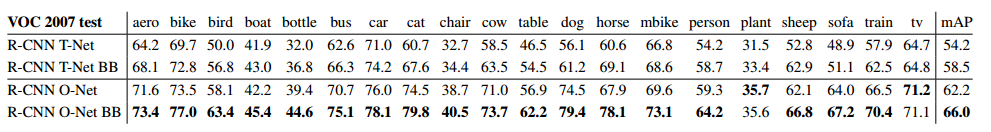

T-Net表示AlexNet，O-Net表示VGG。

## 3.4 误差分析

使用不同层的特征以及使用改进后的R-CNN BB方法所得到的假正例（识别为真，实际为假）的情况：

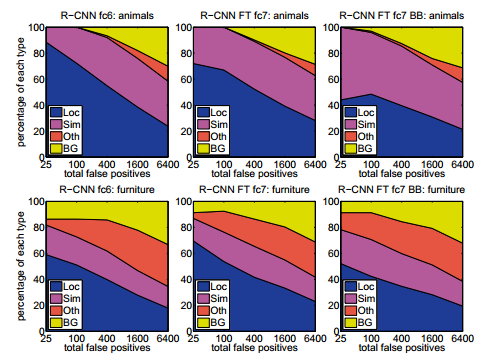

- Loc：检测结果类别正确，但与真实框的IoU在0.1-0.5之间，即偏离了真实框；
- Sim：把目标错误的识别成了相似的类别；
- Oth：识别出了完全不相关的类别
- BG：识别出了背景。

观察发现，大部分的错误都是R-CNN的定位不准确，这说明R-CNN的候选框生成算法所产生的位置不准确，会带来较大的误差，因此提出了R-CNN BB算法，发现蓝色区域比例下降。

## 3.5 Bounding-box regression

针对R-CNN产生的候选区域位置不准确的问题，作者对其加以改进，使用了R-CNN BB算法，通过**额外训练一个模型SVM，将预测框尽可能的像GroundTruth靠拢，降低误差。**

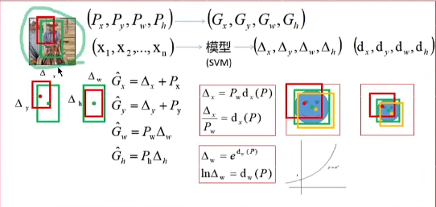

如图，红框为预测框，绿框为真实框，黄框为使用该算法调整后的预测框。我们要做的就是：**额外训练一个模型，使得移动后的黄框尽可能的接近绿框。**

假设P为红框，G为绿框，$\hat G$为调整后的黄框。x,y,w,h分别表示框的中心点坐标，宽和高。x表示提取到的特征。因此，**我们就能通过提取到的特征以及红绿框的位置，训练出模型将红框进行移动。**

假设$\Delta_x,\Delta_y为红框到黄框移动大小，\Delta_w,\Delta_h为红框到黄框宽和高的缩放比例$。那么我们的转换公式如图左边所示，只需要训练出这四个$\Delta$值即可。

然而，作者并不直接这样做，而是使用了如图所示的公式：

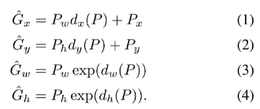

比较后发现，$d_x=\frac{\Delta_x}{P_w}$，表示归一化后的偏移量。同理，$\Delta_w=e^{d_w}，两边取对数，得到:ln\Delta_w=d_w$。==为什么不直接训练$\Delta,而是训练d$？==

原因如下：

1. 对于$\Delta_w$，她表示的是缩放比例，因此一定是一个正值。若如果直接使用SVM预测，那么可能会预测出负值，这是不合理的。而如果预测$d_w$，因为它是对数，最后计算$\Delta_w$是要取指数，因此一定是正值。**所以保证了缩放比例一定是正值。**
2. 对于$\Delta_x$，我们记t为红框与绿框的偏移量。那么我们就需要使得$(\Delta_x-t)^2$的值尽可能的小。
   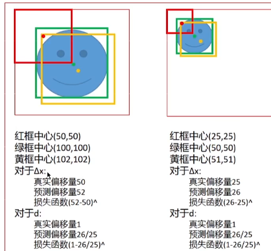
   如图所示，虽然这两张图大小不一样，**但是他的偏移程度是一致的，只是数值不同。那么他们的损失值应该相等。**然而，如果我们训练$\Delta_x$，发现他们的**损失值不同，这是不利于模型训练的。**==因此，训练$归一化后的d_x$，发现得到的损失值相同。==

# 总结

R-CNN是目标检测领域的经典之作，他针对目标检测领域发展停滞不前的问题，提出了R-CNN框架，打破了这个难题，推动了这一领域的发展。

创新点：

1. 受到AlexNet等启发，将CNN从图像识别领域推广到了目标检测领域，使用CNN推动了目标检测领域的发展；
2. 提出R-CNN框架：在候选区域生成方面，使用Selective Search的方法，有效地去除冗余候选区域，使得计算量大大的减小；在特征提取方面，使用CNN提取生成的候选区域中的特征；在分类方面，不直接使用CNN的分类结果，而是训练一个分类器进行分类，能够降低CNN的定位不精确以及难假例难以分类的问题。提升了模型精度；
3. 针对产生的候选区域框定位不精准，导致模型结果不够优秀的问题，提出了R-CNN BB。通过提取到的特征额外训练一个分类器，将产生的预测框向Ground Truth靠拢，提升了准确率。

不足：

1. 训练是多阶段的。R-CNN首先需要进行微调来训练一个CNN提取特征，然后再训练SVM进行分类，此外还需要额外训练一个SVM进行预测框位置调整。
2. 训练消耗时间以及存储空间。
3. 在检测目标时速度较慢。
