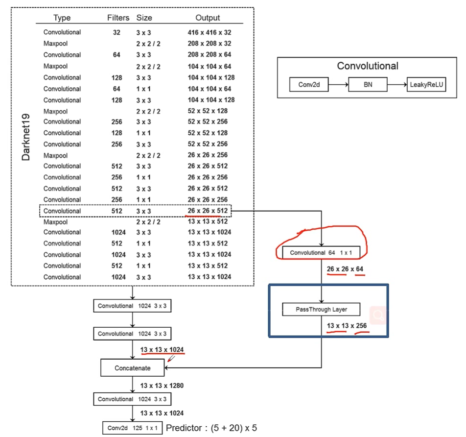
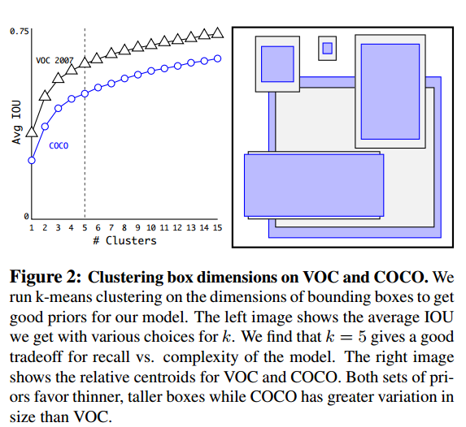
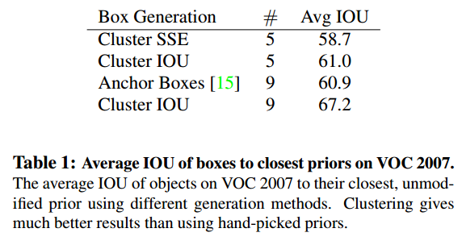
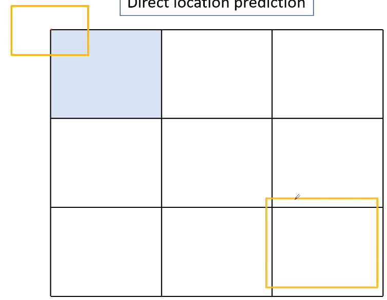
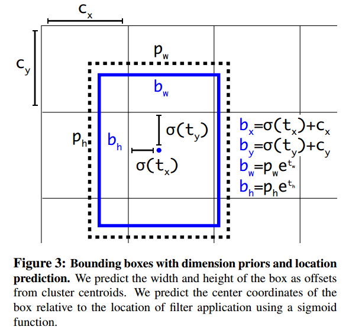
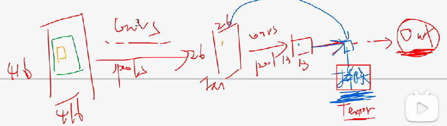
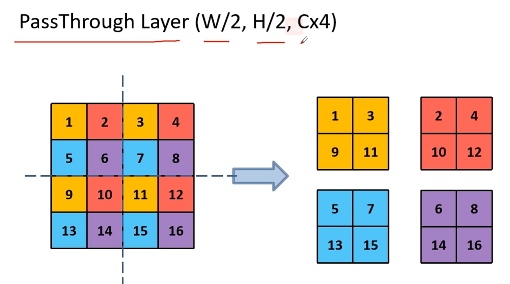
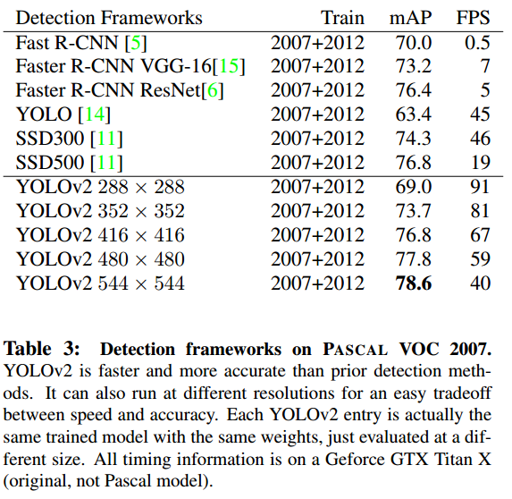
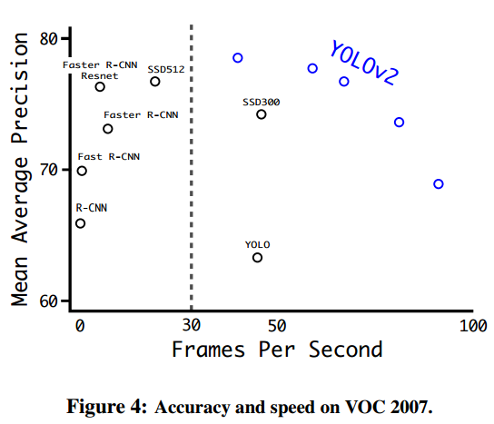

# YOLO9000:Better, Faster, Stronger

# 1.文章概要

## 1.1 背景

1. YOLOv1是单尺度训练(448\*448)，而YOLOv2是multi-scal training。
2. 在前人的基础上进行改进与优化。
3. 检测小物体困难。
4. 相比于分类数据集，目标检测数据集的数量更少。

## 1.2 创新点/优点:star:

1. YOLOv2模型可以在**不同的尺寸(multi-scale)**上运行，在**速度和准确性之间提供了一个简单的权衡**。

2. 解决YOLOv1中的定位较差以及低召回率的问题。

3. 我们简化了网络，然后使其表示更容易学习。

   

## 1.3 不足

1. 每个框只能预测一个类别。
2. 难以处理多物体中心在同一cell的情况。
3. 没有使用到细粒度特征，对预测小物体有一定难度。

# 2.算法描述

## 2.1 整体架构

## 2.2 Better

### 2.2.1 Batch Normalization

==批标准化，防止梯度消失或爆炸。==

### 2.2.2 High Resolution Classifier

高分辨率分类。YOLOv1中是224\*224预训练，然后448\*448检测。而v2中**统一了训练和检测的尺寸，直接全部都使用448\*448**，提升了4%mAP。==使用更加高的分辨率，在预训练是能够提取更多的特征，因此提升了性能。==

### 2.2.3 Anchor Boxes

在v1中预测bbox是根据训练数据来预测的。**v2吸收了Faster R-CNN的经验，使用了Anchor Boxes。**虽然使用该方法略微**降低了mAP，但是提升了recall**（漏检降低了，误检提升一点很正常）。

**去掉了v1中的FC层**，使用anchor boxes进行预测bbox。

1.  首先我们消除一个池化层，使网络的卷积层的输出具有更高的分辨率。
2.  将输入图像从448\*448改成了416\*416。==因为需要得到一个奇数大小的特征图，这样如果是一个大物体，他就可能由一个grid cell进行预测。如果是偶数的话，就有可能由周围的4个cell进行预测，降低了冗余。==在v2中，416经历了32倍的卷积池化压缩，得到13\*13的特征图。

### 2.2.4 Dimension Clusters聚类

根据训练集的GT**使用k-means算法**进行聚类得到初始的anchor boxes大小。==如果实现选择更好的先验框，我们可以使网络更容易学习预测好的bbox。==
k=5时效果最佳。因此每个cell有5个anchor boxes，而v1中只预测2个。

**如果我们使用欧氏距离的标准k-均值，则较大的盒子比较小的盒子产生更多的误差**。然而，我们真正想要的是导致良好IOU分数的先验，这与盒子的大小无关。因此，使用的距离度量为：$d(box,centroid)=1-IOU(box,centroid)$。

**结果发现，短而宽的盒子越来越少，而高而薄的盒子越来越多。**

下图表明，使用k-means来生成边界框可以更好地表示模型，并使任务更容易学习。

### 2.2.5 Fine-Grained Features直接预测坐标位置

**如果使用Faster R-CNN的方法，那么这个物体的中心点可能会移动出当前所在的cell。**因此，遵循v1中的方法，==即预测相对于网格单元的位置的位置坐标，而不是预测偏移量。==

在Faster R-CNN中，预测值为：$x=(t_x*w_a)+x_a,y=(t_y*h_a)+y_a$。显然这里面的**$t_x,t_y$都没有被限制，可能导致预测框跑到当前cell外。**

因此进行改进：$b_x=\sigma(t_x)+c_x，b_y=\sigma(t_y)+c_y$。这样的话，**$\sigma(t_x),\sigma(t_y)$一定会被缩放到0-1之间，所以预测的框不会超出当前的grid cell，让每个先验框(anchor box)预测目标中心落在当前cell的目标。**对于$t_w,t_h和t_o$，是因为宽高以及置信度一定为正数，**因此使用log的形式保证这三个数一定大于0。**

在v2中，网络为每个bbox预测5个值：$t_x,t_y,t_w,t_h,t_o$，并且通过上述的计算公式得到最终的bbox坐标以及置信度。

### 2.2.6 Fine-Grained Features细粒度特征

v2在13 × 13的特征映射上预测检测。虽然这对于大型对象来说已经足够了，**但是对于较小的对象，它可能会受益于更细粒度的特性**。简单地添加一个passthrough layer，以**26 × 26*的分辨率从先前的层中获得功能。就是通过将相邻的特征叠加到不同的通道而不是空间位置来连接高分辨率特征和低分辨率特征。相当于ResNet，使用了残差映射，融合了低阶和高阶特征。

具体做法：先使用1\*1卷积降低特征维度为64，然后使用如下方式操作：

这样，高宽地缩小一半，通道扩大4倍，就可以和13\*13的feature map进行特征维度叠加了。

### 2.2.7 multi-scale training

我们希望YOLOv2对不同大小的图像具有**鲁棒性**，因此采用**多尺度训练**。**在训练阶段，每10个batch我们的网络随机选择一个新的图像尺寸。**由于我们的模型将样本降低了**32倍(5次下采样)**，因此最小的选项是320 × 320，最大的选项是608 × 608。因此，对于不同的输入尺寸，**只需要修改对最后检测层的处理就可以重新训练。**这样提升了网络的泛化能力，具有鲁棒性。

## 2.3 Faster

### 2.3.1 Darknet-19

使用了Darknet-19的基础骨干网络。19个卷积层以及5个池化层。

### 2.3.2 Training for classification

训练细节。首先在ImageNet 1000分类中使用224\*224预训练得到模型，然后微调，修改模型输入为448\*448。

### 2.3.3 Training for detection

检测细节。在Darknet-19的基础上**删除了最后的卷积层、池化层以及softmax层**，因此此时只有18层。然后**再添加了3个3\*3的卷积层，最后再添加1\*1的卷积层，他的输出就是我们需要的检测的大小。**这个卷积层为1\*1\*125，其中125=(5+20)\*5，分别表示**5个坐标、20个类别以及5个bbox。**

# 3.实验结果

和之前的方法相比，v2的mAP以及FPS均更高，说明该模型十分优秀。

