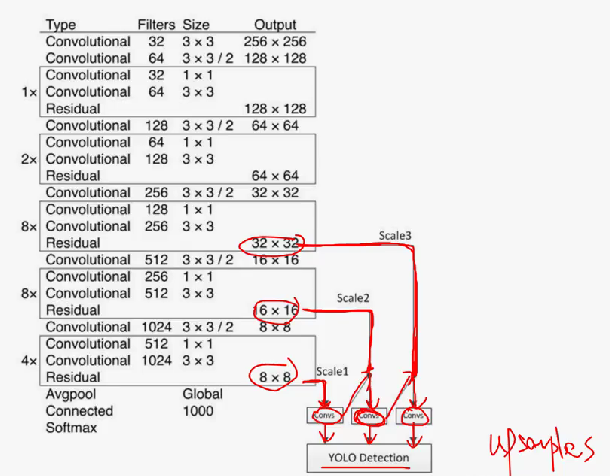

# YOLOv3: An Incremental Improvement

# 1.文章概要

## 1.1 背景

在v2的基础上加以改进。

## 1.2 方法:star:

1. **每个框使用多标签分类预测边界框可能包含的类。**v1:使用cell预测类别，7\*7\*2\*(5+20)。v2：使用anchor box，7\*7\*(5\*5+20)。v3:每个bbox都能预测类别，7\*7\*9\*(5+20)。**这样就解决了不同物体中心落在同一个cell中的情况。**
2. 将**最后的分类从softmax变为多个二分类**，因此损失函数改变。
3. **YOLOv3在3个不同的尺度上预测bbox。**这样通过不同大小的feature map的输出分别进行预测最后在综合，==该方法允许我们从上采样特征中获得更有意义的语义信息，并从早期的特征映射中获得更细粒度的信息。==

## 1.3 创新点/优点:star:

1. 每个框都能预测所有类别，而不是像之前v1和v2只能预测某个类别。
2. 可以预测多物体中心在同一cell的情况。
3. 使用了多尺度预测，结合了细粒度特征，对预测小物体有一定帮助。

## 1.4 缺点

- 还是不能准确地将bbox和目标物体对齐。

# 2.算法描述

## 2.1 整体架构

## 2.2 Bounding Box Prediction

与v2版本相同。其中的$p_w,p_w$表示anchor box，虚线框。$b_w,b_h$为v3预测的bbox，为蓝色框。**不直接回归中心点坐标数值，而是回归相对于格点左上角坐标的位移值。**

- **$c_x,c_y$表示的是当前grid cell的左上角相对于特征图左上角的坐标。**

- $(b_𝑥,b_𝑦)$ 表示bbox 的中心坐标。

- $(b_𝑤,b_ℎ)$ 表示bbox的宽高。

  

## 2.3 Class Prediction

**每个框使用多标签分类预测边界框可能包含的类。**我们没有使用softmax，最后的分类从softmax变为多个二分类。在训练过程中，我们使用二元交叉熵损失进行类预测。==使用softmax强制假设每个bbox只有一个类，而事实往往并非如此。多标签方法可以更好地为数据建模，说明每个bbox都有可能属于某个类别。==

## 2.4 Predictions Across Scales

YOLOv3在3个不同的尺度上预测bbox。

如图，不使用Darknet-53最后的池化层、FC以及softmax，而是分别使用8\*8,16\*16,32\*32这3个**不同尺度的feature map进行预测并综合。**8\*8直接进行卷积并预测输出。16\*16不直接预测，而是将8\*8的feature map先上采样，然后再merge，再进行预测。==该方法允许我们从上采样特征中获得更有意义的语义信息，并从早期的特征映射中获得更细粒度的信息。==

由于有3个尺度，并且每个尺度预测3个bbox，因此一共有9个bbox。同样还是使用聚类先得到先验框的大小。输出的大小为N\*N\*[3+(4+1\*C)]。其中的**N代表feature map的大小，如8\*8的特征图中N\=8。**由于尺度不同，因此预测的框也不同。**feature map越小，其感受野越大，因此更倾向预测大的框。**

最后的预测详情图如下（注意这个图的输入大小为416，与Darknet-53不一样）：

# 3.实验结果

在COCO数据集上的结果，评估指标为mAP0.5:0.95。可见，v3检测的速度非常快，并且准确率也较高。
