# self-attention

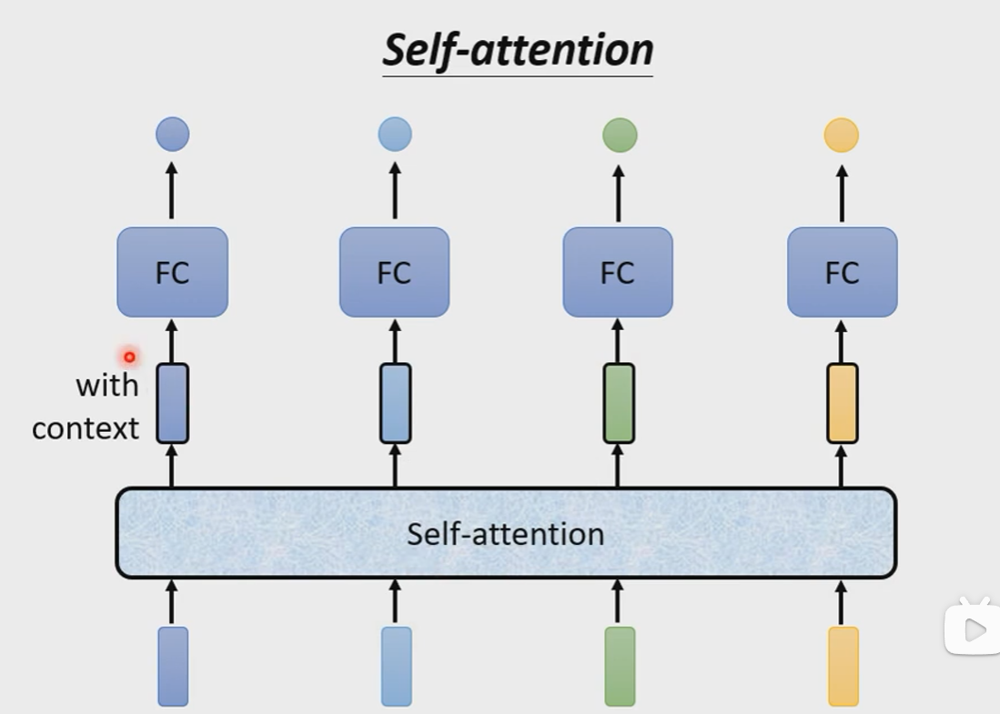

输入几个vector，经过self-attention就会输出几个vector。自注意力机制会考虑**一整个Seq后才会输出vector。**

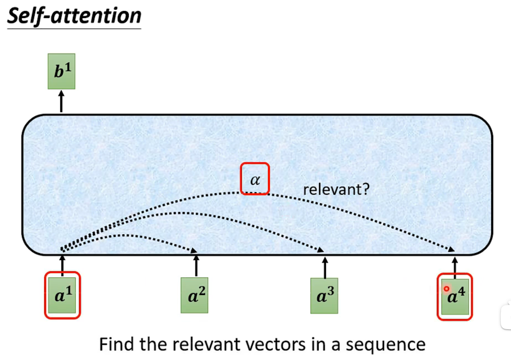
如图，$b^1$是由$a^1$以及与其相关的某些输入而得到的输出结果。我们会使用一个参数$\alpha$来表示每个输入之间的关系，即**相关度。**

如何计算α？
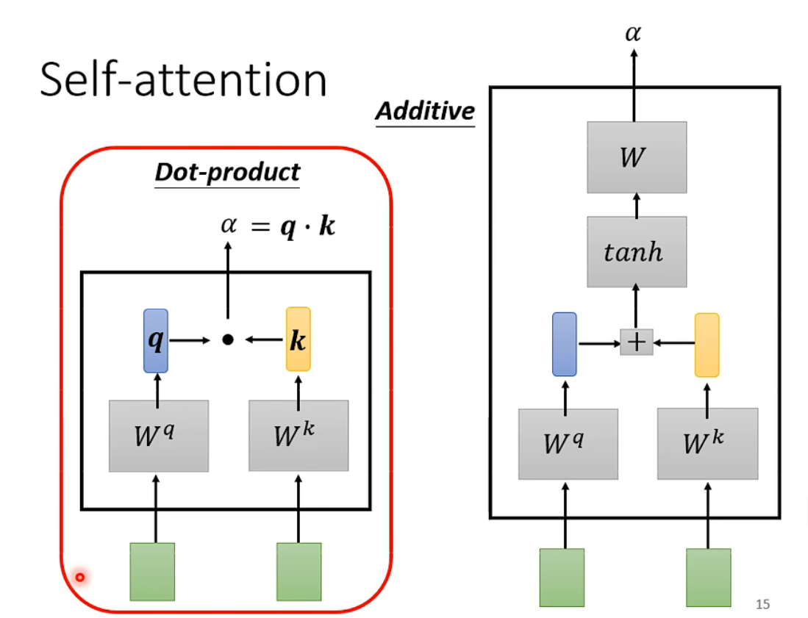
左图更加常用。

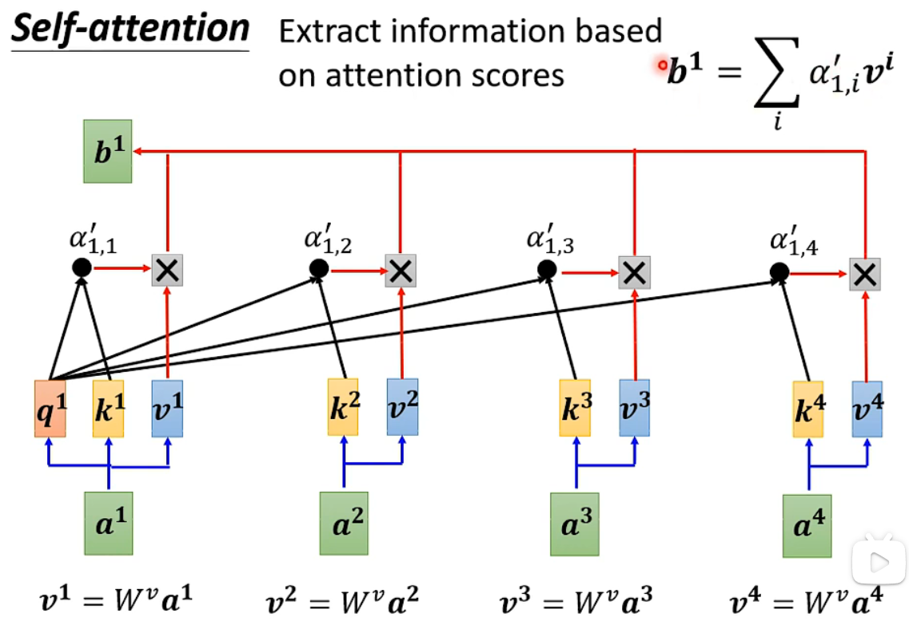
如图，其中`q表示query用于查询k，k表示key，v表示value。`
计算完qk后得到α，再对其使用激活函数如softmax。再将激活后的$\alpha'$与v计算得到的结果相加。**我们发现，如果==最终结果$b^1$与某个$v^i$比较接近==，那么说明这个$v^i$对应的attention score比较大，说明$a^1与a^i$的==相关性比较大==。**

# Q,K,V的矩阵形式运算

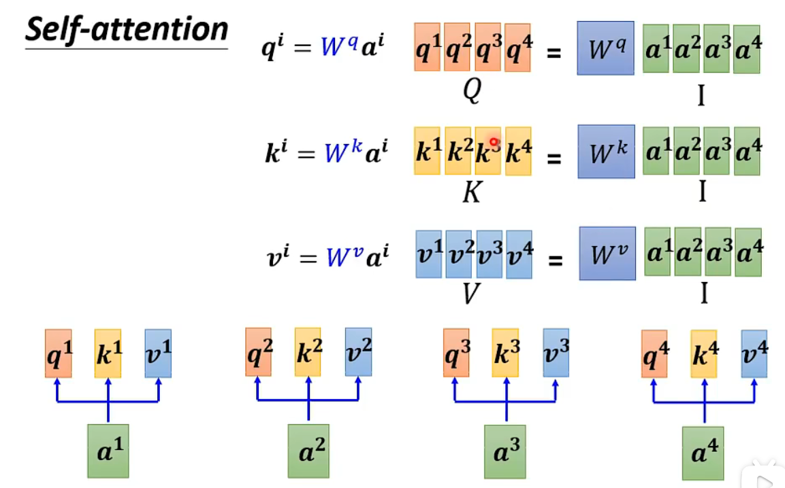
首先，将输入向量按照列排列得到输入矩阵I，然后分别与权重矩阵相乘得到Q,K,V。

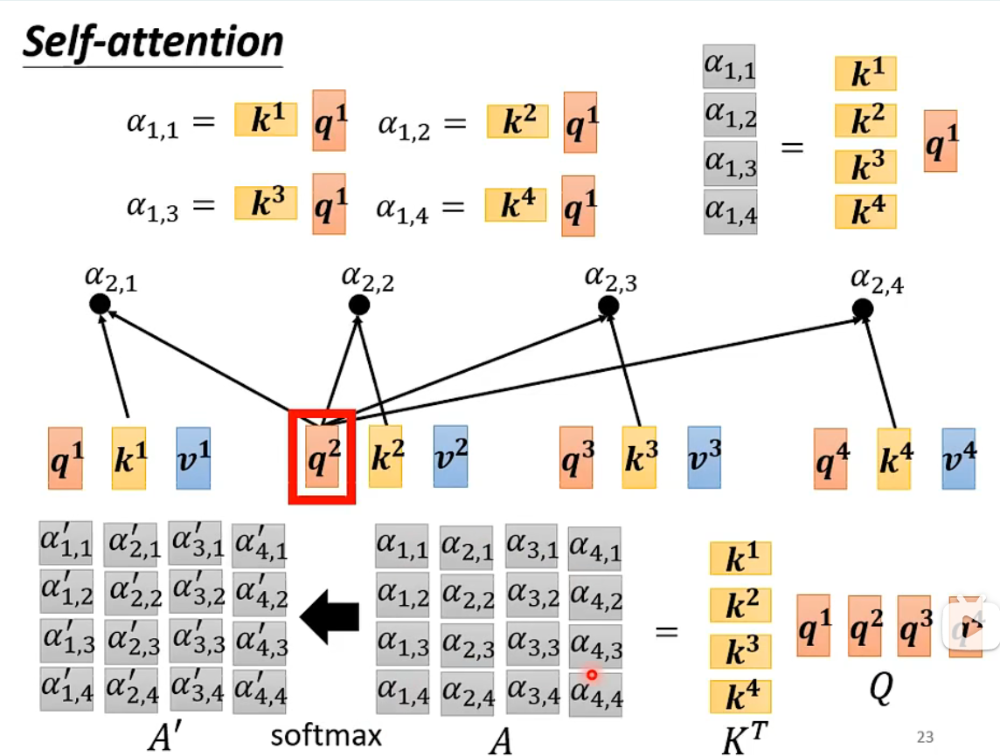
然后，将k转置后按照行堆叠，q按照列堆叠，进行矩阵乘法运算得到attention score α，再经过激活函数如softmax得到$A'$，即$K^TQ=A,\phi(A)=A'$。

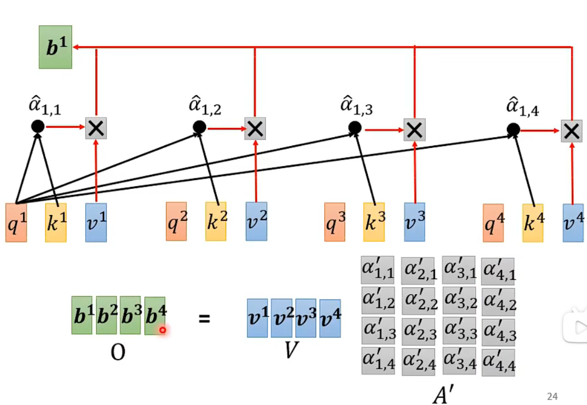
接着，计算$VA'=O$，即得到了输出的结果。

完整过程如下：
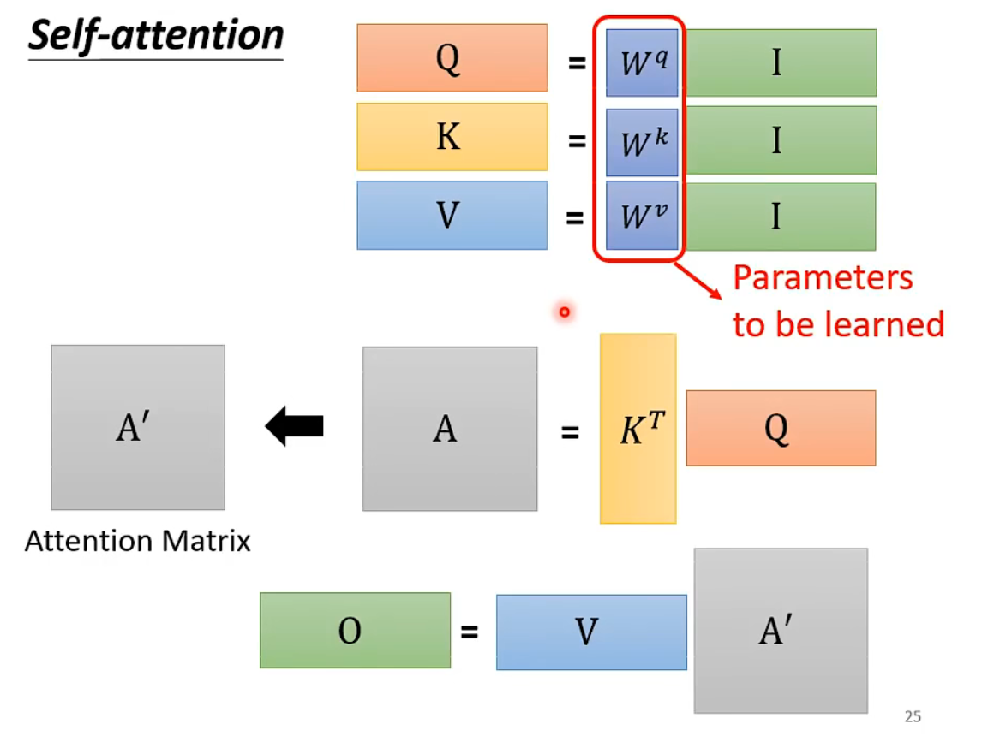
其中的W是需要进行训练的。

# Multi-head Self-attention多头自注意力机制

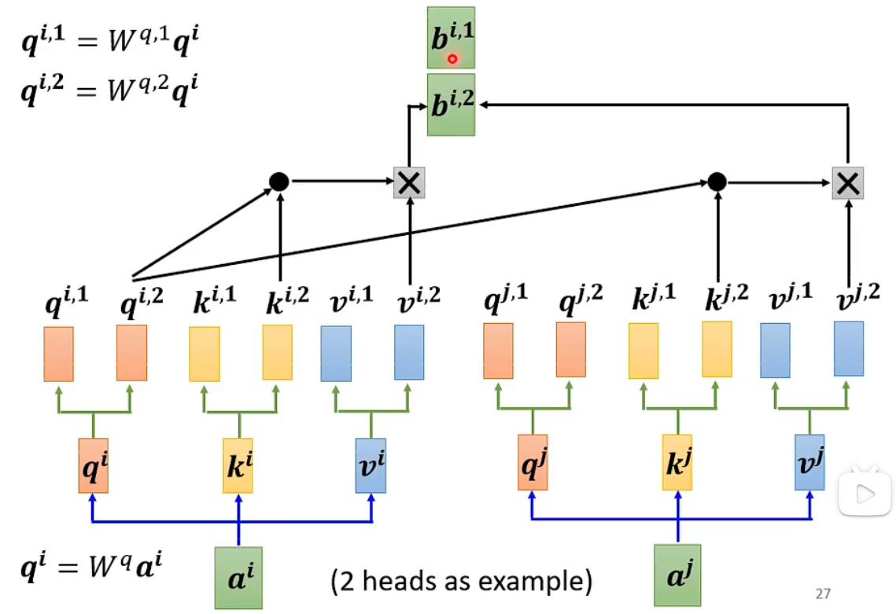
可以**使用多个q来查找不同的k**，这就是多头注意力机制。需要注意的是，==计算时只关注本次的q,k,v而不关注其他的q,k,v。==如计算$b^{i,2}$时只关注$q^{i,2},k^{i,2},v^{i,2},k^{j,2},v^{j,2}$，其他的如上标1与此次计算无关。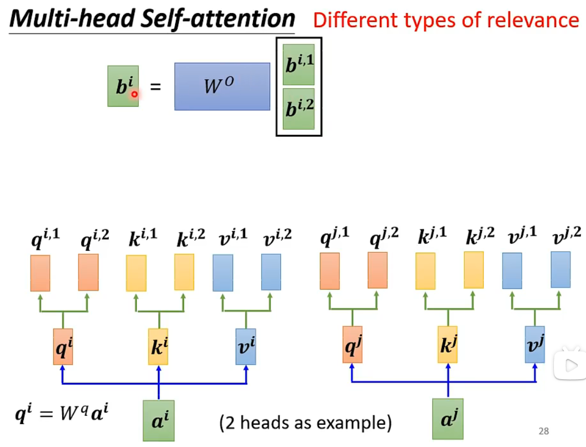

# 位置编码

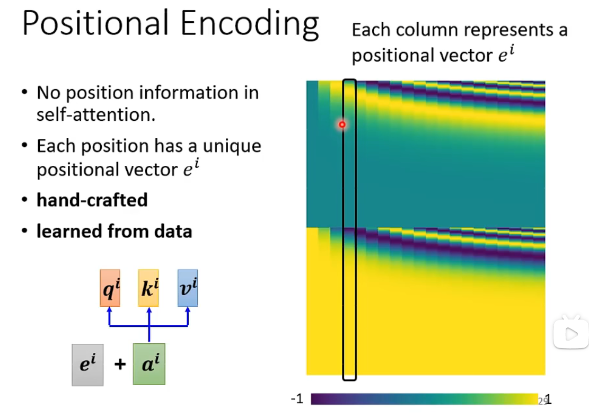
在计算机中，他并不知道输入的位置到底是多少。因此，添加了一个位置向量$e^i$，==表示此次输入的位置信息。==

# 对于Self Attention的一些理解

## 什么是self-attention？

自注意力机制，是一种通过自身和自身相关联的attention机制，从而得到一个更好的 representation 来表达自身。

不严谨的说，自注意力机制就是利用$x_i$之间两两相关性作为权重的一种加权平均将每一个$x_i$映射到$z_i$，
比如$x_i和x_2$分别表示“Thinking”和“Machines”的embedding。此时可以说$x_i和x_2$ 都只表示自己的word，没有考虑局部依赖关系。
因此，首先计算数据之间的相关性，再进行加权，就知道了哪些数据之间的相关性高。

## Transformer为什么需要进行Multi-head Attention?

引入Self Attention后会**更容易捕获句子中长距离的相互依赖的特征**，Multi-head Attention是多层次的self-attention，**多头的注意力有助于网络捕捉到更丰富的特征/信息(==类比 CNN 中同时使用多个卷积核==)。**

在self-attention中，序列中的每个单词(token)和该序列中其余单词(token)进行attention计算。self-attention的特点在于**无视词(token)之间的距离直接计算依赖关系**，从而能够学习到序列的内部结构，实现起来也比较简单。

## Self-attention为什么要使用Q、K、V？

Query，Key，Value的概念取自于信息检索系统，Q表示的就是**与我这个单词相匹配的单词的属性**，K就表示**我这个单词的本身的属性**，V表示的是**我这个单词的包含的信息本身**。

Attention机制中的Q,K,V即是，我们对当前的Query和所有的Key计算相似度，将这个相似度值通过Softmax层进行得到一组权重，根据这组权重与对应Value的乘积求和得到Attention下的Value值。

实验发现self-attention使用Q、K、V，这样三个参数独立，模型的表达能力和灵活性很好。

## 为什么Q、K、V代表了注意力？

**V是表示输入特征的向量**，Q、K是**计算Attention权重的特征向量**。它们**都是由输入特征得到的**。Attention(Q,K,V)是根据关注程度对V乘以相应权重。

你有一个**问题Q**，然后去搜索引擎里面搜，搜索引擎里面有好多文章，每个**文章V**有一个能代表其正文内容的**标题K**，然后搜索引擎用你的**问题Q**和那些**文章V**的**标题K**进行一个匹配，看看**相关度（QK —>attention值）**，然后你想用这些检索到的不同相关度的文章V来表示你的问题，就用这些相关度将检索的文章V做一个加权和，那么你就得到了一个新的Q’，这个**Q’融合了相关性强的文章V更多信息，而融合了相关性弱的文章V较少的信息**。这就是注意力机制，注意力度不同，**重点关注（权值大）与你想要的东西相关性强的部分，稍微关注（权值小）相关性弱的部分。**
