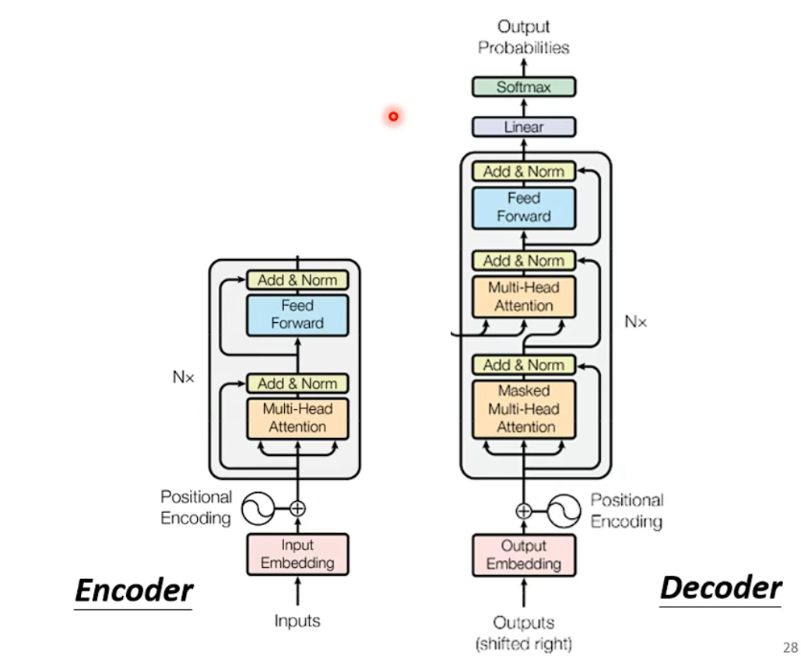
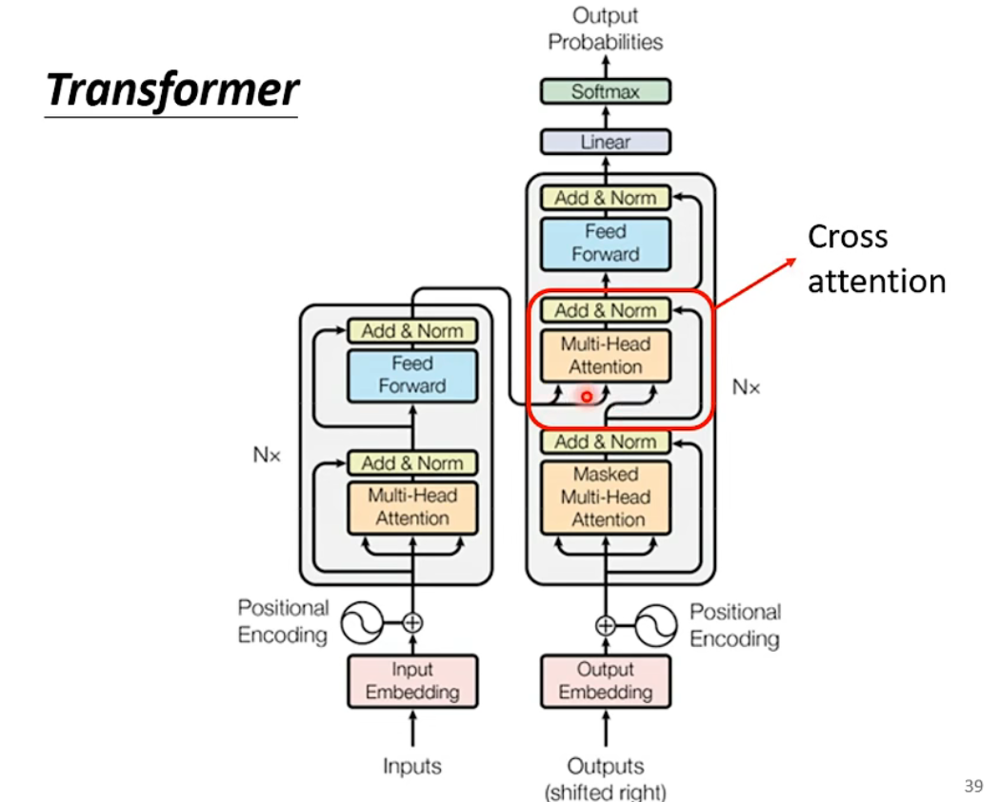
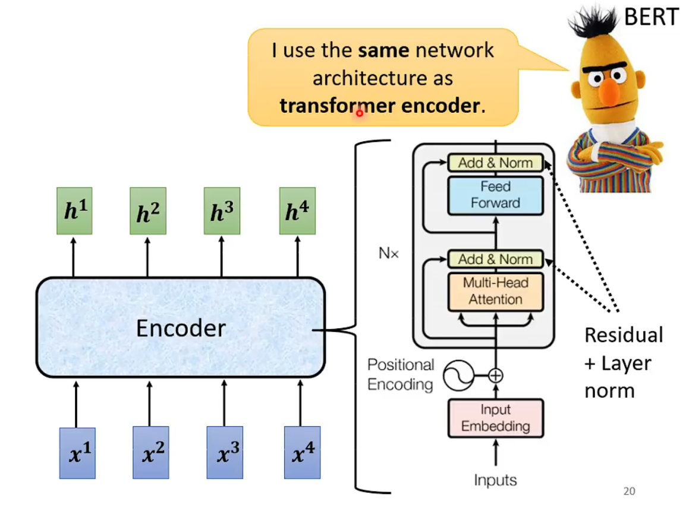
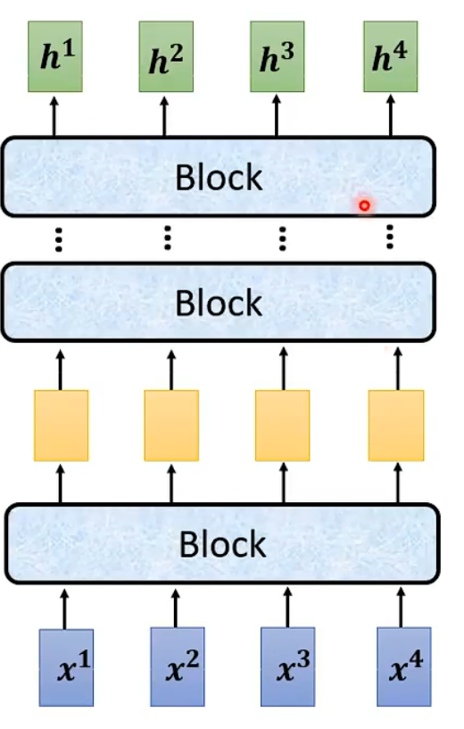
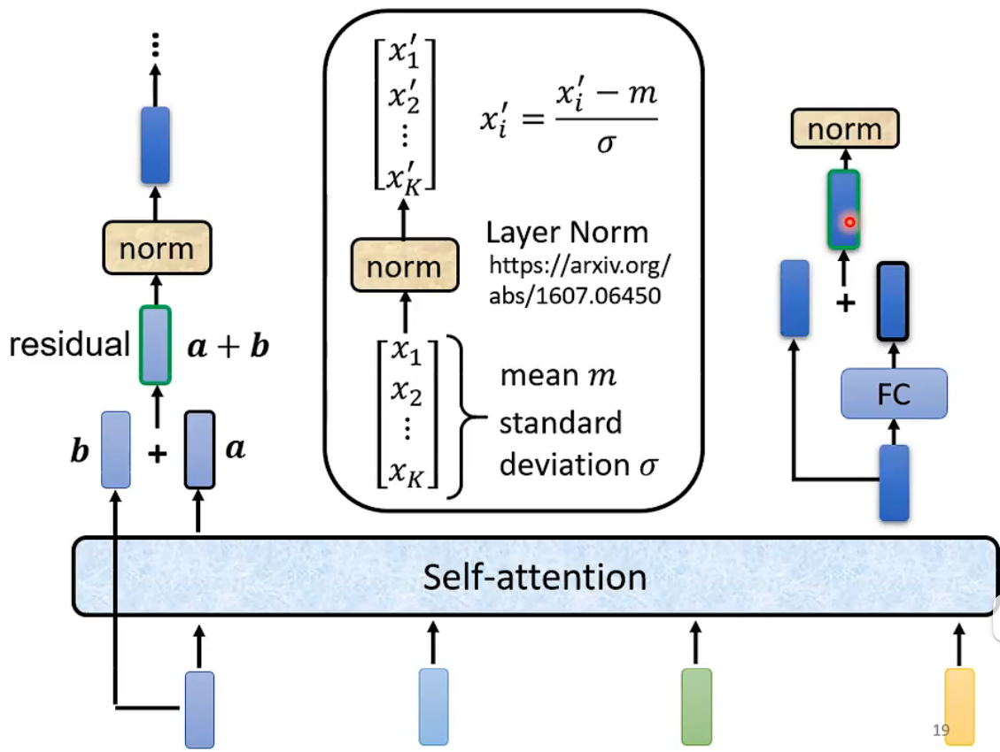
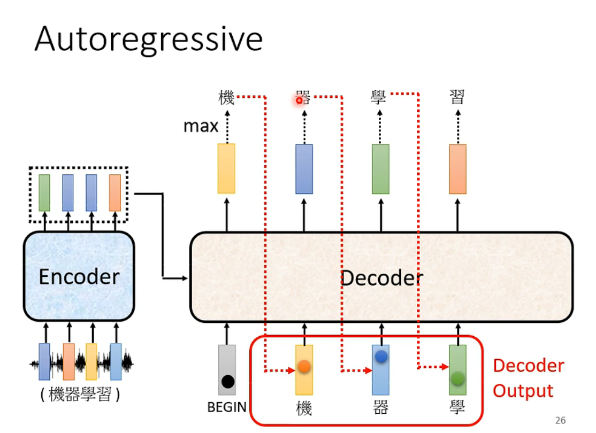
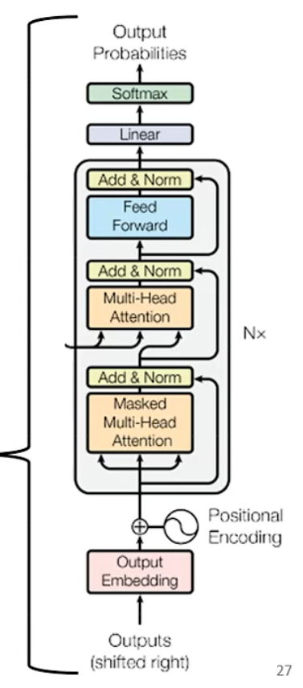
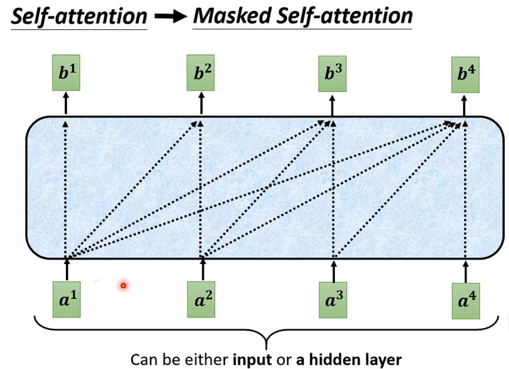
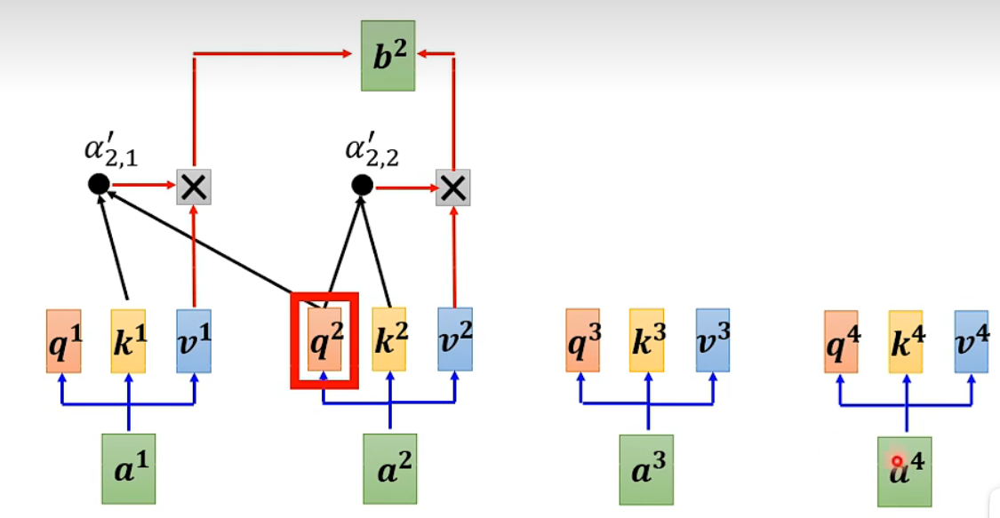
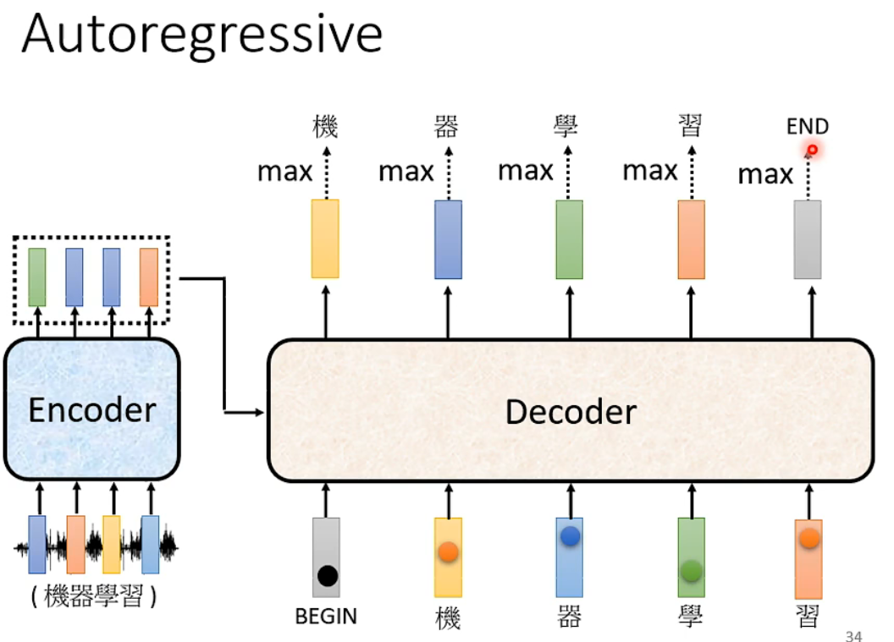

# Encoder,Decoder和Transformer的示意图

# Encoder

上图是Transformer的Encoder架构。其中：

- input Embedding表示将输入进行词嵌入处理；
- Multi-Head Attention表示多头注意力机制；
- Add ＆Norm表示进行残差连接以及标准化；
- Feed Forward表示前馈网络，中间是两层FC层，用于更加深入的提取特征。

该图是Encoder架构，主要就是将输入的值经过多个Block后得到输出的值。
其中，每个Block中的结构如下所示：

可见，其步骤为：

1. 先使用注意力机制得到结果a；
2. a与原始输入b相加得到新的结果；
3. 进行norm标准化处理；
4. 再进行FC；
5. FC后再与原始输入（norm标准化处理后的结果）相加；
6. 最后再进行一次norm和FC即可得到最终的输出结果。

# Decoder

decoder和RNN有点像，他的过程为：

- 读取encoder得到的结果，并以一个特殊符号作为开始，使用Decoder模块进行预测输出；
- 将每次预测输出的结果当作下一次预测的输入继续进行预测。

**在Decoder中将Multi-Head Attention改成了Masked Multi-Head Attention。**

当使用Masked Multi-Head Attention时，**生成输出结果时==只能考虑当前及其前面的输入==，而不考虑该输入之后的输入。**

如下所示：

可以发现计算b^2^时，只使用q^2^去查找k^1^和k^2^，而不去查找后面的k^3^和k^4^。

**为什么要使用masked self-attention？**

1. 在Encoder中，**其结果是并行输出的**。因为我们知道整个输入是什么，因此可以并行计算输出结果；
2. 而在Decoder中，**其结果是串行输出的**。即，只有生成了前面的输出，才能将该输出作为下一个的输入进行预测输出。**因此，在t时刻，我们只能看见当前及其前面的输入，而无法看见t之后的输入==（因为该输入要依赖t时刻的输出，因此还没有生成）==**。

我们除了在摧毁表中存储所有的字以外，还会存储BEGIN表示开始，END表示结束。

- BEGIN作为开始符号，将其与Encoder的输入一起输入Decoder开始预测。
- END作为结束符号，当预测出的END概率最大时，输出END，表示本次预测结束，这时候就确定了输出的长度。