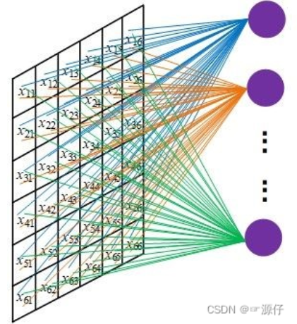
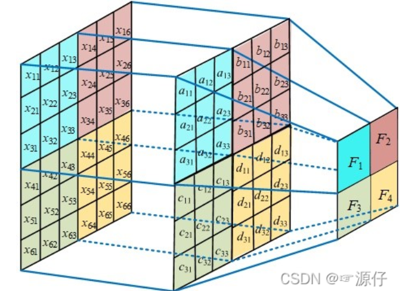

[ CNN中的卷积操作与参数共享_卷积参数共享](https://blog.csdn.net/weixin_54546190/article/details/122179752?ops_request_misc=%7B%22request%5Fid%22%3A%22168966834516800225513344%22%2C%22scm%22%3A%2220140713.130102334.pc%5Fall.%22%7D&request_id=168966834516800225513344&biz_id=0&utm_medium=distribute.pc_search_result.none-task-blog-2~all~first_rank_ecpm_v1~rank_v31_ecpm-1-122179752-null-null.142^v88^insert_down1,239^v2^insert_chatgpt&utm_term=为什么CNN能参数共享&spm=1018.2226.3001.4187)

卷积神经网络（Convolutional Neural Networl, CNN）的两大核心思想：

- 局部连接（Local Connectivity）
- 参数共享（Parameter Sharing）

两者共同的一个关键作用就是减少模型的参数量，使运算更加简洁、高效，能够运行在超大规模数据集上。

# 1 局部连接

 对于一张输入图片，大小为W × H , 如果使用全连接网络，生成一张X × Y的特征图，不进行局部连接，每个神经元和每一个输入像素连接，参数量动辄千万级别，网络很难训练。 这么多参数肯定是不行的，我们就想办法减少参数的个数。
一般而言，**图像信息都是==局部相关==的**，**如果输出层的每一个像素只和输入层图片的一个局部相连，那么需要的参数个数就可以大大减少。**假设输出层每个像素只与输入图片上F × F 的一个方块区域有连接，也就是说输入层的这个像素值，只是通过原图的这个W × H 减少到了F × F。

因此，使用局部连接，通过图像的局部相关性，我们就可以将输入的一个区域映射到输出的一个像素上。

# 2.权值共享

卷积中不做参数共享，则每一个输出对应一组参数值，参数量仍然庞大：

如图，每个区域都需要对应的参数$a_{ij}$。

我们知道，==图像的底层特征是跟具体位置无关的，比如边缘。==无论是在图像中间的边缘特征，还是图像四角的边缘特征，都可以用类似于微分的特征提取器提取。

- ==低层次特征==往往是==泛化的、易于表达的==，如纹理、颜色、边缘、棱角等等。
- ==高层次特征==往往是==复杂的、难以说明的==，比如金色的头发、瓢虫的翅膀、缤纷的花儿等等。

观察CNN各层输出可看出， ==浅层（靠近输入）==能提取到上述低层次特征，==深层（靠近输出）==往往能提取到上述高层次特征。最后使用==全连接层分析最深处的高层次特征==并给出预测结果。

那么，对于主要用于提取底层特征的前几层网络，把上述局部全连接层中每一个F × F方形区域对应的参数（权值）共享，就可以进一步减少网络中的参数个数了。也就是说，输出层的每一个像素，是由输入层对应位置的F × F局部图片，与相同的一组F × F的参数（权值）做内积（点积），再经过非线性单元计算而来的。这样的话，无论图片原大小如何，只用F × F个参数就够了。当然，一组F × F的参数只能得到一张输出特征图，一般会有多组参数，分别经过卷积后可以有好几层特征图。
==即，对于这些低层次特征，我们不关心他的具体位置不管他是在中间还是在角落，我们只要能通过某种参数进行运算后能够提取出他是该特征即可。因此，我们使用权值共享，代表可以使用这一组F\*F的参数得到这种特征。对于其他低级特征如颜色，也可以这样做。==

需要注意的是，==高层特征==一般是与==位置有关的（全局特征）==，比如 一张人脸图片，眼睛和嘴的位置不同，那么处理到高层，不同位置就需要不同的神经网络权重（参数），这时候卷积层就不能胜任了，就需要用局部全连接层和全连接层。
==即，对于这些高层次特征，他们的位置十分重要，如在中间的金色头发必须在中间，不能说它可以在角落。因此，不同位置就需要不同的神经网络权重（参数），这时候卷积层就不能胜任了，就需要用局部全连接层和全连接层。==