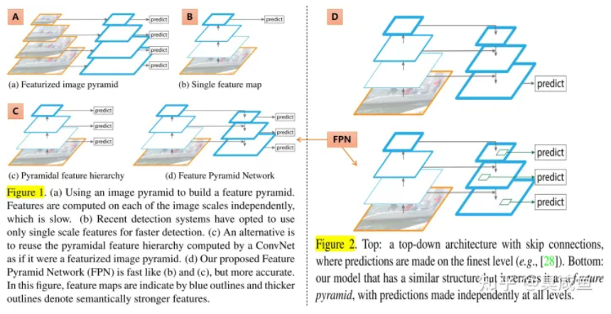
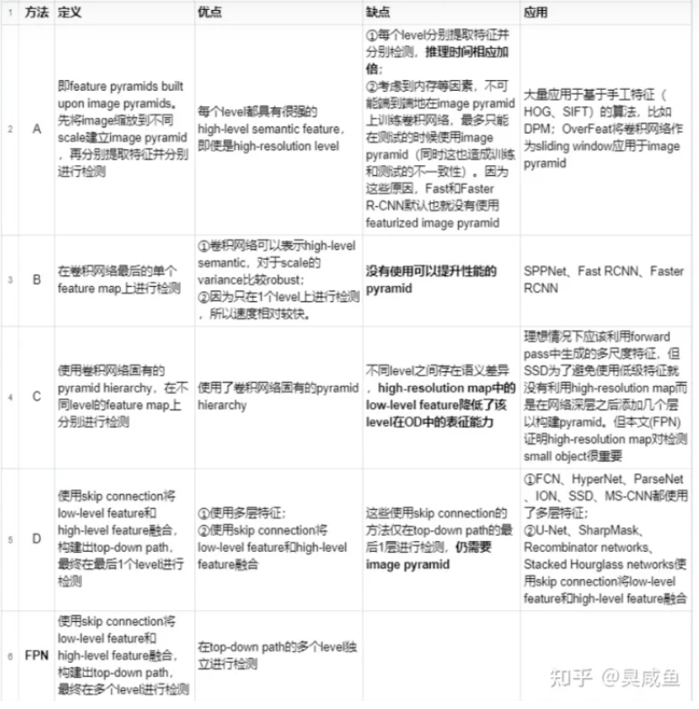

# Feature Pyramid Networks for Object Detection

# 1.文章概要

## 1.1 背景

feature pyramid是用来检测不同scale的object的1种基本方法。但**最近的deep learning detector（RCNN、SPPNet、Fast RCNN、Faster RCNN）却都没有使用pyramid representation（在多个尺度不同的feature map上进行检测）**，其中部分原因是它们计算量大、需要大量memory。

如图1和图2所示，基于feature pyrimid来检测不同scale的object，共有5种思路：**4种已有思路（分别缩写为ABCD）和本文思路（FPN）**

## 1.2 方法:star:

FPN：基于CNN固有的pyramid hierarchy，通过skip connection构建top-down path，仅需少量成本生成feature pyramid，并且**feature pyramid的每个scale都具有high-level semantic feature**，最终在feature pyramid的各个level上进行目标检测。

## 1.3 创新点/优点:star:

- **在deep learning detector中构建pyramid（而最近的RCNN、SPPNet、Fast RCNN、Faster RCNN都没有使用pyramid representation）**，仅需少量成本并且feature pyramid中每个level都具有high-level semantic feature
- 速度快、精度高
- generic：FPN独立于骨干网络，可以用于改进多种算法，本文将其用于Faster RCNN（RPN+Fast RCNN）、instance segmentation proposals

## 1.4 缺点

- PoolNet指出top-down路径中高级语义信息会逐渐稀释
- Libra RCNN指出FPN采取的sequential manner使得integrated features更多地关注于相邻层，而较少关注其它层，每次fusion时非相邻层中的semantic information就会稀释1次

# 2.算法描述

## 2.1 整体架构

- 输入：任意scale的单张图片
- 输出：在多个level输出对应size的feature map

FPN的构建包括1个bottom-up path、1个top-down path和skip connection

### 2.1.1 bottom-up pathway

- backbone：bottom-up path就是backbone的前向传播

- stage：

- - 定义：将backbone分为多个stage，将每个stage定义为1个pyramid level。如ResNet中的conv_x，都是有相同的conv堆叠起来的，因此是一个stage。最后输出一个feature map，并传给下一个stage。
  - 输出：每个stage中，所有layer输出特征图的size是相同的，取其中最后1层的输出作为该stage的输出，因为每个stage中最深的层应该具有最强的特征
  - 下采样：相邻stage之间的下采样比例为2

- FPN for ResNet：本文将ResNet的后4个stage{�2,�3,�4,�5}（相对于输入的下采样比例分别为4、8、16、32）的输出定义为4个pyramid level，并不将第1个stage的输出包含到FPN中因为其内存占用量比较大。

### 2.1.2 top-down pathway

### 2.1.3 skip connection

## 2.2 损失函数:star:

# 3.Training Details

# 4.Inference Details

# 5.实验结果

