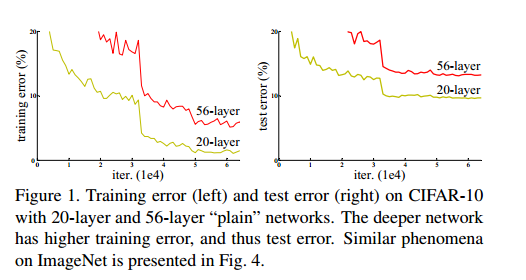
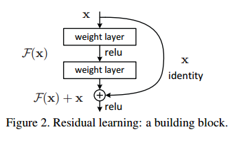
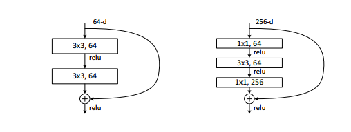
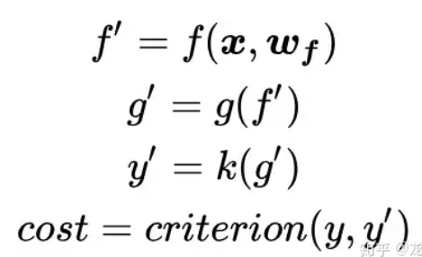
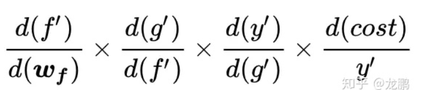

# Deep Residual Learning for Image Recognition

# 摘要

> 深度神经网络更难训练。我们提出了一个残差学习框架，以简化比以前使用的网络深度大得多的网络的训练。我们明确地将层重新表述为参考层输入的学习残差函数，而不是学习未参考的函数。
>

说明了训练深度神经网络是困难的，但是提出了一个新的框架，能够训练深度神经网络。

# 1.介绍

## P1-P3

当网络层数增加时，网络反而退化了，训练误差和测试误差都提升了，说明训练深度神经网络的复杂性与困难，**随着网络越来越深，梯度就会出现爆炸或者消失**。

如何解决：

- 在初始化的时候要做好一点，就是权重在随机初始化的时候，权重不要特别大也不要特别小。
- 在中间加入一些normalization，包括BN（batch normalization）可以使得校验每个层之间的那些输出和他的梯度的均值和方差相对来说比较深的网络是可以训练的，避免有一些层特别大，有一些层特别小。

使用了这些技术之后是能够训练（能够收敛），虽然现在能够收敛了，但是当网络变深的时候，性能其实是变差的（精度会变差）。

==注意，这并不是因为层数太多出现过拟合导致性能变差。==过拟合是指训练误差低，但是测试误差高。这里应该是因为网络模型太复杂，而使用的数据量不够。

==退化问题的实质：通过多个非线性层来近似恒等映射可能是困难的(恒等映射亦称恒等函数：是一种重要的映射，对任何元素，象与原象相同的映射)。神经网络在反向传播过程中要不断传播梯度，而当层数加深，梯度在传播过程中逐渐消失【而梯度消失则是导致网络退化的一个重要因素】，导致无法对前面网络的权重进行有效调整。==

## P4

如果一个浅的网络学习的还不错，那么他的更深的版本应该不会变得更差，因为我们能够使用**identity mapping（恒等映射）**，这样就变成了浅的网络。然而SGD做不到这件事情，无法学习到这样的参数满足恒等映射。

## P5

我们不使用初始的映射，而是使用残差映射。
我们将新的输出设置为$H(x)=F(x)+x$，其中x为前面层的输出，而$F(x)=H(x)-x$就是需要我们学习的残差。
==我们假设优化残差映射比优化原始的、未引用的映射更容易。在极端情况下，如果一个恒等映射是最优的，将残差推至零要比用一堆非线性层拟合一个恒等映射容易得多。==
==x是原始的浅层神经网络已经学到的一些东西，新加的层不要重新去学习，而是去学习学到的东西和真实的东西之间的残差，最后整个神经网络的输出等价于浅层神经网络的输出x和新加的神经网络学习残差的输出之和，将优化目标从H（x）转变成为了H(x)-x。==

如果说恒等映射是最优的，那么我们只需要将F(x)学习为0即可，这要比使用非线性层学习恒等映射要简单许多。
如果说比恒等映射更好，那么这个残差就能被学习并修改参数。

如何实现？添加shortcut connections（图中的identity，将上层输出的x添加到堆叠输出的结果H(x)中）。快捷连接是那些跳过一个或多个层的连接。它只是执行恒等映射，它的输出被添加到堆叠层的输出中。身份快捷连接既不增加额外的参数，也不增加计算复杂度。

# 2.相关工作

残差连接如何处理输入和输出的形状是不同的情况：

- 第一个方案是在输入和输出上分别添加一些额外的0，使得这两个形状能够对应起来然后可以相加
- 第二个方案是之前提到过的全连接怎么做投影，做到卷积上，是通过一个叫做1*1的卷积层，这个卷积层的特点是在空间维度上不做任何东西，主要是在通道维度上做改变。所以只要选取一个1*1的卷积使得输出通道是输入通道的两倍，这样就能将残差连接的输入和输出进行对比了。在ResNet中，如果把输出通道数翻了两倍，那么输入的高和宽通常都会被减半，所以在做1*1的卷积的时候，同样也会使步幅为2，这样的话使得高宽和通道上都能够匹配上

# 3.Deep Residual Learning

## 3.1 Residual Learning

> 让我们把H(x)看作是由几个堆叠层(不一定是整个网络)拟合的底层映射，其中x表示这些层的第一层的输入。如果假设多个非线性层可以渐近逼近复杂函数s2，则等价于假设它们可以渐近逼近残差函数，即H(x)−x(假设输入和输出具有相同的维数)。因此，我们不是期望堆叠层近似于H(x)，而是明确地让这些层近似于残差函数F(x):= H(x) - x。因此，原始函数变为F(x)+x。
>
> 这种重新表述的动机是关于**退化问题**的反直觉现象(图1，左)。正如我们在介绍中所讨论的，**如果添加的层可以构造为身份映射，那么较深的模型的训练误差应该不大于较浅的模型。**退化问题表明，求解器在逼近多非线性层的恒等映射时可能存在困难。通过残差学习的重新表述，如果恒等映射是最优的，求解器可以简单地将多个非线性层的权值向零驱动，从而逼近恒等映射。

文章认为，使用多层非线性层来学习一个恒等映射比较困难，但是可以学习F(x)。

## 3.2  Identity Mapping by Shortcuts

使用如下公式定义其中的几个堆叠层：

$y=F(x,\{W_i\})+x$

如果输入与输出的维度不一致，那么可以：

$y=f(x,\{W_i\})+W_sx$，其中的$W_s$用于改变输入的通道数量。

需要注意，我们可以使用2-3层或者更多的层作为堆叠层，但不能是一层，否则：

$y=W_1x+x$，相当于线性变化，没有使用ReLU，无意义。

## 3.3 网络架构

普通网络：卷积层基本上都是使用3\*3的滤波器，并遵循两条规则：

1. 对于相同的输出特征图大小，各层具有相同数量的滤波器；
2. 如果特征图大小（即宽高）减半，则滤波器的数量增加一倍，以保持每层的时间复杂度。

残差网络：在上述普通网络的基础上，我们插入快捷连接(图3，右)，将网络转换为对应的残差版本。

- 当输入和输出维度相同时(图3中的实线方式)，可以直接使用。

- 当维度增加时(图3中的虚线方式)，我们考虑两种选择:

  1.  快捷方式仍然执行恒等映射，增加维度时填充额外的0。这个选项不引入额外的参数;

  2. **投影快捷方式用于匹配维度(通过1×1卷积完成)。**

     对于这两个选项，当快捷键跨越两个大小的特征映射时，它们的步幅为2。

## 3.4 实现

- 把短边随机的采样到256和480（AlexNet是直接将短边变成256，而这里是随机的）。随机放的比较大的好处是做随机切割，切割成224*224的时候，随机性会更多一点。
- 将每一个pixel的均值都减掉了。
- 使用了颜色的增强（AlexNet上用的是PCA，现在我们所使用的是比较简单的RGB上面的，调节各个地方的亮度、饱和度等）。
- 使用了BN（batch normalization），在卷积后激活前。它不仅可以加快了模型的收敛速度，而且更重要的是在一定程度缓解了深层网络中“梯度弥散（特征分布较散）”的问题，从而使得训练深层网络模型更加容易和稳定。
- 我们知道网络一旦训练起来，那么参数就要发生更新，除了输入层的数据外(因为输入层数据，我们已经人为的为每个样本归一化)，后面网络每一层的输入数据分布是一直在发生变化的，因为在训练的时候，前面层训练参数的更新将导致后面层输入数据分布的变化。以网络第二层为例：网络的第二层输入，是由第一层的参数和input计算得到的，而第一层的参数在整个训练过程中一直在变化，因此必然会引起后面每一层输入数据分布的改变。
- 批量大小是56，学习率是0.1，然后每一次当错误率比较平的时候除以10。
- 模型训练了60*10^4个批量。建议最好不要写这种iteration，因为他跟批量大小是相关的，如果变了一个批量大小，他就会发生改变，所以现在一般会说迭代了多少遍数据，相对来说稳定一点。
- 这里没有使用dropout，因为没有全连接层，所以dropout没有太大作用。
- 在测试的时候使用了标准的10个crop testing（给定一张测试图片，会在里面随机的或者是按照一定规则的去采样10个图片出来，然后再每个子图上面做预测，最后将结果做平均）。这样的好处是因为训练的时候每次是随机把图片拿出来，测试的时候也大概进行模拟这个过程，另外做10次预测能够降低方差。
- 采样的时候是在不同的分辨率上去做采样，这样在测试的时候做的工作量比较多，但是在实际过程中使用比较少。

# 4.实验

使用bottleneck，他将使用1\*1卷积降低特征维度，再进行3\*3卷积，最后再使用1\*1恢复维度。BottleNeck 一般用于深度较高的网络，主要的作用就是减少计算的参数量。

深度学习依靠误差的链式反向传播来进行参数更新，假如我们有这样一个函数：

其中的f，g，k大家可以自行脑补为卷积，激活，分类器。

cost对f的导数为：

它有隐患，一旦其中某一个导数很小，多次连乘后梯度可能越来越小，**这就是常说的梯度消散**，对于深层网络，传到浅层几乎就没了。但是如果使用了残差，**每一个导数就加上了一个恒等项1，$\frac{dh}{dx}=\frac{d(f+x)}{dx}=1+\frac{df}{dx}$**。此时就算原来的导数df/dx很小，这时候误差仍然能够有效的反向传播，这就是核心思想。

# 总结

创新点：

1. 超深的网络结构(突破1000层)
2. 提出residual模块
3. 使用Batch Normalization加速训练(丢弃dropout)