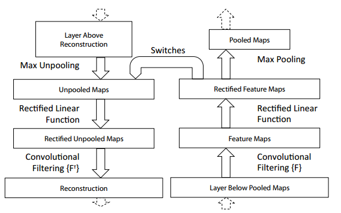

# 摘要

> 大型卷积网络模型最近在ImageNet基准上展示了令人印象深刻的分类性能(Krizhevsky et al, 2012)。然而，1.**他们为什么表现得这么好，或者2.如何改进，目前还没有明确的认识。**在本文中，我们解决了这两个问题。
>
>
> 我们介绍了一种**新的可视化技术**，该技术可以深入了解中间特征层的功能和分类器的操作。在诊断角色中使用，这些可视化使我们能够找到在ImageNet分类基准上优于Krizhevsky等人的模型架构。我们还进行了消融研究，以发现不同模型层对性能的贡献。我们证明了我们的ImageNet模型可以很好地推广到其他数据集:当softmax分类器被重新训练时，它令人信服地击败了Caltech-101和Caltech-256数据集上当前最先进的结果。

主要介绍通过一个新的可视化技术，能够帮助我们理解:

- 为什么CNN在物体识别上表现得很好；
- 如何加以改进。

# 1.介绍

## P1

有几个因素导致了人们对convnet模型的重新兴趣:

- 更大的训练集的可用性，有数百万个标记的例子;
- 强大的GPU实现，使非常大的模型的训练变得可行;
- 更好的模型正则化策略，如Dropout (Hinton et al, 2012)。

## P2

但对这些复杂模型的内部操作和行为，以及它们是如何实现如此良好的性能，仍然知之甚少。

为了解决该问题，提出了一种新的可视化技术，它能够：

1. 揭示了激发模型中任何层的单个特征图的输入刺激；
2. 允许我们在训练过程中观察特征的演变，并诊断模型的潜在问题；
3. 通过遮挡输入图像的部分来对分类器输出进行敏感度分析，揭示场景的哪些部分对分类很重要。

# 2.方法

## 2.1 用Deconvnet进行可视化

> 为了检查一个convnet，一个deconvnet被附加到它的每一层，如图1(顶部)所示，提供一个连续的路径返回到图像像素。首先，将输入图像呈现给卷积神经网络，并在各层中计算特征。为了检查给定的卷积网络激活，我们将层中的所有其他激活设置为零，并将特征映射作为输入传递给附加的反卷积网络层。然后我们依次(i)Unpooling，(ii)Rectify和(iii)filter，以重建导致所选激活的下一层的活动。然后重复此操作，直到达到输入像素空间。

右边是convnet，我们会做卷积，非线性激活以及最大池化。
左边是deconvnet，做相反的操作，先unpooling，在激活，最后卷积。

### 2.1.1 Unpooling

==在convnet中，最大池化操作是不可逆的，但是我们可以通过在一组开关变量中记录每个池化区域内最大值的位置来获得近似逆。==在反卷积网络中，解池操作使用这些开关将来自上一层的重构放置到适当的位置，从而保留刺激的结构。见图1(底部)的过程说明。

如图是最大池化和上池化。

- 右边为最大池化，我们在一定区域内选择最大值作为池化后的feature map上的值；
- 中间为unpooling中提到的*switches*，用于记录池化时各区域最大值的位置，便于上池化的实现；
- 左边为unpooling，借助switches进行上池化，得到在像素层面的图像值。在unpooling过程的时候，就把相应位置填上去，其它的神经元激活值全部为0。
  

### 2.1.2 Rectification

> convnet使用relu非线性来校正特征映射，从而确保特征映射始终是正的。为了在每一层获得有效的特征重构(也应该是正的)，我们将重构的信号通过一个relu非线性。

同样使用ReLU进行激活。

### 2.1.3 Filtering

使用学习的过滤器将前一层的特征映射进行卷积。为了反转这个，deconvnet使用相同的filters的**转置**版本（**用卷积过程转置后的滤波器参数一样，只不过把参数矩阵水平和垂直方向翻转了一下**），但是应用于rectified maps，而不是下面的图层的输出。实际上，这意味着垂直和水平地翻转每一个过滤器。
[一文搞懂反卷积，转置卷积 - 知乎 (zhihu.com)](https://zhuanlan.zhihu.com/p/158933003)

# 3.训练细节

> 该模型在ImageNet 2012训练集(130万张图像，分布在1000个不同的类别)上进行训练。每张RGB图像的预处理方法是:将最小尺寸调整为256，裁剪中心256x256区域，减去每像素平均值(所有图像)，然后使用10个不同的224x224大小的子裁剪(角+中心，(外)水平翻转)。
>
>
> 使用128个小批大小的随机梯度下降来更新参数，从学习率为10−2开始，结合动量项为0.9。当验证误差趋于平稳时，我们在整个训练过程中手动降低学习率。
>
> Dropout (Hinton et al, 2012)在完全连接层(6和7)中使用，速率为0.5。所有权重初始化为10−2，偏差设置为0。

介绍了训练的细节。

# 4.卷积可视化

特征可视化：

特征可视化：**一旦我们的网络训练完毕了，我们就可以进行可视化，查看学习到了什么东西**。

总的来说，通过CNN学习后，我们学习到的特征，是具有**辨别性**的特征，比如要我们区分人脸和狗头，那么通过CNN学习后，背景部位的激活度基本很少，我们通过**可视化就可以看到我们提取到的特征忽视了背景，而是把关键的信息给提取出来了**。

- 从layer 1、layer 2学习到的特征基本上是颜色、边缘等低层特征；
- layer 3则开始稍微变得复杂，学习到的是纹理特征，比如上面的一些网格纹理；
- layer 4学习到的则是比较有区别性的特征，比如狗头；
- layer 5学习到的则是完整的，具有辨别性关键特征。

可以看见，除了一些显著的特征，其他地方哦都是灰色的。因为我们在使用unpooling的时候除了最大值使用的原值之外，区域部分都是填充的0.

训练过程中的特征演化：

结果：

1. 仔细看每一层，在迭代的过程中的变化，出现了sudden jumps;
2. 从层与层之间做比较，我们可以看到，**低层在训练的过程中基本没啥变化，比较容易收敛，高层的特征学习则变化很大。**这解释了低层网络从训练开始，基本上没有太大的变化，因为梯度弥散，对低层网络的影响较小；
3. 从高层网络conv5的变化过程，我们可以看到，刚开始几次的迭代，基本变化不是很大，但是到了40~50的迭代的时候，变化很大，因此我们以后在训练网络的时候，不要着急看结果，看结果需要保证网络收敛。**低层收敛较容易，高层较难。因此高层的特征需要更长的时间保证收敛。**

特征不变性：

我们可以看到对于一张经过缩放、平移或者具有旋转对称性等操作的图片来说：**对网络的第一层影响比较大**，**到了后面几层，基本上这些变换提取到的特征没什么比较大的变化。**
然而对于那些不是不具有旋转对称性的图像来说，输出将会受到影响。

为什么有这个现象？

- 对于第1层，由于它是初始层，只能学习到一些颜色、边缘等低层特征，因此当图像进行了一定的改变后，他对这些改变较为敏感，因此欧氏距离较大，较容易受到影响；
- 对于第7层，他已经学习到了比较明显的特征，即使对输入图像进行了一定的改变，但他学习到了主要特征基本没变，因此距离相对较小。

## 4.1 框架选择

> 虽然训练模型的可视化提供了对其操作的洞察，但它也可以帮助在第一时间选择好的体系结构。通过可视化Krizhevsky等人的体系结构的第一层和第二层(图6(b)和(d))，各种问题都很明显。
>
> 第一层滤波器是高频和低频信息的混合，对中频的覆盖很小。此外，第二层可视化显示了由第一层卷积中使用的大跨距4引起的混叠伪影。为了解决这些问题，我们(i)将第一层过滤器大小从11x11减小到7x7， (ii)将卷积步幅改为2，而不是4。这种新架构在第一层和第二层特征中保留了更多的信息，如图6(c)和(e)所示。更重要的是，它还提高了分类性能，如5.1节所示。

## 4.2 遮挡的敏感性

对于图像分类方法，一个自然的问题是，模型是否真正识别图像中对象的位置，或者只是使用周围的上下文。

**实验清楚地表明，模型正在定位场景中的物体，他将使用图像中学习到的强的特征进行查找。当这些显著的特征被遮挡时，正确分类的概率显著下降。**

如图，当我们使用灰色框分别遮挡图像，然后我们得到了右边4列的结果，我们以此来判断输入图像中哪些部分对于预测的结果影响较大。

举个例子，对于第一行来说，我们系统地遮挡图像，得到第5层特征图的输出。可以发现，当遮挡的位置在狗脸部附近时，其分类概率降低较为明显。如第4列，当脸部被遮挡时，分类的概率降低。第5列说明遮挡大部分情况下都是狗，但是如果遮挡脸部，那么可能会错误分类成网球。

## 4.3 相关性分析

> 深度模型与许多现有的识别方法的不同之处在于，**1.没有明确的机制来建立不同图像中特定对象部分之间的对应关系**(例如，人脸具有**特定的眼睛和鼻子的空间配置**)。然而，一个有趣的可能性是，**深层模型可能会隐式地计算它们。（即能够建立特征之间的某种关系）**为了探索这一点，我们取5张随机绘制的狗的正面姿态图像，系统地屏蔽掉每张图像中面部的相同部分(例如，所有的左眼，见图8)。

> **越低的值表示掩蔽操作导致的变化一致性越强，因此不同图像中相同物体部分之间的对应关系越紧密(即遮挡左眼会以一致的方式改变特征表示)。**在表1中，我们使用l = 5和l = 7层的特征，将面部的三个部分(左眼、右眼和鼻子)与物体的随机部分的∆分数进行比较。**相对于随机对象区域，第5层特征的这些部分得分较低，表明模型确实建立了某种程度的对应关系。**

汉明距离：**比较向量的每一位是否相同，若不同则汉明距离加1**，这样即可得到汉明距离。向量相似度越高，对应的汉明距离越小。

深度卷积模型确实建立了某种程度的对应关系，能够建立特征之间的对应关系（在本例子中遮挡左眼会以一致的方式改变特征表示）。

# 5.实验

## 5.1 在ImageNet2012上使用

修改一下第一层卷积核的大小为7\*7，以及将网络架构中的stride修改为2，结果更为优秀。

- 删除全连接层或者中间两层，发现结果误差不大。但是如果都删除，有较大的差距，说明网络深度很重要。
- 增加中间卷积层的大小可以在性能上获得有用的增益。但是增加这些，同时扩大完全连接的层会导致过度拟合

## 5.2 特征泛化

> **我们将我们的ImageNet训练模型的第1-7层保持固定，并使用新数据集的训练图像在最上面训练一个新的softmax分类器（对于适当数量的类）。**由于softmax包含的参数相对较少，因此可以从相对较少的示例中快速进行训练，如某些数据集的情况。

保持1-7层的模型结构与参数，对softmax层进行重新训练。

Caltech-101：使用ImageNet预训练的模型效果更好，而从头开始训练的模型较差；

Caltech-256：同样的，从头开始训练的效果较差。

PASCAL 2012：该数据集中每张图像中含有多个对象，而模型只会给出图像中的一个目标，因此效果较差。该数据集是完整的场景，而不像ImageNet那样。

## 5.3 特征分析

> 我们探索了我们的imagenet预训练模型的每一层的特征是如何区分的。**我们通过改变从ImageNet模型中保留的层数，并在上面放置一个线性SVM或softmax分类器来做到这一点。**对于这两个数据集，随着我们提升模型，可以看到一个稳定的改进，使用所有层获得最好的结果。这支持了这样一个前提，**即随着特征层次的加深，它们会学习到越来越强大的特征。**

通过改变网络的层数，并且在最后添加SVM或者softmax进行分类得到结果，我们发现：更高层能够识别到更加强大的特征，将会得到更好的结果。

# 讨论

> 我们以多种方式探索了用于图像分类的大型卷积神经网络模型。
>
>
> 首先，我们提出了一种新颖的方法来可视化模型中的活动。这表明这些特征远不是随机的、不可解释的模式。相反，当我们提升层次时，**它们显示出许多直观上理想的特性，如合成性、增加的不变性和类判别性。**然后，我们通过一系列遮挡实验证明，该模型虽然经过分类训练，但对图像中的局部结构高度敏感，而不仅仅是使用广泛的场景上下文。对模型的消融研究表明，网络的最小深度，而不是任何单独的部分，对模型的性能至关重要。
>
>
> 最后，我们展示了ImageNet训练模型如何很好地推广到其他数据集。这一结果对小型(即< 104)训练集的基准测试的实用性提出了质疑。我们的convnet模型对PASCAL数据的泛化效果较差，可能受到数据集偏差的影响(Torralba & Efros, 2011)，尽管它仍然在最佳报告结果的3.2%以内，尽管没有对任务进行调整。例如，如果使用不同的损失函数，允许每个图像有多个对象，我们的性能可能会提高。这自然也会使网络能够处理目标检测。

1. 使用新的可视化方法研究CNN中的层，发现特征并不是随机的，是可以解释的。
2. 对于一些局部结构高度敏感。
3. 深度对性能很重要。
4. 推广到其他数据集上。

# 个人总结

这篇文章主要讲述了如何可视化CNN中的层（feature map），感性上来说，这项工作可以帮助我们理解CNN的每一层长什么样，进而帮助我们感性地理解CNN的工作原理。

一般来说，一个普通的CNN包括卷积层、激活函数、池化层，输入经过这些卷积运算、激活函数、池化操作，就会得到中间的feature map，**本文的目的就是对特定的feature map进行可视化。**

整篇文章的核心思想是，“map these activities back to the input pixel space, showing what input pattern originally caused a given activation in the feature maps."，把某一feature map通过deconvolution network还原到输入空间中，再进行可视化。当然，你可能会说，如果这个deconvolution的过程是完美的，那么feature map经过这个过程应该会还原成原始输入才对，可是正因为CNN中间经历了池化操作（一般是最大池化），使得feature map无法完美地还原，所以最后转化的图像不是原输入，而是原始输入经过多次池化后保留的信息。

创新点：

1. 使用可视化来解释CNN中每层都在做什么，每层能够学习到什么样的特征，这让我们对CNN有了更加深刻的了解；
2. 使用可视化找到了AlexNet中的不足之处，修改了其中的参数，提高了网络的能力；
3. 使用可视化说明CNN在寻找物体时能够真正识别物体的位置，而不是仅仅依靠周围的特征；
4. 使用可视化说明不同图像中特定对象部分之间的对应关系，说明能够在一定程度上建立起相应关系（如文章中眼镜的相对位置）。

不足：

- 如果数据集中存在多个对象，那么检测效果较差（如PASCAL 2012）。