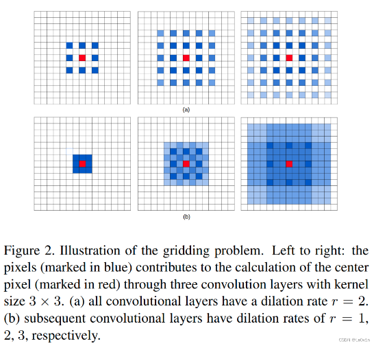
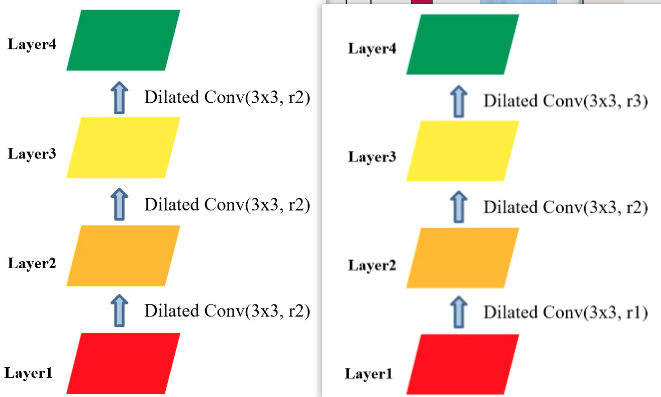
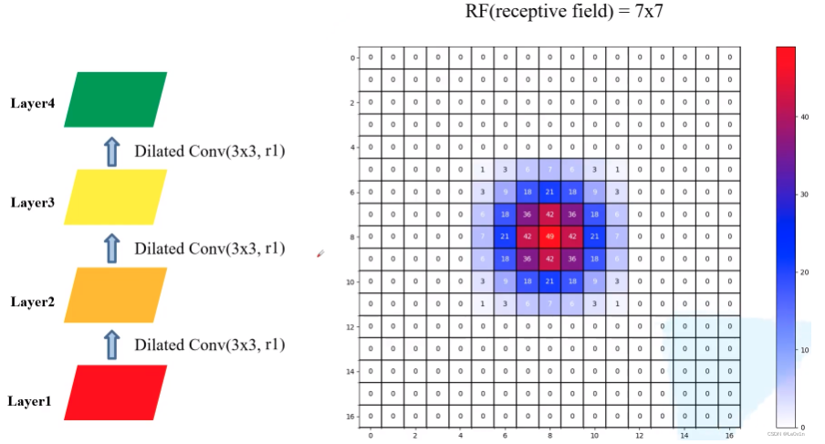

# 空洞卷积

> Dilated/Atrous Convolution(中文叫做空洞卷积或者膨胀卷积) 或者是 Convolution with holes 从字面上就很好理解，是在标准的 convolution map 里注入空洞，以此来增加 reception field。相比原来的正常convolution，dilated convolution 多了一个 hyper-parameter 称之为 dilation rate，指的是kernel的间隔数量(e.g. 正常的 convolution 是 dilatation rate 1)。
> 

## 卷积的问题

主要问题有：

1. 内部数据结构丢失；
2. 空间层级化信息丢失。
3. 小物体信息无法重建 (假设有四个pooling layer 则 任何小于 2^4 = 16 pixel 的物体信息将理论上无法重建。**因为会下采样，每次缩减两倍，可能导致无法重建。**)

在这样问题的存在下，语义分割问题一直处在瓶颈期无法再明显提高精度， 而 dilated convolution 的设计就良好的避免了这些问题。
在图像分割领域，图像输入到CNN(典型的网络比如FCN)中，FCN先像传统的CNN那样对图像做卷积再pooling，降低图像尺寸的同时增大感受野，但是由于图像分割预测是pixel-wise的输出，所以要将pooling后较小的图像尺寸upsampling到原始的图像尺寸进行预测（upsampling一般采用deconv反卷积操作），之前的pooling操作使得每个pixel预测都能看到较大感受野信息。因此**图像分割中有两个关键，一个是pooling减小图像尺寸增大感受野，另一个是upsampling扩大图像尺寸。**在先减小再增大尺寸的过程中，肯定有一些信息损失掉了，那么能不能设计一种新的操作，**不通过pooling也能有较大的感受野看到更多的信息呢**？答案就是dilated conv。

## 存在的问题：Gridding Effect

蓝色像素使用3次空洞卷积对红色像素的贡献，蓝色越深代表次数越多。上面是使用3次r=2的空洞卷积，下面是r=1,2,3。

### 使用膨胀系数相同与不同的空洞卷积

可以发现，两种方法的参数数量是一样的，仅仅是膨胀系数不同而已。

对于 r=[2, 2, 2] 这样连续相同的膨胀卷积来说，Layer4的感受野是13×13，但在这个视野下有很多像素值是没有利用到的。我们更加倾向于使用 r=[1, 2, 3]这样不相同连续的膨胀系数 —— 感受野下使用的区域是连续的。

### 普通卷积与空洞卷积

直接使用普通卷积Layer4的感受野和前面的两种膨胀卷积不同：

- 膨胀卷积的感受野为 13×13。
- 普通卷积的感受野为 7×7。
- 这说明使用**膨胀卷积可以大幅度增加感受野。**
