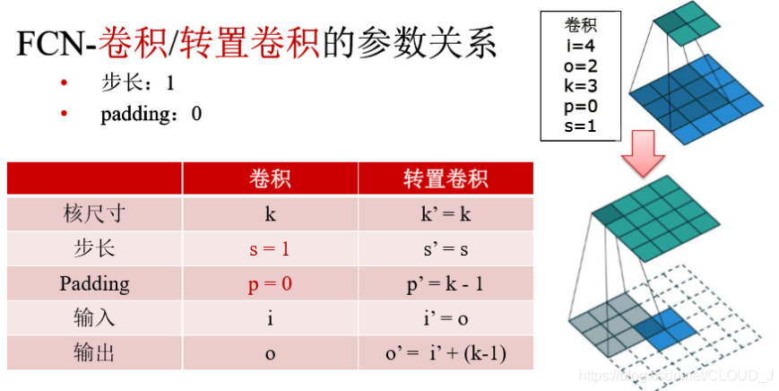
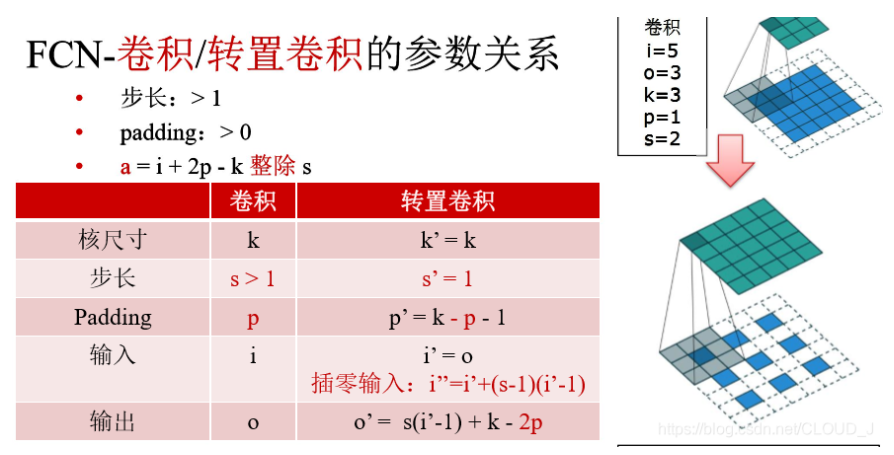
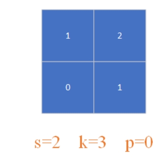
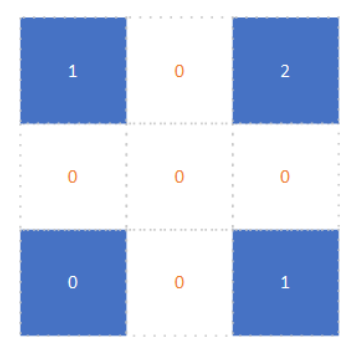
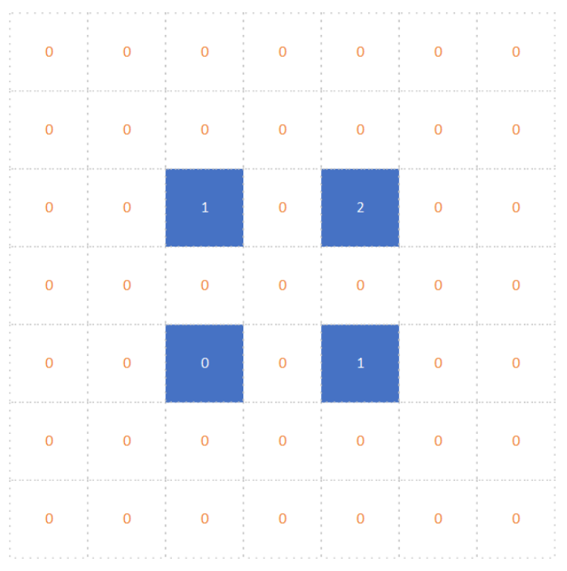
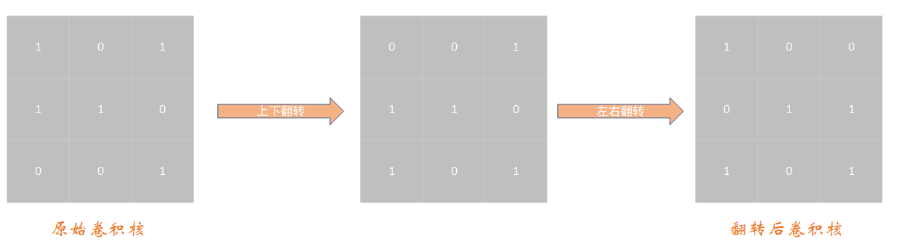
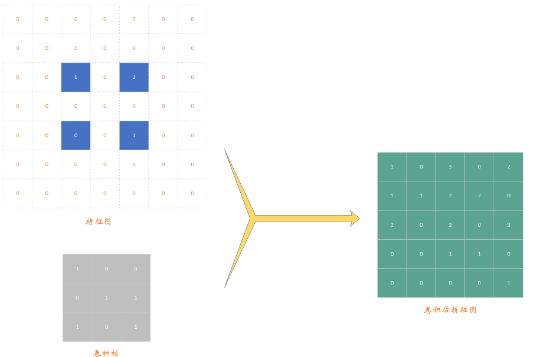
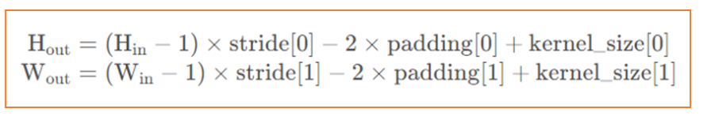

# 转置卷积

[转置卷积](https://blog.csdn.net/qq_47233366/article/details/127310195)

## 转置卷积计算过程

- 在**输入特征图元素**（**经过填充的0不是输入特征图元素。输入特征图元素在本例中为蓝色高亮的元素**）间填充s-1行、列0（其中s表示转置卷积的步距，注意这里的步长**s和卷积操作中的有些不同**）
- 在**输入特征图**四周填充k-p-1行、列0（其中k表示转置卷积kernel_size大小，p为转置卷积的padding，注意这里的**padding和卷积操作中的有些不同**）
- 将卷积核参数上下、左右翻转
- 做正常卷积运算（padding=0，s=1）

首先我们假设输入[特征图](https://so.csdn.net/so/search?q=特征图&spm=1001.2101.3001.7020)的尺寸为2*2大小，s=2，k=3，p=0，如下图所示：

1. 我们需要在特征图元素间填充s-1=1 行、列 0 （即填充1行0，1列0），变换后特征图如下：
   
2. 我们需要在输入特征图四周填充k-p-1=2 行、列0（即填充2行0，2列0），变换后特征图如下：
   
3. 我们需要将[卷积核](https://so.csdn.net/so/search?q=卷积核&spm=1001.2101.3001.7020)上下、左右翻转，得到新的卷积核【卷积核尺寸为k=3】，卷积核变化过程如下：
   
4. 最后一步，我们做正常的卷积即可【注：拿第二步得到的特征图和第三步翻转后得到的卷积核做正常卷积】，结果如下：
   

## 转置卷积计算公式

知道输入特征图尺寸以及k、s、p算出输出特征图尺寸：

对于stride[0]，stride[1]、padding[0]，padding[1]、kernel_size[0]，kernel_size[1]该怎么理解？其实啊这些都是卷积的基本知识，这些参数设置时可以设置一个整数或者一个含两个整数的元组，\*[0]表示在高度上进行操作，\*[1]表示在宽度上进行操作。