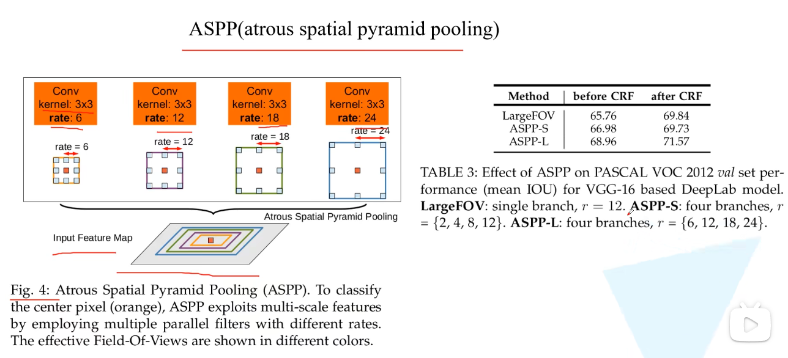
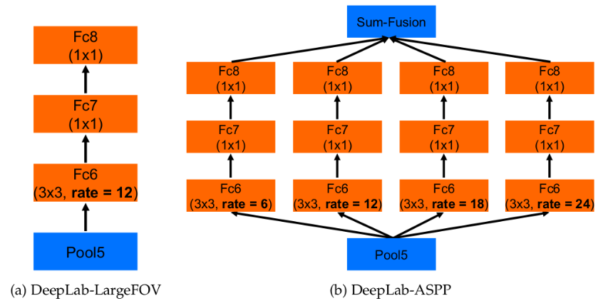
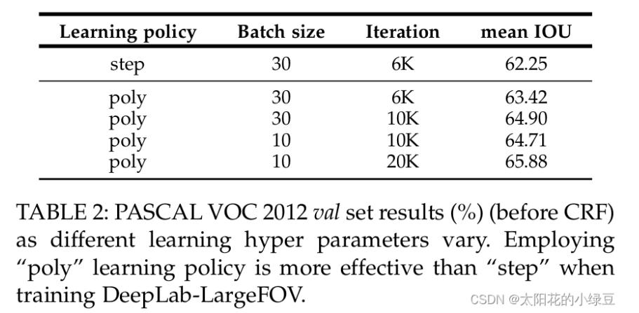

# DeepLab: Semantic Image Segmentation with Deep Convolutional Nets, Atrous Convolution, and Fully Connected CRFs

# 1.文章概要

## 1.1 背景

和上篇文章一样，在文章的引言部分作者提出了DCNNs应用在语义分割任务中遇到的问题。

- 分辨率被降低（主要由于下采样stride>1的层导致）
- 目标的多尺度问题
- DCNNs的不变性(invariance)会降低定位精度

## 1.2 方法:star:

- 针对分辨率被降低的问题，一般就是将**最后的几个Maxpooling层的stride给设置成1**(如果是通过卷积下采样的，比如resnet，同样将stride设置成1即可)，然后**配合使用膨胀卷积**。
- 针对目标多尺度的问题，最容易想到的就是将图像缩放到多个尺度分别通过网络进行推理，最后将多个结果进行融合即可。这样做虽然有用但是计算量太大了。为了解决这个问题，DeepLab V2 中提出了ASPP模块（atrous spatial pyramid pooling）。
- 针对DCNNs不变性导致定位精度降低的问题，和DeepLab V1差不多还是通过CRFs解决，不过这里用的是fully connected pairwise CRF，相比V1里的fully connected CRF要更高效点。在DeepLab V2中CRF涨点就没有DeepLab V1猛了，在DeepLab V1中大概能提升4个点，在DeepLab V2中通过Table4可以看到大概只能提升1个多点了。
  

## 1.3 创新点/优点:star:

## 1.4 缺点

# 2.算法描述

## 2.1 整体架构

这里以ResNet101作为backbone为例，下图是根据官方源码绘制的网络结构（这里不考虑MSC即多尺度）。在ResNet的``Layer3`中的Bottleneck1中原本是需要下采样的（3x3的卷积层stride=2），但在DeepLab V2中将`stride设置为1`，即不进行下采样。而且`3x3卷积层全部采用膨胀卷积膨胀系数为2`。在`Layer4`中也是一样，取消了下采样，所有的`3x3卷积层全部采用膨胀卷积膨胀系数为4`。最后需要注意的是ASPP模块，在以ResNet101做为Backbone时，每个分支只有一个3x3的膨胀卷积层，且卷积核的个数都等于num_classes.

### 2.1.1 ASPP(atrous spatial pyramid pooling)

下图(b)有画出更加详细的ASPP结构（这里是针对VGG网络为例的），将Pool5输出的特征层（这里以VGG为例）并联4个分支，每个分支分别通过一个**3x3的膨胀卷积层（rate不同，但是空洞卷积会添加padding保证输入输出的feature map大小相同）**，1x1的卷积层，1x1的卷积层（卷积核的个数等于num_classes）。最后将**四个分支的结果进行Add融合**即可。 如果是以ResNet101做为Backbone的话，每个分支只有一个3x3的膨胀卷积层，卷积核的个数等于num_classes（看源码分析得到的）。

### 2.1.2 Learning rate policy

在DeepLab V2中训练时采用的学习率策略叫poly，相比普通的step策略（即每间隔一定步数就降低一次学习率）效果要更好。文中说最高提升了3.63个点，真是炼丹大师。poly学习率变化策略公式如下：
$lr \times (1-\frac{iter}{max\_iter})^{power}, power=0.9.$

其中lr为初始学习率，iter为当前迭代的step数，max_iter为训练过程中总的迭代步数。

## 2.2 损失函数:star:

# 3.Training Details

# 4.Inference Details

# 5.实验结果

