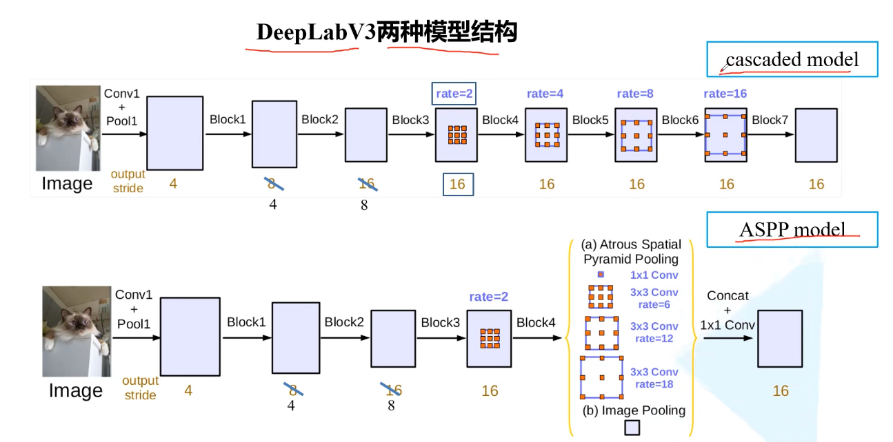
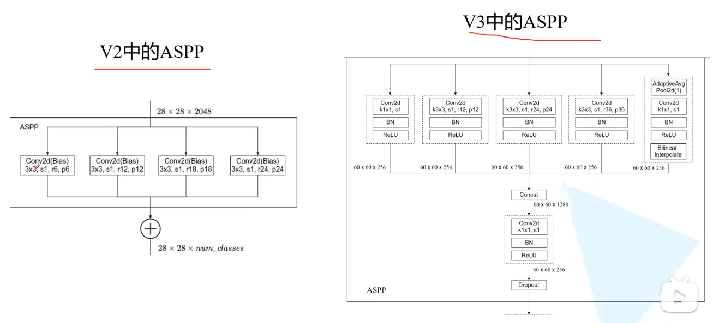

# Rethinking Atrous Convolution for Semantic Image Segmentation

# 1.文章概要

## 1.1 背景

## 1.2 方法:star:

- 引入了`Multi-grid`
- 改进了`ASPP`结构
- 把`CRFs`后处理给移除掉了

## 1.3 创新点/优点:star:

## 1.4 缺点

# 2.算法描述

## 2.1 整体架构

文中提出了两种模型，分别是cascade model和ASPP model，后者效果更好，因此主要分析后者。

### ASPP model

使用的Backbone是ResNet101.原论文中说在训练时`output_stride=16`（即特征层相对输入图片的下采样率），但验证时使用的`output_stride=8`。但在Pytorch官方实现的DeepLabV3源码中就直接把`output_stride`设置成8进行训练的。

**另外需要注意的是，图中标注的rate并不是膨胀卷积真正采用的膨胀系数。** 真正采用的膨胀系数应该是图中的rate乘上Multi-Grid参数。

#### v2和v3的ASPP模块对比

DeepLab V2中的ASPP结构其实就是通过**四个并行的膨胀卷积层**，每个分支上的膨胀卷积层所采用的膨胀系数不同（注意，**这里的膨胀卷积层后没有跟BatchNorm并且使用了偏执Bias**）。接着通过add相加的方式融合四个分支上的输出。
右图为v3的架构，这里的ASPP结构有5个并行分支，分别是一个1x1的卷积层，三个3x3的膨胀卷积层，以及一个**全局平均池化层(其中的AdaptiveAvgPool(1)表示将输入的feature map通过AvgPool池化到1\*1大小。)**（后面还跟有一个1x1的卷积层，然后通过双线性插值的方法还原回输入的W和H）。关于最后一个**全局池化分支作者说是为了增加一个全局上下文信息global context information**。然后通过**Concat的方式将这5个分支的输出进行拼接（沿着channels方向）**，最后在通过一个1x1的卷积层进一步融合信息。

### Multi-grid

在之前的DeepLab模型中虽然一直在使用膨胀卷积，但设置的膨胀系数都比较随意。在DeepLab V3中作者有去做一些相关实验看如何设置更合理。下表是以cascaded model（ResNet101作为Backbone为例）为实验对象，研究采用不同数量的cascaded blocks模型以及cascaded blocks采用不同的Multi-Grid参数的效果。注意，**blocks中真正采用的膨胀系数应该是图中的==rate==乘上这里的==Multi-Grid参数==**。通过实验发现，不添加任何额外Block（即没有Block5，Block6和Block7，ASPP model不添加，Cascade model添加了这3个Block）将**Multi-Grid设置成(1, 2, 4)**效果最好，因为在**ASPP model中是没有额外添加Block层的**，后面讲ASPP model的消融实验时采用的就是Multi-Grid等于(1, 2, 4)的情况。

## 2.2 损失函数:star:

# 3.Training Details

# 4.Inference Details

# 5.实验结果

