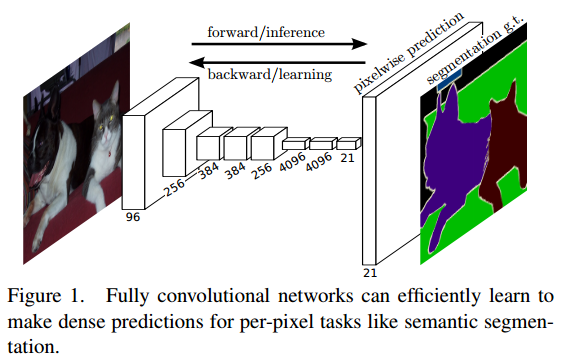
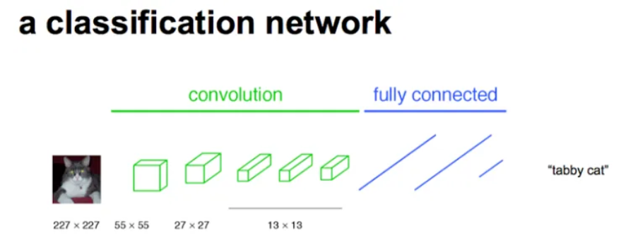
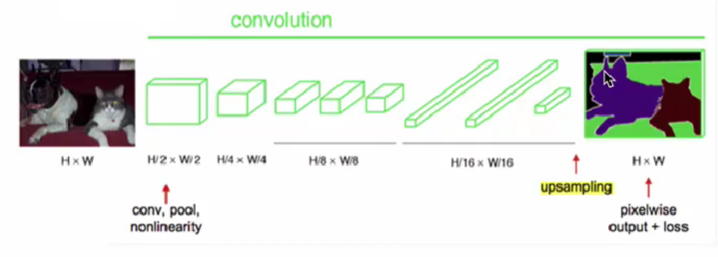
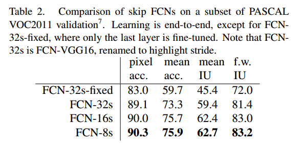
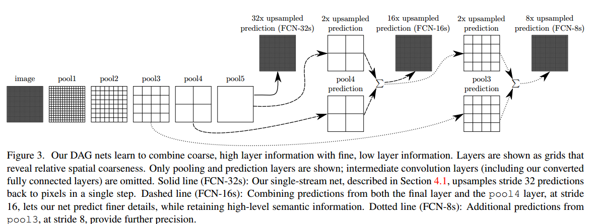
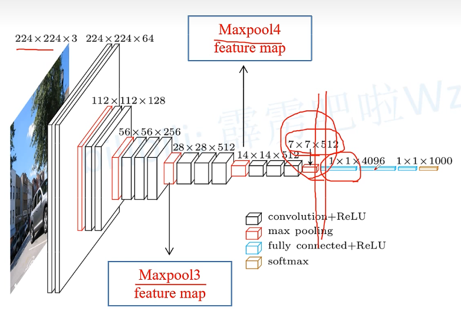
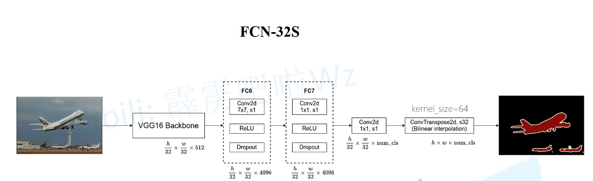
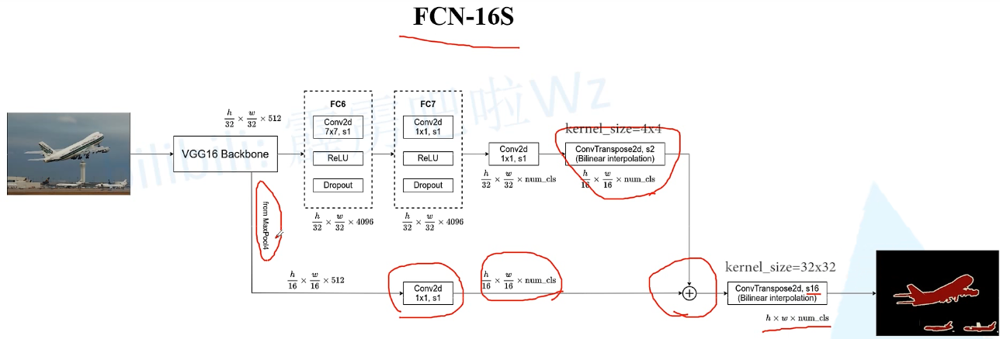
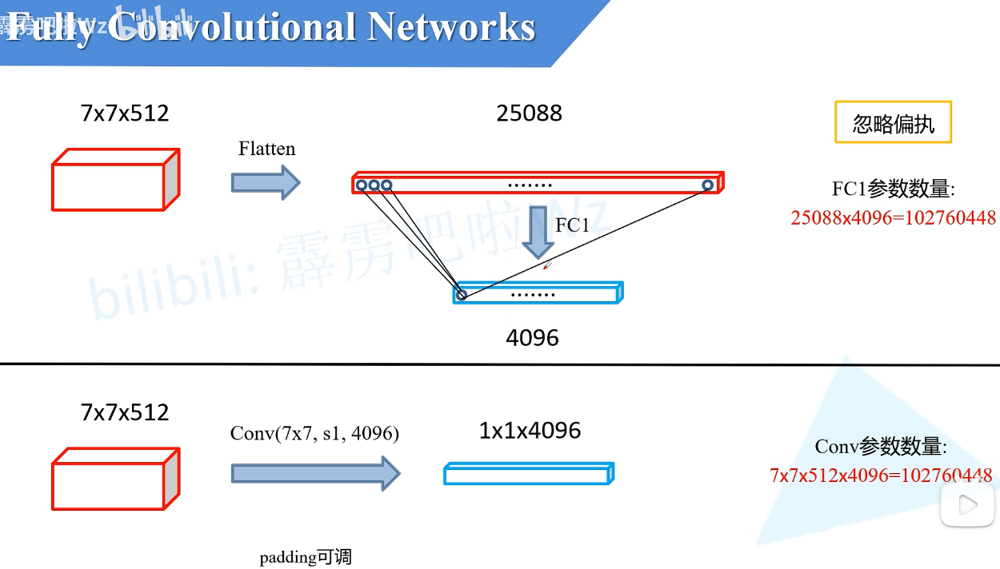
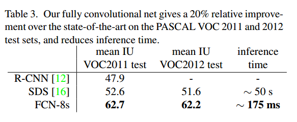

# Fully Convolutional Networks for Semantic Segmentation

# 1.文章概要

## 1.1 背景

卷积网络正在推动识别技术的进步。Convnets不仅在整幅图像分类方面得到了改进，而且在具有结构化输出的局部任务上也取得了进展。这包括在边界盒目标检测、部分和关键点预测以及局部对应方面的进展。

1. 从粗糙到精细推理的下一步自然是对每个像素进行预测。先前的方法使用卷积神经网络进行语义分割，但是有个缺点，**即其中每个像素都用其封闭对象或区域的类别进行标记。**
2. 语义分割面临语义和位置之间固有的紧张关系:**全局信息解决什么问题，而局部信息解决什么问题。**
3. 我们的方法借鉴了最近深度网络在**图像分类**和**迁移学习**方面的成功。

## 1.2 方法:star:

- 我们的关键见解是建立“完全卷积”网络，该网络可以接受任意大小的输入，并通过有效的推理和学习产生相应大小的输出。
- 定义了一种新的架构，该架构将来自**深层粗糙层的语义信息**与来自**浅层精细层的外观信息**相结合，以产生准确而详细的分割。

## 1.3 创新点/优点:star:

FCN对图像进行像素级的分类，从而解决了语义级别的图像分割（semantic segmentation）问题。与经典的CNN在卷积层之后使用全连接层得到固定长度的特征向量进行分类（全联接层＋softmax输出）不同，**FCN可以接受任意尺寸的输入图像，**采用**反卷积层**对最后一个卷积层的feature map进行**上采样**, 使它**恢复到输入图像相同的尺寸**，从而可以**对每个像素都产生了一个预测**, 同时保留了原始输入图像中的空间信息, 最后在上采样的特征图上进行逐像素分类。

## 1.4 缺点

1. 得到的结果还是不够精细。进行8倍上采样虽然比32倍的效果好了很多，但是上采样的结果还是比较模糊和平滑，对图像中的细节不敏感。
2. 对各个像素进行分类，没有充分考虑像素与像素之间的关系。忽略了在通常的基于像素分类的分割方法中使用的空间规整（spatial regularization）步骤，缺乏空间一致性。

# 2.算法描述

## 2.1 整体架构

CNN的强大之处在于它的多层结构能自动学习特征，并且可以学习到多个层次的特征：**较浅的卷积层感知域较小，学习到一些局部区域的特征**；**较深的卷积层具有较大的感知域，能够学习到更加抽象一些的特征**。这些抽象特征对物体的大小、位置和方向等敏感性更低，从而有助于识别性能的提高。
虽然这些抽象的特征对分类很有帮助，可以很好地判断出一幅图像中包含什么类别的物体，但是因为丢失了一些物体的细节，不能很好地给出物体的具体轮廓、指出每个像素具体属于哪个物体，因此做到精确的分割就很有难度。

**传统的基于CNN的分割方法**：为了对一个像素分类，使用该像素周围的一个图像块作为CNN的输入用于训练和预测。这种方法有几个缺点：一是存储开销很大。例如对每个像素使用的图像块的大小为15x15，然后不断滑动窗口，每次滑动的窗口给CNN进行判别分类，因此则所需的存储空间根据滑动窗口的次数和大小急剧上升。二是计算效率低下。相邻的像素块基本上是重复的，针对每个像素块逐个计算卷积，这种计算也有很大程度上的重复。三是像素块大小的限制了感知区域的大小。通常像素块的大小比整幅图像的大小小很多，只能提取一些局部的特征，从而导致分类的性能受到限制。

而全卷积网络(FCN)则是从抽象的特征中恢复出每个像素所属的类别。即从图像级别的分类进一步延伸到像素级别的分类。

主要分为两部分：全卷积部分以及上采样部分。

- 全卷积部分包括骨架网络的全卷积部分以及将FC修改成卷积的部分。
- 上采样用于得到原始图像大小的feature map，此时大小为h\*w\*分类数。

上图为FCN的基本结构。其中**32s表示上采样32倍将特征图还原到原图像大小，因此叫FCN-32s。**

VGG-16：

FCN-32s：

1. 前面使用VGG-16的Backbone，将原图像下采样了32倍。
2. 然后，将原来的FC6和FC7改成**Conv卷积层。注意添加padding和卷积核大小**，保证两次Conv仍然能够保持大小不变。
3. 之后添加一个1\*1卷积，**并将卷积核个数设定为分类数+1**。
4. 最后进行**转置卷积**上采样，**将特征图恢复为原图像大小**，此时得到h\*w\*K的feature map。
5. 然后对每个featuremap上同一位置进行softmax，最终得到一个最大的结果，该结果为该像素的分类结果。最终就得到了需要的heatmap。

## 2.2 Convolutionalization(全连接层 -> 卷积层)

这些完全连接的层也可以被视为卷积，其核覆盖了整个输入区域。这样做将它们转换成完全卷积的网络，可以接受任何大小的输入和输出分类图。

如上图为全连接层，下一层的每个结点都与上一层连接，参数如右边所示。
下图将FC替换成了Conv，各种参数如图所示，相当于**覆盖了整个输入区域**，使用的参数与FC一致。

**为什么要将全连接层转化为卷积层？**

1. 全连接层可以视作一种特殊的卷积。
2. 网络改成全卷积形式后在某些场景可以提升效率。

对于传统的 CNN（即包含全连接层），一个确定的网络其输入图像的大小是固定的，比如 CaffeNet 的输入须是 227×227，那么对于更大的图像，在检测时就需要裁剪出很多 227×227 的小图像分别送入 CNN 网络中，使得检测任务十分耗时。
而网络需要输入固定大小图像的主要原因就是有全连接层，当把全连接层替换成了卷积层后，就可以不限制输入图像的大小，一次性输入网络即可获得一张图片所有位置的检测目标概率，形成一幅 heatmap。

固定大小是说送入网络训练的每一个数据大小需要一样，可以全都是 227\*227，也可以全都是 224\*224，只要统一就行。
这样要求的原因是**全连接层与前一层连接时，参数数量需要预先设定好**。不同于**卷积操作，卷积核的参数数量就是卷积核大小**，它与前一层的 feature map 多大没有关系，但是全连接层的参数是随着前一层 feature map 的大小变化而变化的，当输入图像大小不同，全连接层之前得到的 feature map 大小也不一样，那么全连接层的参数数量就不能确定，所以必须固定输入图像的大小。==即，对于FC，需要固定输入大小，否则无法保证权重一致进行正向传播。而对于FCN等，不需要固定输入大小，因为最后的feature map大小相较输入图像缩小了k倍，因此课直接确定参数大小为h/k\*w/k\*K(类别)\*C(通道数)。==

# 3.损失计算

# 5.实验结果

FCN与其他方法的对比：

