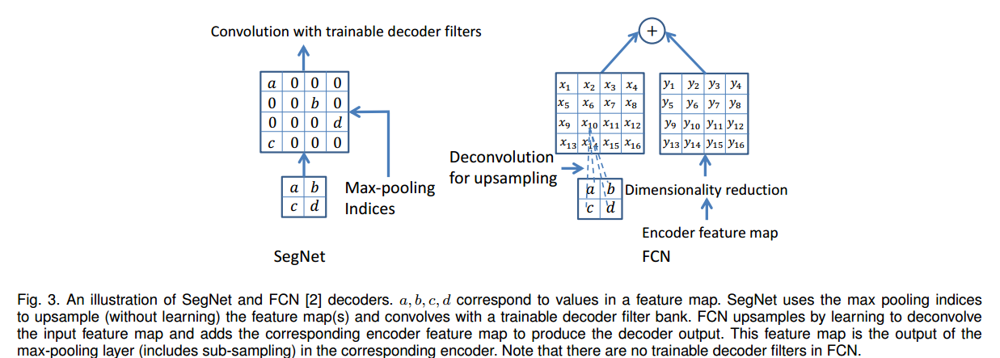

# SegNet: A Deep Convolutional Encoder-Decoder Architecture for Image Segmentation

# 1.文章概要

## 1.1 背景

作者先谈了之前的一些工作，认为虽然有很多方法，但是都很粗糙，其主要原因在于**max pooling and sub-sampling reduce feature map resolution**。而作者设计SegNet就是**为了解决在语义分割中将低分辨率映射到原输入的分辨率上的问题。**

**解码器是使用编码器中进行maxpool的像素索引来进行反池化，从而上采样**，这个idea是来自于无监督特征学习。在解码器中**重新使用编码器池化时的索引下标有这么几个优点**：

1.  能改善边缘的情况；
2. 减少了模型的参数；
3. 这种能容易就能整合到任何的编码器-解码器结构中，只需要稍稍改动。

文章的一些贡献还有SegNet和FCN的一些比较，设计分割网络时候的一些权衡等。

文章采用的数据集是CamVid road scene segmentation 和 SUN RGB-D indoor scene segmentation。之所以不用主流的Pascal VOC12，是因为作者认为VOC12的背景太不相同了，所以可能分割起来比较容易。

回顾了一些以前的传统语义分割工作，例如随机森林、特征工程、条件随机场等。

在深度学习的模型方面，提到了FCN，指出FCN拥有一个非常大的编码器网络（134MB），却只有一个超级小的解码器（0.5MB），所以效果会不太理想。于是FCN中开始添加解码器，但是添加了三个之后性能就没有增加了（对应FCN-32S\FCN-16S\FCN-8S）。作者认为解码器在恢复编码器的特征应该会利用更多的内存占用。

之后还提到了CRF-RNN的联结训练、多尺度的特征提取。对于条件随机场（CRF），作者认为是因神经网络的解码器部分性能太差了，所以才需要用CRF来改善分割结果。

## 1.2 方法:star:

## 1.3 创新点/优点:star:

1. SegNet的核心是利用**编码器-解码器**结构来进行语义分割。编码器和解码器的网络结构采用VGG16（去掉全连接层之后还有13层），两者完全对称。
2. SegNet的新颖之处在于用编码器对其低分辨率的特征信息进行上采样。具体的说，**解码器是使用编码器中进行maxpool的像素索引来进行反池化，从而免去了学习上采样的需要。**
3. SegNet的灵感来源于场景理解应用。因此，它能有效地在推理期间减少内存占用和增加计算效率。与其他model相比，它**参数数量也要少得多**，并且可以使用随机梯度下降进行端到端的训练。

## 1.4 缺点

# 2.算法描述

## 2.1 整体架构

- 编码器：VGG16去掉全连接层，大幅度减少了模型的大小（134M to 14.7M），其中顺序为：CNN->BN->ReLU->maxpool。
- 解码器：和编码器对称结构，但是反池化是根据编码器层中max-pooling indices来反池化，进行上采样。FCN中是利用双线性插值，再直接叠加上一层的特征图。

### Encoder

1. **使用VGG16网络，但是去掉了全连接层，**还剩13层，减少了大量的参数。顺序为Conv->BN->maxpool。
2. **为了防止下采样导致的边界信息丢失，将每次maxpool的最大值的相应位置保存，**类似于ZFNet。

### Decoder

解码器网络中的解码器使用来自相应编码器特征映射的**存储的最大池索引(memorized max pool)**对其输入的**feature map**进行上采样。

SegNet与FCN的decoder区别：

- SegNet使用feature map结合decoder中记录的indices进行上采样，**不需要训练学习**，然后再将得到的feature map与一个**可以训练的decoder进行卷积**。
- FCN做的是**特征融合**。他首先进行**反卷积进行上采样（可学习训练）**，然后再将大的feature map降维得到与之前反卷积相同的大小，再进行相加计算得到最终结果。

## 2.2 损失函数⭐

# 3.Training Details

- 数据集：CamVid Road Scene Segmentation和SUN RGB-D Indoor Scenes
- 超参数：SGD with Momentum，LR=0.001，Momentum=0.9，Dropout=0.5。
- 损失函数：交叉熵。
- 类平衡：median frequency balancing，大致过程是首先计算下每个类的像素点的频率，然后取中位数作为分母，再取各个类的频率作为分子，计算得到每个类别的权重。
- 衡量指标：**global accuracy (G)** which measures the percentage of pixels correctly classified in the dataset，**class average accuracy (C)** is the mean of the predictive accuracy over all classes **mean intersection over union (mIoU)**和**the boundary F1-measure (BF)**。

# 4.Inference Details

# 5.实验结果

